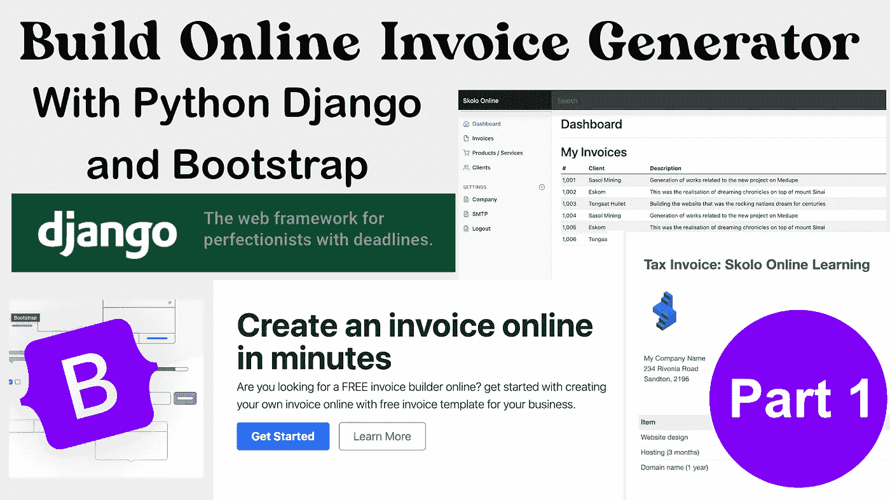
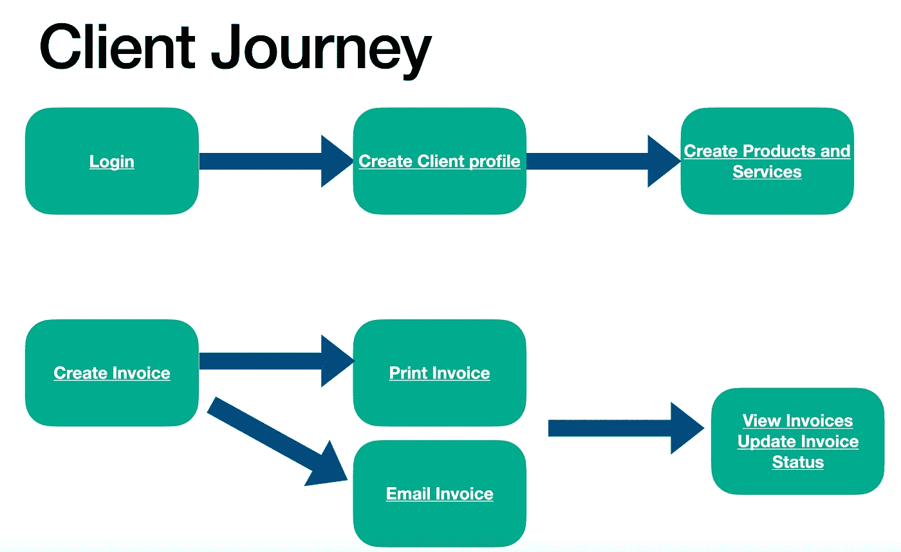
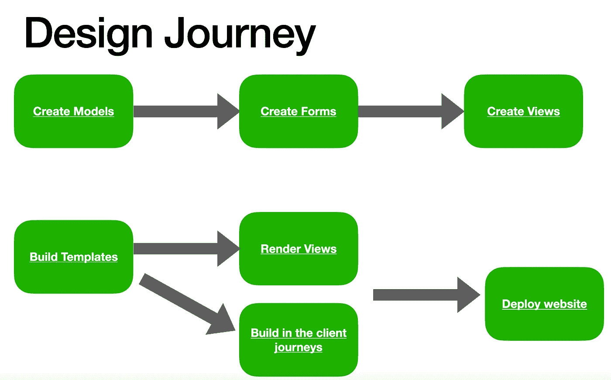
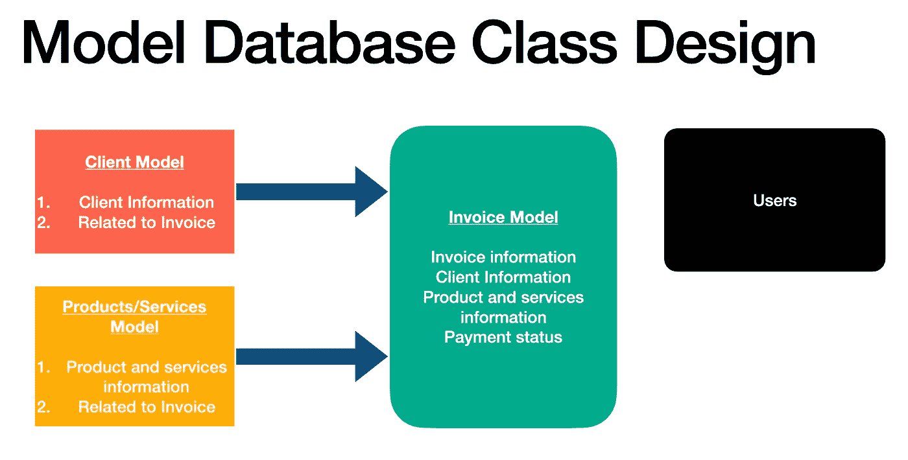

# 用 Django 和 Bootstrap 第 1 部分创建发票应用程序

> 原文：<https://medium.com/nerd-for-tech/create-invoicing-app-with-django-and-bootstrap-part-1-6619d493060d?source=collection_archive---------0----------------------->

这是一个实践教程，一步一步地指导如何使用 Python Django 和 Bootstrap 框架从头开始创建一个发票应用程序来创建我们的前端。对于 python 来说，这是一个令人兴奋的学习项目，因为它将教会你这些重要的开发技能:



*   从 Django 创建 PDF 文档(对 dashboard、SaaS web 应用程序开发有用)
*   构建仪表板应用程序——用 Django 进行 CRUD 开发(创建、读取、更新和删除记录)
*   从 Django 应用程序发送电子邮件——包括在电子邮件中附加 pdf

和我写的许多教程一样，这篇教程有一个 youtube 视频([如何用 Django](https://www.youtube.com/watch?v=9XE0sf0XYuw) 创建一个发票应用程序)，你可以观看这个视频，一步一步地了解如何编写代码。该代码也可在 GitHub — [Django 发票应用源代码](https://github.com/skolo-online/invoicing)上获得。

因为这是一个复杂的教程，我将在教程系列或部分中介绍这些步骤。一篇文章涵盖的内容太多了，这是第一篇文章。我发表的系列中的每一篇新文章，都会有一个视频和带有代码的 GitHub 链接。

# 我们将在教程的第 1 部分中讨论的内容

*   如何获得开源 bootstrap 5 dashboard HTML、CSS 和 JS 的源代码
*   描述我们的应用程序的客户端旅程，客户端将能够做什么
*   描述我们的应用程序设计之旅，规划应用程序开发
*   为您的应用程序设计数据库
*   从头开始创建 Django 项目
*   在 Django 建立我们的第一个模型——客户端模型
*   下一节课的作业

# **Bootstrap5 前端代码**

我将在教程的最后提供这段代码，所以我在项目中只使用开源代码(没有付费的主题和模板)是很重要的。您可以从他们的网站下载 Bootstrap5 示例，从这里开始— [下载 Bootstrap5](https://getbootstrap.com/docs/5.1/examples/) 。

您可以将这些元素结合起来，创建一个我们将要使用的像样的登录页面、登录页面和仪表板 HTML。

# Django 发票应用的客户之旅

客户端通常是许多应用程序开发计划会议和开发头脑风暴会议的焦点。我们需要了解应用程序的最终用户，他们想要实现什么，他们想要解决什么问题。


如何创建发票申请

本质上，我们的客户正在寻找一种负担得起的方式来创建在线发票，打印出来或通过电子邮件发送给客户。他们还希望在一个地方记录他们的发票，跟踪他们为每个客户开出的发票总额。客户还希望能够搜索发票，跟踪付款，甚至在未收到付款时发送提醒。

这些客户需求构成了我们应用程序功能的基础，了解客户需求可以让我们更好地设计 Django 应用程序。

我们可以将所有这些需求浓缩成一个视觉效果，让客户能够在我们的应用程序上完成所有步骤:



客户之旅—Django 发票应用

客户将能够(1)登录，(2)创建客户档案，(3)添加产品和服务，(4)创建发票，(5)打印或通过电子邮件发送发票，(6)在列表中查看发票并更新其状态—已支付、未支付、过期等。

# Django 发票应用的设计之旅

在这个阶段，我们可以理解作为应用程序的设计者，我们将要经历什么。理解 Django 架构——这些是我们要遵循的步骤:



设计之旅——Django 发票应用

如果你是 Django 开发的新手，可以看看我以前写的关于 Django 开发的教程。我在这里介绍了以下内容:

*   [深入解释创建 Django 模型](https://python.plainenglish.io/django-models-with-slugfield-override-model-save-method-and-custom-html-forms-73db161e2fb) —包括覆盖保存方法
*   [Django 认证，用户登录，注册](https://skolo-online.medium.com/python-django-user-registration-login-logout-custom-styling-c2f2901e162a)
*   [为 Django 应用程序添加电子邮件功能](/nerd-for-tech/add-email-functionality-to-a-django-user-registration-b3b3655ed623)

# Django 发票应用程序的数据库设计

一旦我们理解了用户的旅程，也就更容易找出硬件来设计我们的数据库。一些需要考虑的事项:

*   我们需要什么型号？
*   模型之间的关系是什么——主要的“主导”模型和支持模型。我称之为“奴隶”和“主人”模型。主模型是主要的应用程序模型，理想情况下，您希望每个应用程序都有一个主模型。如果需要更多，可以在同一个 Django 项目中创建另一个应用程序。那么从模型通常与主模型相关。

例如，请参见下图中的发票应用程序:



Django 发票应用程序的数据库设计

这里的**主模型**是发票模型。这是我们将创建的主要模型。模型也构成了数据库结构的基础，每个模型都是数据库中的一个表，表的列是模型中的变量，行是类的实例。

因此，发票模型将包含以下内容:发票号、支付状态、支付指令、客户信息和产品信息。

客户信息——本身就是一个类，您需要为客户提供姓名、详细地址和联系人。它还可以重复使用，因为同一个客户可以有多张发票。这就说得通了，客户应该是一个模型。然而，这将是发票类的“从属”模型。

类似地，产品/服务模型可以与发票模型相关联。在产品/服务模型中，我们可以描述我们将收费的具体产品和服务。

# 从头开始创建 Django 项目

这是教程中最简单的部分，事实上，在视频中我跟随了之前的教程，我已经详细介绍了如何在虚拟环境中基于云服务器从零开始创建 Django 项目。

任何人都应该能够得到云服务器，从[数字海洋](https://m.do.co/c/7d9a2c75356d)花 5 美元就能得到。作为一名开发人员，当我学习或教学时，我不喜欢在我的个人电脑上塞满随机的项目。

# 构建客户端模型

客户端模型将是我们今天做的最后一件事，至少它允许我们在所有这些讨论之后编写一些代码。谈话对于计划和确保我们编写正确的代码是很重要的。

有一种说法是:

> “如果我有 8 个小时砍树，我会花 6 个小时磨利我的斧头”

亚伯拉罕·林肯。我们已经磨快了我们的斧子，我们了解我们的客户，他们想要什么，我们想要实现什么，让我们开始砍树吧。

创建一个模型文件并添加以下代码:

```
from django.db import models
from django.template.defaultfilters import slugify
from django.utils import timezone
from uuid import uuid4
from django.contrib.auth.models import Userclass Client(models.Model):PROVINCES = [
    ('Gauteng', 'Gauteng'),
    ('Free State', 'Free State'),
    ('Limpopo', 'Limpopo'),
    ]#Basic Fields
    clientName = models.CharField(null=True, blank=True, max_length=200)
    addressLine1 = models.CharField(null=True, blank=True, max_length=200)
    province = models.CharField(choices=PROVINCES, blank=True, max_length=100)
    postalCode = models.CharField(null=True, blank=True, max_length=10)
    phoneNumber = models.CharField(null=True, blank=True, max_length=100)
    emailAddress = models.CharField(null=True, blank=True, max_length=100)#Utility fields
    uniqueId = models.CharField(null=True, blank=True, max_length=100)
    slug = models.SlugField(max_length=500, unique=True, blank=True, null=True)
    date_created = models.DateTimeField(blank=True, null=True)
    last_updated = models.DateTimeField(blank=True, null=True)def __str__(self):
        return '{} {} {}'.format(self.clientName, self.province, self.uniqueId)def get_absolute_url(self):
        return reverse('client-detail', kwargs={'slug': self.slug})def save(self, *args, **kwargs):
        if self.date_created is None:
            self.date_created = timezone.localtime(timezone.now())
        if self.uniqueId is None:
            self.uniqueId = str(uuid4()).split('-')[4]
            self.slug = slugify('{} {} {}'.format(self.clientName, self.province, self.uniqueId))self.slug = slugify('{} {} {}'.format(self.clientName, self.province, self.uniqueId))
        self.last_updated = timezone.localtime(timezone.now())super(Client, self).save(*args, **kwargs)
```

[https://raw . githubusercontent . com/skolo-online/invoicing/main/invoice/models . py](https://raw.githubusercontent.com/skolo-online/invoicing/main/invoice/models.py)

非常简单的模型—观看视频，深入了解代码。

# 家庭作业

完成产品/服务和发票的模型，显示。下周我们将继续下一期。让我知道你的想法，在下面或 youtube 视频中留下评论。

# Youtube 视频

使用 Django 和 Bootstrap 创建在线发票应用程序的 Youtube 视频