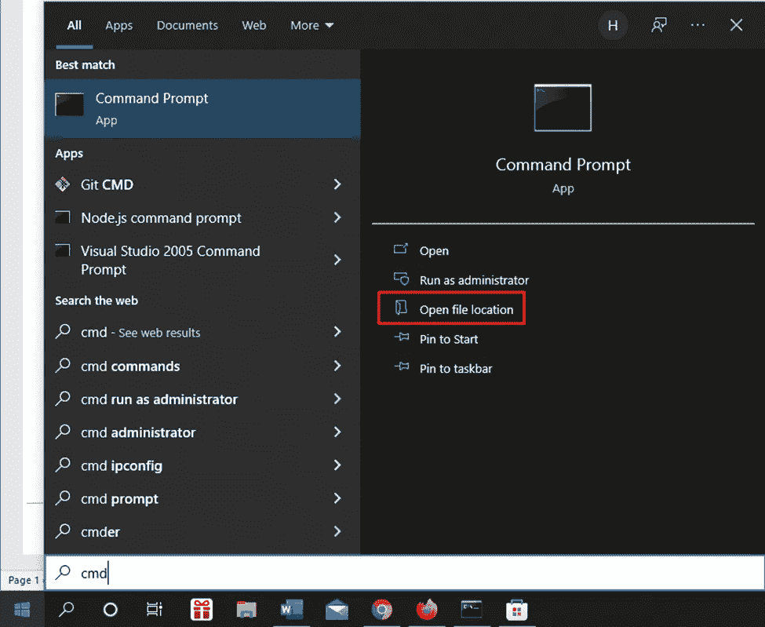
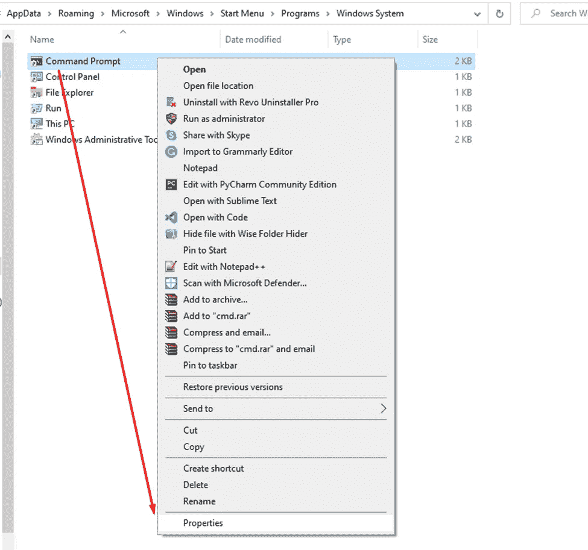
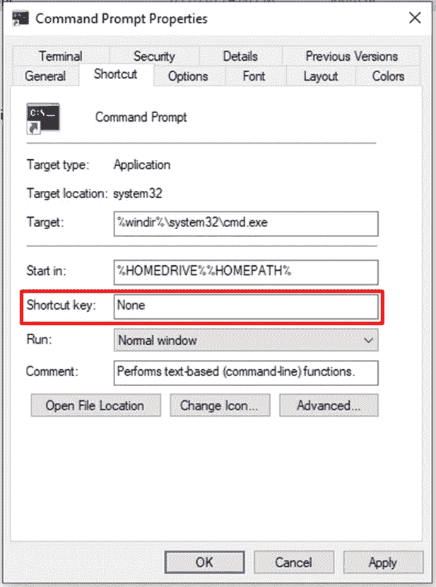
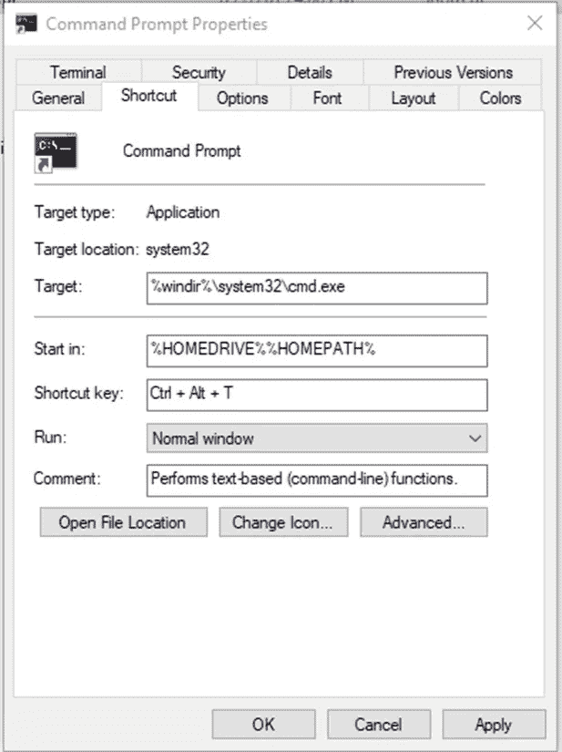

# 为打开命令提示符创建键盘快捷键

> 原文：<https://medium.com/nerd-for-tech/create-keyboard-shortcut-for-opening-command-prompt-f802ad9548cb?source=collection_archive---------3----------------------->

图为[塔达斯·萨](https://unsplash.com/@stadsa?utm_source=unsplash&utm_medium=referral&utm_content=creditCopyText)在 [Unsplash](https://unsplash.com/s/photos/windows-linux?utm_source=unsplash&utm_medium=referral&utm_content=creditCopyText)

或者每一个以前体验过 Linux 的 Windows 用户。我相信微软应该在下一次 Windows 更新中添加一个命令。这是**使用快捷方式**打开终端。我们在 Linux 发行版中通过按这个快捷键`Ctrl+Alt+T`很容易调用终端

Windows 中没有官方终端。我们在这里使用命令提示符和 Powershell。但是，要打开应用程序，我们应该按下搜索按钮，并键入“CMD”或“PowerShell”。您知道有一种方法可以打开该功能，使用键盘快捷键轻松访问这两个应用程序吗？

# 捷径

好了，下面是使用键盘快捷键打开应用程序的步骤。这里我将给出一个打开命令提示符的例子。

1.  在“开始”菜单中，找到“cmd ”,然后单击“打开文件位置”

2.打开属性选项

3.在这里，你会看到快捷键仍然是 None 点击它

4.通过点击它，使用键盘创建您想要的快捷方式。我更喜欢用和 Linux 一样的`Ctrl+Alt+T`

5.单击“应用”,然后单击“确定”

# 结论

恭喜你，现在，你可以使用`Ctrl+Alt+T`打开命令提示符。实际上，它适用于所有的 Windows 应用程序。我给出了上面这样的标题，以确保所有的 Windows 开发人员都认识到这个故事，并利用它。

快乐分享。感谢阅读。😇