# 使用 Spring Boot、Spring Cloud 和 Eureka 服务器创建微服务应用

> 原文：<https://medium.com/nerd-for-tech/create-microservice-application-using-spring-boot-spring-cloud-eureka-server-7bc2f6092f10?source=collection_archive---------0----------------------->


大家好！

在这篇博文中，我将向你展示如何使用 **Spring cloud** 、 **Eureka Server** 和 **Spring Boot** 创建一个微服务应用。这将是一个理解微服务架构逻辑的非常基本的 Spring Boot 应用。

让我们开始吧。

# 设置 Eureka 服务器

首先，我们将创建我们的尤里卡服务器。 **Eureka** 是由**网飞**开发的一个库，它允许微服务从**单点**相互通信。

现在，我们走[*https://start.spring.io/*](https://start.spring.io/)。选择下面的依赖关系*(尤其是尤里卡服务器依赖关系)*。并使用*生成*按钮下载项目。


尤里卡服务器

打开您的项目。您将在您的 **pom.xml** 文件上看到 **Eureka Server** 依赖项。

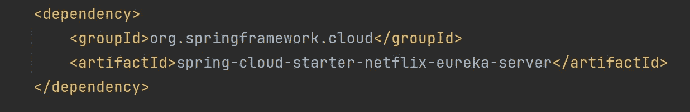

在主类中，让我们添加依赖关系 **@EnableEurekaServer:**

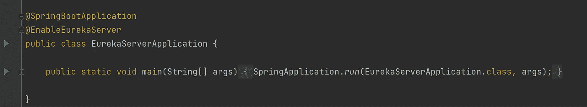

在 **application.properties** 文件中，让我们添加这些信息:

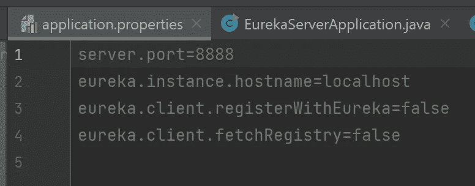

> server . port = 8888
> eureka . instance . hostname = localhost
> eureka . client . registerwitheureka = false
> eureka . client . fetchregistry = false

现在，让我们转到 **localhost:8888** ，我们将看到**尤里卡服务器**正在运行:

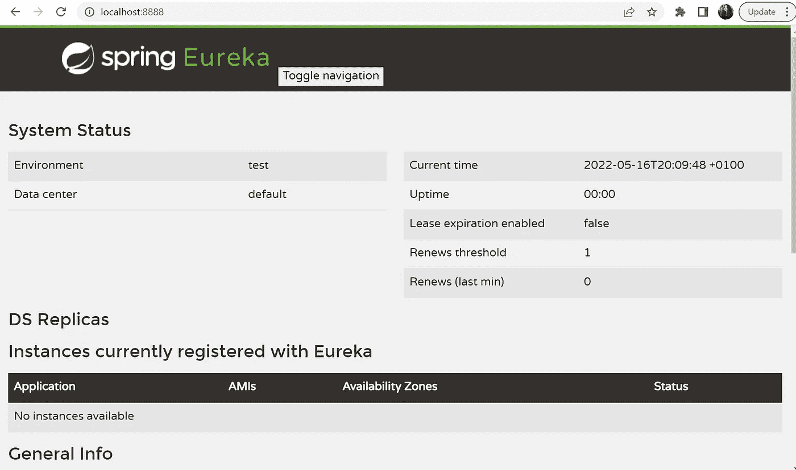

# **设置国家服务器**

现在，让我们创建我们的国家服务器。这一次，我们将选择**尤里卡发现客户端**作为依赖项。此外，我正在添加**龙目**图书馆。

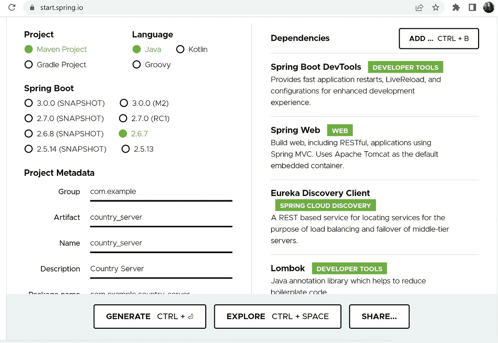

打开**国家服务器**项目，在 pom.xml 文件中，你会看到**尤里卡客户端**的依赖关系:

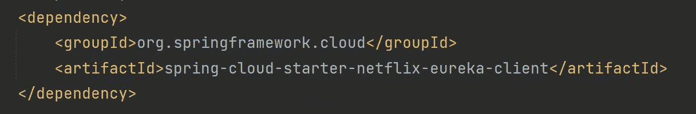

首先，向主类添加 **@EnableDiscoveryClient** 注释:

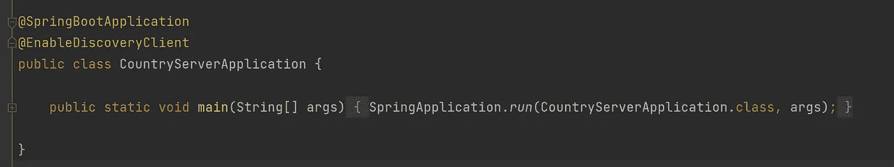

然后创建**国家**实体:

```
import lombok.AllArgsConstructor;
import lombok.Data;
import lombok.NoArgsConstructor;

**@Data**
**@AllArgsConstructor**
**@NoArgsConstructor**
public class **Country** {
    private String countryName;
    private String capitalName;
    private String currency;
}
```

现在，让我们创建一个返回美国国家的硬编码的国家控制器类:

```
**@RestController**
public class **CountryController** {
    **@GetMapping**("/countries")
    public List<Country> getAllCountries() {
        List<Country> countries = new ArrayList<Country>();
        countries.add(new Country("Turkiye", "Ankara", "TL"));
        countries.add(new Country("Sweden", "Stockholm", "SEK"));
        return countries;
    }
}
```

最后，我们将向 **application.properties** 文件添加一些信息:

```
spring.application.name=Country-Service
eureka.client.serviceUrl.defaultZone=http://localhost:8888/eureka
server.port = 9000
```

现在让我们运行**国家客户端**项目并刷新我们的**尤里卡服务器**页面:

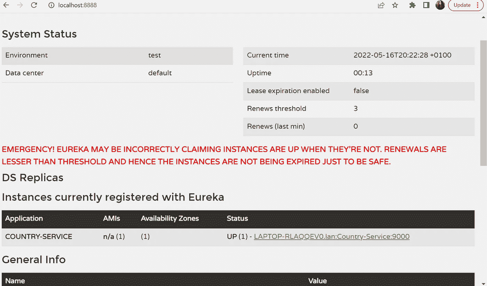

在这里，我们已经注册了我们的国家服务尤里卡服务器！

# 国家客户

现在，让我们制作一个**国家客户端**微服务，并从客户端**向**国家服务**发送请求。**

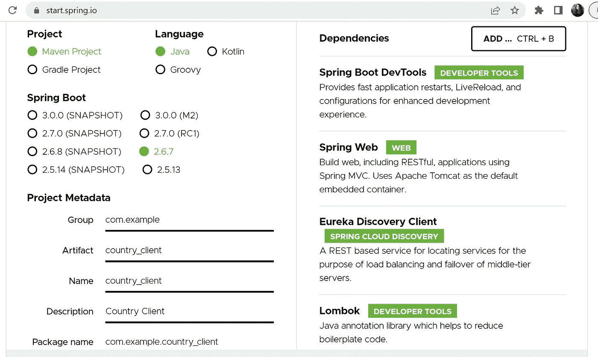

打开国家客户端项目，在主类中添加 **@EnableDiscoveryClient** 注释，创建一个向我国服务器发送请求的**客户端控制器**类:

```
**@RestController
@AllArgsConstructor**
public class CountryClientController {
    private **DiscoveryClient** discoveryClient;

   ** @GetMapping("/")**
    public List<Country> **handleRequest**() {
        List<ServiceInstance> instances = **discoveryClient.getInstances("Country-Service");**
        if (instances != null && !instances.isEmpty()) {
            ServiceInstance serviceInstance = instances.get(0);
            String url = serviceInstance.getUri().toString();
            url = url + "/countries";
            RestTemplate restTemplate = new RestTemplate();
            return **restTemplate.getForObject(url, List.class)**;
        }
     return null;
    }
}
```

现在，将这些信息添加到 **application.properties** 文件中:

```
server.port=9090
eureka.client.serviceUrl.defaultZone=http://localhost:8888/eureka/
spring.application.name=Country-Client
```

让我们运行我们的客户！在 Eureka 服务器中，我们看到我们的客户端已注册:

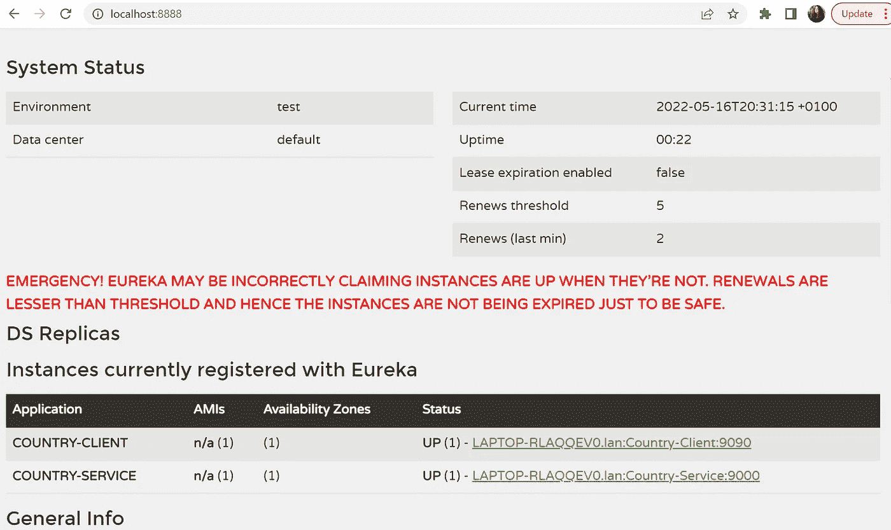

让我们转到我们客户的 **localhost:9090** 地址:

塔谭。我们的迷你微服务项目正在运行:

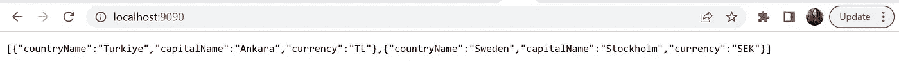

你可以从这里找到完整的代码:
[***https://github.com/minnela/Spring_Cloud_Microservice***](https://github.com/minnela/Spring_Cloud_Microservice)

感谢您的阅读:)