# 在 Redhat Openshift 容器平台(OCP)上创建 MySQL 实例

> 原文：<https://medium.com/nerd-for-tech/create-mysql-instance-on-redhat-openshift-container-platform-ocp-482a7c3e6cb2?source=collection_archive---------7----------------------->

在本文的第 3 部分中，我们将看到如何从 OCP web 控制台创建运行在 Openshift 集群上的 MySQL 实例。

*小工具图库应用系列:*

*   **Part-1:** [用科特林、Spring Boot 和 H2 数据库实现 REST API](/nerd-for-tech/implement-rest-api-with-kotlin-spring-boot-and-h2-database-9d0103064600)
*   **第二部分:** [用 OpenAPI 3.0 记录 Spring Boot REST API](https://techcolors.medium.com/documenting-spring-boot-rest-api-with-openapi-3-0-220a5103f0a5)
*   **第三部分:** [在 Redhat Openshift 容器平台(OCP)上创建 MySQL 实例](/nerd-for-tech/create-mysql-instance-on-redhat-openshift-container-platform-ocp-482a7c3e6cb2)
*   **第 4 部分:**在 OCP 集群上部署 Spring Boot 应用程序，并连接到 MySQL 实例(进行中)

照片由[维达尔·诺德里-马西森](https://unsplash.com/@vidarnm?utm_source=medium&utm_medium=referral)在 [Unsplash](https://unsplash.com?utm_source=medium&utm_medium=referral) 拍摄

我们可以使用以下选项尝试我们自己的 Red Hat OpenShift 4 集群

***电脑上:***

[https://cloud . red hat . com/open shift/install/CRC/installer-provisioned](https://cloud.redhat.com/openshift/install/crc/installer-provisioned)

***自管:AWS / Azure / GCP:***

[https://cloud.redhat.com/openshift/install#public-cloud](https://cloud.redhat.com/openshift/install#public-cloud)

***Redhat 托管服务:***

*   [https://www.openshift.com/products/dedicated/?hsLang=en-us](https://www.openshift.com/products/dedicated/?hsLang=en-us)
*   [https://www.ibm.com/cloud/openshift](https://www.ibm.com/cloud/openshift)

一旦我们登录到 Redhat Openshift 控制台，作为管理员从 OCP web 控制台创建一个新项目“gadget-gallery ”,如下所示。

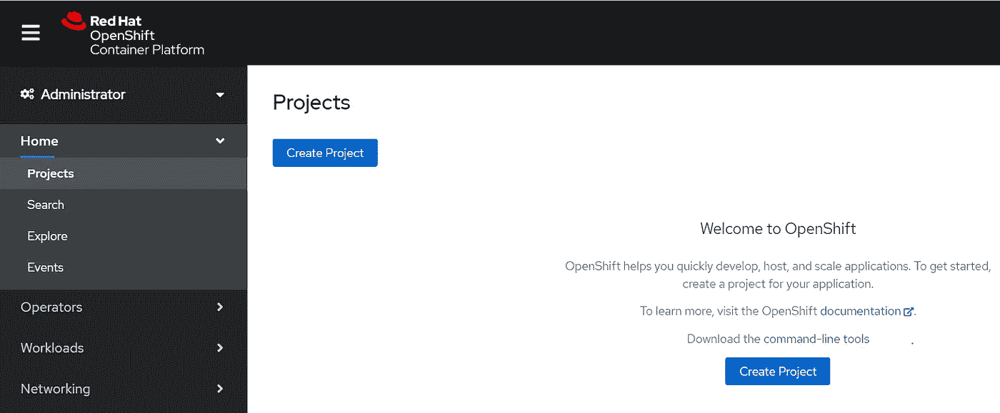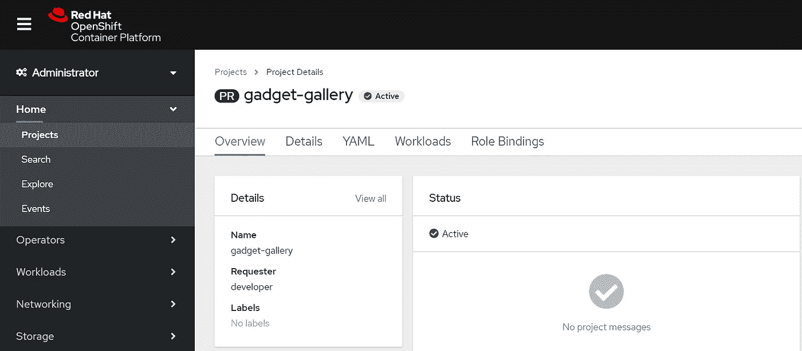

我们还可以创建一个新项目，并使用以下命令在 OC 控制台 CLI 上验证该项目。

创建新项目

*   ***oc 新建-项目<项目-名称>***

从 OCP 集群中获取用户的所有项目

*   ***oc 项目***

要在项目之间切换

*   ***oc 项目<项目名称>***

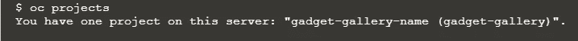

**在 Openshift 上创建 MySQL 数据库:**

**步骤 1:** 选择“gadget-gallery”项目，从下拉菜单切换到“Developer ”,点击“Topology”向您的项目添加内容，使用这些选项之一创建应用程序、组件或服务。

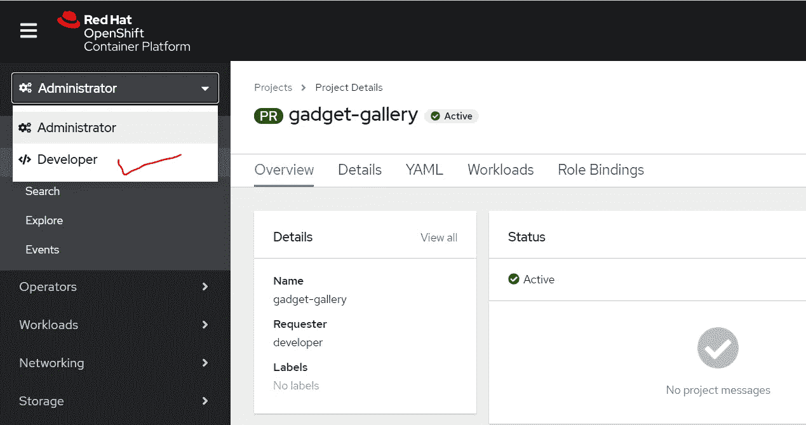

**步骤 2** :从开发者目录中选择拓扑下的‘数据库’选项，并选择 MySQL 模板

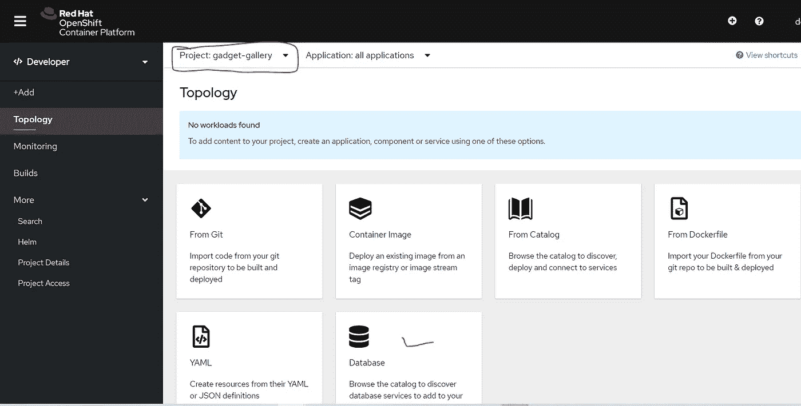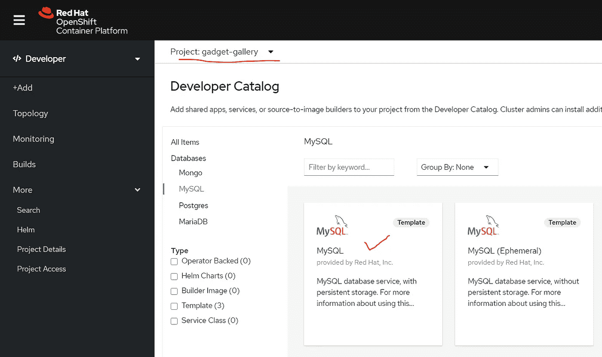

**步骤 3** :点击“MySQL 实例化模板”并填写 MySQL 用户名密码、root 密码和数据库名称的详细信息。

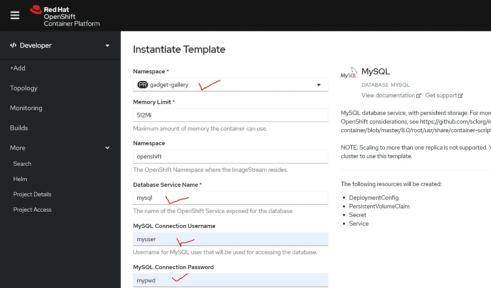

单击“创建”按钮旋转 MySQL 实例，并验证在 MySQL pod 中创建的指定数据库“coredb”。

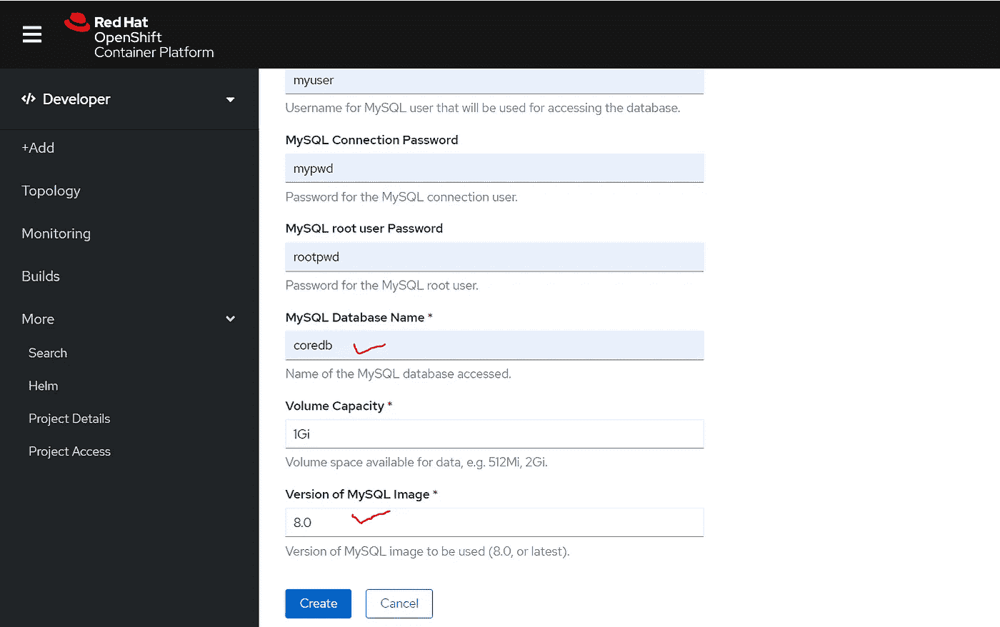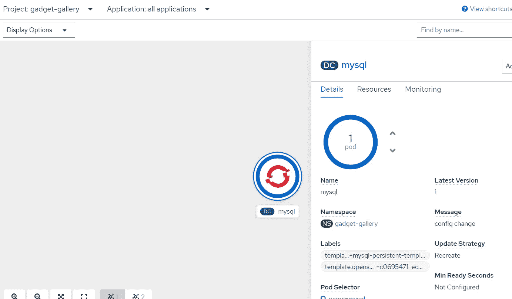

MySQL—Minishift 上的部署配置

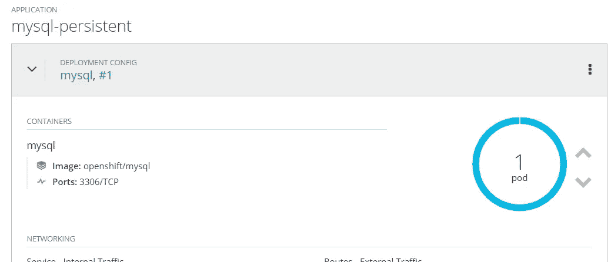

找到 MySQL 的 POD IP，如下所示——同样用于从 Spring Boot 应用程序连接 MySQL。

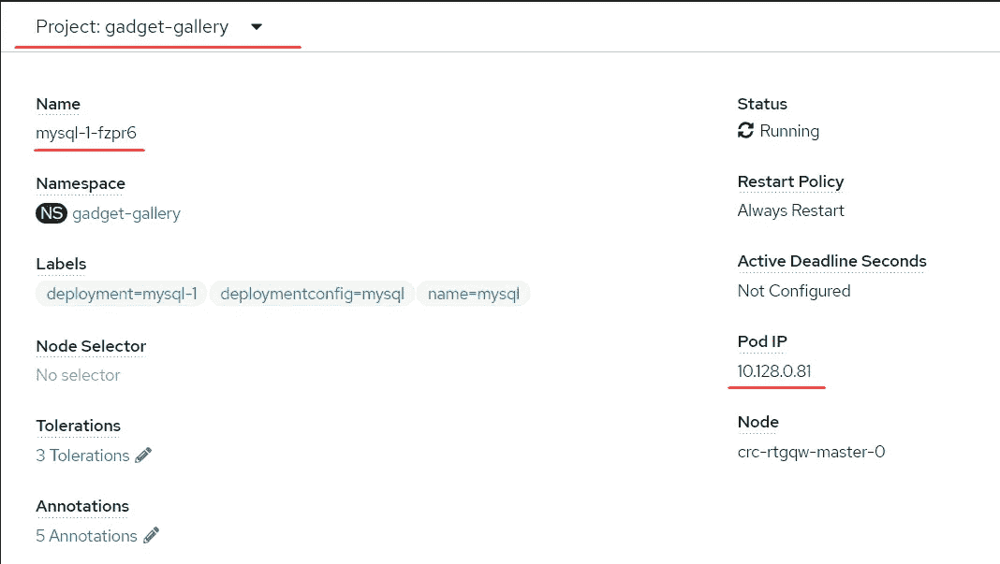

我们还可以在 OC 控制台 CLI 上使用以下命令验证这一点。

从集群中取出所有的豆荚

*   **oc 获取吊舱**

获取特定的 pod 详细信息

*   **oc 描述 pod/<pod-name>**

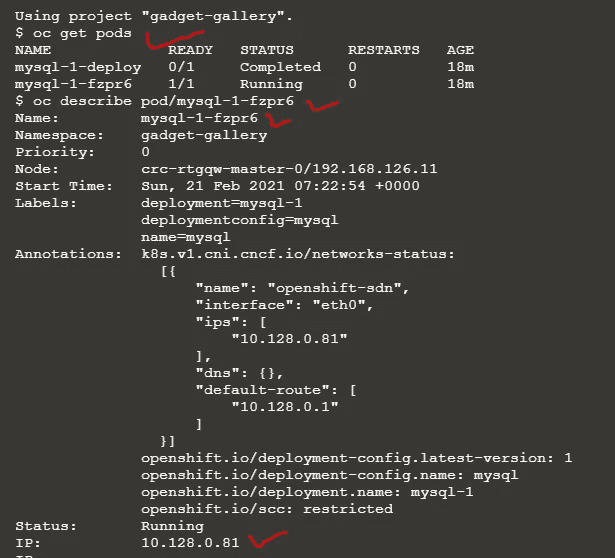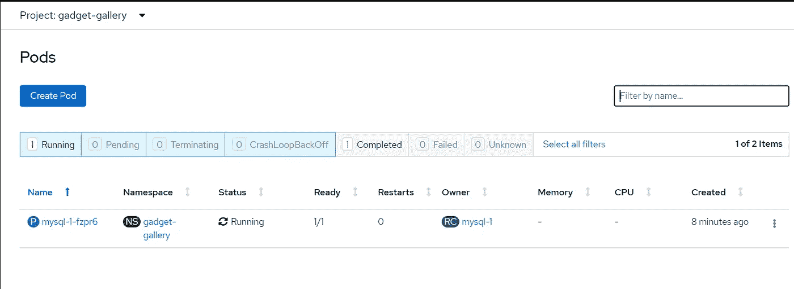

**步骤 4** :要登录 MySQL 终端，点击 pod 名称并切换到“终端”。提供 MySQL 用户名和密码(如步骤 3 所示)。

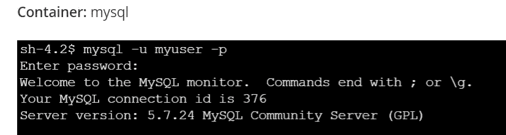

成功登录后，使用“show databases”验证是否创建了名为“coredb”的数据库。

点击“日志”菜单检查错误/故障。

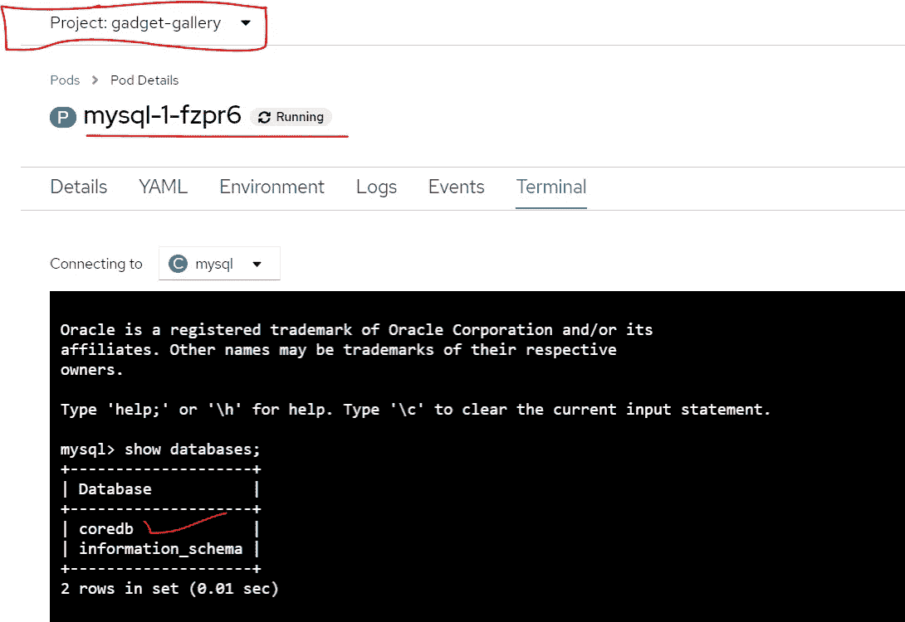

**总结**:

在本文中，我们从 OCP 控制台和 OC 控制台 CLI 创建了 MySQL 实例，运行在带有“coredb”数据库的 Openshift 集群上。我们将使用同一个实例从**第 4 部分中的“小工具库”应用程序(Spring Boot 应用程序，用于将小工具细节保存在 coredb 数据库中创建的小工具表中)进行连接。**