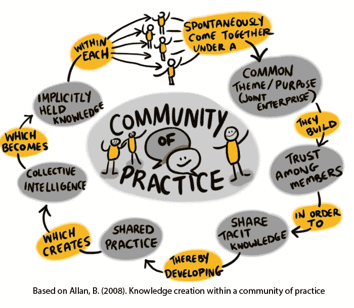
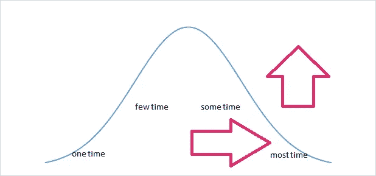

# 去创建一个实践社区

> 原文：<https://medium.com/nerd-for-tech/create-or-be-part-of-a-community-of-practice-cfee1bfdac99?source=collection_archive---------0----------------------->

(感谢朱利亚·福赛思[https://flic.kr/p/21JgUxF](https://flic.kr/p/21JgUxF)

你想灌输一种学习、不断进步和归属感的文化吗？去创造一个警察！。

当我进入敏捷世界时，我开始听到“实践社区”这个术语，它看起来非常正式或遥远。其实是完全相反的。

# 这是什么？

实践社区(从现在开始称为 CoP)就是一群人，他们是特定角色的积极实践者(比如 Scrum Master ),并且有计划的聚会，在那里他们可以讨论几个主题、问题、解决方案等等。

它可以服务于许多目的:分享是关键，从其他人的经验中学习，学习新的话题，重新学习旧的话题，与其他人建立网络，它当然也可以作为宣泄:)。

没有真正的需要有任何正式的结构(如社区主席，秘书等)。大概唯一有区别的两个角色可能是:创始人和参与者。然而，除此之外，这只是一群人试图通过讨论共同的话题来度过一段美好时光。

尽管说警察不同于兴趣社区(CoI)是很重要的，在兴趣社区中，人们聚集在一个共同的话题周围，比如足球或绘画。CoP 是由具有相同技能、工作或角色的个人组成的。

# 如何创建一个？

去做吧。要开始讨论，你至少需要两个人。你和其他想像你一样向别人学习的人。对于两个人来说，你可以聚在一起，在桌子上拿一杯咖啡，然后开始聊天。

尽管你需要记住一些事情:

1.  创建一个时间段。选择频率和持续时间。
2.  让频率不要太远以至于失去联系和能量，也不要太频繁以至于你可能会用尽不同的话题:)。每周、每两周或每月都可以。将它设为 1 或偶数，以便逐月匹配。
3.  关于频率，也取决于交谈的迫切程度。我将在后面提到我为什么这样说。
4.  持续时间要足够长，以便进行深入的讨论，但也要足够短，不要花太多时间来为讨论找借口。
5.  然而，最重要的规则是:**提交。**你想创建一个社区，然后致力于它，它的形成和可持续性。
6.  如果你想扩大它的影响范围，那就传播这个信息。不要让它是你创造的，而是它的好处和学习机会。

令人惊讶的是，你会发现许多人想成为社区的一部分，想学习，但没有精力或决定自己组建一个社区。因此，一旦他们找到一个已经在运行的，他们更有可能会加入。记住创新扩散中的早期采用者和落后者。

# 设定目标

最后一个关键提示:**要有目标**。就要达到的具体目标或里程碑与社区达成一致。如果有一种感觉是我们没有的，人们也会失去兴趣(有点像和你的女朋友在一段感情中，保持很长时间的单一阶段)。例如，你可以说:

> “伙计们，如果到 12 月份，我们举行一次‘会议’,介绍我们当时讨论过的 12 个主题，以及我们所有的经验教训，你们觉得怎么样？我们应该邀请我们的朋友、同事等”。

**这增加了动力和参与度。**

# 如何保持兴趣？

嗯，你在第一次和第二次会议上迸发的能量和动力可能会很快消失。怎么才能让它持久？。

如果某样东西能激励你，并且你非常喜欢某样东西，那么你会想要更多。

如果人们从中获得了价值，他们就会来。它只是自动的。没有借口，如果你真的想要什么，就要坚持下去。

所以这里的关键是让它对每个人都有价值。

这里有一些提示:

1.  问吧。你想知道人们想要什么吗？问吧。不要假设你知道他们想要什么。
2.  传授/分享。如果你知道一些事情并且可以分享，那就去做吧。人们会回报你的。
3.  试着提前为 5 到 10 次会议制定一个共同的议程。这样，人们知道他们将得到什么，能量也不会消失，因为你们只是盯着对方不知道该说什么或问什么。
4.  轮流促成。通过轮流，会议的所有权是共享的，人们也可以为会议做准备。
5.  作为创始人，你肯定会成为学习的榜样。利用这个机会学习在公共场合讲话(用一个友善的:)，为会议提供便利，为一大群人提供便利，介绍游戏，给一些人打气，等等。
6.  如果人们看到你的能量和激情，他们会继续来。
7.  总之，**每个 CoP 都需要领导者**。一个领导者会把人们聚集在一起，激励他们来，在需要的时候大声说出来，等等。创始人很可能是社区的天然领导者(因为他们首先想创建它)，然而如何使它及时可持续应该是社区的关注点(因此它不依赖于创始人，其他人可以接管)。
8.  你需要各种类型的领导者，不仅仅是那些做一些决定的人，而是那些通过他们的热情、好奇心、专业知识、意见、幽默感、前瞻性思维等来领导的人。

我有时喜欢根据物理或理论进行类比，这样可以使观点更有根据。所以在这种情况下，我会用熵和逃逸速度。

熵是指自然界的每一个系统都会衰变和“变形”，除非你给它输入能量。

警察也是一样。如果没有能量(以任何形式)注入，CoP 将会衰变。能源可以是谈论的新话题，新的人进来，带来一个专家谈论一些事情；但特别是为了**不时刷新社区的目的**。这将是推动缔约方会议进一步发展的最重要因素。

逃逸速度被定义为物体击败地球引力和火箭进入太空所需的速度。你可以把这个应用到警察身上。

开始时，缔约方会议需要大量的精力和奉献精神才能继续下去。但是一旦进来的人多了或者进来的人多了，那么你就会开始越来越接近这个逃逸速度。只有一旦你超越了它，那么 CoP 将会自动运行(可能不需要创始人在场或者像其他人那样注入更多的能量)。

保持速度肯定比获得速度容易。

衡量这一点的一个好方法是通过分析出席的频率和进来的人数。

频率可分为:仅一次/两次、几次、几次、大部分时间。并且频率可能遵循正态分布(从左到右)。注意:这完全是经验性的。

出席人数的正态分布

所以，你通常有两个目标:

1.  在 Y 轴上向上移动图表。增加总人数，这样即使分布保持不变，你仍然有一个最低的出席门槛，仍然会推动社区向前发展。
2.  全神贯注右边的曲线，让它在左边变薄(所以它是一个不完美的钟)。这将增加参加聚会的有效人数(不一定是新人数)。有点像增加对社区的忠诚度。

两者都是有效的，在不同的时期需要。

# 来的人多了怎么办？

首先，庆祝一下！:)您刚刚创建了您的第一个实践社区！。

然而，随着社区的发展，它的需求也在增长。一些提示/评论/想法:

1.  人们加入并不断进来，因为他们感觉自己是社区的一部分，他们发现了社区的价值(学习、分享等)。
2.  这里的建议是永远保持它作为一个社区。
3.  一个社区是由它的参与者所拥有的(这并不意味着不能有一个委员会来围绕它进行组织)。
4.  作为创始人，你不拥有它。你应该总是寻找机会卸下责任或“传递火炬”，尽管要小心传递给谁。
5.  接受一些赞助，让每个人都有好的体验，但不要太多以至于“你在出卖自己”。你知道我的意思。虽然这很难做到，如果警察是你工作的公司的内部人员(或者你的生存很大程度上依赖于赞助商)，但你仍然可以实现平衡。我想一个重要的因素是对所有成员的透明度，即为什么以及如何提出和接受赞助。
6.  执行设置也将变得更加困难:找到一个更大的场地，带一些食物，一些椅子，桌子，等等。关键是开始组建一个能够承担所需多项任务的委员会。
7.  如果可以的话，试着学习一些大型团队的引导技巧。管理 10 个人的会议和管理 50 个人的会议是不一样的。也许 10 个人你可以组成一个小组，但是 50 个人你需要把他们分成几个小组，以便更好地讨论和集中精力。这是绝对要考虑的事情。
8.  如果你没有某种方法来组织房间里的人，人们就会停止参加聚会。混乱的会议意味着经验的衰退，这意味着与会者人数的减少。
9.  随着更多的人来，更多不同的人也会来。主持人应该做好准备，准时召开会议，并在参与和包容与无休止的讨论之间找到正确的平衡。
10.  许多人来到社区宣泄他们的问题，并寻求解决问题的建议。这很好，这也是它存在的部分原因。然而，如果你有很多这样的人，将聚会引向积极的结果/感觉比仅仅抱怨要困难得多。在包容(允许人们表达自己)与对所有其他人有针对性和有价值的对话之间取得平衡。

# 我的经历

我怎么知道这件事？因为我在以前的公司里开了一家。我是一名软件经理，当时是 Scrum Master。

我们是在不同团队中工作的四个 SMs，我们看到这四个团队以不同的方式运作，甚至都在 Scrum 框架下，一些每天开会，一些每天开会；有的用吉拉，有的做实体板；有些人用一种方式进行回顾，有些人用另一种方式，等等。

因此，我给其他人发了一封电子邮件，提议创建一个。其他三条短信接受:)。

在第一次会议上，我们建立了社区。

我们同意做:

*   每周三(频率)一小时(时长)。我们需要每周都做，因为团队之间的偏差很大，我们都想在最前面解决这个问题。
*   我们的目标是分享知识，并从其他人那里学习如何每天应用 Scrum(目的和目标)。
*   我们进行了一些头脑风暴，并提出了至少 10 场会议的议程，非常重要的是，决定了我们将覆盖主题的顺序(该顺序基于我们的主要难点)。我们的议程是围绕 Scrum 的:日常、回顾、计划、开发-qa 集成、测试优先、回顾、分离用户故事等等。

随着会议的进行，我们制定了一个常规的会议模式:

1.  X 是什么？
2.  X 代表什么？
3.  你是怎么做的或者过去做过吗？然后比较
4.  我们想怎么做？找出差距
5.  为所有团队建立新的基线

进行得非常顺利。虽然有两条短信掉线了(由于外部原因)，但我和另一条短信接过来，继续进行，并到达了议程的末尾。

在议程结束之前，我们花了一些时间讨论下一步的工作。我们想出了在整个组织的培训中展示我们所学内容的主意(新目的)。

我们得到了经理的认可，我们花了大约 4 周的时间准备材料(每周只有几个小时)。

一旦我们以非常好的评论完成了这项工作，并且新的 SM 刚刚得到推广，我们再次聚在一起，提出了另外十个要谈论的话题(再次提出新的目标，并以小组为单位设定议程)。

诸如此类。它反映了我之前描述的过程，尤其是不时刷新目的。

**社区万岁！:)**

# 你抱怨过…

这篇文章背后的想法是分享我关于创建一个警察的经验以及创建一个警察的好处。

你抱怨过多少次了

*   团队是孤岛:每个人都会犯同样的错误，而且他们不会分享他们学到的教训。
*   开发人员相互竞争:他们不互相帮助，也不利用他们共享的知识。
*   团队成员只依靠他们的团队，不寻求团队之外的帮助。

所有这些问题都被一位经理“解决”了，他创建了一个“每周更新会议，与所有团队领导分享经验”(不是所有角色，只有领导)。人们很少去，或者他们只是向经理报告他们做了什么，但没有人参与丰富的对话。

这都是因为如果你强加这样的东西，它会让人感觉不自然，人们也不会内在地认同它。他们是被迫的，而不是受其驱使。此外，经理的出席正好让会议的气氛与最初的意图完全相反(分享>报告)。

CoP 可以通过提供与每周更新会议相同的理论成果来帮助解决这一问题，但要以一种邀请所有人都参与其中的横向环境进行分享的形式来完成。

就我个人而言，我认为实践社区的重要性不仅仅在于学习，还在于属于一个有着相同兴趣和问题的团体的感觉。

它为一种文化奠定了基础，这种文化促进社区所有成员的自我学习、开放分享和不断改进。

你抱怨过多少次“人们不合作”？也许这只是一个形式或方法的问题，而不是缺乏态度的问题。

***一个社区只需要两个人就可以启动。去找那个人，组成你自己的实践社区！。***