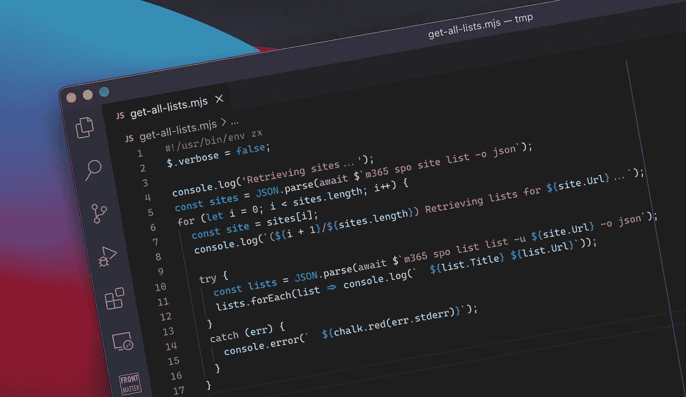

# 用 zx 在 JavaScript 中创建脚本

> 原文：<https://medium.com/nerd-for-tech/create-scripts-in-javascript-with-zx-872b7a1ba3f5?source=collection_archive---------19----------------------->



如果你使用 JavaScript 并且需要自动化你的工作，如果你没有听说过 zx，你就错过了。

# 自动化可以自动化的东西

*让我们手动做这件繁琐的事情*，从来没有人说过。我们都讨厌做令人麻木的重复性工作。见鬼，即使我们可以更快地完成需要手动完成的工作，我们仍然会不惜一切代价实现自动化以避免重复工作。

我们不仅仅自动化日常事务。自动化是消除人为错误的好方法。不足为奇的是，许多开发人员和开发主管都支持完全集成和自动化的测试和部署过程。它帮助开发团队消除人为错误，关注真正重要的事情。

当自动化工作时，您通常会编写一个脚本——一系列导致预期结果的命令。有几种方法可以让你做到这一点。

# 尝试

编写脚本最常见的选择可能是 Bash。Bash 已经存在很长时间了，并且是 macOS 和 Linux 上的默认 shell。如今，你也可以在 Windows 上使用它。

虽然它是为速度而设计的，但实际上使用起来并不简单。它将所有的输入和输出视为一个字符串，并且需要对像 **awk** 或 **grep** 这样的神秘命令有扎实的理解来处理它。Bash 有一个数组的基本概念，但是使用它们并构建健壮的脚本并不容易。如果您使用 JSON，您将需要其他工具，如 **jq** 来查询数据并将其转换成 Bash 可以处理的数据(字符串)。

# 微软 PowerShell

另一个选择是[PowerShell](https://docs.microsoft.com/powershell/scripting/overview?WT.mc_id=m365-00000-wmastyka)——微软打造的外壳。最初是作为 Windows PowerShell 发布的，现在它可以作为 Microsoft PowerShell 在任何平台上使用。

Bash 将一切都视为字符串，而 PowerShell 将一切都视为对象。每个命令都返回可以查询和循环的对象。您也可以自己创建带有属性的对象集合。这是一种编程语言！

PowerShell 和 Bash 的另一个大区别是 PowerShell 在设计时考虑到了清晰性。它没有使用像 **awk** 或 **grep** 这样晦涩难懂的命令，而是使用遵循*动词名词*标准命名约定的命令(称为 *cmdlets* ，发音为 *commandlets* ，例如 *Get-ChildItem* 。PowerShell cmdlets 有一种解析参数、显示帮助和处理错误的通用方式，因此如果您了解 PowerShell 的工作方式，您可以轻松地在不同的 cmdlet 集之间切换，它们将完全按照您的预期工作。

这个实力也是 PowerShell 的短板。如果你用的都是 PowerShell，PowerShell 就很棒。一旦你试图在 PowerShell 脚本中使用常规的可执行程序，比如微软 365 的 [CLI、](https://aka.ms/cli-m365) [Azure CLI](https://docs.microsoft.com/cli/azure/?WT.mc_id=m365-00000-wmastyka) 或任何其他 CLI，你就会纠结于处理错误和 CLI 的输出。您还需要记住的是，PowerShell 是一种独立的语言，有自己的语法和概念，您需要学习才能真正从中受益。

# 谷歌 zx

最近，我注意到另一个解决方案引起了我的注意。虽然它不像 Bash 或 PowerShell 那样是一个 shell， [Google 的 zx](https://github.com/google/zx) 是一个基于 Node.js 的可执行文件，它简化了使用 JavaScript 构建的脚本的运行。由于这些天我几乎在任何地方都使用 JavaScript，我不得不看看 zx 和 boy，它太酷了！

用 Node.js 编写脚本的想法并不新鲜，现在不用 zx 也可以做到。Node.js 脚本非常方便，因为您可以使用一种您已经熟悉的语言——JavaScript。结合访问许多增强您脚本的 npm 包，您几乎可以做任何事情。但是当你需要调用一个可执行文件时，这种便利就结束了。指定参数、检索响应和处理错误并不简单，而且会很快添加到脚本中。而这正是 zx 的闪光点。

zx 解决了使用 JavaScript 编写脚本时最重要的问题。它使得调用可执行文件并获得它们的输出、处理错误变得容易，并且它还提供了一些快捷功能，例如着色输出(粉笔)、提示用户(问题)或访问文件系统。

为了了解它在实践中是如何工作的，我编写了一个简短的脚本，使用 CLI for Microsoft 365 来检索所有站点，并为每个站点显示其列表:

```
**#!/usr/bin/env zx** $.verbose **=** **false**;console.log('Retrieving sites...');
**const** sites **=** JSON.parse(**await** $`m365 spo site list -o json`);
**for** (**let** i **=** 0; i **<** sites.length; i**++**) {
  **const** site **=** sites[i];
  console.log(`(${i **+** 1}/${sites.length}) Retrieving lists for ${site.Url}...`); **try** {
    **const** lists **=** JSON.parse(**await** $`m365 spo list list -u ${site.Url} -o json`);
    lists.forEach(list **=>** console.log(`  ${list.Title} ${list.Url}`));
  }
  **catch** (err) {
    console.error(`  ${chalk.red(err.stderr)}`);
  }
}
```

你马上会看到，这只是 JavaScript。写 zx 脚本不需要学习任何东西。注意使用`await $`语法运行可执行文件是多么简单。看看 stdout 的输出是如何内联返回的，并可以进一步处理？如果您需要处理错误，您可以将`await $`包装在一个`try..catch`子句中，并从捕获的错误的 stderr 中获取错误细节。就是这样！请注意，使用对象是多么容易，脚本是多么容易理解，处理错误所需的开销是多么小！

有了 shebang ( `#!/usr/bin/env zx`)之后，您可以将该脚本标记为可执行的(`chmod +x ./myscript.mjs`)，并像运行任何其他 Bash 脚本一样运行它。

# 摘要

如果您需要编写健壮的自动化脚本，并且在日常工作中使用 JavaScript，那么您应该考虑使用 zx。这会让你利用现有的技能，让你专注于手头的工作。查看[谷歌 zx](https://github.com/google/zx) ，我期待听到你的想法。