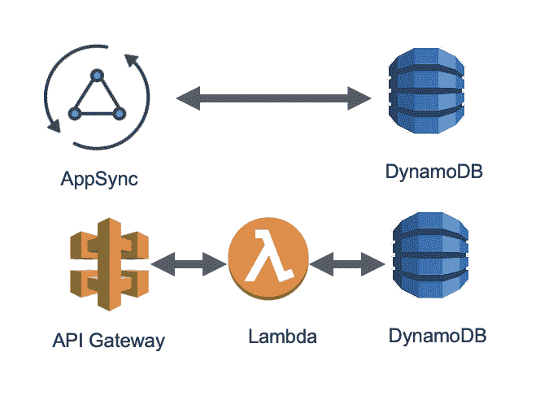
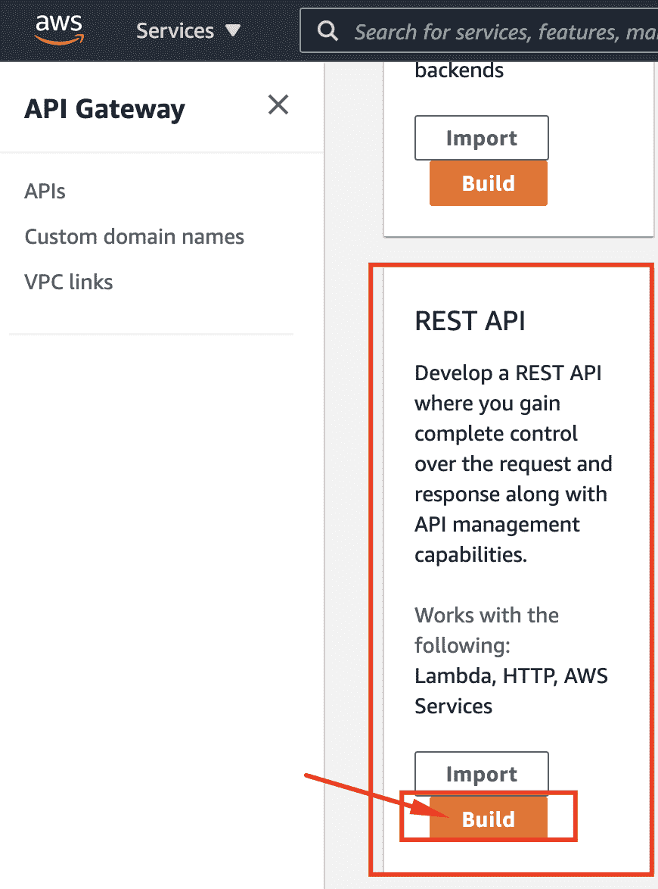
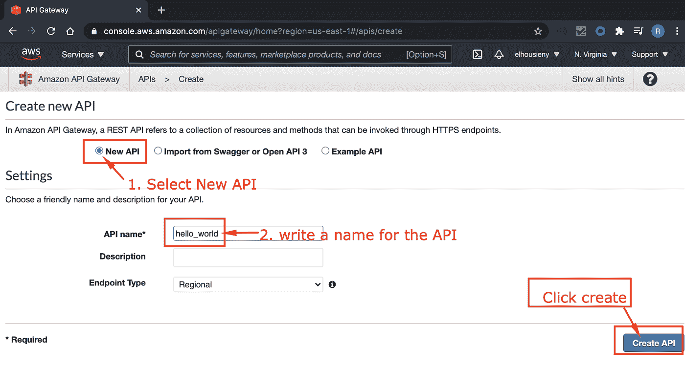
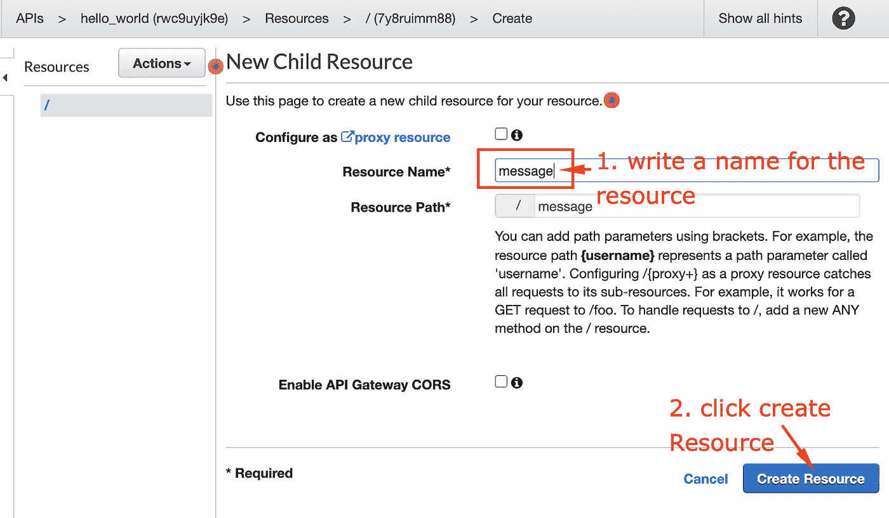
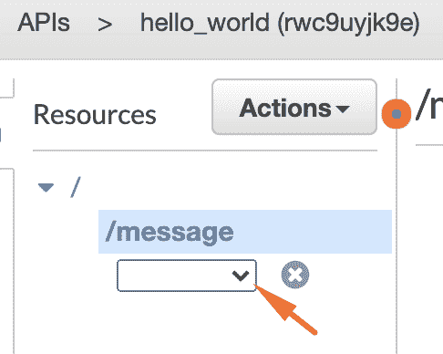
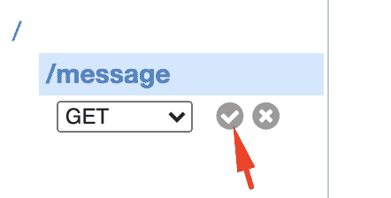
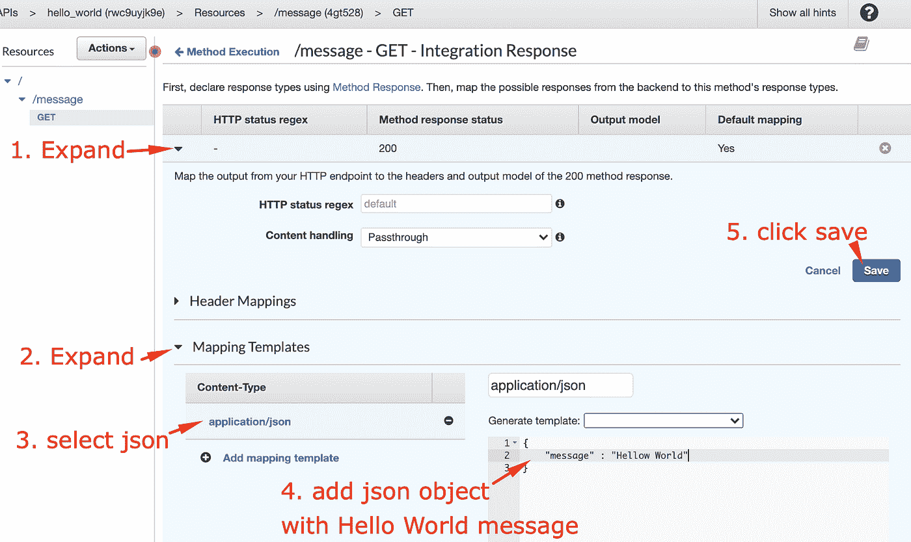

# 创建无服务器微服务“Hello World”REST API:循序渐进

> 原文：<https://medium.com/nerd-for-tech/create-serverless-microservice-hello-world-rest-api-step-by-step-502555dc48a1?source=collection_archive---------3----------------------->

基本微服务的基本元素包括一个 API 端点和一个数据库。在本文中，我将展示如何构建一个“Hello World”微服务，我将在以后的文章中基于它来解释微服务设计模式。

本文是解释微服务设计模式系列的一部分

1.  【本文】创建无服务器微服务“Hello World”:一步一步来

 [## 创建无服务器微服务“Hello World”REST API:循序渐进

### 基本微服务的基本元素包括一个 API 端点和一个数据库。在这篇文章中，我将…

www.linkedin.com](https://www.linkedin.com/pulse/create-serverless-microservice-hello-world-step-elhousieny-phd%25E1%25B4%25AC%25E1%25B4%25AE%25E1%25B4%25B0/?trackingId=3xdxZckTF8ML9xqjVXYxLQ%3D%3D) 

# [2。向微服务添加 Lambda](https://www.linkedin.com/pulse/create-serverless-microservice-hello-world-step-elhousieny-phd%E1%B4%AC%E1%B4%AE%E1%B4%B0-1c/)

 [## 逐步创建无服务器微服务“Hello World ”:向微服务添加 Lambda

### 本文是解释微服务设计模式 1 系列文章的一部分。创建无服务器微服务“你好…

www.linkedin.com](https://www.linkedin.com/pulse/create-serverless-microservice-hello-world-step-elhousieny-phd%E1%B4%AC%E1%B4%AE%E1%B4%B0-1c/) 

3.[【本文】为 Mac 设置 AWS 无服务器开发环境](https://www.linkedin.com/pulse/setting-up-aws-serverless-dev-environment-mac-elhousieny-phd%E1%B4%AC%E1%B4%AE%E1%B4%B0/)

 [## 为 Mac 设置 AWS 无服务器开发环境

### 本文是解释微服务设计模式 1 系列文章的一部分。创建无服务器微服务“你好…

www.linkedin.com](https://www.linkedin.com/pulse/setting-up-aws-serverless-dev-environment-mac-elhousieny-phd%E1%B4%AC%E1%B4%AE%E1%B4%B0/) 

4.[向无服务器微服务添加 dynamo db](https://www.linkedin.com/pulse/4-adding-dynamodb-serverless-microservice-rany-elhousieny-phd%E1%B4%AC%E1%B4%AE%E1%B4%B0/)

 [## 4.向无服务器微服务添加 DynamoDB

### 本文是解释微服务设计模式 1 系列文章的一部分。创建无服务器微服务“你好…

www.linkedin.com](https://www.linkedin.com/pulse/4-adding-dynamodb-serverless-microservice-rany-elhousieny-phd%E1%B4%AC%E1%B4%AE%E1%B4%B0/) 

完整代码可以在[https://github . com/ranyelhousieny/micro services _ AWS _ server less](https://github.com/ranyelhousieny/Microservices_AWS_Serverless)找到

==========================================

# 1.使用 API 网关构建无服务器 REST API 端点

可以为 REST 或 GraphQL 创建 API 端点。在本文中，我将使用 API Gateway 创建 REST 端点。如果您对 GraphQL 感兴趣，请遵循本文使用 AppSync 和 Amplify 构建 GraphQL 微服务[https://www . LinkedIn . com/pulse/building-app sync-graph QL-using-AWS-Amplify-rany-elhousieny/](https://www.linkedin.com/pulse/building-appsync-graphql-using-aws-amplify-rany-elhousieny/)

# 使用 AWS 控制台创建 API 网关

转到您的 AWS 控制台并搜索 API 网关

选择公共 REST API

按照下图中的步骤操作:

现在，您将看到创建动作和资源的屏幕。资源是您希望使用 API 访问的资源。选择创建资源

# 创建资源

# 创建 REST 方法

一种方法是 http CRUD 动词(API)，例如(GET、POST、DELTE、UPDATE)。

从消息菜单中选择获取方法

现在选择模拟响应

您将获得以下屏幕。不要担心稍后会解释它，但是现在让我们通过集成一个响应来返回一个简单的“Hello World”消息

让我们在浏览器上部署和尝试

点击 url 并在末尾添加/消息

您可以使用 fetch 从 React 前端调用这个 API，如下文所述，但是将 url 更改为您刚才使用的 URL[这里](https://www.linkedin.com/pulse/fetch-data-redux-thunk-react-native-app-rany-elhousieny-phd%E1%B4%AC%E1%B4%AE%E1%B4%B0/)

发布者

[状态在线](https://www.linkedin.com/in/ranyelhousieny/)

[phdᴬᴮᴰ雷尼·埃尔豪斯尼](https://www.linkedin.com/in/ranyelhousieny/)

高级经理软件工程师，AWS 解决方案架构师认证，PSM，ACSA，MIS，UPE，MSCA

[32 篇文章](https://www.linkedin.com/in/ranyelhousieny/detail/recent-activity/posts/)