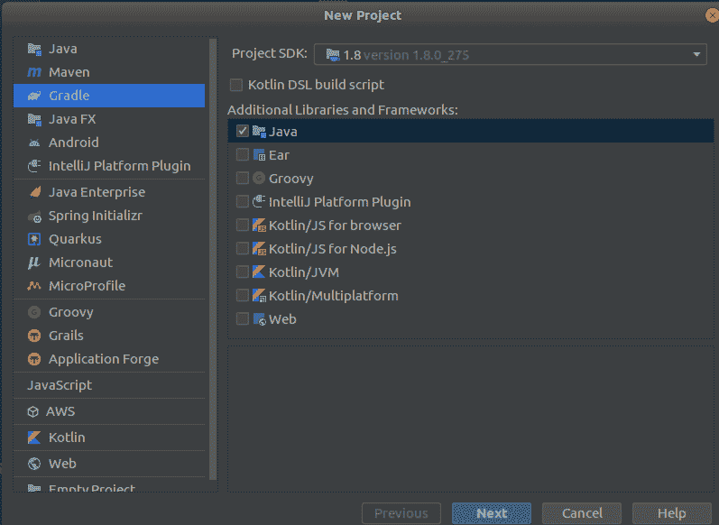
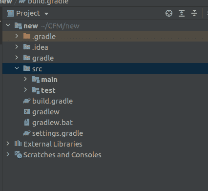

# 创建第一个春季启动应用程序

> 原文：<https://medium.com/nerd-for-tech/create-the-first-spring-boot-app-4e930d812a22?source=collection_archive---------8----------------------->

我不打算深入研究许多特性和描述，而只是通过创建一个新的应用程序来深入了解 Spring boot 的世界。要初始化 spring boot 应用程序，我们可以使用 gradle 或 maven。如果你有任何问题，请写在评论里，我会亲自处理的。本系列的最终教程，

[](https://billa-code.medium.com/flutter-series-connecting-the-spring-boot-web-socket-market-data-real-time-market-data-976a07022109) [## 颤振系列—连接弹簧靴网络插座市场数据(实时市场数据)

### 嗨伙计们。所以在上一篇教程中，我向你们展示了如何使用 spring boot 应用程序创建 web socket 来发送…

billa-code.medium.com](https://billa-code.medium.com/flutter-series-connecting-the-spring-boot-web-socket-market-data-real-time-market-data-976a07022109) 

IDE : Intelij

构建工具:Gradle

Java — 1.8

所以首先让我们使用 intellij 创建一个空的 gradle 项目，如下所示。



创建项目后，我们将得到一个只有两个文件的项目。build.gradle 和 settings.gradle。这些是我们要配置的文件，使它成为一个 spring boot 应用程序。第一步，我们用下面的代码替换 build.gradle 中的代码。

所以在我们添加这些代码后，我们必须按 ctrl + shift + o 来同步梯度变化。我们在 build.gradle 中指定的依赖项将被下载。同步后，现在让我们建立项目，然后运行它。我需要一些时间来下载依赖项。



在主文件夹中，我们可以找到两个名为 java 和 resources 的文件夹。这些文件夹是我们将要进行大部分编码的地方。

现在我们必须为这个程序创建一个控制器。我将在 java 文件夹中创建一个名为 StockController.java 文件的控制器。

```
import org.springframework.boot.SpringApplication;
import org.springframework.boot.autoconfigure.EnableAutoConfiguration;
import org.springframework.web.bind.annotation.RequestMapping;
import org.springframework.web.bind.annotation.RestController;

@RestController
@EnableAutoConfiguration
public class StockController {

    @RequestMapping("/")
    String home() {
        return "Hello World!";
    }

    public static void main(String[] args) {
        SpringApplication.*run*(StockController.class, args);
    }
}
```

现在我们可以看到一个名为 gradlew 的文件被创建。因此，如果您使用 Windows，那么我们必须使用 gradlew.bat，如果我们使用 linux，我们必须使用 gradlew 文件来构建和运行。问题是在 linux 中我们不能从终端立即使用这个文件。首先，我们必须使用以下命令更改文件的读写权限。

```
sudo chmod +x gradlew
```

现在，在命令行或终端中，我们必须构建 spring boot 项目。对于 windows，请键入以下命令。

对于 Linux

```
./gradlew clean build
```

现在要运行应用程序，只需键入

```
./gradlew bootRun
```

快乐编码。在下一课中，让我们看看如何创建一个简单的项目，以及如何将它部署到生产环境中。

*原载于 2021 年 6 月 2 日*[*【http://billacode.wordpress.com】*](https://billacode.wordpress.com/2021/06/02/spring-boot-basics/)*。*