# 使用 NodeJs 创建 Twitter Bot 并部署在 Heroku 上

> 原文：<https://medium.com/nerd-for-tech/create-twitter-bot-using-nodejs-and-deploy-on-heroku-dd6ec31534f4?source=collection_archive---------11----------------------->

机智的！我们都知道 Twitter 是什么，我们大多数人都熟悉它的“微博”功能。我们使用状态发布、转发、点赞、评论等功能。

***这篇文章将学习如何使用 twitter 机器人*** 来自动化这些特性

> 你可以用你的机器人做很多事情，它们只限于我们自己的想象。

# 我们将创建一个 twitter 机器人，它将做两件事

1.  每天发一个笑话。
2.  关注某些标签， ***比如*** 包含这些标签的推文 ***转发*** 它们。

# 第一步:申请 Twitter 开发者账户

咄！当然，我们将需要一个开发者帐户。我们还能怎么创造机器人？😅

*   登录[推特](https://twitter.com/)
*   前往[developers.twitter.com](https://developer.twitter.com/en/apply-for-access)并点击“申请开发者账户”
*   选择应用类型，即学生/企业/业余爱好者等。选择学生或业余爱好者。(除非是商业账户，否则这并不重要。商业账户有不同的规则)
*   提及你申请的目的。试着具体说明你打算用你的机器人做什么，在我的例子中，我补充道“我将每天发布随机的笑话。关注一些标签，比如“转发”。你越具体，获得批准的机会就越大。

# 重要！申请前请阅读所有指南

> 在申请之前，请确保您已经阅读了[开发者协议和政策](https://developer.twitter.com/en/developer-terms/agreement-and-policy)、[自动化规则](https://help.twitter.com/en/rules-and-policies/twitter-automation)和[Twitter 规则](https://help.twitter.com/en/rules-and-policies/twitter-rules)

## 我们就要到了…

# 第二步:在 Twitter 上创建你的应用

在您的开发者帐户获得批准后，创建您的应用程序。现在一天，真的不需要多少时间。

*   按照此[创建应用程序 url](https://developer.twitter.com/en/portal/apps/new) 。填写所需的详细信息。

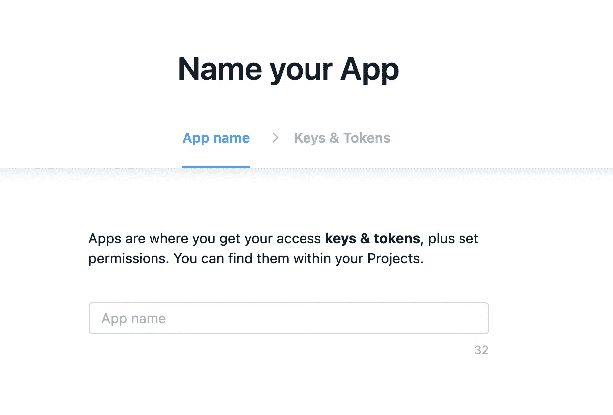

*   输入应用程序名称后，点击下一步。这将显示您的钥匙和代币。

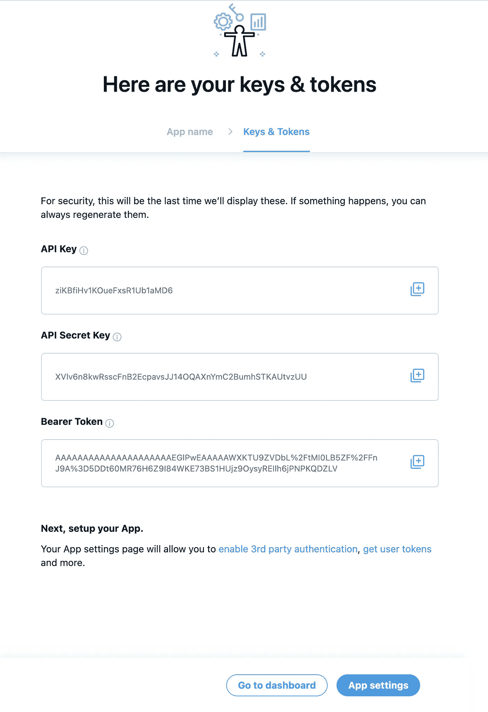

不要浪费你的时间复制我的证书，我已经删除了🤞🏽

*   现在转到**应用程序权限**并点击编辑，从选项中选择**读写**选项，因为我们希望我们的应用程序能够读写。

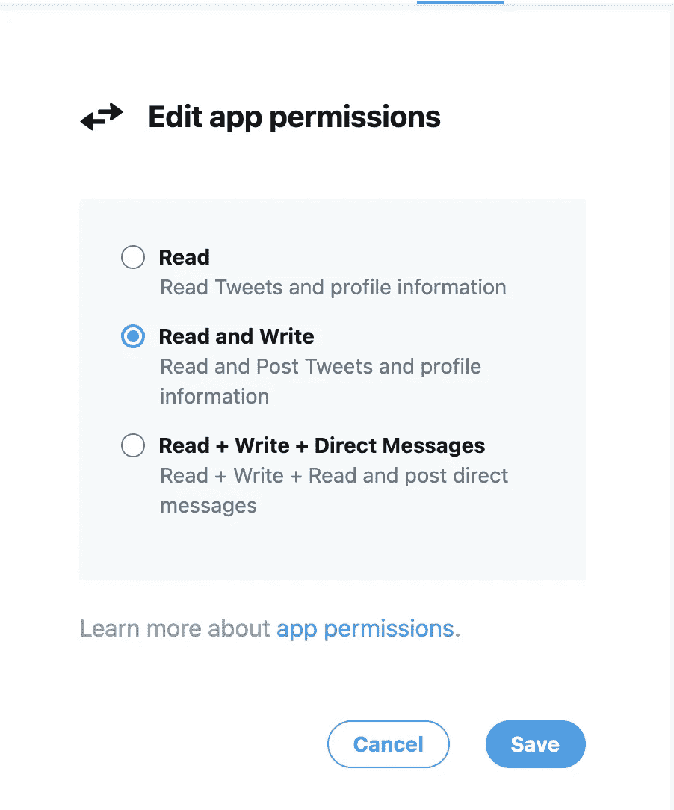

*   点击保存按钮将要求您确认，说“是”。
*   现在，在**概览中，**选择您的应用程序，您将看到一个密钥🔑应用程序名称旁边的图标。继续点击它。

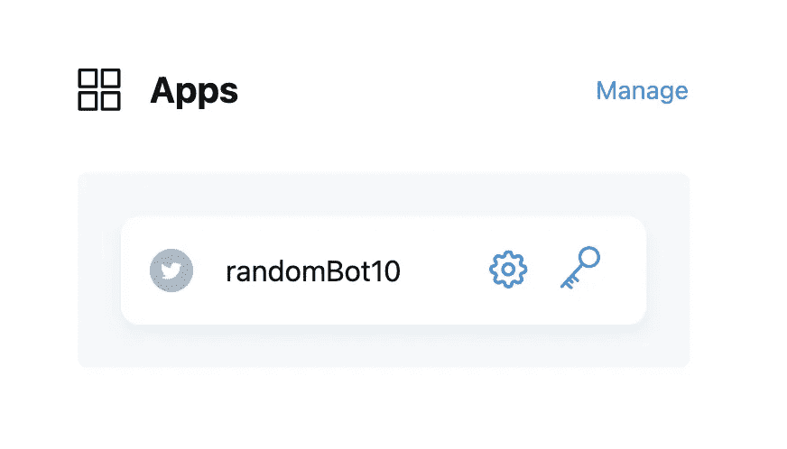

*   您现在应该看到您的**消费者密钥**和**认证令牌**
*   生成**访问令牌和密码**，将它们存储在安全的地方，因为我们的操作需要它们。

## 快到了…

# 步骤 3:设置开发环境

确保您的计算机上安装了 NodeJs，npm

对于 Ubuntu，使用以下命令安装

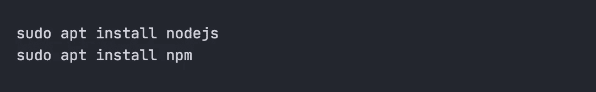

对于 Mac 或 Windows，点击[此处](https://nodejs.org/en/)获取安装说明

创建一个名为`<your-bot-name>` 的目录，在我的例子中，我命名为`lazy-twitter-bot`

我们将使用`[twit](https://www.npmjs.com/package/twit)` npm 包。它是 NodeJs 的 Twitter API 客户端。
在`<your-bot-name>`目录中输入以下命令。

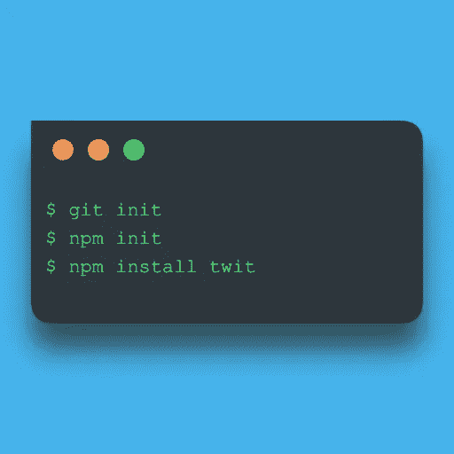

Node.js 开发环境设置现在已经完成🎉

# 步骤 4:开发机器人

在我们开始开发之前，我们需要认证`twit`。为此，我们将使用我们在前面步骤中保存的 API 密钥、访问令牌等。

*   在你的根目录下创建文件夹名`config`。
*   添加一个文件名`config.env`并在其中输入以下代码。

**config.env**

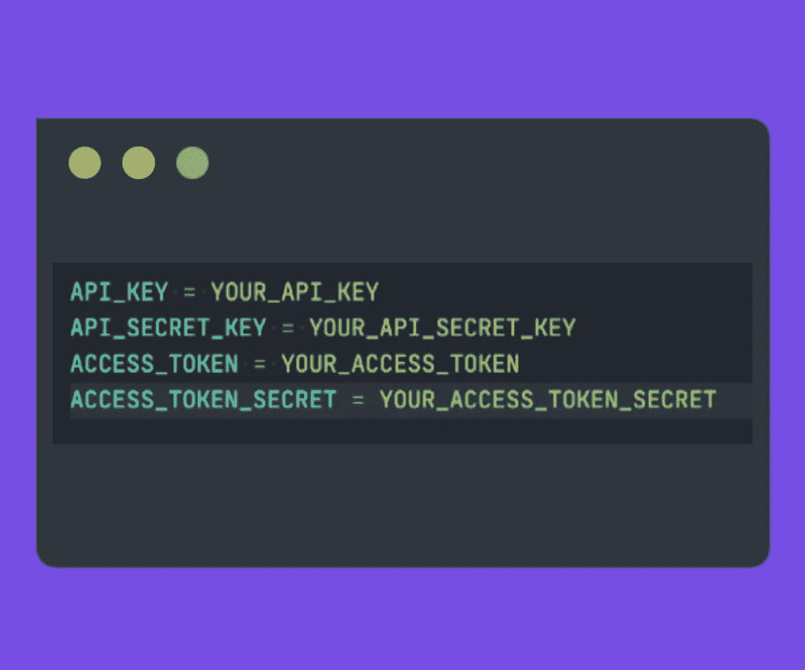

*   将此文件添加到您的`.gitignore`文件中，因为我们不知道将被推送到 git repo 的秘密。
*   安装 npm 包，这将帮助我们加载环境变量。

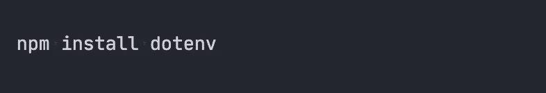

*   添加`[axios](https://www.npmjs.com/package/axios)` npm 包。我们将使用这个获取笑话，并使用我们的机器人发布它。

现在我们已经添加了我们的`.env`文件，安装了我们的依赖项，让我们继续创建`index.js`，这将是我们的 bot 的入口点。

> 在我的例子中，我使用`index.js`来编写我的机器人代码。你可以根据你的想法给它起任何名字。我将在文件中编写所有代码，因为这些代码只是为了演示的目的。我认为每个功能都应该有其专用的。js 文件，前提是您要构建多个特性

下面是我们机器人的代码

**index.js**

让我们来理解代码

*   从`./config`文件夹导入我们的`config`
*   从`twit`包导入`Twit`
*   从`axios`包导入`axios`
*   使用 `Twit`和我们从`config.env`导入的配置初始化 **T 实例**
*   **postStatusUpdate 方法**

1.  这个函数基本上每天都会运行(86400000 在 ms 中)，我们已经用一个简单的`setInterval` API 实现了这一点。
2.  给这个网站打个电话。这是一个很酷的网站，我发现它能产生笑话。它有多个参数，通过这些参数你可以获取笑话。我做了一个简单的调用，随机返回一个笑话。
3.  一旦我们有了笑话对象，我们就使用
    `**T.post(‘statuses/tweet’, { status: joke }, responseCallback );**`发布它
4.  responseCallback 是我们处理 Twitter APIs 响应的常用方法。
5.  运行`node index.js`
6.  这将发布我们的推文！🎉🎉这太简单了，不是吗？要验证，请登录 twitter 并检查推文是否已发布

*   **like and tweet 方法**

1.  该功能将每小时运行一次，请遵循以下 hastags
    ``#JavaScript, #nodejs, #mongoDB, #vuejs, #reactjs, #expressjs``
2.  我们将创建一个`stream`来观察/扫描包含这些标签的推文。
3.  对于 on `tweet`事件，我们获得 tweet 对象。然后，我们使用`favorite/create`属性来喜欢推文，使用`statuses/retweet/:id`来转发更新。
4.  现在再次使用`node index.js`运行文件
5.  你现在应该看到多条推文被点赞和转发🎉

要了解更多关于 API、属性请访问 [**本**](https://github.com/ttezel/twit) **。**

# 步骤 5:在 Heroku 上部署机器人

*   在 [Heroku](https://id.heroku.com/login) 上创建一个账户
*   在 Heroku 上创建并应用`<your-bot-name>`

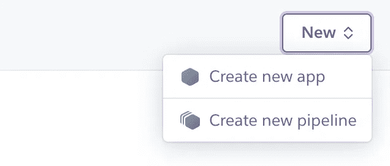

*   这将打开一个表单，输入所需的详细信息。应用程序名称应该是本地项目目录的名称

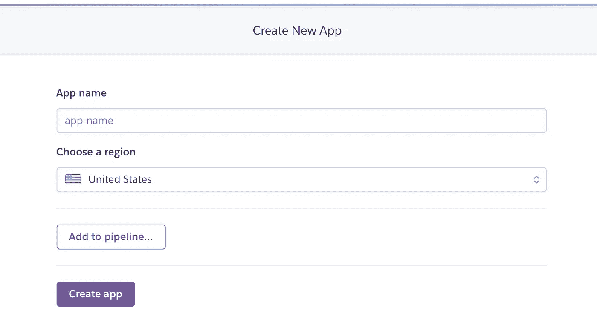

*   现在使用下面的命令在你的机器上安装 **heroku-cli**

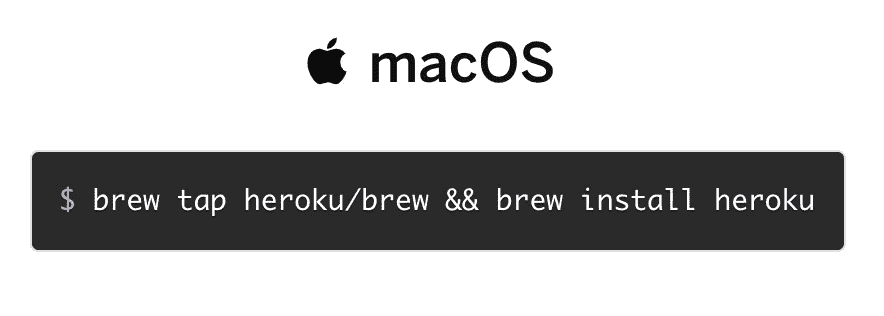

*   对于 windows，Linux 或其他安装方法请按照[这个](https://devcenter.heroku.com/articles/heroku-cli)链接。
*   为了让 heroku 理解我们的 bot start 命令，我们创建了一个具有以下代码的 **Procfile**
*   **过程文件**

*   让我们使用下面的 CLI 命令登录 heroku

*   这将在您的浏览器中打开一个登录链接，输入您的密码。成功登录后，您现在可以关闭选项卡。
*   使用以下命令在 Heroku 上部署机器人

## 我们快到了..

现在我们的机器人已经部署在 Heroku 上，我们需要启动它，让它完成我们为它编写的工作。

启动 Heroku 上的*工人*

*   去[https://dashboard.heroku.com/apps](https://dashboard.heroku.com/apps)点击你的机器人应用
*   然后点击**配置 Dynos**

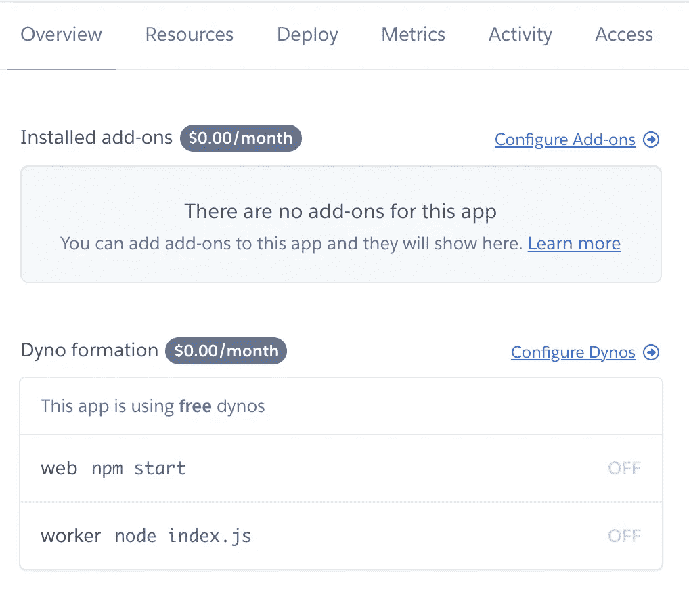

*   关闭`web npm start` ，启动`worker node index.js`并确认

# 机器人准备好了！🍾🎊

准备好摇滚了吗

# 随机机器人

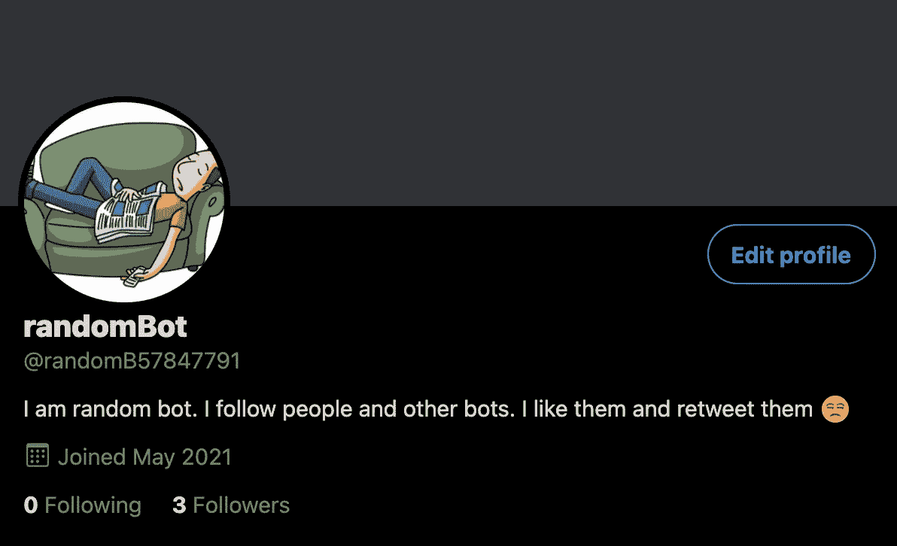

你可以按照这个 [**链接**](https://twitter.com/randomB57847791) 看到机器人在工作

# 机器人的源代码

 [## nomercy 10/懒人推特机器人

### 在 GitHub 上创建一个帐户，为 Nomercy10/lazy-twitter-bot 开发做出贡献。

github.com](https://github.com/Nomercy10/lazy-twitter-bot) 

# 我们完了。

感谢您的反馈！

感谢您的阅读！🙌