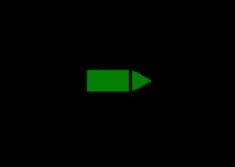
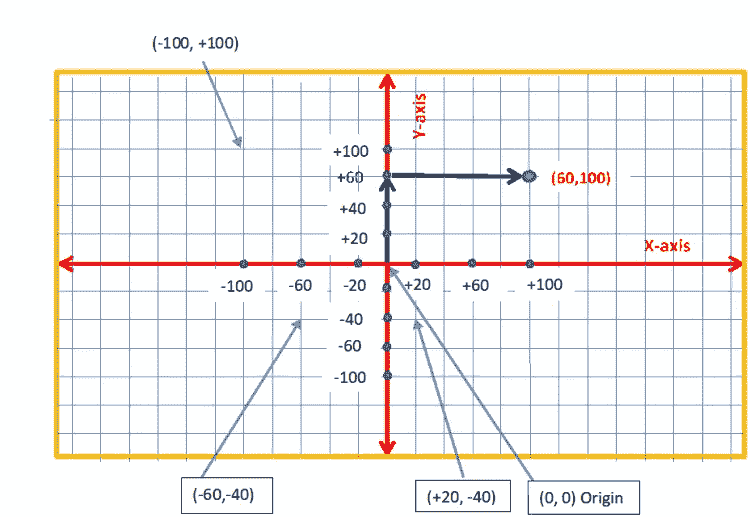
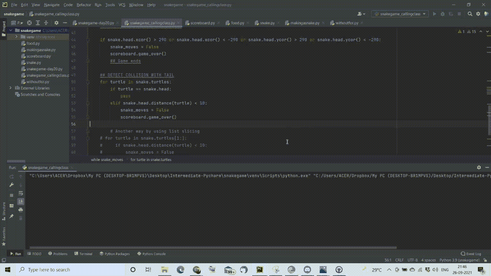

# 使用 Turtle 在 Python 中创建自己的贪吃蛇游戏

> 原文：<https://medium.com/nerd-for-tech/create-your-own-snake-game-in-python-using-turtle-bd3bf95bb4c1?source=collection_archive---------1----------------------->

# 关于蛇的游戏

我们都可以证明，贪吃蛇游戏可能是我们小时候在手机上玩的第一个游戏，也是我们最喜欢的游戏。相互竞争以获得最高分。

随着 android 的出现，我们有了很多更复杂的游戏。尽管如此，贪吃蛇游戏的魅力并没有消失，我们甚至可以在 android 上看到它的模仿。它的创作仍然引人入胜。

作为一名 python 开发人员，我深入研究了如何尽可能简单地创建游戏。我们可以在创建游戏时学习 OOP 概念，如继承、__init__ 功能、探索 python 中的海龟、随机和时间模块。

事不宜迟。让我们直接开始吧。

# 游戏的目标

玩家必须移动蛇，当蛇碰到食物时，蛇的长度增加，分数也增加。如果蛇头碰到自己的尾巴或屏幕边缘。蛇死了，控制台应该输出游戏结束。

# **构建贪吃蛇游戏的步骤**

1.  **安装海龟模块和随机**(请看一下[我之前的项目](/nerd-for-tech/simulating-a-random-walk-in-python-617d1e6de7d7)模拟随机漫步，以更好地了解海龟模块。)
2.  **创建游戏屏幕**
3.  **创造蛇的身体**
4.  **创建移动蛇的键盘绑定**
5.  **为蛇创造食物(类继承)**
6.  **维护记分板(类继承)**
7.  **检测蛇与食物的碰撞**
8.  **检测蛇与墙壁的碰撞**
9.  **探测蛇与尾巴的碰撞**

## 第一步:**安装模块龟和随机**

要安装 turtle 包，你可以在 py 控制台发出下面的命令。

```
pip install turtle
```

## **步骤 2:创建游戏屏幕**

```
from turtle import Screen, Turtle
import time
screen = Screen()
screen.setup(width=600, height=600)
#giving keyword arguments here for better understanding
screen.bgcolor("black")
screen.title("Snake Game")
screen.tracer(0) #Screen wont refresh
# First step is to create a snake
```

从 turtle 包中导入屏幕和 Turtle 类后。我们创建了一个屏幕类的对象。我们使用了以下方法来创建 turtle 包的可用屏幕，可以在这里找到(Turtle 文档)。

**解释-:**

*   **screen.title("贪吃蛇游戏")**将设置所需的屏幕标题
*   **screen.setup(width=600，height=600)** 用于设置屏幕的高度和宽度
*   **screen.tracer(0)** 将关闭屏幕更新直到刷新
*   **screen . bgcolor(" black ")**将设置屏幕的背景色为黑色

## **第三步:创建蛇的身体**

```
from turtle import Turtle
xy_starting = [(-20, 0), (-40, 0)]
class Snake:
    def __init__(self):
        # What should happen when we initialize a new snake object
        my_turtle_1 = Turtle("triangle")
        my_turtle_1.color("green")
        self.turtles = [my_turtle_1]
        self.head = self.turtles[0]
        self.create_snake()

    def create_snake(self):
        for coordinates in xy_starting:
            my_turtle = Turtle("square")
            my_turtle.color("green")
            my_turtle.penup()  # to
            my_turtle.goto(coordinates)
            self.turtles.append(my_turtle)
            #Simply appends other turtles passed to the turtles list
            # Changing the positioning of the second and third box 
            # they end up on top of each other
```

我们创建另一个名为 snake.py 的 py 文件，在这里我们将创建我们的蛇。

```
xy_starting = [(-20, 0), (-40, 0)]
# Defines the coordinates for our three turtles 
```

我们继续创建蛇的方法是创建三只乌龟，它们显示在屏幕上，如下所示。



图片来源:我的桌面

为了了解海龟坐标系的概念:



从坐标系中我们知道，默认情况下，我们的第一只海龟会出现在坐标(0，0)处。因此，我们应该在(-20，0)和(-40，0)创建第二只海龟。我们将 x 和 y 坐标定义为一个列表中的元组。

我们定义了一个名为“create_snake”的新函数。这基本上创造了一只形状为正方形、颜色为绿色的海龟。

```
def create_snake(self):
        for coordinates in xy_starting:
            my_turtle = Turtle("square")
            my_turtle.color("green")
            my_turtle.penup()  # to stop the turtle from drawing
            my_turtle.goto(coordinates)
            self.turtles.append(my_turtle)
```

**解说-:**

*   **my_turtle = turtle(" square ")**将创建一个名为“my _ Turtle”的方形 Turtle 类对象。
*   **my_turtle.color("green")** 将乌龟的颜色设置为绿色。作为青蛇是有道理的。
*   my_turtle.penup() 在移动时，也就是在创建 3 只乌龟时，将停止乌龟的绘制。
*   **my _ turtle . goto(coordinates)**当 for 循环遍历 xy 坐标列表时，将使 turtle 转到这些 x-y 坐标。
*   **self . turtles . append(my _ turtle)**会将新的海龟添加到类开始时初始化的“海龟”列表中。

## __init__ 函数

```
class Snake:
    def __init__(self):
        # What should happen when we initialize a new snake object
        my_turtle_1 = Turtle("triangle")
        my_turtle_1.color("green")
        self.turtles = [my_turtle_1]
        self.head = self.turtles[0]
        self.create_snake()
```

记住，每当你从任何类中初始化一个新的对象时，就会调用**“init”**。我们将创建一个三角形的蛇头，并将其添加到一个名为“海龟”的列表中。

另一种理解方式是，在我们的 **__init__** 函数中成功的**“self”**可以被整个类使用和调用。它们成为整个类的全局变量。

类似地，Snake 类的许多对象可以通过传递不同的乌龟作为参数来创建。

**解释-:**

*   **my _ turtle _ 1 = Turtle(" triangle ")**将创建一个形状为三角形的 Turtle 类的对象。
*   我的乌龟会把我们的第一只乌龟变成绿色
*   **self . turtles =[my_turtle_1]**会创建一个乌龟对象列表，以 my _ turtle _ 1 作为第一个乌龟对象或者头。
*   **self . head = self . turtles[0]**将提取蛇的头部(或龟的列表)
*   最后，我们调用 create_snake()函数来创建我们的蛇。

> **因此，每当“类蛇”的任何对象被创建时，上面的代码行就像在 __init__ 函数中一样被执行。**

## **步骤 4:创建键盘绑定来移动蛇**

**4.1:移动蛇**

我们定义了另一个函数“move”来实现移动蛇的功能。

```
def move(self):
    for turtle in range(len(self.turtles) - 1, 0, -1):
        # Simply start = 2, stop = 0, step = -1
        # to goto a particular x and y position
        x_coord = self.turtles[turtle - 1].xcor()
        y_coord = self.turtles[turtle - 1].ycor()
        # turtles[turtle].penup()
        self.turtles[turtle].goto(x_coord, y_coord)
    self.turtles[0].penup()# To not make drawing a line when moving
    self.turtles[0].forward(move_by_forward)
```

我们希望我们所有的海龟一起移动来实现这一点，我们遍历每个海龟对象，并使用“goto”方法将海龟移动到成功的海龟的先前位置。

**解说:**

*   **for turtle in range(len(self . turtles)-1，0，-1)** 将从乌龟的头部到尾部遍历乌龟对象“turtles”列表。(最后一只乌龟)。其中**" len(self . turtles)-1 "**返回值 2，0 为**-1 "**步长的停止值
*   **x _ coord = self . turtles[turtle—1]。xcor()** 获取当前被迭代的海龟的 x 坐标。
*   **y _ coord = self . turtles[turtle—1]。ycor()** 获取当前被迭代的乌龟后面的乌龟的 y 坐标。
*   **self.turtles【乌龟】。goto(x_coord，y_coord)** 将海龟移动到下一个海龟的坐标 x_coord，y_coord。
*   **self.turtles[0]。penup()** 会移动乌龟的头而不画图。
*   **self.turtles[0]。前进(move_by_forward)** 将乌龟移动 20 步。

## **4.2:创建键盘绑定**

```
def up(self):
    # If the turtle goes up it shouldn't be going down by pressing   down arrow
    if self.head.heading() != DOWN:
        self.head.setheading(UP)

def down(self):
    # If the turtle goes down it shouldn't be going up by pressing up arrow
    if self.head.heading() != UP:
        self.head.setheading(DOWN)

def right(self):
    # If the turtle goes right it shouldn't be going left by pressing left arrow
    if self.head.heading() != LEFT:
        self.head.setheading(RIGHT)

def left(self):
    # If the turtle goes left it shouldn't be going right by pressing right arrow
    if self.head.heading() != RIGHT:
        self.head.setheading(LEFT)
```

我们定义了 4 个函数上、下、右和左。解释海龟向不同方向的运动。

我们还应该考虑蛇游戏的逻辑，如果:

> self . head . heading()-指向蛇的当前头部

*   如果海龟上升，按下条件**给出的向下箭头，它就不会下降！= DOWN** 只比我们可以设置的头指向“UP”**self . head . set heading(UP)**。
*   如果海龟掉下去了，按下条件 if **self.head.heading()！= UP** 。
*   如果乌龟往右走，按条件 if **self.head.heading()！=左**。
*   如果乌龟向左走，按下条件 if **self.head.heading()给出的右箭头，它就不应该向右走！=右**。

```
# Hardcoding Headings for easy readability
UP = 90
DOWN = 270
RIGHT = 0
LEFT = 180
```

我把标题硬编码了，标题基本上是表示方向的度数。

```
# Incorporating Event Listeners
snake = Snake()
screen.listen()
screen.onkey(snake.up, "Up")
screen.onkey(snake.down, "Down")
screen.onkey(snake.left, "Left")
screen.onkey(snake.right, "Right")
```

为了创建 keayboard 绑定，我们转到 main.py。

**解释-:**

*   将创建一个类 snake 的对象。
*   **screen.listen()** 在 TurtleScreen 上设置焦点(以便收集按键事件)
*   **screen.onkey(snake.up，" up")** 将 snake 类的" Up "函数绑定到键盘上的向上箭头。
*   **screen.onkey(snake.down，" down")** 将 snake 类的" Down "函数绑定到键盘上的向上箭头。
*   **screen.onkey(snake.left，" left")** 将 snake 类的" Left "函数绑定到键盘上的向上箭头。
*   **screen.onkey(snake.right，“右”)**将 snake 类的“右”函数绑定到键盘上的向上箭头。

## 第五步:为蛇创造食物

我们创建了一个名为 food.py 的新文件，并在其中定义了一个名为“food”的类来为我们的蛇创建食物。

```
from turtle import Turtle
import random

class Food(Turtle):

    def __init__(self):
        super().__init__()
        self.shape("circle")
        self.penup()
        self.shapesize(stretch_len=1, stretch_wid=1)
        self.color("blue")
        self.speed("fastest")
        random_x = random.randint(-280, 280)
        random_y = random.randint(-280, 280)
        self.goto(random_x, random_y)

    # Defining a function for changing the position of food
    # with every iteration
    def refresh(self):
        random_x = random.randint(-280, 280)
        random_y = random.randint(-280, 280)
        self.goto(random_x, random_y)
```

## 类继承

我们不用从 turtle 包中再次创建 Turtle 类的对象，而是使用类继承来继承这个类的所有属性和方法。

方法是简单地在类定义中将“Turtle”作为参数传递。

```
class Food(Turtle):
```

为了实现子类 Food 中超类(Turtle)的 __init__ 函数的功能，我们使用了“super”关键字。

```
def __init__(self):
        super().__init__()
```

定义食物的大小

```
self.shapesize(stretch_len=1, stretch_wid=1)
```

定义当食物被蛇吃掉时，食物应该跳到哪里的随机坐标。

```
random_x = random.randint(-280, 280)
        random_y = random.randint(-280, 280)
        self.goto(random_x, random_y)
```

我们定义了另一个函数“refresh ”,它将使食物进入随机坐标。

```
def refresh(self):
        random_x = random.randint(-280, 280)
        random_y = random.randint(-280, 280)
        self.goto(random_x, random_y)
```

## 步骤 6 : **维护记分牌**

我们创建了一个名为 scoreboard 的新 pyfile，其中有一个类记分牌，用于在蛇吃食物时维护用户的分数。

```
from turtle import Turtle

class Scoreboard(Turtle):

    def __init__(self):
        super().__init__()
        self.score = 0
        # need to give white color otherwise it wont be visible as
        # it will be in black
        self.color("white")
        self.penup()
        self.goto(0, 270)
        # Deciding upon the coordinates of where the scoreboard is to be placed
        self.write(f"Score: {self.score}", align="center", font=("Arial", 24, "normal"))
        self.hideturtle()
        # Deciding upon the coordinates of where the scoreboard is to be placed

    def update_scoreboard(self):
        self.write(f"Score: {self.score}", align="center", font=("Arial", 24, "normal"))

    def increase_score(self):
        self.score += 1
        self.clear()
        self.update_scoreboard()
        self.write(f"Score: {self.score}", align="center", font=("Arial", 24, "normal"))

    def game_over(self):
        self.goto(0, 0)
        self.write("GAME OVER", align="center", font=("Arial", 24, "normal"))
```

为了简洁起见，我在代码中添加了注释。我已经创建了 4 个函数 __init__ 用白色创建了分数图形。

```
self.goto(0, 270)
```

定义记分板放置在屏幕中间顶部的位置。x 轴= 0，y 轴= 270

```
update_scoreboard(self)
```

每次调用都会更新记分板。

```
increase_score(self)
```

会增加分数，也会清除以前的分数。

```
game_over(self)
```

在这种情况下，记分板将返回零值。

## **步骤 7:检测蛇与食物的碰撞**

```
## DETECTING COLLISION WITH FOOD
## Detecting collision by using distance method
## Checking the distance of the snake from the food
## We know that food is 10 by 10 in dimensions
## After testing 15 was the best one
if snake.head.distance(food) < 15:
    food.refresh()
    snake.extend()
    scoreboard.increase_score()
```

碰撞可以通过蛇和食物之间的距离来解释，该距离应该小于 15(测试时)。碰撞后需要执行三个动作。

1.  食物应该在一个新的位置生成——food . refresh()
2.  蛇应该伸出尾巴— snake.extend()
3.  记分板的分数增加— scoreboard.increase_score()

1 和 3 已经讨论过了，让我们看看如何实现 2。那是延长尾巴。

```
def add_turtle(self, coordinates):
    my_turtle = Turtle("square")
    my_turtle.color("green")
    my_turtle.penup()  # to
    my_turtle.goto(coordinates)
    self.turtles.append(my_turtle)

def extend(self):
    #catches the tail of the snake and inserts a turtle there
    self.add_turtle(self.turtles[-1].position())
```

我们在 snake.py 文件中定义了两个新函数“add_turtle”和“extend”

add_turtle 从 extend 函数中获取一个对象和尾巴的坐标，并简单地将一个新创建的 turtle 添加到 turtles 列表中，从而增加 turtle 列表中 turtle 对象的数量以及蛇的长度。

## 步骤 8 : **检测蛇与屏幕边界的碰撞**

```
## DETECTING COLLISION WITH WALL

if snake.head.xcor() > 290 or snake.head.xcor() < -290 or snake.head.ycor() > 290 or snake.head.ycor() < -290:
    snake_moves = False
    scoreboard.game_over()
    ## Game ends
```

为了检测蛇的碰撞，我们只对当它碰到屏幕边界时的头部感兴趣。我们可以用一个简单的 if 条件来检查这一点，它检查乌龟头部的 x 和 y 坐标。

通过测试发现，x 和 y 坐标中的 290°和-290°将是我们定义屏幕边界和冲突的最佳选择。

## 步骤 9:检测蛇与自己尾巴的碰撞

```
## DETECT COLLISION WITH TAIL
for turtle in snake.turtles:
    if turtle == snake.head:
        pass
    elif snake.head.distance(turtle) < 10:
        snake_moves = False
        scoreboard.game_over()
```

elif snake.head.distance(乌龟)< 10 accounts for the distance of the head of the turtle with the previous turtles in snake if it is found to be less than 10 the while loop breaks snake_moves = False and the game over message is poped up by calling the game over function in the scoreborard class.

The complete code can be found [此处](https://github.com/Ayu-dxt777/100daysofpython/tree/main/Snake%20Game)。

最后的结果是:



**总结**

我们成功开发了贪吃蛇游戏，在这个过程中，我们学习了海龟模块、类继承、OOP 概念，比如 __init__ 功能。

你喜欢我的努力吗？如果是的话，请跟我来获取我的最新帖子和更新，或者更好的是，请我喝杯咖啡！☕

[](https://www.buymeacoffee.com/ayushdixit)[](https://www.buymeacoffee.com/ayushdixit) [## ayushdixit 正在编码、部署项目和写博客

### 嘿👋我刚刚在这里创建了一个页面。你现在可以给我买杯咖啡了！

www.buymeacoffee.com](https://www.buymeacoffee.com/ayushdixit)