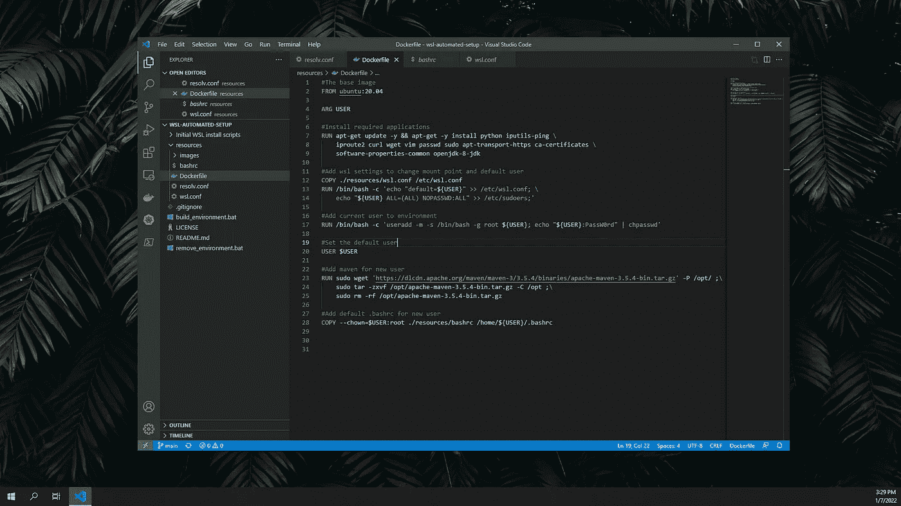

# 使用 Docker 创建自己的 WSL 发行版

> 原文：<https://medium.com/nerd-for-tech/create-your-own-wsl-distro-using-docker-226e8c9dbffe?source=collection_archive---------1----------------------->

## WSL 历险记

根据您或您的团队的需求创建可定制的 WSL 发行版的指南。

我的 WSL 发行版的 docker 文件

# 介绍

随着 Windows Subsystem for Linux 的成熟以及在整个行业中获得越来越多的支持，它正迅速成为用于开发工作的传统 VM 工具(如 VirtualBox 或 VMware)的一个有吸引力的替代工具…