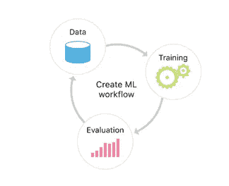
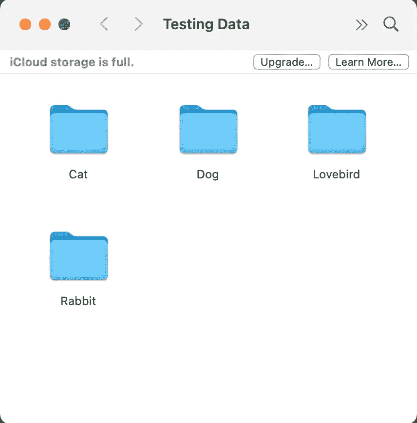

# CreateML

> 原文：<https://medium.com/nerd-for-tech/createml-a0300e442fb5?source=collection_archive---------21----------------------->

它允许我们做的是获取文本、图像或其他类型的文件等数据，并将其输入这个名为 CreateML 的框架，以创建我们自己的 coreML 模型，然后可以将这些模型集成到我们的应用程序中。本培训直接在 Xcode playground 进行，我们将使用最新版本的 swift 以及 iOS12 API 或更高版本。训练完模型后，用它以前从未见过的数据对它进行测试，并评估它执行任务的情况。当模型表现足够好时，您就可以使用 CoreML 将它集成到您的应用程序中了。

***Create ML 利用了苹果产品内置的机器学习基础设施，如照片和 Siri。这意味着你的图像分类和自然语言模型更小，训练时间更少。***

## **如何为训练收集数据**

我们可以很容易地去[www.images.google.com](http://www.images.google.com)，我们只是要搜索我们想要的，并保存我们想要的图像到一个名为训练数据的文件夹。

我们赋予文件夹的标签极其重要，因为这是 ml 模型将与我们放入该文件夹的每一张图像相关联的标签，并且它将本质上赋予我们这个标签。

现在我们有了训练模型所需的所有图像，我们创建了另一个名为 testing data 的文件夹。这个文件夹将再次包含相同的子文件夹，名称相同，但图像完全不同，我们还没有显示我们的模型。这个测试数据集用于验证我们模型的准确性，因为它们被标记为模型可以检查它认为它是什么，然后将其与正确的答案进行比较，然后评估它在分类过程中的准确性。

我们不必担心图像的格式或大小，因为 createML 会替我们处理。

## **如何训练一个全新的机器学习模型**

Xcode ->打开开发者工具->创建 ML ->新建文档

并为训练和测试数据选择文件路径。