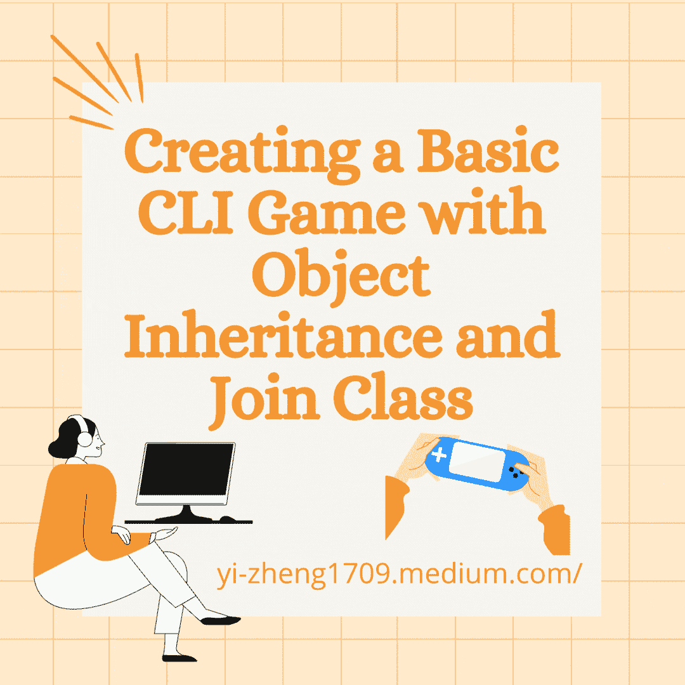
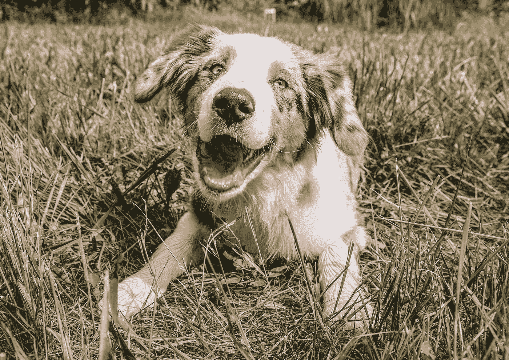
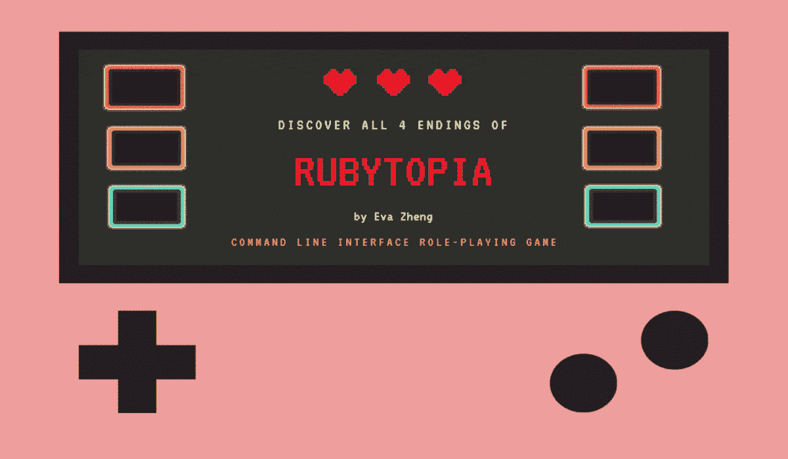

# 用对象继承和加入类创建一个基本的 CLI 游戏(包括 Repl)

> 原文：<https://medium.com/nerd-for-tech/creating-a-basic-cli-game-with-oop-77d7cb7516e8?source=collection_archive---------1----------------------->



所以是时候开始我在熨斗学校的第一个项目了。除了必须抓取一个站点或使用一个 API 和最终结果是一个命令行界面(CLI)应用程序，没有任何其他限制。但是当我第一次开始的时候，我甚至不知道关于抓取/API 的需求，但是这不是这篇文章的重点。

我一直喜欢游戏，我记得在某处读到过，最早的 RPG 之一是 CLI 游戏！当我给我的团队领导(也就是老师)发消息说我想做一个 CLI RPG 时，我可能极度缺乏睡眠。那时，我认为我们甚至还没有完成课程中 Ruby 部分的面向对象编程(OOP)。

所以那时，我很困惑如何才能把生命值和法力值加入到游戏中。我如何记录我杀了多少怪物？我如何攻击怪物？怪物会怎么攻击我？一切事物之间将如何相互联系？谁来记录这一切？

我压力太大了。


[马太·亨利](https://unsplash.com/@matthewhenry?utm_source=medium&utm_medium=referral)在 [Unsplash](https://unsplash.com?utm_source=medium&utm_medium=referral) 上拍照

# **对象继承**

于是几天过去了，我们学完了对象关系，但我仍然很困惑。

但是，嘿，我知道我是那种能从很多很多错误中学习的人。我甚至不知道自己在做什么，就开始编写游戏代码。

```
class Elfattr_accessor :name, :health, :mana, :evilness, :happiness, :hp_pots, :mp_pots, :friends_made def initialize

       @health = 60
       @mana = 60
       @evilness = 0
       @happiness = 2
       @hp_pots = 20
       @mp_pots = 20
       @friends_made = [] endend 
```

现在，我认为这是一个很好的主意。看看它有多有条理！但后来我想在未来创造更多的种族。只有一场比赛的游戏会很无聊，你不觉得吗？那么我是不是必须将所有的实例变量复制粘贴到我的其他类中？呀。

但是后来，我们在课程中进展到了**对象继承**。我得救了。对于像我这样的新手来说，Ruby 是一门非常棒的语言。顾名思义，一个对象可以继承另一个对象的特征！多棒啊。



[诚实的爪子](https://unsplash.com/@honestpaws?utm_source=medium&utm_medium=referral)在 [Unsplash](https://unsplash.com?utm_source=medium&utm_medium=referral) 上拍照

它是如何工作的？让我们首先创建**父类**。这是一个拥有我希望我的**子类**(或**子类**)拥有的所有基本特征的类。我将在/lib 文件夹的 Race.rb 中创建**父类**。

```
class Raceattr_accessor :health, :mana, :evilness, :happiness, :hp_pots, :mp_pots, :friends_made def initialize

       @health = 60
       @mana = 60
       @evilness = 0
       @happiness = 2
       @hp_pots = 20
       @mp_pots = 20
       @friends_made = [] endend 
```

我希望每个**子类**都有不同的生命值和法力值，所以我决定把这些特性从`**initialize**`方法中去掉。但是我仍然保留了`**attr_accessor**` ，因为我根本*不愿意在每次我想要创建一个新类的时候复制并粘贴整个文本块。*

*所以现在我们有了一个**父类**，我们可以产生一个**子类**。我们如何继承那些可爱的特质？让我们看看！*

*我将创建一些**子类**。一个在/lib 文件夹的 Elf.rb 文件中。另一个名为 Giant.rb，也位于/lib 文件夹中。这样，当我在**的父类**上调用`**require_relative**`时，它不会在目录中很靠前。*

*这是 Elf.rb 文件。*

```
*require_relative 'Race'class Elf < Race def initialize
       super
       self.health = 60
       self.mana = 80
   endend* 
```

*这是 Giant.rb 文件。*

```
*require_relative ‘Race’class Giant < Race def initialize 
       super
       self.health = 120
       self.mana = 30
       self.happiness = 4end* 
```

*让我们打破这一点！*

```
*require_relative ‘Race’*
```

*这一行意味着我所在的当前文件(无论是 Elf.rb 还是 Giant.rb)将需要其他文件中的另一个文件(它是我所在的当前文件的相对路径)才能工作。Ruby 很聪明，知道我指的是一个 Ruby 文件，所以我只保留了“Race”这个文件名。我不需要指出任何目录，因为它们都存在于同一个文件夹中！可爱！*

*无论如何，如果我不需要“Race ”,并且我试图运行我的 Elf.rb 文件，我将收到一条红色的错误消息，内容如下:*

```
*uninitialized constant ‘Race’*
```

*接下来我们来分解一下。*

```
*class Elf < Race*
```

*这意味着 Elf 是一个种族的孩子。Elf 将继承种族职业中现有的一切。这包括所有的`**attr_accessor**`宏和`**initialize**`中实例变量的设置。*

*但是目前种族职业没有任何生命值和法力值！那是因为我希望每场比赛都以不同的生命值和法力值开始！这就是为什么我手动设置生命值和法力值。我使用了`**self.health=**`和`**self.mana=**`，因为我已经定义了定制的生命和法力设置方法。因此，我没有仅仅设置 health 实例变量和 mana 实例变量，而是调用了`**self.health=**`和`**self.mana=**`来分别设置 health 和 mana。*

*再来看巨班。*

```
*def initialize
    super
    self.health = 120
    self.mana = 30
    self.happiness = 4
end*
```

*在 initialize 方法中写‘super’会告诉 Ruby 我希望 Giant 类继承 Race 类`**initialize**`方法拥有的一切。*

*现在，当 Race 类已经设置了 happy 实例变量时，为什么我还要设置`**self.happiness = 4**`？这不是错误。我希望巨人职业比其他子种族更快乐，所以我决定覆盖种族职业的设置`**@happiness**`。同样，我为 happy 属性创建了一个定制的 setter 方法，所以我调用了那个 setter 方法，而不是简单地将属性设置为 4。*

*如果我愿意，我也可以用`**@evilness**`实例变量来做这件事。我要做的就是:*

```
*def initialize
    super
    self.evilness = 8
end*
```

*所以每当我觉得需要改变一些最初在父种族类中设置的属性时，我所要做的就是在**子类**中覆盖它。*

*使用**对象继承**非常有助于创建共享公共方法和公共统计信息的类(它们将被设置为实例变量)。*

*另一个例子是这些 Race 方法。每当我创建一个新的子种族类，这个孩子将继承所有这些方法！所以现在我连复制粘贴都不用了。那种方式不是比我以前的效率更高吗？*

```
*class Race#there are other methods here    def check_mana
       self.mana == 0
   end    def check_mp_pot
    self.mp_pots == 0
   end    def check_hp_pot
       self.hp_pots == 0
   end    def death?
       self.health == 0
   endend* 
```

*现在我们来看看记录玩家和怪物攻击的问题。谁记录什么？*

*所以每个亚种族类都存在于他们自己的文件中。精灵对怪物的存在一无所知。这也意味着怪物还不知道精灵类的存在。但是，它们可以通过 CLI 类相互“交互”。我调用了我的 CLI 类 Rubytopia。Rubytopia 将是加入所有东西(我所有的怪物和我所有的子种族)的职业！Rubytopia 不仅是我的 CLI 类，也是我的“join”类。*

# *什么是联接类？*

*嗯，那是我为我的亚种族职业和怪物创造方法的地方，这样他们将会有战斗！只有在 Rubytopia 类中，他们才能互相争斗。简单地说，join 类连接所有的东西。一切都可以通过 join 类与彼此的信息进行交互。*

*让我给你看看！*

*所以我有一个叫巫师的怪物。这是巫师. rb 文件的一部分。魔法师现在只知道它自己。在初始化时，它本身不能做太多事情。精灵类也是如此。*

```
*class Sorcerer
   attr_accessor :health, :name def initialize
       self.health = 60
       self.name_set #I have a method that randomly sets the name
   end def reply
   #####some method that gives a reply as a string
   endend*
```

*这是我的 Rubytopia 文件的一部分。*

```
*class Rubytopia
   attr_accessor :monster, :player def create_elf
       self.player = Elf.new
   end def sorcerer_encounter
       self.monster = Sorcerer.new
   endend*
```

*所以现在鲁比托邦有一个巫师和一个精灵。Rubytopia 有一个名为`**@monster**`的属性，它跟踪当前的 monster 对象。稍后，我可以访问怪物对象的健康状况，看看战斗序列是否应该继续。同样，Rubytopia 也有一个`**@player**`属性，用于跟踪当前玩家(子种族对象)以及玩家的健康和法力。现在是编码的时候了——神奇！*

*以下代码存在于 Rubytopia 中。*

```
*def player_turn
   counter = 0
   while counter < 7
      self.player_turn_choice
      break if self.monster_or_player_death
      self.monster_turn
      break if self.monster_or_player_death
      counter += 1
   end ##there is a little bit more to this method
   ##but it doesn't highlight the beauty of the join class
end* 
```

*所以即使没有我展示什么是`**self.player_turn_choice**`方法，你也可以猜到它可能只是玩家的选择。同样的还有`**self.monster_or_player_death**`和`**self.monster_turn**`。*

*只是为了让我的代码更紧凑，我用了一个代码来检查怪物和玩家的健康状况，因此方法名为`**monster_or_player_death**`。(但这只是我的偏好。)join 类可以访问 monster 和 sub Race 的信息，因为它们是作为 Rubytopia 的属性存在的(还有 CLI 类和 join 类)。Rubytopia 可以通过对象的 reader 方法访问数据，比如每个对象的健康状况！编码魔术！*

*所以这是怪物和次种族可以相互影响的例子之一。虽然从来没有直接，但由于 join 类，它们能够存在于同一个方法中。如果我愿意，我还可以创建一个方法，让他们互相交谈！这就是 join 类的神奇之处。它(同时)赋予了两个阶层生命，否则他们不会知道彼此的存在！*

# *while/until 循环*

*上面显示的`**player_turn**`方法是我想解决的最后一个方法之一，因为我对***while 循环**的理解很肤浅。**

**那么为什么我要在我的方法中使用它呢？**

**因为它能完成任务。只要`**self.monster_or_player_death**`是假的，我就想让玩家留在战斗中(由 `**player_turn**`处理)。想象一下，必须编写一个没有循环的遇到怪物的简单游戏！我将不得不硬编码每一个怪物的遭遇！这听起来…很痛苦。**

**让我们再看一遍 while 循环代码片段，但这次我们将着眼于`**while**`循环的功能，而不是类交互。**

```
**def player_turn
   counter = 0
   while counter < 7
      self.player_turn_choice
      break if self.monster_or_player_death
      self.monster_turn
      break if self.monster_or_player_death
      counter += 1
   end ##there is a little bit more to this method
   ##but it doesn't highlight the beauty of the join class
end**
```

**只要计数器小于 7，`**player_turn**`方法就会遍历 while 循环中的块。每次循环时，它都会执行:**

*   **`**self.player_turn_choice**`**
*   **检查`**self.monster_or_player_death**`是否为真(如果为真将中断循环)**
*   **`**self.monster_turn**`**
*   **检查`**self.monster_or_player_death**`是否为真(如果为真将中断循环)**
*   **将本地变量`**counter**`加 1，并重新分配`**counter**`的值**
*   **回到循环的起点。**

**因此，在一个正常运行的循环中，有两件事会打破这个循环:**

*   **循环结束时到达 7**
*   **`**self.monster_or_player_death**`返回 true。**

**起初我只在循环中检查了一次`**self.monster_or_player_death**`。然后我玩了一遍游戏来测试 bug，看到怪物攻击我，尽管它的生命值为 0！这时我意识到我必须在`**self.monster_turn**`之后再投入一张支票。**

**虽然循环肯定是有帮助的，但可能需要尝试几次才能让方法运行起来，但它绝对值得使用！**

## **现在开始直到循环！**

**我在`**start**`方法中使用了一个`**until**`循环。`**start**`方法是让 Rubytopia 实例开始运行的方法。你可以想象在我们到达`**until**`循环之前还有其他方法，但是这些现在并不重要。**

```
**class Rubytopia
   #the list of attr_accessor def start 
      #other methods that get invoked prior to this loop
      until self.over?
         self.event_generator
      end
   endend**
```

**这段代码只是说，在`**self.over?**`方法返回真值之前，`**self.event_generator**`(随机生成大量其他事件的方法)将继续执行。**

**虽然你可能不知道`**over?**`的确切代码，但你可以从它的名字中猜出它测试游戏是否结束。**

**使用 until 循环比手动告诉我的程序生成一个事件一定次数要好得多。**

# **结论**

**唷！要读的东西太多了！**

****

**起初，对象关系可能真的令人困惑。一开始我不知道该如何构建我的游戏。老实说，我甚至不知道 join 类将如何与我的游戏一起工作。在我尝试构建我的游戏的第一天，我试图让我的 Elf 类访问关于怪物的数据。我的一些脑细胞死于这种混乱的想法。**

**学习如何优化项目中的每一个对象关系确实需要时间！我试错了很多次，才明白什么是可行的，什么是绝对疯狂的。在旅程的开始，我在 Rubytopia 类中为`**@player_health**`和`**@player_mana**`创建了实例变量。好像我已经完全忘记了 getter 方法。**

**我知道我必须使用循环来让我的游戏生成怪物，但是我太害怕使用它们了！我不想陷入无限循环！但是我很高兴我复习了关于循环的知识，这样我对游戏的设想就变成了现实。**

**当我在写我的游戏时，我了解到当你的大脑疲劳时，或者当你饥饿时，休息一下是非常重要的。如果你不充满能量，你的大脑就无法工作。因此，拥有一个休息良好的大脑绝对有助于处理任何项目！**

**这是对我的游戏的回复，给任何感兴趣的人！请单击绿色的播放按钮继续。**

**随着我在熨斗之旅中继续创建更多的项目，我很高兴能够加深对对象关系的了解！**