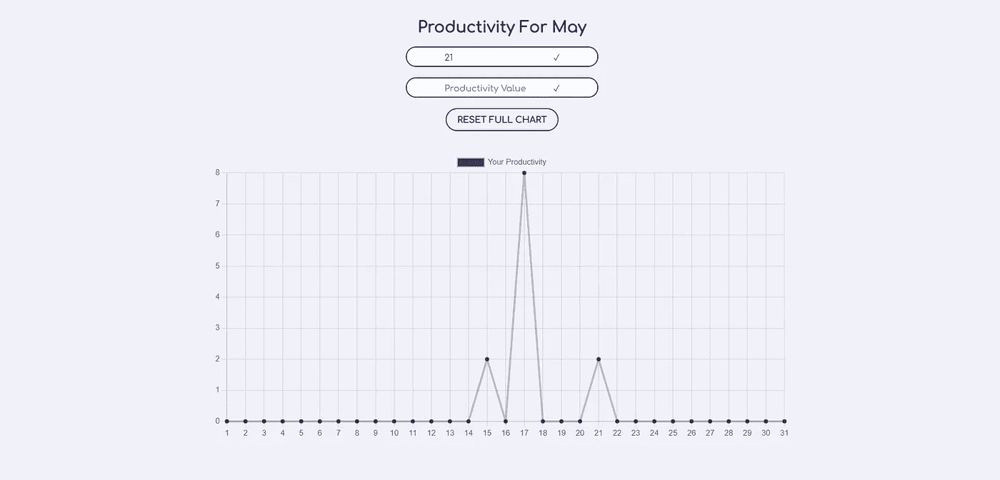
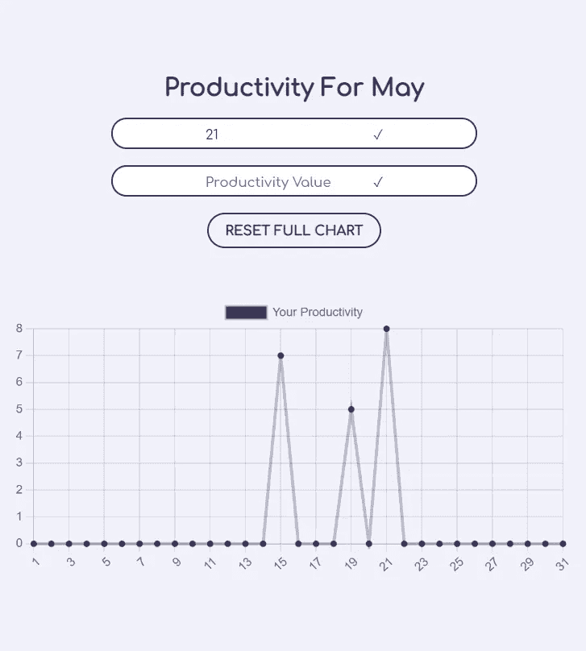

# 在 ReactJS 中创建日常生产力应用程序

> 原文：<https://medium.com/nerd-for-tech/creating-a-daily-productivity-app-in-reactjs-9c8a45ea2ead?source=collection_archive---------14----------------------->

## 带有 ReactJS 和 ChartsJS 的生产力应用程序——初学者的 10 个简单步骤的迷你项目。

本文是在 ReactJS 中创建一个小型项目的分步指南，涵盖了基于函数的组件、钩子、本地存储、charts.js 和其他 npm 库的概念。让我们开始吧！此外，如果您在任何地方遇到问题，您可以在这里查看我的代码。



# 步骤 1:创建 React 应用程序

让我们通过在终端中键入命令`npx create-react-app my-app`来创建我们的 react 应用程序。现在，将 cd 放入刚刚创建的 my-app 文件夹，并运行`npm start`。瞧啊。你刚刚运行你的新项目！

# 步骤 2:文件和文件夹

现在，我们需要制作一些文件和文件夹。在 *src* 文件夹内，制作一个名为 ***组件*** *的文件夹。*该文件夹将包含三个文件。***productivity . js****，****productivity . CSS****(样式表)，****line chart . js****。*清理 *App.js* 和 *App.css(你的风格，你的愿望)*文件，让你有一个干净的石板。接下来，让我们将我们的生产力转化为应用程序，将折线图转化为生产力。

```
//App.js
import Productivity from './Components/Productivity'function App() {
    return (
        <div className="App">
            <Productivity />
        </div>
    );
}export default App;//Productivity.js
import LineChart from './LineChart'
import './Productivity.css'const Productivity = () => {
    return (
        <div className='productivity-container'>
            <LineChart />
        </div>
    );
}export default Productivity;
```

# 步骤 3:安装软件包

进入主要部分。记住，从现在开始所有的代码都要写在 ***LineChart.js*** 文件中。但是在我们继续之前，让我们安装我们将需要的包和依赖项。为此，在终端中运行以下命令。我们还会将这些导入到我们的文件中。

*   `npm i chart.js`
*   `npm i react-chartjs-2`
*   `npm i react-hooks-useform`
*   `npm i jquery`

```
import React,{useState, useEffect} from 'react'
import { Line } from 'react-chartjs-2'
import { useForm } from 'react-hook-form'
import * as $ from 'jquery'
import './Productivity.css'
```

# 步骤 4:本月的天数

我们需要图表的 x 轴具有准确的标签数，因为当前月份中有几天。让我们做一个返回完全相同的函数。不仅如此，我们还要在不同的地方使用这个函数。这将是非常重要的。

```
function daysInThisMonth() {
    var now = new Date();
    return new Date(now.getFullYear(), now.getMonth()+1, 0).getDate();
}
```

charts.js 中的任何图表都接受两个参数: ***数据*** 和 ***选项*** 。现在，我们的数据必须是动态的，所以我们将为此使用 ***useState*** 钩子。但是对于选项，让我们在一开始就声明它们。我们不会在任何时候篡改它们。

```
const options = {
    scales: {
        yAxes: [
            {
                display: true,
                ticks: {
                    beginAtZero: true,
                },
            },
        ],
    },
};
```

# 步骤 5:初始化数据集

在这一步中，我们将初始化我们的数据集，该数据集将使用 useState 挂钩馈入折线图的*‘data’*参数。

```
const [datasets, setDatasets] = useState(
    {
        label: 'Your Productivity',
        data: Array(daysInThisMonth()).fill(0),
        fill: false,
        backgroundColor: 'rgb(60, 51, 92)',
        borderColor: 'rgba(60, 51, 92, 0.3)',
    },
)const data = {
    labels: Array.from({length: daysInThisMonth()}, (_, i) => i + 1),
    datasets: [datasets],
};
```

`Array(daysInThisMonth()).fill(0)`是一个数组，元素个数等于当前月的天数，每个元素都是 0。有点像`[0,0,0,0,0,0,.....]`，`Array.from({length: daysInThisMonth()}, (_, i) => i + 1)`给出当前月份(x 轴)中从 1 到天的数字。

# 第六步:表格

表单。我们想从用户那里获得两个输入。首先是日期(确切地说是天数)，然后是生产率值。我更喜欢把我的工作效率保持在 0 到 10 的范围内，但是你可以按照你喜欢的方式来做。

因此，我们应该记住，我们的输入字段需要限制为一组值，即

*   输入 1 → 1 到当月的天数
*   输入 2 → 0 到 10

***使用形式*** 出现在这里。为此，初始化必要的变量，如下面的表单中的`const { register, handleSubmit } = useForm();`。

# 第七步:onSubmit()

坚持住，我们快到了！让我们设置 ***onSubmit*** 函数，它将在我们的值被正确提交时触发。提交表单时要做什么？只需更新我们的**数据集数组**(它记住了所有的 0 ),这样它在给定的日期索引处就有了给定值，并将其反馈给折线图。这里，`data.datasets[0].data`就是我们上面提到的数据集数组。

```
const onSubmit = (d) => {
    var prodValues = data.datasets[0].data;
    prodValues[d.day - 1] = d.prod;
    setDatasets({
        label: 'Your Productivity',
        data: prodValues,
        fill: false,
        backgroundColor: 'rgb(60, 51, 92)',
        borderColor: 'rgba(60, 51, 92, 0.3)',
    })
    $('#productivity-form').trigger("reset");
}
```

# 步骤 8:标题和渲染

我们加个小标题，好吗？我们将在 javascript 中使用`getMonth()`方法。然而，这里的问题是`getMethod()`函数返回一个数字。看看这种方法。

```
var month_names = ['January', 'February', 'March', 'April', 'May', 'June', 'July', 'August', 'September', 'October', 'November', 'December'];var date = new Date();var month = month_names[date.getMonth()];
```

并将标题渲染为`<h2>Productivity For {month}</h2>`

最后将折线图渲染为`<Line data={data} options={options} />`

# 第九步:本地存储

我们完了！启动应用程序，尝试你新建立的图表，玩得开心！

现在，刷新页面。哎呀！React 应用程序的特点是，当你第一次运行它们时，它们的效果令人惊叹。但是，你一刷新页面，噗！所有输入的数据，所有设定的状态瞬间消失

解决方法:(请击鼓)大老家伙， ***本地储存！***

让我们将数据数组从本地存储中取出，放入一个变量中。

`const initialArray = (JSON.parse(localStorage.getItem("datasets")).arr)`

这里还有一个问题。如果我们的存储中没有一个名为“数据集”的项目*(当我们第一次运行应用程序时)*，这个变量将返回什么，null？但是如果我们做了呢？这很难判断，所以我们需要应用如下的空值检查。

`const initialArray = localStorage.getItem(‘datasets’) ? (JSON.parse(localStorage.getItem(“datasets”)).arr) : (Array(daysInThisMonth()).fill(0));`

也就是说，如果本地存储中存在一个***【datasets】***对象，那太好了，把它的数组放入变量***【initial array】***。但如果没有，没问题，就把全零数组当做***‘initial array’***。

# 步骤 10:使用效果挂钩

我们从本地存储中获取这个数组，但是我们实际上在哪里设置它呢？每当数据集发生变化时，我们都需要设置数组。为此，使用了 ***useEffect*** 钩子。

```
useEffect(() => {
    var array = { arr: datasets.data }
    window.localStorage.setItem('datasets', JSON.stringify(array))
}, [datasets])
```

并且稍微修改一下我们的数据集声明

```
const [datasets, setDatasets] = useState(
    {
        label: 'Your Productivity',
        data: initialArray,
        fill: false,
        backgroundColor: 'rgb(60, 51, 92)',
        borderColor: 'rgba(60, 51, 92, 0.3)',
    },
)
```

# 我们正式结束了！

通过一点点造型，你可以让应用程序看起来非常漂亮。这是我的。你可以在这里查看我的代码[如果你在任何地方卡住了。](https://github.com/AsavariA/daily-productivity)



非常感谢您阅读这篇文章。这是我的第一篇文章。希望你喜欢。

项目链接:[https://daily-productivity.web.app/](https://daily-productivity.web.app/)

知识库链接:[https://github.com/AsavariA/daily-productivity](https://github.com/AsavariA/daily-productivity)

再次感谢！