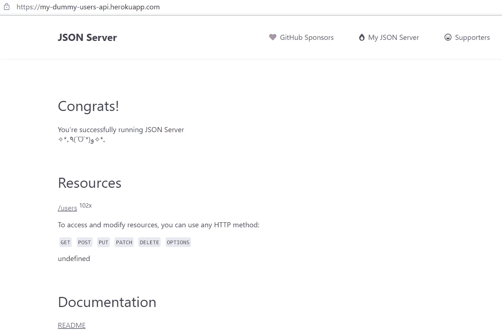
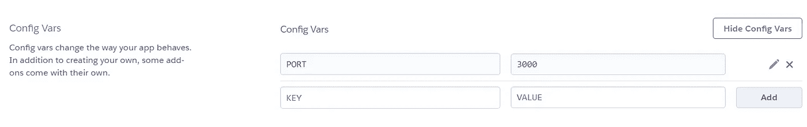

# 创建一个假的 REST API 并部署

> 原文：<https://medium.com/nerd-for-tech/creating-a-fake-rest-api-and-deploy-2a6edf1223f5?source=collection_archive---------2----------------------->


照片由[米切尔罗](https://unsplash.com/@mitchel3uo?utm_source=unsplash&utm_medium=referral&utm_content=creditCopyText)在 [Unsplash](https://unsplash.com/s/photos/developer?utm_source=unsplash&utm_medium=referral&utm_content=creditCopyText) 拍摄

如今， [API](https://en.wikipedia.org/wiki/API) 在现代应用中的重要性是众所周知的事实。API 有助于构建如此高效和安全的应用程序。由于 API 的存在，与其他第三方组件的集成变得更加容易。API 的开发主要遵循三种类型的架构或协议。

1.  [休息](https://stoplight.io/api-types/#rest)
2.  [肥皂](https://stoplight.io/api-types/#soap)
3.  [JSON-RPC 和 XML-RC](https://stoplight.io/api-types/#json-rpc-and-xml-rpc)

现在，回到这篇文章背后的主要议程。正如我们经常看到的，无论是在开发阶段还是在测试阶段，我们可能需要一些虚拟的或伪造的 API 来确保应用程序的后端功能。有时，假设与应用程序集成的实际 API 可能还没有准备好进行测试，这可能是阻塞的原因之一。为了克服这种情况，我们可以开发自己的假 API 并部署它。因此，任何地方的任何人都可以轻松使用它。

在本文中，我将演示首先在本地使用 [json-server](https://github.com/typicode/json-server) 创建一个假 REST API 的步骤，然后将其部署在 [Heroku](https://dashboard.heroku.com/) 云平台上。那么，让我们开始吧🏃‍♀️

为了便于理解，我将整个讨论分为两部分。

1.  开发自己的 API
2.  部署您的 API

# 开发自己的 API

在开始实际开发之前，我们需要确保在我们的项目和系统中有以下可用的依赖关系。

*   检查节点的状态。JS:如果你已经在你的系统中安装了 node.js，那就没问题，否则请先从[这里](https://nodejs.org/en/)下载并安装 node.js。
*   此外，通过检查版本，确保`npm`已正确安装在您的系统中。在命令提示符或终端上执行`npm -version`
*   一旦完成，创建您的`package.json`，并添加所需的依赖项，如下所示。

对于整个项目参考，请从这里的[克隆源代码](https://github.com/iamKrishnendu/usersDummyAPI.git)并运行`npm install`来安装和配置项目。

## 创建“db.json”文件

`db.json`是包含实际数据的主要文件，我们可以在这些数据上执行基本的 API 操作。即获取、发布、上传、修补、删除和选项。就创建这个文件而言，我们将借助另外两个库，它们可以为我们的 API 生成一些假数据。[骗子](https://github.com/Marak/Faker.js#readme)和[洛达什](https://lodash.com/)。

`faker`和`lodash`的用法可以在`generate.js`文件下找到

一旦用`json-server generateData.js`命令执行这个文件，它将为我们的 API 生成`100`记录。下面提供了一个输出示例。

默认情况下`json-server`现在正在`http://localhost:3000`上运行。因此您可以在浏览器上检查输出。

因此，现在只需复制整个记录并将其粘贴到`db.json`文件中，您的数据就可以通过 API 访问了。

现在，如果您执行`json-server db.json`，那么`json-server`会将`db.json`文件视为后端，您可以通过任何 API 客户端(如 [Postman](https://www.postman.com/) )访问`https://localhost:3000/users`，所有其他操作都可以在上面执行。

# 创建` server.js '

`server.js`负责以编程方式在默认端口上启动`json-server`。

现在，您已经创建了自己的 REST API，并在本地运行👨‍🔧

# 部署您的 API

现在，是时候公开你的 API 了。为此，您需要在某个服务器或云平台上部署您的 API。这里我们将使用 Heroku 进行部署。

*   如果您在 Heroku 上没有任何现有帐户，请先从[这里](https://signup.heroku.com/login)注册。
*   你还需要在 GitHub 上为你的项目创建一个存储库

完成这些步骤后，您就可以开始下一步的部署了。

1.  下载 Heroku 命令行界面(CLI)并安装
2.  然后打开命令提示符或终端，执行`heroku login`。你会看到 Heroku 登录页面会在你的默认浏览器上自动打开。
3.  登录完成后，通过执行下面的命令在本地克隆您的存储库，并导航到项目文件夹

```
git clone <repository url> 
cd <project folder path>
```

4.执行`heroku create`命令来创建一个`heroku app`，它将成为您的 API 项目的一个引用

5.现在，执行`git push heroku main`来完成部署过程

6.`Build succeeded!`如果成功，消息会出现在控制台上。

7.要从命令提示符或终端打开 Heroku 应用程序，运行`heroku open`命令，您应该会看到`JSON Server`页面以及您的 API 信息。



JSON 服务器页面

*   这里有一个非常好的分步部署指南。为了更加清楚，请参考这些步骤。

注意:部署 API 后，您可能会在启动 Heroku 应用程序时遇到一些错误。下面提供了一些可能解决该问题的通用步骤。

*   在 Heroku 应用程序的`Settings`标签下，在`config vars`部分指定`port`编号，如下所示。



*   在根项目文件夹下创建`Procfile`,它将包含`node`命令，需要执行该命令来触发您的`server.js`文件。

仅此而已！

# 尾注

首先感谢你阅读这篇文章，如果你觉得这篇文章有用，那么请鼓掌👏图标，并与他人分享。这将激励我写更多关于这类内容的博客。