# 在 Unity 中创建第一人称持枪动画

> 原文：<https://medium.com/nerd-for-tech/creating-a-first-person-gun-holding-animation-in-unity-4a67c7b5a997?source=collection_archive---------0----------------------->

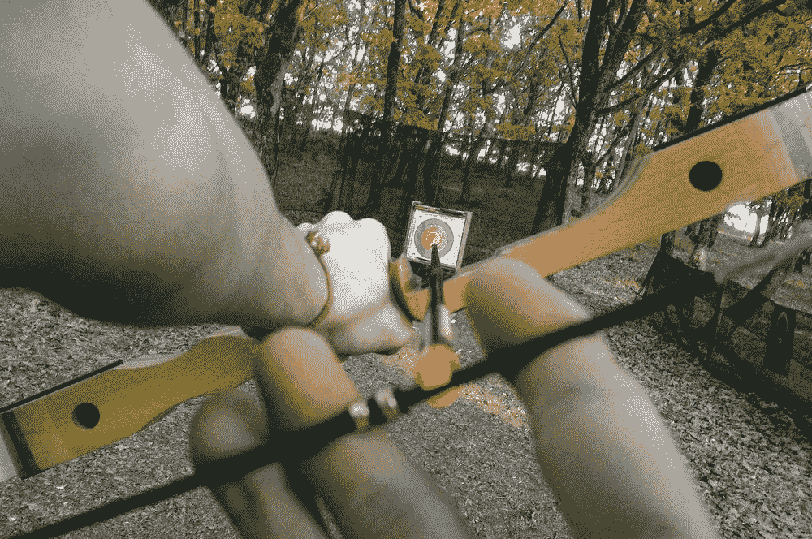

我一直在做一个僵尸生存游戏。我决定创建一个持枪角色的第一人称视角。我正在使用的角色和枪支模型来自 GameDevHQ 创建的自定义包。我还将使用定制包中预制的第一人称角色控制器。

随着模型和角色控制器的导入，我将角色控制器添加到场景中。

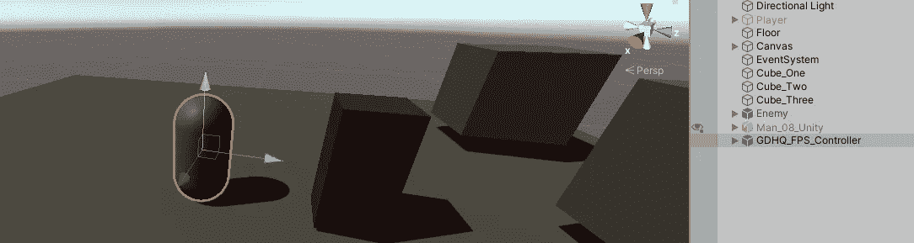

我在场景中添加了角色模型。然后，我将角色控制器中的所有脚本复制到角色模型中，并将主摄像头放在角色模型下。然后我从角色控制器中删除了剩余的部分。

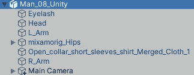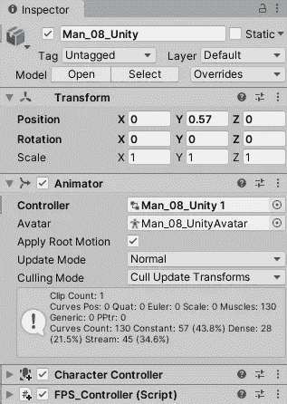

我用了 Mixamo 的一个闲置动画作为角色。

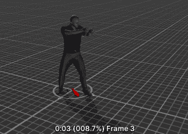

添加空闲动画后，我将枪模型与屏幕对齐，看起来像第一人称射击游戏。我还临时将枪模型作为主相机的父模型。

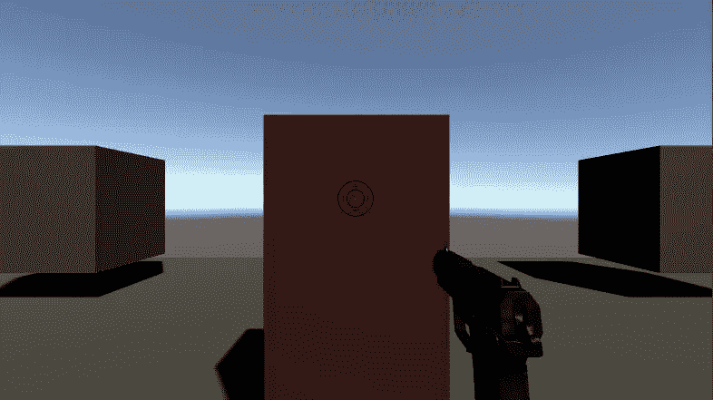

为了开始装配，我添加了四个空的游戏对象，分别放置在左右手上，并给出了肘部弯曲的提示。

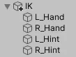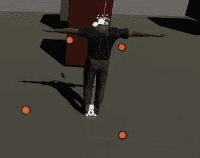

橙色和红色的点是不同的位置

Unity 有一个叫做动画装配的预览包。我下载了这个来使用两骨 IK 约束。我把这个加到了左右手上。根部、中部和顶部点与角色模型的右肩、左肩、手臂和手匹配。

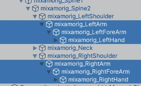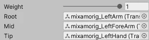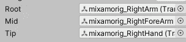

源对象将是手和每只手的提示。

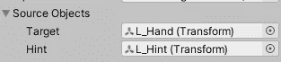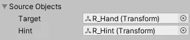

在枪模型中，添加两个空的游戏对象来表示右手和左手，并将它们放置在枪的相应两侧。

蓝点是游戏物体的位置

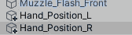

我创建了一个简单的学习脚本来使手部位置平稳到位。

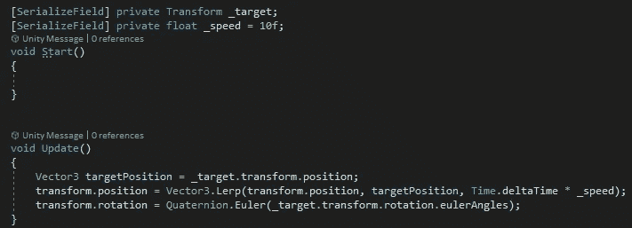

将枪模型中的游戏对象添加到左右手各自的点上。

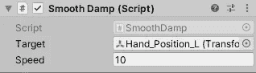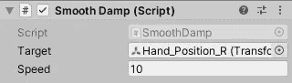

现在你需要点击播放，旋转和移动双手，让他们尽可能地排成一行。您可能希望在播放模式下复制变换，并在退出播放模式时粘贴它们，以保存位置。

双手就位后，您可以在主相机中创建一个空的游戏对象，并赋予它枪的位置。把枪从主相机里拿出来，添加 lerp 脚本。目标将是新的游戏对象。

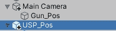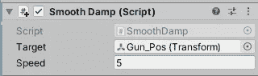

这会给你一个相当不错的第一人称枪械动画。

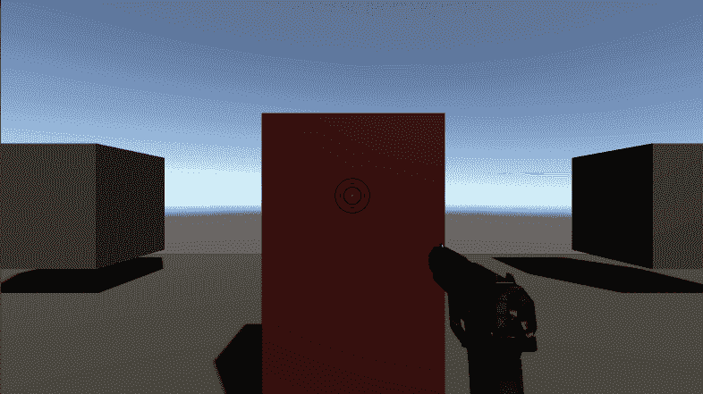