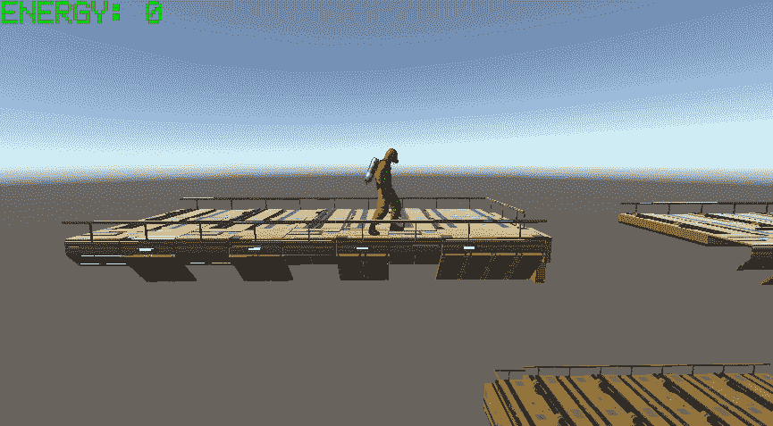
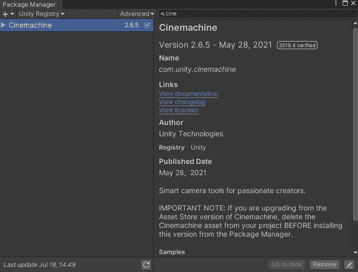
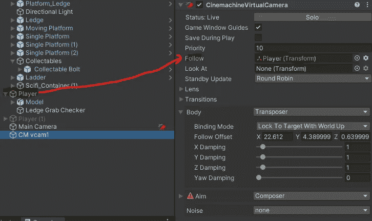
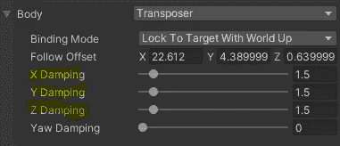

# 使用 Cinemachine 创建跟踪摄像机

> 原文：<https://medium.com/nerd-for-tech/creating-a-follow-camera-with-cinemachine-1fcae33e1f7d?source=collection_archive---------26----------------------->

目标:使用 Cinemachine 创建一个虚拟摄像机，它会跟随玩家角色，让他们出现在屏幕上。

我们首先进入*窗口*菜单，选择*软件包管理器*导入 Cinemachine。

点击菜单栏上的 *Cinemachine* ，选择*创建虚拟摄像机*。

将玩家对象分配给虚拟摄像机的 *Follow* 属性。

我们可以通过调整虚拟摄像机的*主体*组件上的*阻尼*属性来微调跟随效果的响应。

