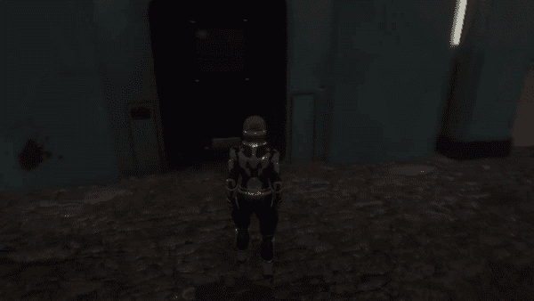

# 用 Unity 中的时间线打造功能门

> 原文：<https://medium.com/nerd-for-tech/creating-a-functional-door-with-timeline-in-unity-6163c34f1098?source=collection_archive---------1----------------------->

在游戏中打开和关闭门是非常常见的，所以让我们在 3D 环境中用 Unity 的时间轴来做这件事。

这些可爱的资产来自 Filebase，一个来自 GameDevHQ 的令人难以置信的游戏就绪资产库。

我创建了两个空对象，一个用于*导演*组件，另一个用作*触发器*。