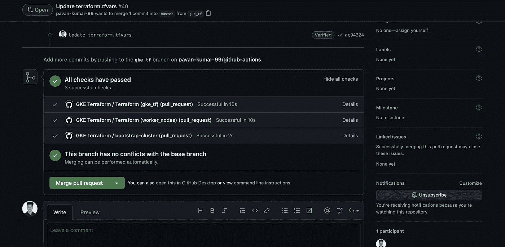
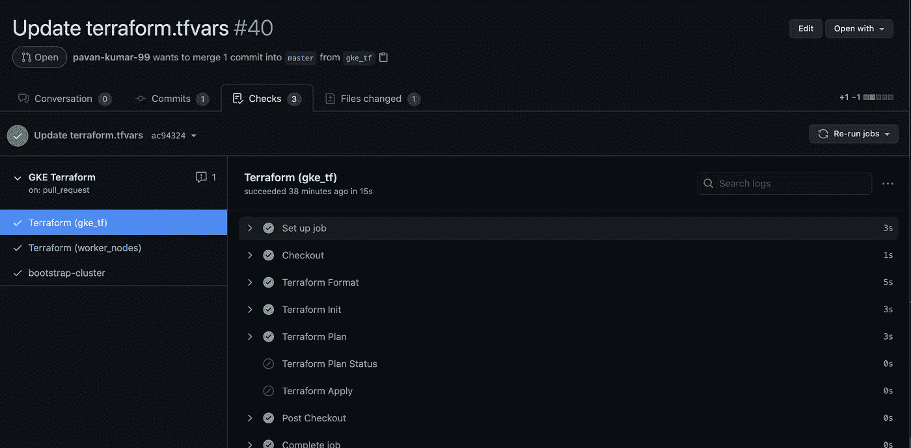
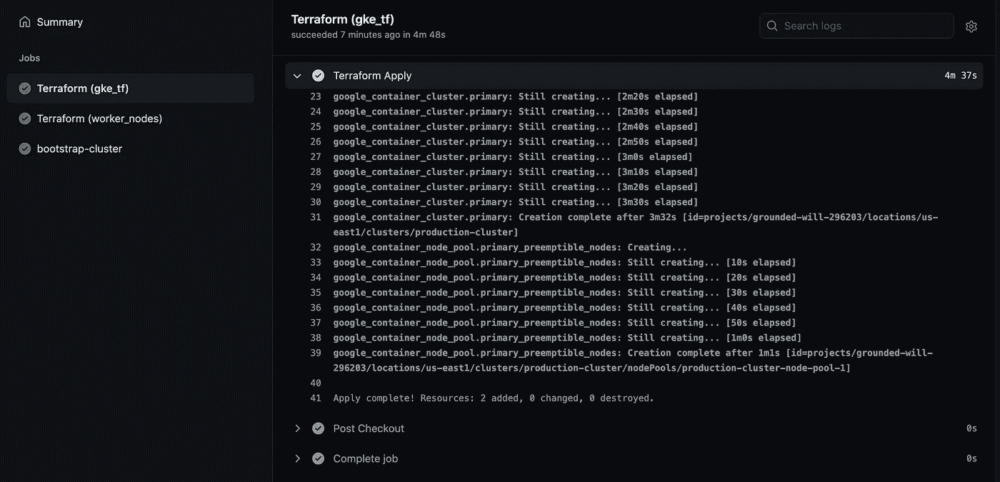
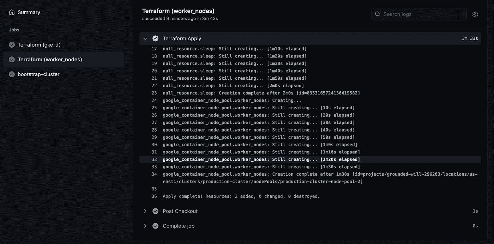
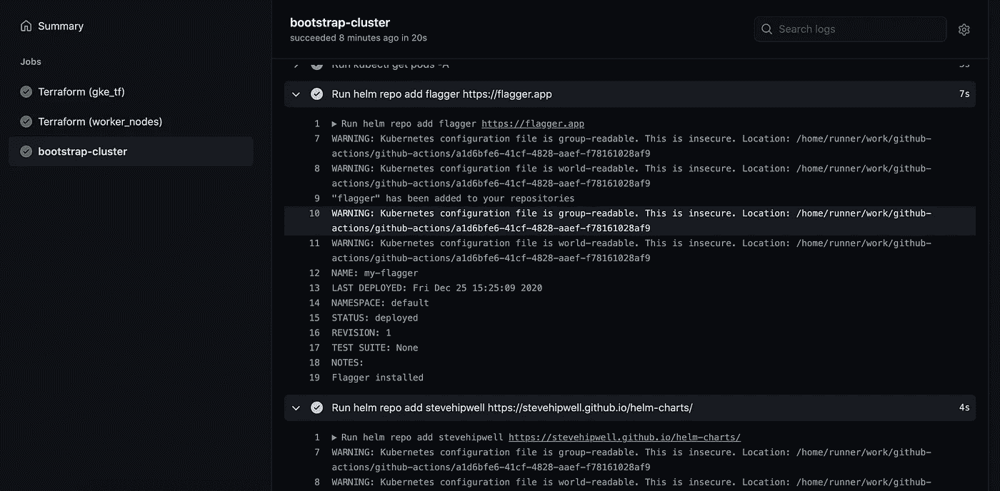
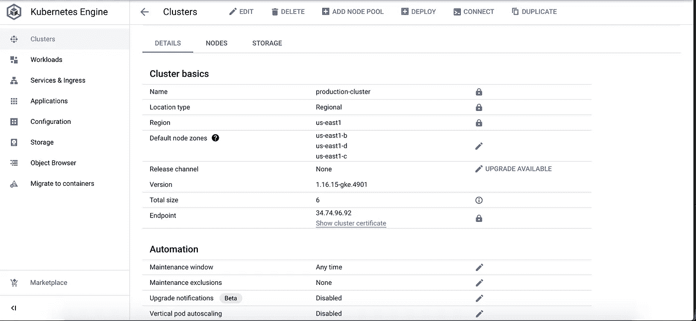

# 使用 GitHub 操作创建 GKE 集群

> 原文：<https://medium.com/nerd-for-tech/creating-a-gke-cluster-with-github-actions-dd34e2de50a6?source=collection_archive---------0----------------------->

使用 GitHub 动作自动化 Kubernetes 集群创建和引导

GitHub Actions 允许您直接在 GitHub 存储库中设计 CI 和 CD 工作流。GitHub 动作与 GitHub 完全集成。构建、测试和部署可以直接从 GitHub 完成。因此您的 CI/CD 工作流可以位于您的源代码所在的位置。CI/CD 管道可以由拉请求或分支合并等事件触发。在本文中，我们将使用 GitHub 操作通过 terraform 创建一个 GKE 集群，并使用一些工具如 Istio 和 flagger 引导集群。

# 整个故事是关于什么的？(TLDR)

1.  GitHub Actions 允许您直接在 GitHub 存储库中设计 CI 和 CD 工作流。构建、测试和部署可以直接从 GitHub 完成。
2.  我们将使用 GitHub 操作创建一个 GKE 集群(使用 terraform ),并通过安装 Istio、Flagger 等组件来引导集群。

# 先决条件

1.  GCP 账户
2.  GitHub 帐户
3.  任何远程后端存储您的状态(可选)

# 演示

在本演示中，我们将首先调配一个 GKE 集群，然后将一组可抢占的节点添加到同一个已调配的集群中。

您可以派生我的 repo，它同时包含 terraform 和 GitHub 操作文件。

## [https://github . com/pavan-Kumar-99/medium-manifests/tree/github-actions](https://github.com/pavan-kumar-99/medium-manifests/tree/github-actions)

这是我的 terraform 代码的一个示例片段。这将创建一个 GKE 集群，然后向通过我们的 terraform 创建的集群添加一个节点池。但是我们如何自动化这个呢？我们如何确保我们的 terraform 代码没有任何错误？我们如何确保主分支中的 terraform 代码没有任何格式问题？我们如何确保在合并之前对提交给主分支机构的任何拉请求进行适当的测试？最后，我们如何自动调配 GKE 集群和节点池？解决的办法是 [**GitHub 的动作。**](https://github.com/features/actions)

现在让我们看一下 GitHub 动作在这里做了什么

1.  name:GitHub 操作的名称。
2.  on:触发此工作流的 GitHub 事件的名称。
3.  push.paths:如果对该路径进行了任何更改，将会触发工作流。
4.  分支:仅针对主分支在推送时触发工作流。
5.  pull_request:在 pull 请求事件上触发工作流。
6.  作业:工作流由一个或多个作业组成(这些作业定义了要执行的一组步骤)。
7.  jobs.terraform:作业的 id。
8.  jobs.terraform.env:可用于作业中所有步骤的环境变量的映射。
9.  runs-on:应该运行作业的计算机类型。
10.  strategy.matrix:矩阵允许您通过在单个作业定义中执行变量替换来创建多个作业。这里我们告诉我们的工作流在 gke_tf 和 worker_nodes 文件夹中运行。
11.  步骤:作业包含一系列称为步骤的任务。
12.  steps.uses:它指定要使用的预构建操作的名称。你可以在 GitHub 市场这里([https://github.com/marketplace?type=actions](https://github.com/marketplace?type=actions))找到很多。
13.  steps.run:指定要在 shell 中运行的命令。
14.  steps.if:阻止作业运行，直到满足某个条件。
15.  bootstrap.needs:默认情况下，所有的作业都是并行运行的。“需求”部分确定了在运行作业之前应该成功完成的作业。

## 因此，我们的 GitHub 操作执行以下步骤

1.  **每当提出一个拉请求**
    a)将代码从主分支签出到最新的 ubuntu 机器上。(name: Checkout )
    b)检查我们的 terraform 代码格式是否正确。(name: Terraform Format )
    c)初始化 Terraform 工作目录。(name: Terraform Init )
    d)生成一个推测执行计划，显示 Terraform 将采取什么行动来应用当前配置。(名称:地形图)

2.**每当合并拉请求时**
a)根据当前目录中的 Terraform 配置文件创建或更新基础设施(名称:Terraform Apply )
b)通过安装 flagger 和 Istio 操作符(名称:bootstrap-cluster)引导集群。此作业等待 terraform 作业完成后才开始。

现在让我们通过将 gke_tf 或 worker_nodes 文件夹中的 worker 节点计数从 1 增加到 2 来发出一个 Pull 请求。

显示我们支票状态的 PR。

地形平面图和格式

由于 pull 请求尚未合并，它将只检查格式问题并执行 terraform 计划。

现在，必须合并拉取请求(手动)。我们把这个也自动化怎么样？是的，您现在可以从 GitHub UI 中启用拉请求的自动合并。

拉请求的自动合并。

一旦我们的拉请求被合并，我们的 GitHub 操作将开始在您的 GCP 帐户中创建一个集群。

在 GCP 创建集群

如果您登录到 GCP 控制台，您现在应该能够在 GKE 部分看到您的集群以及一个额外的节点组。

# 结论

感谢阅读我的文章。希望你喜欢它。以下是我的一些其他文章，你可能会感兴趣。

# 被推荐的

 [## 使用 Kind 创建一个 Kubernetes 集群

### 如何使用 kind 在 5 分钟内创建一个 Kubernetes 集群？

pavan1999-kumar.medium.com](https://pavan1999-kumar.medium.com/create-a-kubernetes-cluster-using-kind-b364a67437b7)  [## 使用 Flux 在 Kubernetes 中部署应用程序

### 通量介绍

pavan1999-kumar.medium.com](https://pavan1999-kumar.medium.com/deploying-applications-in-kubernetes-using-flux-a9d171b11917)  [## Kustomize 简介

### 如何使用 Kustomize 有效地管理您的 Kubernetes 清单。

pavan1999-kumar.medium.com](https://pavan1999-kumar.medium.com/introduction-to-kustomize-97f990dc2f44)  [## 使用 Argo CD 在 Kubernetes 中部署应用程序

### 使用 Argo CD 在 Kubernetes 中部署应用程序

使用 Argo CDpavan1999-kumar.medium.com 在 Kubernetes 中部署应用程序](https://pavan1999-kumar.medium.com/deploying-applications-in-kubernetes-using-argo-cd-ab004a8cdb5e)  [## Istio 服务网格简介

### 什么是 Istio 服务网格？

pavan1999-kumar.medium.com](https://pavan1999-kumar.medium.com/introduction-to-istio-service-mesh-2bc68d2ffdac)