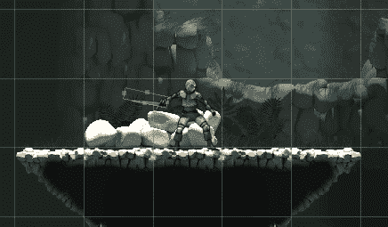
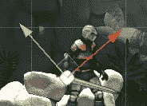
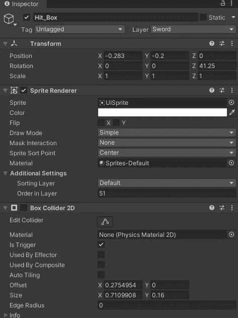
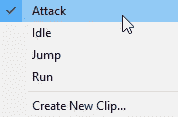
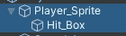
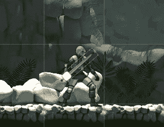
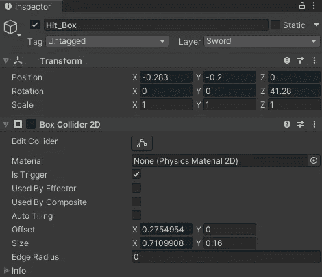
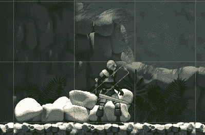

# 在 Unity 中创建 Hitbox

> 原文：<https://medium.com/nerd-for-tech/creating-a-hitbox-in-unity-16a6ed13508d?source=collection_archive---------2----------------------->

在我的游戏中，我为玩家设置了所有的攻击动画。现在我需要创建允许攻击击中敌人的功能。在这篇文章中，我将介绍我是如何为玩家攻击创建 hitbox 的。

首先，创建一个基本的 2D 精灵，并更改精灵渲染器以显示 UISprite。

注意:请确保更改层中的顺序，以便您可以看到它

现在添加一个 2d 盒子碰撞器到 hitbox 并标记为触发器。

转到玩家精灵，选择攻击动画。

确保 hitbox sprite 是 player sprite 的子级，这样您就不必为 hitbox 创建新的动画师。

要创建 hitbox，您需要点击 record，并为每一帧将 hitbox 2d sprite 与剑的位置对齐。

一旦击中框对齐，你就可以在剑不应该造成伤害的帧关闭碰撞器，比如在挥杆完成之后。您还会想要删除 hitbox 的 sprite 渲染器，因为它应该只是 box collider。

这将给你一个漂亮的挥剑击中框。

