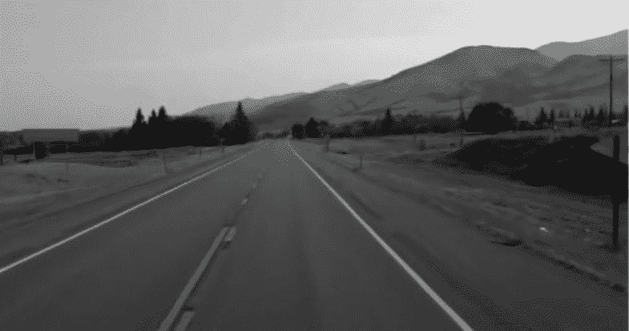
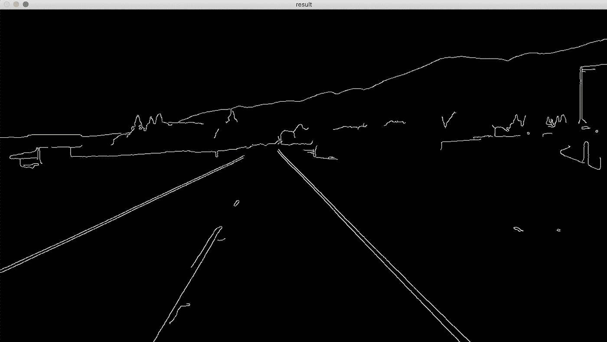
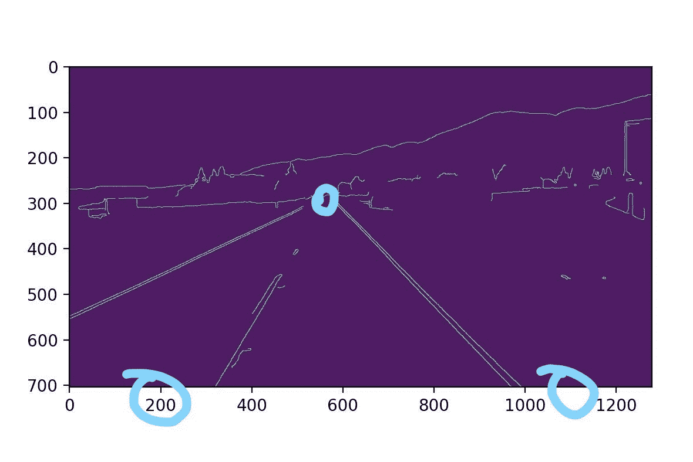
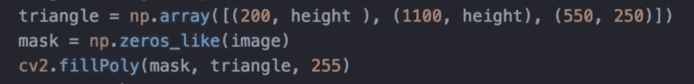
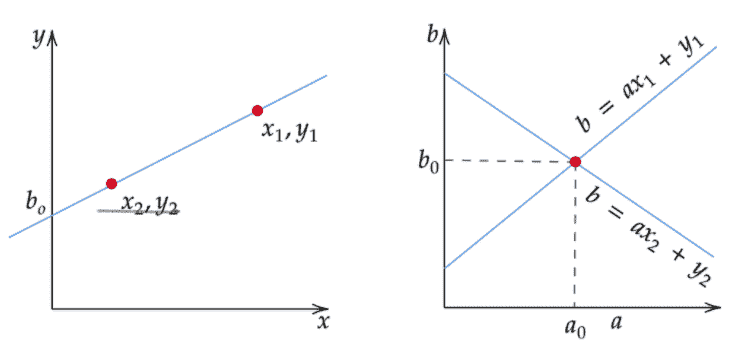
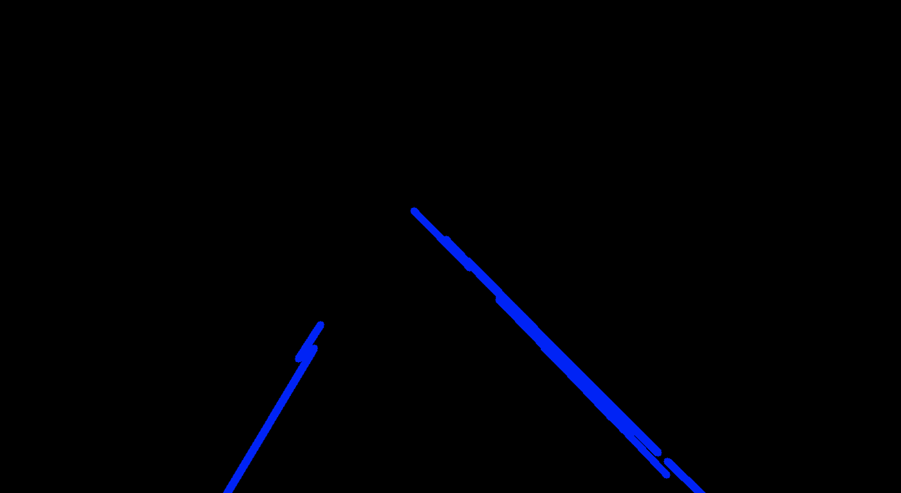
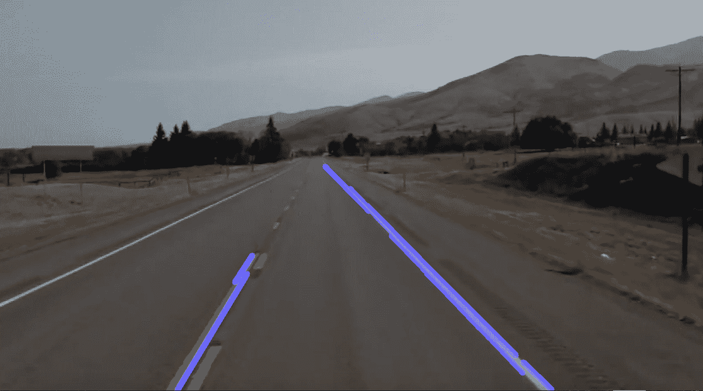

# 使用 OpenCV-Python 创建车道检测程序

> 原文：<https://medium.com/nerd-for-tech/creating-a-lane-detection-program-using-opencv-python-ba82b2305d26?source=collection_archive---------16----------------------->

回到中国，我曾站在俯瞰北京熙熙攘攘的道路的桥顶上，背诵每辆飞驰而过的汽车的品牌。“奔驰……丰田……日产……马自达……”我对汽车的兴趣和热情让我对这些发明进行了更多的研究。在我的研究过程中，我遇到了一个关于如何编写车道检测程序的教程，它看起来非常有趣，但相当具有挑战性。

为了检测车道线，本项目使用 OpenCV-Python。这个过程的第一步是**边缘检测**，它识别图像中颜色强度急剧变化的区域。图像由单个像素组成，其亮度以 0-255 的标度表示。数字 0 代表黑色，而 255 代表白色。为了更容易处理此图像，请将此图像转换为灰度或黑白图像。这样，只有一个通道的颜色，而不是通常的红色，蓝色和绿色。

接下来，应用**高斯模糊**来平滑图像并减少噪声。应用高斯模糊将使检测车道线时的误差最小化。

高斯模糊

应用模糊后，使用 **Canny 函数**描绘出具有最强渐变或颜色变化的区域。Canny 边缘检测可以跟踪颜色强度发生急剧变化的区域，这有助于使车道线更加清晰可辨。黑色区域是照片中像素之间亮度差异较小的部分，而白线代表亮度变化较大的部分。

Canny 函数

清楚标记车道线后，将注意力集中在包含车道线的特定区域。这样做的第一步是使用 **Matplotlib** 。Matplotlib 是 Python 中创建坐标的绘图函数。如下图所示，包围包含车道线的区域的三个坐标如下:(200，700)、(1100，700)和(550，250)。

Matplotlib

这三个点创建了一个三角形区域，我们将为其创建一个遮罩。使用 NumPy 数组指定三个坐标，并输入命令“np.zeros_like”将像素强度设置为 0 或黑色，从而创建此蒙版。然后，使用 OpenCV 的 fillPoly 函数，用白色填充我们感兴趣的区域；我们使用“250”将像素强度设置为最大。遮罩有助于仅聚焦于感兴趣的区域，而不是整个图像。

代码图像

感兴趣区域遮罩

接下来，通过霍夫变换函数找到最适合每条车道线的线。**霍夫变换**是一种使用投票程序识别线条的技术。霍夫空间类似于常规的 *x-y* 坐标平面，也称为笛卡尔坐标平面。直线通常用方程 *y = mx + b* 来表示，其中‘m’为斜率，‘*b*为*y*-截距。这样的方程可以作为单点绘制到霍夫空间中，其中 m 是 *x* 坐标，而 *b* 是 *y(m，b)* 。

笛卡尔坐标平面与霍夫空间

如果我们只有一个点，而不是一条线呢？有无限多条线可以通过该点，每条线都有唯一的斜率和*y*-截距。对于通过该点的每条线，使用该线的斜率和 *y* 截距在霍夫空间上绘制一个点。最终，通过该点的方程组在霍夫空间中形成一条线。

现在，在我们的坐标平面上添加一个点，这允许在霍夫空间上绘制通过该点的线族。最终，霍夫空间将被线条填充，线条由来自 *x-y* 平面中的线性方程的各个数据点形成。然而，由于道路的曲率和其他因素，图像上的车道线并不是完美的直线。要解决这个问题，找到最佳拟合线:通过最多数据点的线。霍夫空间可以被分割成网格，然后这些线被绘制到霍夫空间上。包含最多交叉点的网格将是我们使用的线。使用霍夫变换，找到最适合的线条，并将其应用到图像上。

最佳拟合线

最后一步是将图像与最符合原始图像的线条混合，以便线条可以显示在车道上，而不是黑屏。

最终产品