# 在 Unity 中创建一个壁架抓手

> 原文：<https://medium.com/nerd-for-tech/creating-a-ledge-grab-in-unity-217bc76b4ba3?source=collection_archive---------22----------------------->

2.5D 游戏开发

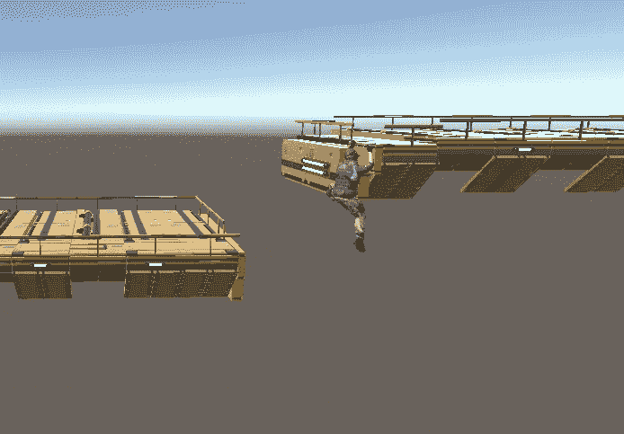

**目标:**在游戏中创建一个抓壁架的功能。

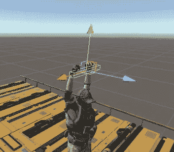

首先，让我们创建一个立方体游戏对象，并定义它的变换属性，使它看起来像一个壁架，把它放在玩家手中的抓取位置，并将触发器设置为活动。然后禁用网格渲染器，使其在游戏过程中不显示。

在玩家将要悬挂的壁架上做同样的动作。这将检测到玩家手中的立方体，当它接触自己时，将玩家定位到壁架抓取位置。

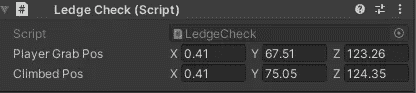

这里，您设置了两个位置，一个是将玩家挂在壁架上时的位置，另一个是在攀爬壁架的动画完成后的位置。

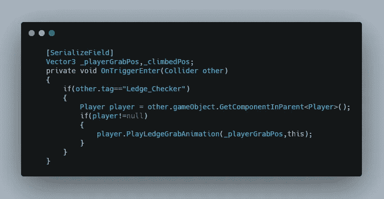

这是动画触发器的脚本，其中壁架碰撞器检查碰撞的对象是否是壁架检查器，如果是，则调用 PlayLedgeGrabAnimation 方法，并提供玩家抓取位置和对当前脚本的引用作为参数。

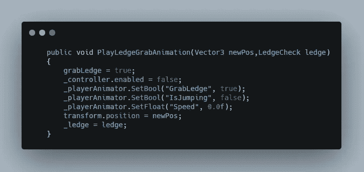

这里，在 player 脚本中的 called 方法中，您基本上控制了动画参数的所有 float 和 bool 值，以启动壁架服装动画。

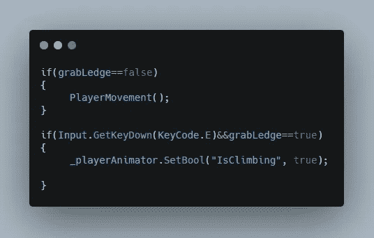

然后你可以在抓壁架时阻止移动，如果玩家在此期间按下 E 键，动画就会从悬挂变为攀爬。

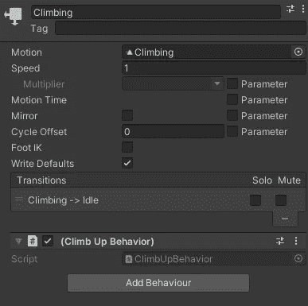

然后在“动画制作人”面板上选择攀爬动画事件，并选择“添加行为”和“创建行为脚本”。

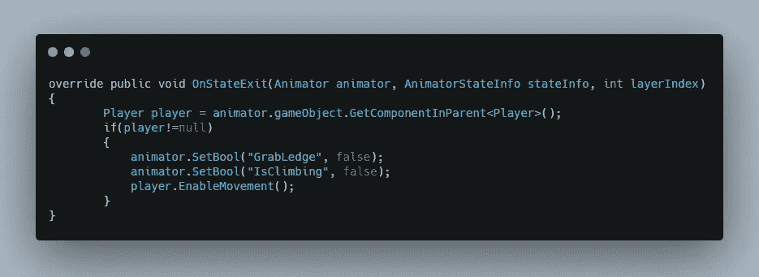

然后在行为脚本中，我们定义动画完成后发生的事情，即停止攀爬动画

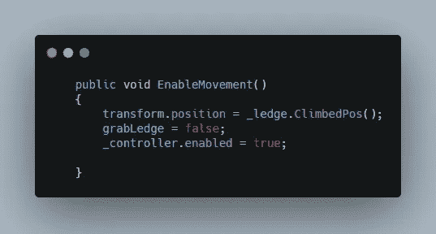

然后从玩家脚本中被调用的函数中，将碰撞体位置转换到攀爬位置，并启用控制器，这样玩家就可以移动了。

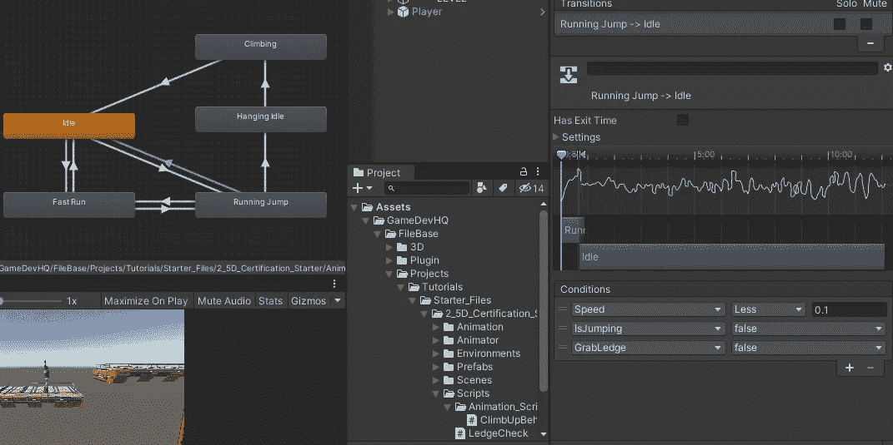

这是我们的动画师来控制动画。您创建一组条件，如果满足这些条件，将启动您想要的动画。

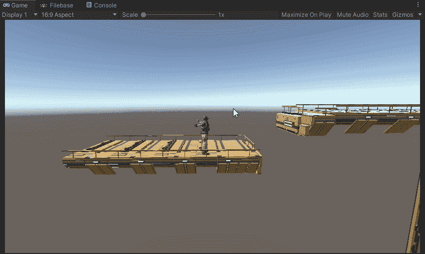

这是最终的结果。