# 在 Unity 中创建一个壁架抓手

> 原文：<https://medium.com/nerd-for-tech/creating-a-ledge-grab-in-unity-62e9c2a9a128?source=collection_archive---------17----------------------->

现在我们已经为我们的角色制作了动画，让我们来看看如何在游戏中创建动画和抓岩架的过程。首先，我们需要添加一个悬挂在壁架上的动画。从那里，我们需要创建一个对象，当我们接近壁架时，我们可以使用它作为我们的探测器，这将使我们能够抓住它:

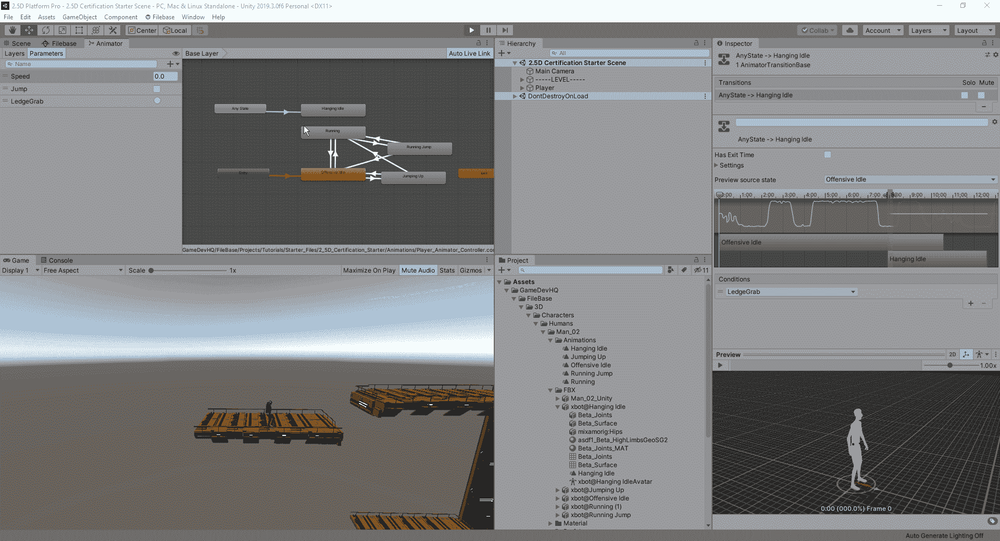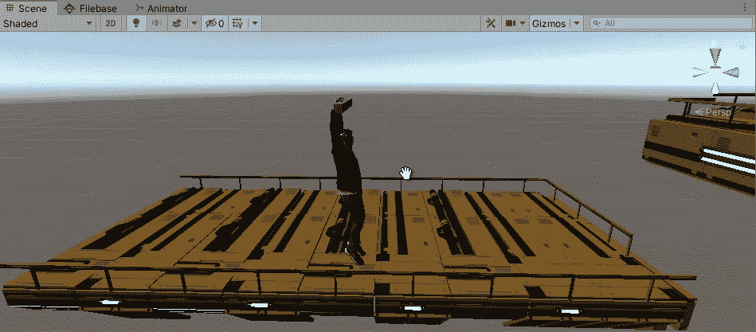

现在我们已经在我们的角色上设置了壁架检查器，我们需要一种方法将它保存到我们的层级中，因为我们使用了游戏模式来创建这个检查器。要做到这一点，我们可以简单地使它成为我们的资产文件夹中的预设，然后当我们停止播放模式时，只需在层次结构中用该预设替换它:

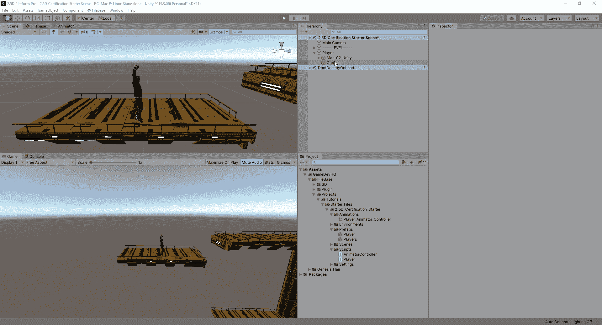

现在我们已经建立了一个检查器，我们需要弄清楚如何创建一个壁架检查系统。为了做到这一点，我们首先需要创建一个立方体作为我们的探测器，并将其与我们的角色在尝试跳到壁架时将到达的大致位置对齐:

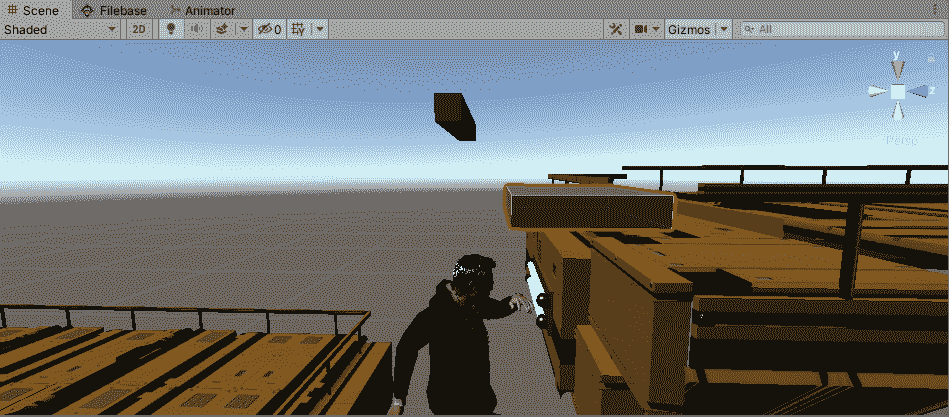

现在，我们已经为启动抓取窗台动画设置了对象，我们现在必须编码一旦我们撞到窗台我们想做什么。首先，我们希望在脚本中创建触发器之间的连接。在我们的玩家脚本中，我们将创建一个新的空白，当它被触发时，它将冻结我们的玩家并激活我们的动画:

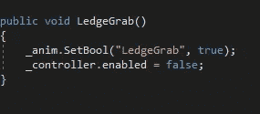

至于它何时被触发，我们将创建一个新的脚本，在被触发时激活这个虚空:

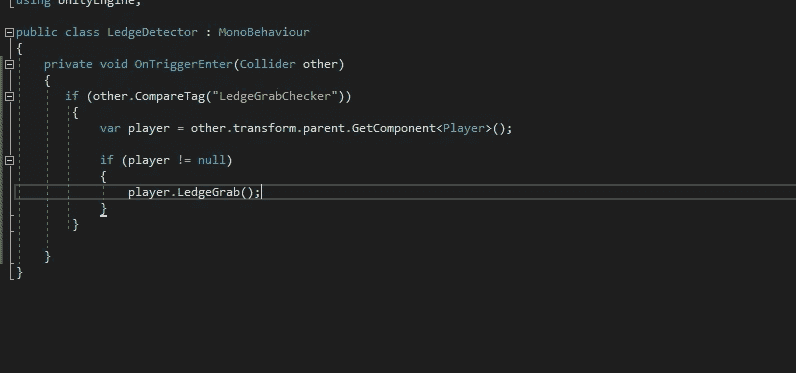

现在，每当我们让探测器触发抓取点时，我们的玩家应该原地不动，进入一个空闲的悬挂动画:

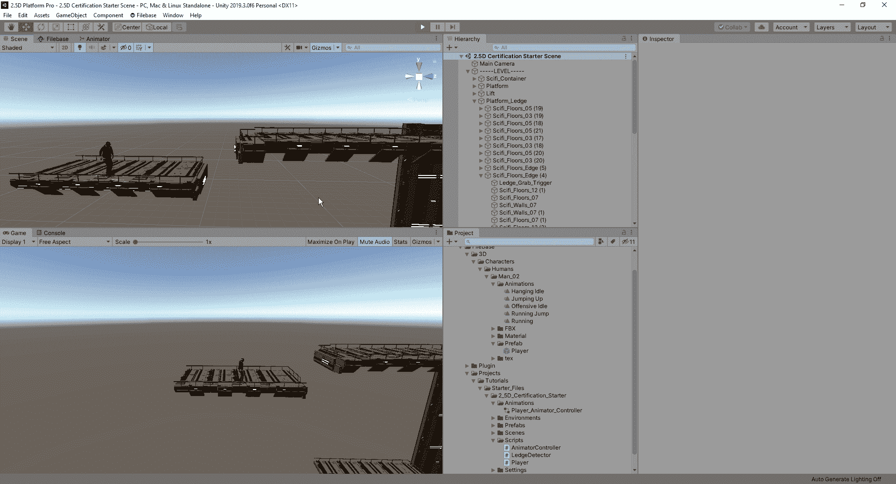

现在我们有了这个，下一步我们要做的就是找出如何让我们的球员进入一个更合适的位置。要做到这一点，我们首先需要将我们的角色移动到一个看起来可以抓住并保存这些坐标的位置:

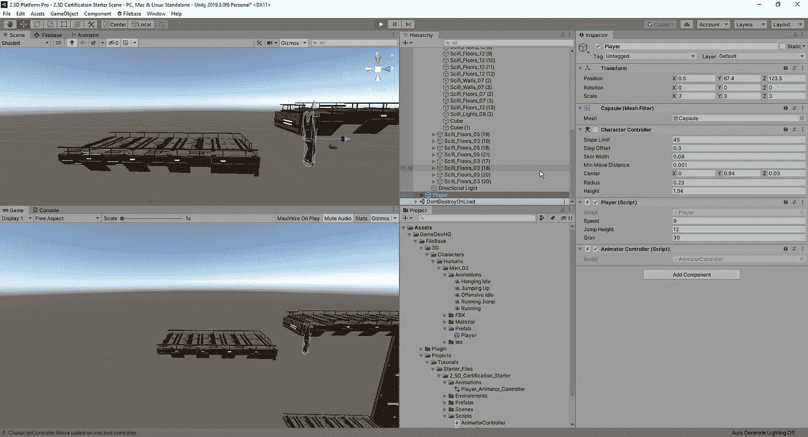

在这里，我们将在触发器脚本中创建一个新变量，并将这些坐标设置为玩家到达触发器时将捕捉到的位置:

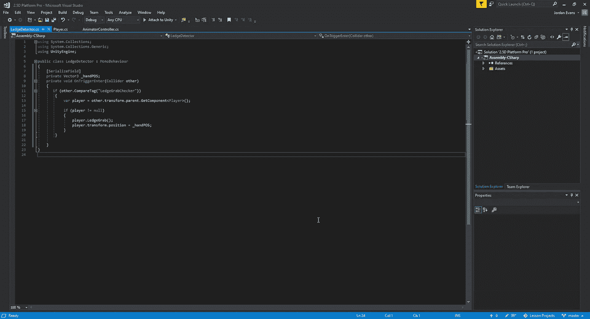

现在我们已经设置好了，并将值放入触发器的新变量中进行处理，我们可以在游戏中测试它:

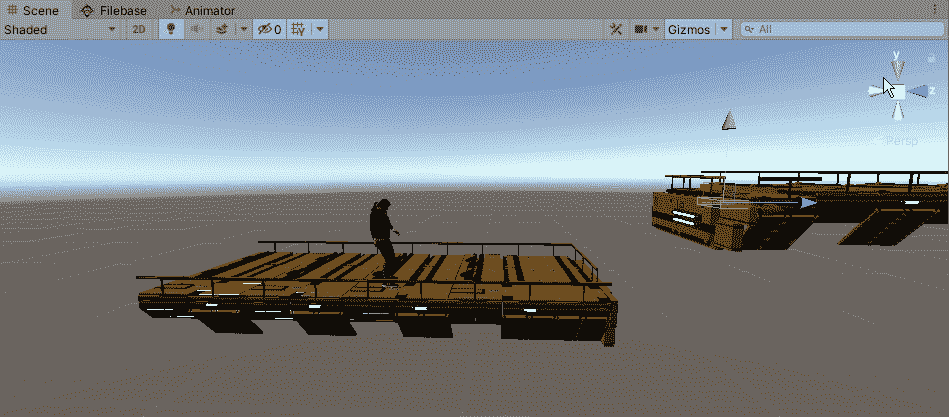

现在，对于这个特性的微小细节部分，我们需要找到一种方法使跳跃看起来尽可能平滑。就目前的情况来看，这个角色有点太投入这个位置了，它没有一种自然的感觉，所以为了解决这个问题，它涉及到很多反复跳跃的尝试和错误，直到我们得到一个好看的抓岩架。经过大量的试验和错误，找出了状态之间的良好转换，您可以得到类似这样的结果:

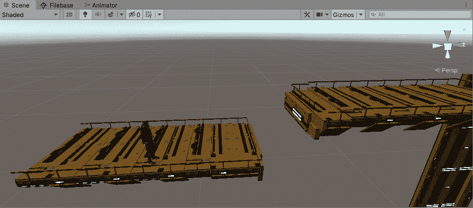

现在我们已经把抓住一个平台的过程都整理好了，我们可以看看如何让我们的玩家把自己拉到平台上。