# 创建壁架抓取机制| Unity

> 原文：<https://medium.com/nerd-for-tech/creating-a-ledge-grab-mechanic-unity-ec78c0c8fa40?source=collection_archive---------1----------------------->

## 统一指南

## 关于如何在 Unity 中创建壁架抓取机制的快速指南

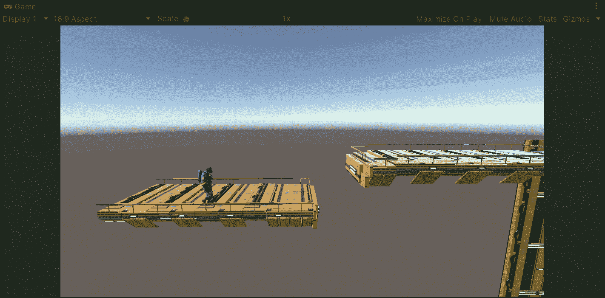

**目标**:用 Unity 制作我们玩家的 3D 模型动画。

在上一篇文章中，我介绍了[如何用 Unity](/nerd-for-tech/animating-player-unity-5e04ba44fb19) 为玩家实现新的动画。现在，是时候在我们的平台游戏中为玩家创建一个抓岩架的机制了。

# 玩家机制

首先，让我们来看看我们的玩家可以执行的当前动画:

*   闲置的
*   步行
*   奔跑
*   正常跳跃
*   跑跳步

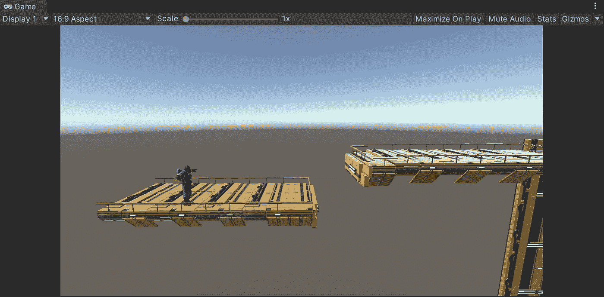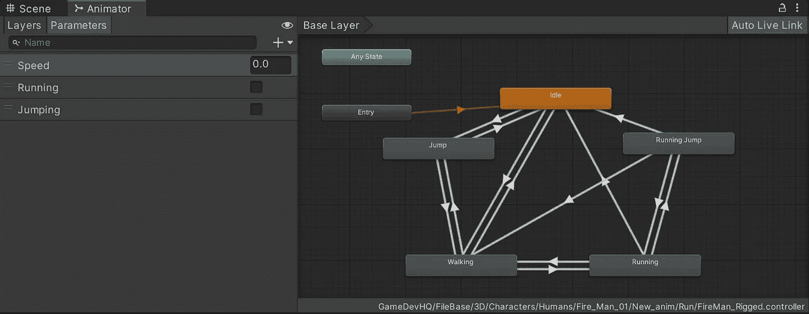

如果你没有看过我的上一篇帖子，我推荐你去看看，以防你不知道如何用 Unity 添加新的动画:

 [## 动画播放器| Unity

### 关于如何在 Unity 中制作 3D 播放器动画的快速指南

medium.com](/nerd-for-tech/animating-player-unity-5e04ba44fb19) 

# 实现壁架抓取机制

## 添加壁架抓取动画

现在，开始实现壁架抓取机制，让我们添加动画到我们的动画状态。我们将要使用的动画是从 [Mixamo](https://www.mixamo.com/#/) (免费)获得的，显示了我们的玩家挂在某个东西上时处于空闲状态的模型:

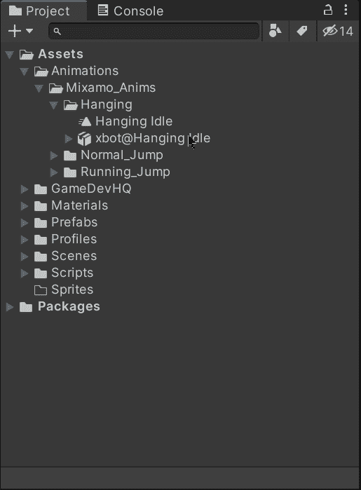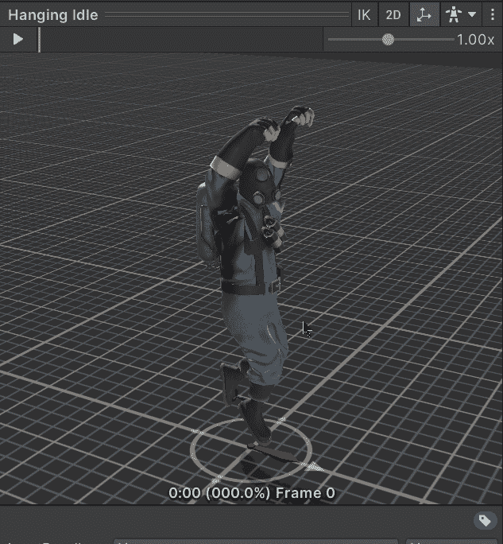

要添加动画，让我们将它的文件拖到 Animator 窗口中，并从跳转状态开始进行相应的转换。然后，为了控制这些过渡，让我们创建一个新的 bool 参数来指示玩家何时抓住壁架:

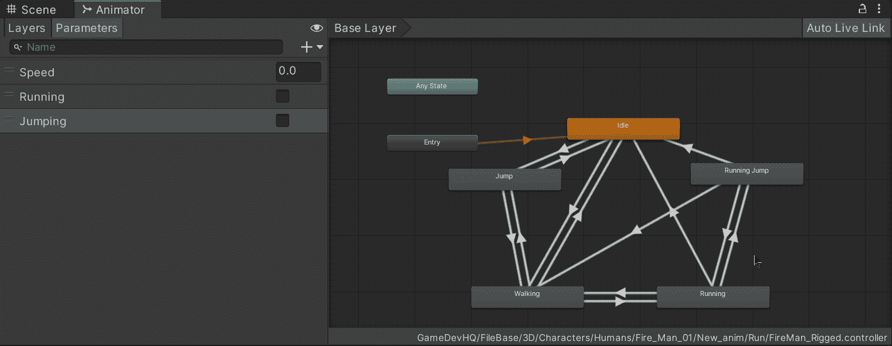

创建后，选择相应的过渡并:

*   禁用 ***具有退出时间*** 属性，以避免在传递到壁架抓取动画之前等待跳跃动画结束。
*   添加布尔作为执行壁架抓取动画的条件。

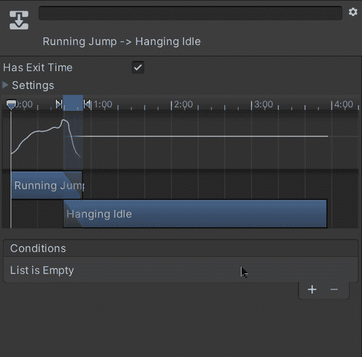

## 识别壁架

现在，继续壁架抓取机制，让我们创建一个新的游戏对象，在我们的玩家游戏对象中有一个碰撞器或一个 3D 立方体。创建完成后，让我们修改新的游戏对象以适应我们的动画，如下所示:

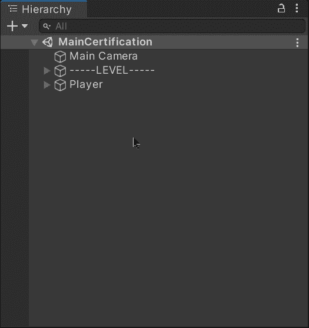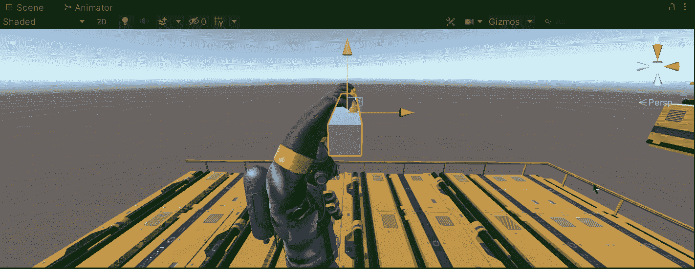

通过这种方式，玩家将在移动的同时移动游戏对象，并且它将检查是否有壁架可供抓取:

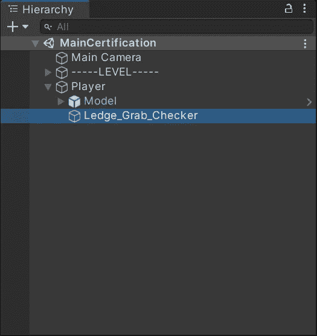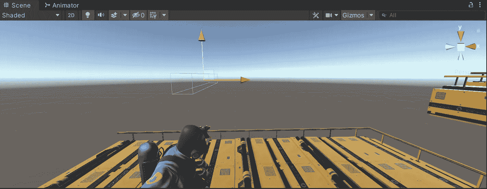

不要忘记选择新的游戏对象和:

*   启用 ***是从碰撞器中触发*** 属性。
*   创建并分配一个新标签以便于识别。

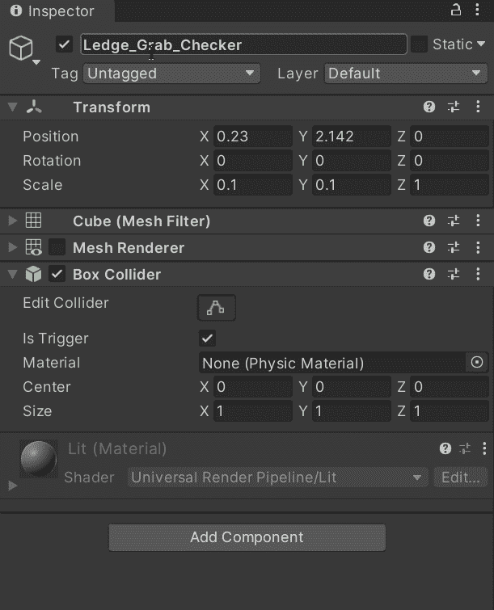

## 识别玩家的标识符

接下来，为了确定我们需要在哪个时刻触发壁架抓取动画，让我们在相应的壁架中创建一个新的游戏对象(带有一个长方体碰撞器或一个 3D 立方体):

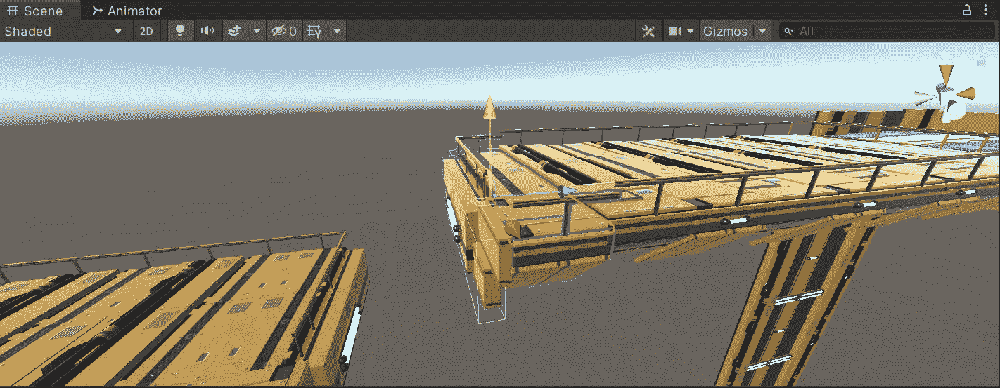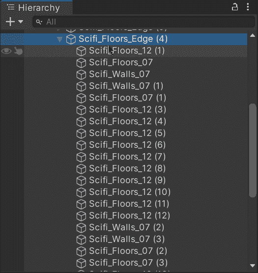

现在，为了识别壁架并按预期触发动画，让我们修改它的属性以满足我们的需要:

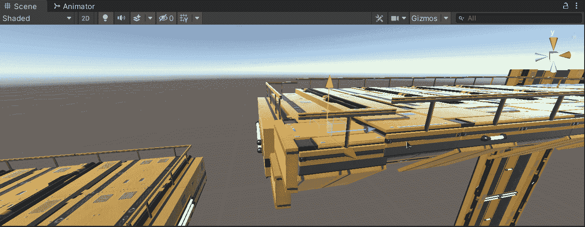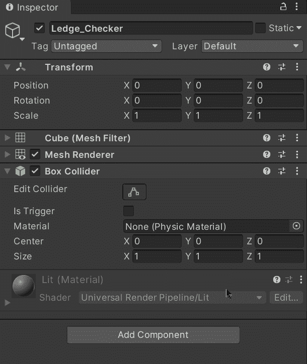

不要忘记启用 ***是从碰撞器中触发*** 属性。

然后，让我们选择新的游戏对象:

*   连接一个**刚体**以便能够检测与壁架抓取检查器的碰撞。
*   创建并附加一个新脚本，以指示如何处理相应的冲突。

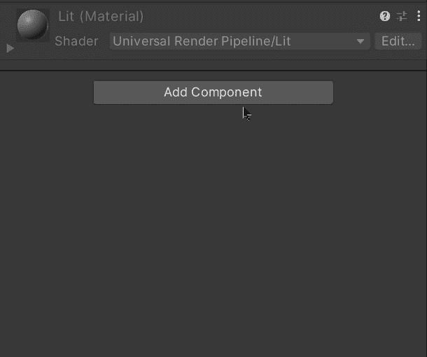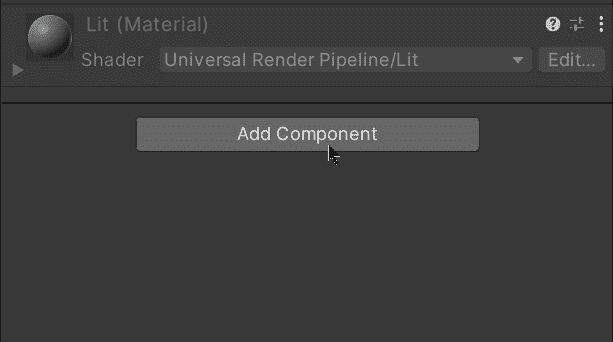

现在，让我们创建一个新的游戏对象来指示玩家在抓住所需的壁架时手的正确位置:

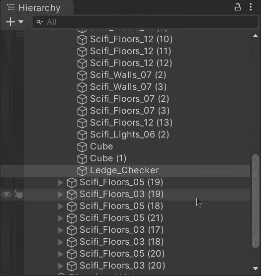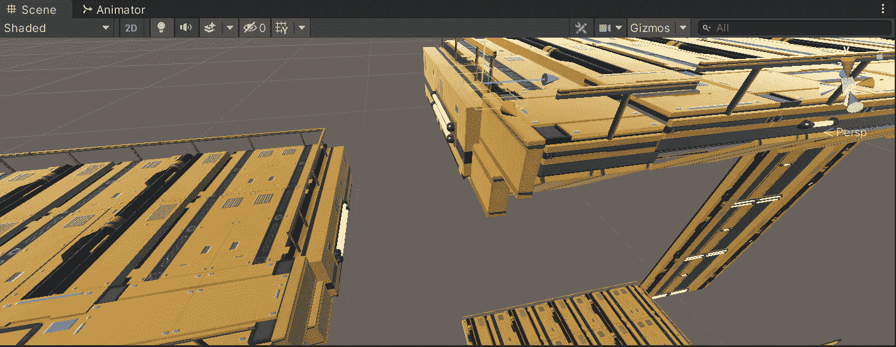

接下来，让我们打开壁架脚本并创建一个新变量来存储最后一个新游戏对象的转换组件，该组件指示玩家抓住壁架的位置:

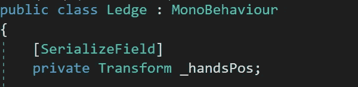

不要忘记使用[SerializeField]来通过检查器设置值。

保存后，让我们通过检查器将游戏对象拖动到脚本组件中:

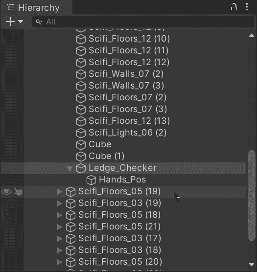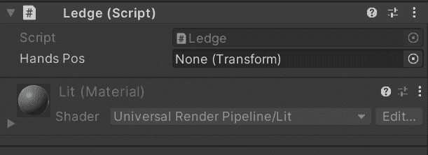

然后，为了正确实现壁架抓取动画，让我们打开播放器脚本并:

*   创建一个新的公共方法来接收抓取壁架时的位置。
*   禁用玩家的角色控制器组件，以避免使用重力或在抓住壁架时控制玩家。
*   从 animator 组件将相应的 bool 设置为 true，以指示玩家应该执行壁架抓取动画。
*   将播放器的位置设置为收到的参数。

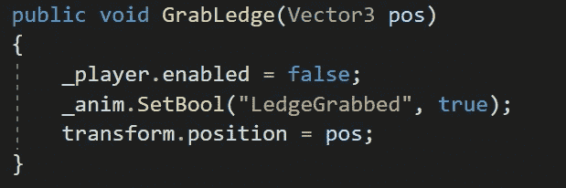

最后，为了识别碰撞，让我们返回到 Ledge 脚本并使用 **OnTriggerEnter** 方法。一旦进入该方法，让我们通过使用 **CompareTag** 方法来检查来自碰撞器的标签是否属于玩家内部的游戏对象。如果是这样的话，让我们从父组件(播放器)获取**播放器**脚本组件，并调用我们在上面创建的包含要设置给播放器的位置的方法:

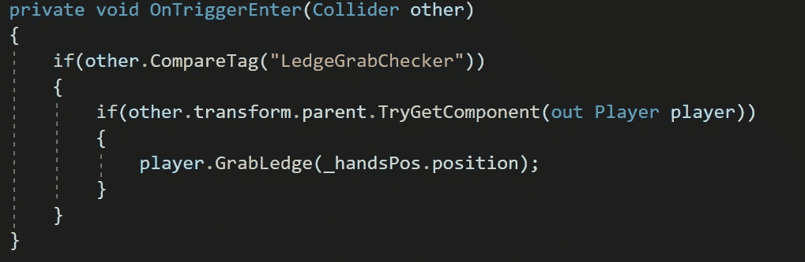

现在，如果我们在 Unity 中运行游戏，我们将能够看到当碰撞发生时，壁架抓取动画和机制按预期工作:

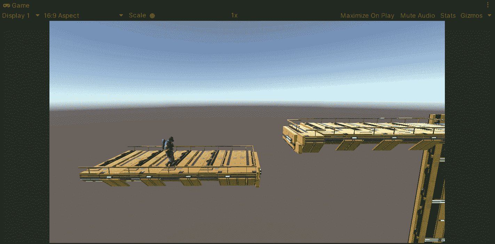

就这样，我们用 Unity 创造了一个壁架抓取机械！:d .我会在下一篇文章中看到你，在那里我将展示如何在我们的 Unity 玩家的状态中处理动画事件。

> *如果你想了解我更多，欢迎登陆*[***LinkedIn***](https://www.linkedin.com/in/fas444/)**或访问我的* [***网站***](http://fernandoalcasan.com/) *:D**