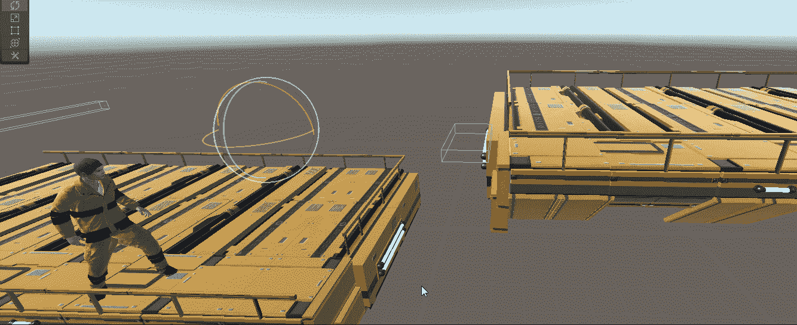

# 在 Unity 中创建壁架抓取系统

> 原文：<https://medium.com/nerd-for-tech/creating-a-ledge-grab-system-in-unity-2afe9621fd0c?source=collection_archive---------5----------------------->

//烟雾和镜子

暂停时间！

如果你看过昨天 Mixamo 关于动画的文章，上面的图片可能看起来很熟悉。我们将关注图像中实际发生的事情，而不是动画。

你应该注意到的是一个原始的壁架抓取系统，允许玩家抓住壁架并悬挂在那里，直到他们爬起来。那么我们到底该如何拉这个…