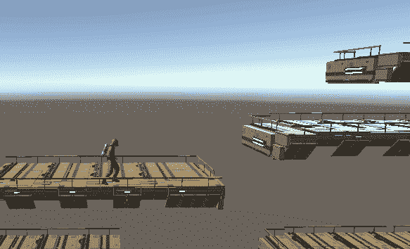
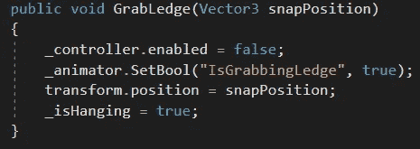
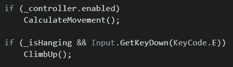
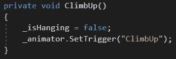
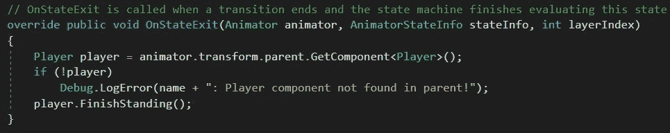
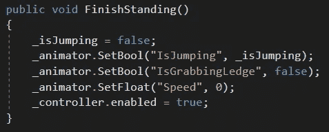

# 在 Unity 中创建壁架抓取系统

> 原文：<https://medium.com/nerd-for-tech/creating-a-ledge-grab-system-in-unity-8d9de1fd2a93?source=collection_archive---------18----------------------->

**目标:**让玩家抓住一个壁架，把自己拉起来。

这个过程很棘手。首先，我们将在玩家的头部上方创建一个不可见的物体，如果他们必须抓住一个壁架，他们的手将会在那里。我们将把它标记为*壁架 _ 抓取 _ 检查器*。我们还将创建一个不可见的*碰撞器*，它的*被触发*设置为*真*。我们还将在希望玩家悬挂的位置创建一个空的游戏对象。我们在代码中将这个空对象称为 *_snapPosition* 。

在壁架的 *OnTriggerEnter* 方法上，如果玩家的*壁架 _Grab_Checker* 是触发对象，壁架将找到附加的玩家并调用其公共 *GrabLedge* 方法，传入 *_snapPosition* 对象的位置。

玩家的 *GrabLedge* 方法禁用了*角色控制器*，因此玩家不能尝试行走或跳跃。然后，它会通过将 *IsGrabbingLedge* 设置为 *true* 来告诉动画转换到挂起状态。然后我们将播放器放在我们传入的 *snapPosition* 上。最后，我们将把 *_isHanging* bool 标记为 *true* 。

在玩家下一次*更新*的过程中，由于控制器被禁用，所以我们不会计算任何移动。 *_isHanging* 为*真*，所以如果玩家也按下 *E* 键，我们就调用 *ClimbUp* 方法。

*ClimbUp* 方法会将*is hanging*设置为 *false* 并触发 *ClimbUp* 动画状态。

*ClimbUp* 动画状态附有一段特殊的代码:一个*statemachinehavior*脚本。当动画剪辑到达其结尾时，它将返回到静止空闲状态。退出将触发*statemachinehbehavior 的 onsteexit*方法。这个方法将依次调用播放器的 *FinishStanding* 方法。

*FinishStanding* 方法首先确保我们将一切恢复正常。当我们抓住壁架时，我们正在半空中跳跃，所以 *_isJumping* 需要设置回 *false* 。然后，我们将设置动画参数，以确保我们将处于站立的空闲位置。最后，我们将重新启用角色控制，给我们的玩家继续玩游戏的自由！

