# 在 Unity 中创建装载场景

> 原文：<https://medium.com/nerd-for-tech/creating-a-loading-scene-in-unity-ced9cf40349f?source=collection_archive---------9----------------------->

## 统一指南

## 如何使用 Unity 创建装载场景的快速指南

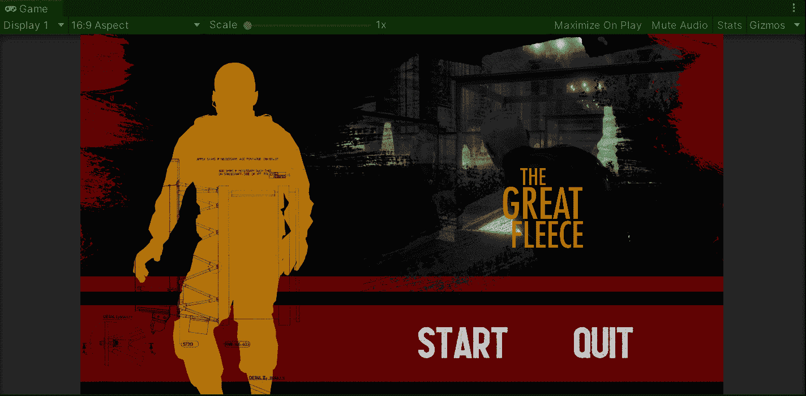

**目标**:实现一个加载场景，处理下一个场景在 Unity 中完全加载之前所花费的时间。

在上一篇文章中，我介绍了[如何通过 Unity](/nerd-for-tech/implementing-a-game-manager-using-the-singleton-pattern-unity-eb614b9b1a74) 应用单例模式来实现游戏管理器。现在，是时候创建一个加载场景来处理用 Unity 加载下一个场景的时间了。

# 主菜单场景

首先，让我们看看我为我的游戏创建的主菜单场景，它有两个按钮:

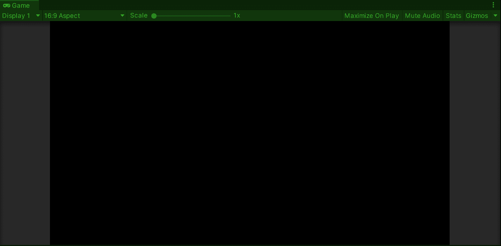

预期的行为是单击 start 按钮，以显示一个包含加载栏的加载场景，该加载栏将被填满，直到主场景被加载并且游戏开始。

# 创建装载场景

所以，为了创建装载场景，让我们点击*文件>新建场景*或者按 *Ctrl + N* :

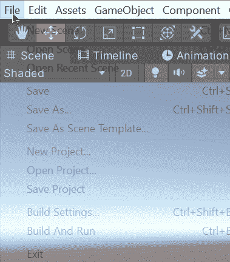

然后，让我们创建一个新的图像来显示背景。我们可以修改锚点预设来覆盖游戏背景:

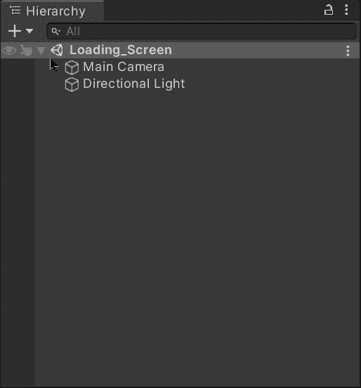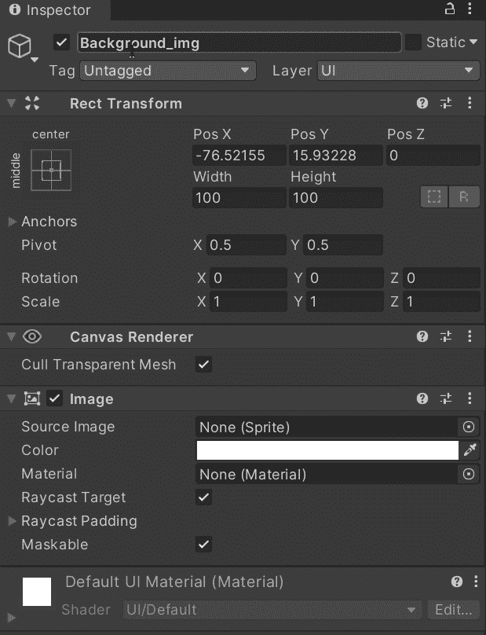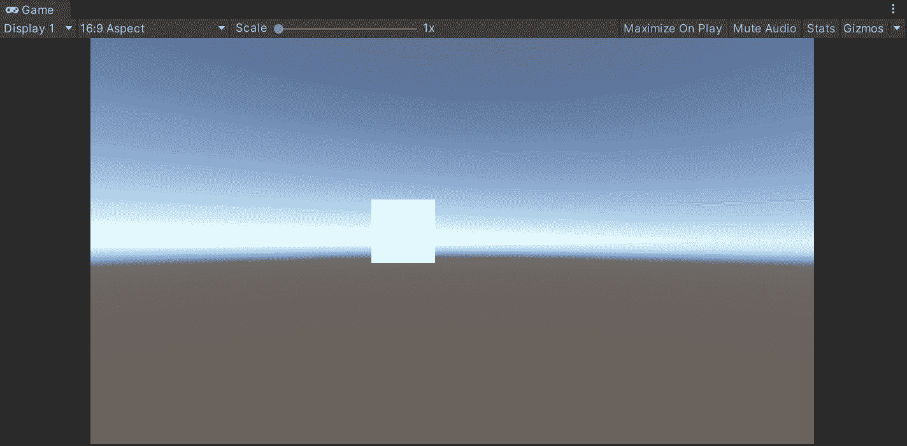

接下来，让我们将相应的图像精灵从项目文件夹中拖动到相应的位置来显示背景。如您所见，我们已经有了图像中装载栏的背景:

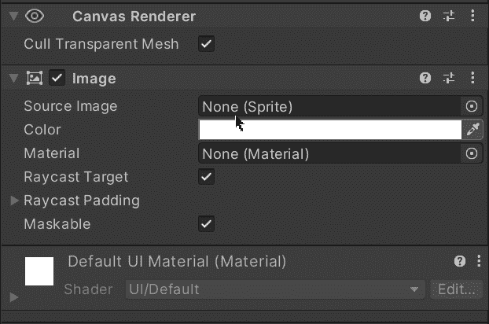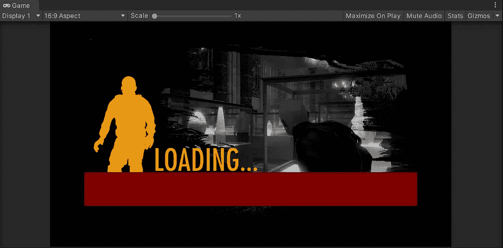

现在，让我们创建一个新的图像，并修改它，使其覆盖加载栏的背景:

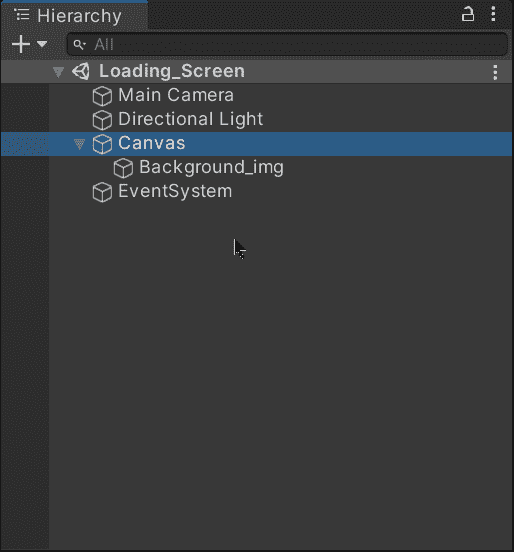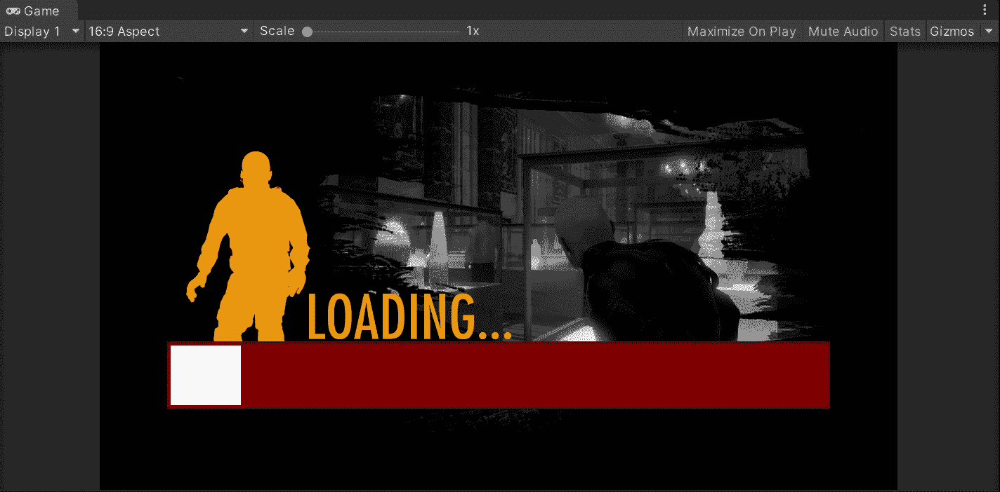

一旦覆盖，让我们拖动加载栏各自的图像精灵:

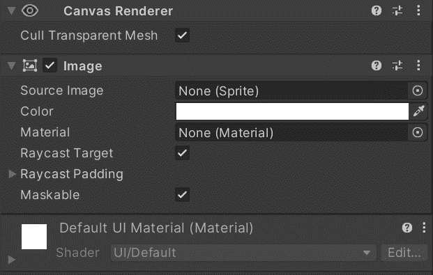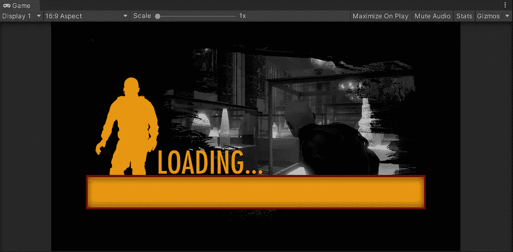

然后，为了使加载栏看起来更好，让我们添加一个新的图像来显示一个覆盖图:

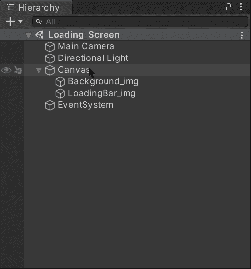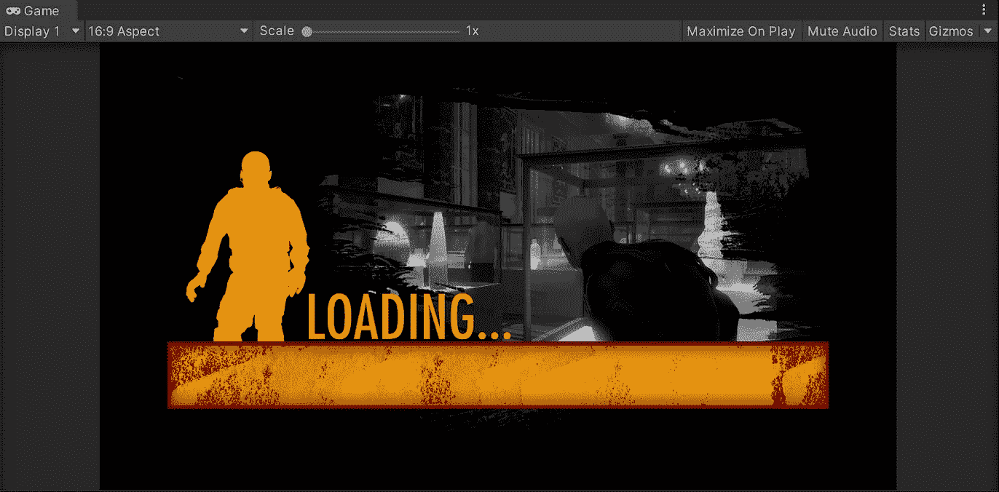

最后，为了在加载栏中显示填充效果，让我们选择加载栏图像，并将 ***图像类型*** 修改为*，将 ***填充方法*** 修改为 ***【水平】*** 。你会注意到 ***填充量*** 值从 0 到 1，它直接修改图像的外观:*

*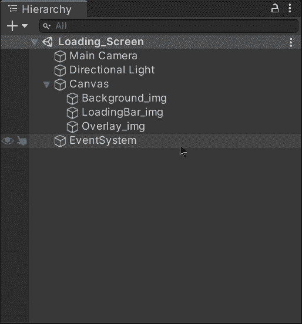**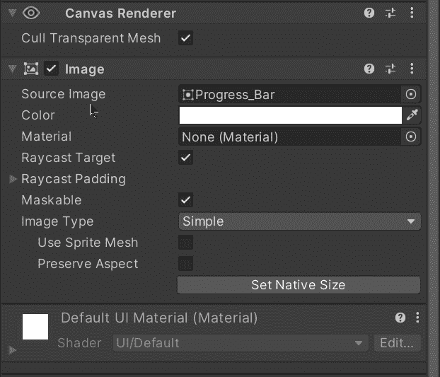**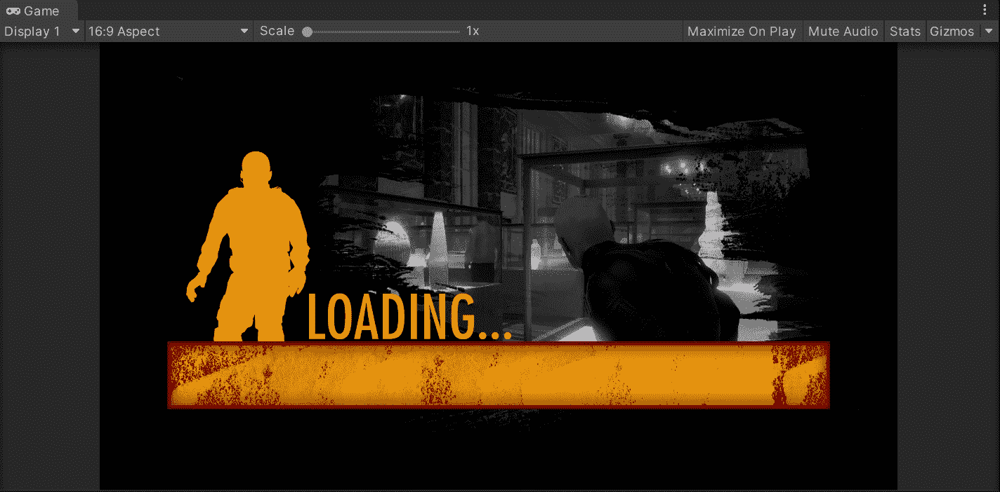*

# *加载场景*

*现在，为了能够在主场景加载时处理加载栏，让我们创建一个新的脚本:*

*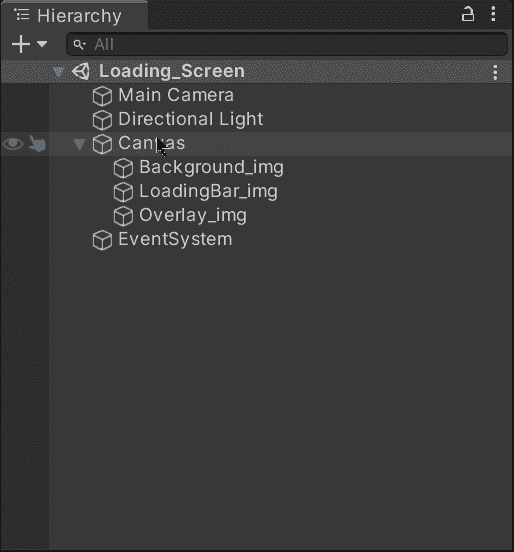**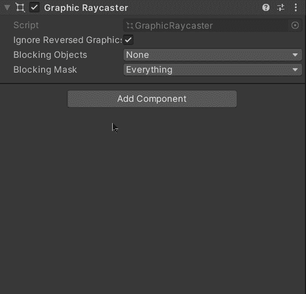*

*然后，让我们打开脚本并包含处理 UI 元素和场景加载所需的相应名称空间:*

*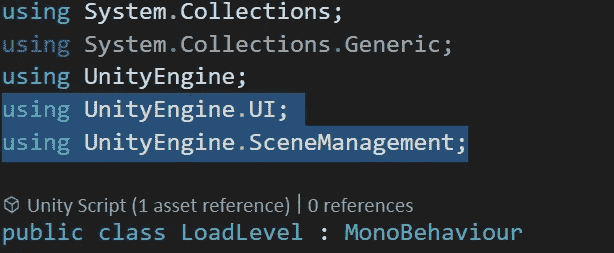*

*接下来，让我们创建一个新的私有图像变量来存储加载栏图像的引用。不要忘记使用**【serialize field】**将图像拖入检查器:*

*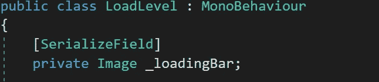*

*然后，让我们创建一个新的协程来处理场景负载:*

*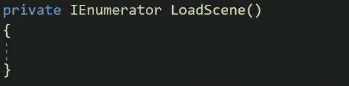*

*为了异步加载主场景并知道它何时已经被加载，我们需要使用来自**场景管理器**类的**异步操作**和 **LoadSceneAsync** 方法:*

*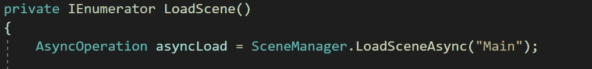*

*如果您想了解更多关于**异步操作**和**负载场景同步**方法的信息，您可以访问 Unity 文档:*

* [## 异步操作

### UnityEngine 中的类/继承自:YieldInstruction /建议更改感谢您帮助我们提高质量…

docs.unity3d.com](https://docs.unity3d.com/ScriptReference/AsyncOperation.html)  [## Unity 脚本 API:场景管理。场景管理器

### 建议更改感谢您帮助我们提高 Unity 文档的质量。虽然我们不能接受所有的…

docs.unity3d.com](https://docs.unity3d.com/ScriptReference/SceneManagement.SceneManager.LoadSceneAsync.html) 

现在，让我们创建一个新的 while 循环，它将一直运行到**异步操作**完成:

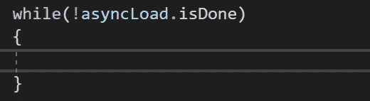

在这里，我们将设置加载栏图像的填充量值等于 **AsyncOperation** progress 属性(也从 0 变为 1)。然后，我们将使用 **yield return** 语句在每次迭代后返回相应的渲染帧:

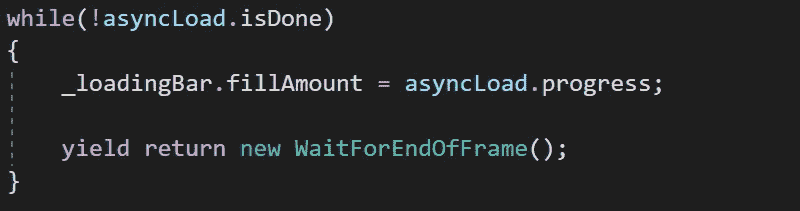

如果您想了解更多关于 **WaitForEndOfFrame** 类的信息，您可以访问 Unity 文档:

 [## WaitForEndOfFrame

### UnityEngine 中的类/继承自:YieldInstruction /在:UnityEngine 中实现。核心模块建议更改谢谢…

docs.unity3d.com](https://docs.unity3d.com/ScriptReference/WaitForEndOfFrame.html) 

最后，让我们使用 **Start** 方法来启动异步加载主场景的协程:

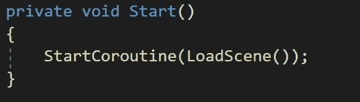

不要忘记通过检查器将加载栏图像拖到脚本组件中:

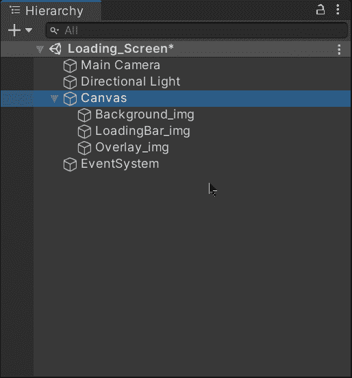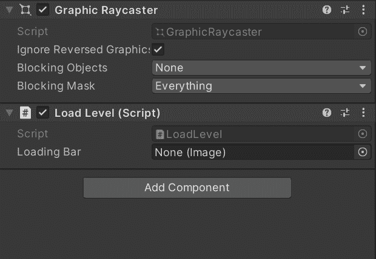

同样，为了避免场景管理问题，让我们通过**构建设置**添加游戏场景:

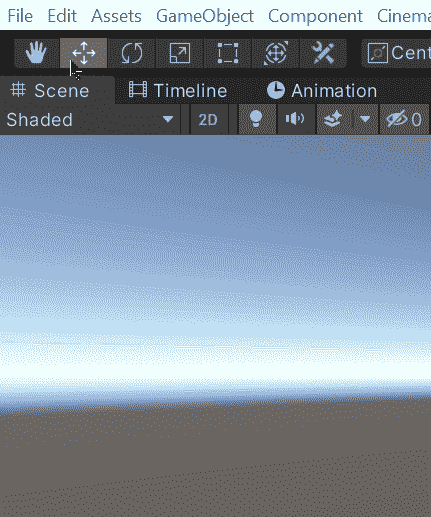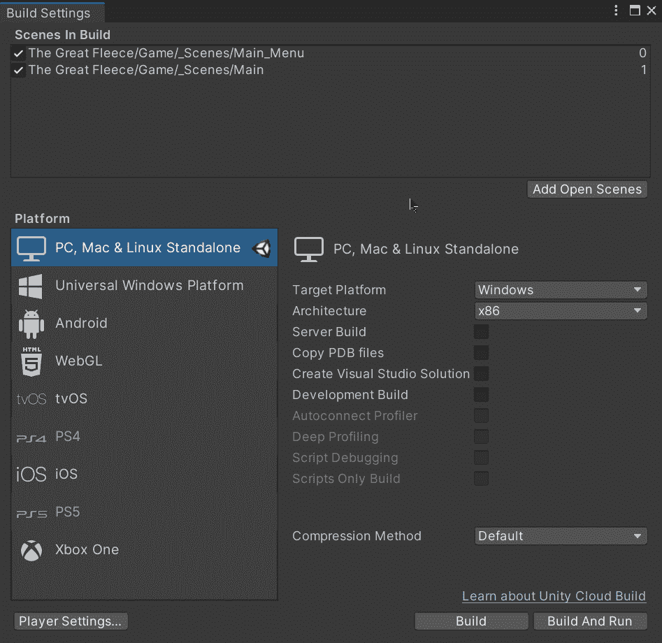

如果我们用 Unity 运行游戏，我们会看到加载场景被显示出来，并等到主场景被加载后才显示出来:

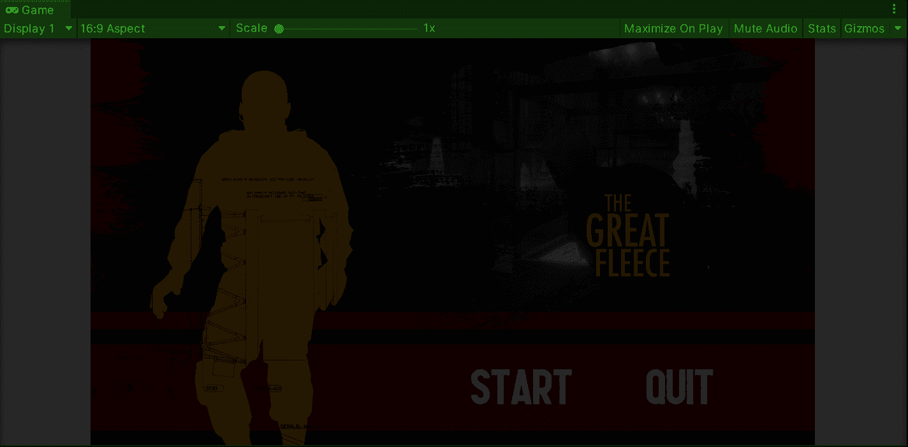

> 注意:加载场景并不需要花费太多时间来加载主场景，因为它并不太重，而且我正在使用一台功能强大的计算机来运行它。

就这样，我们用 Unity 创建了一个装载场景！:d .我将在下一篇文章中看到你，在那里我将与 Unity 一起开始一个新的 2.5D 项目。

> *如果你想了解我更多，欢迎登陆*[***LinkedIn***](https://www.linkedin.com/in/fas444/)**或访问我的* [***网站***](http://fernandoalcasan.com/) *:D***