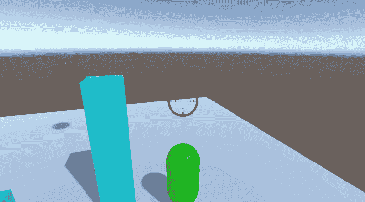
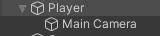
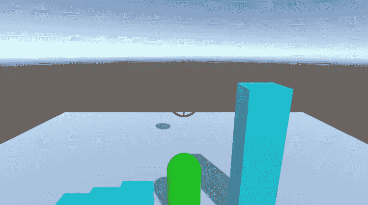
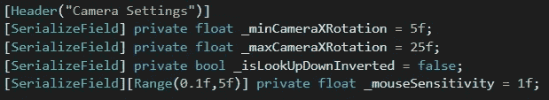
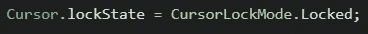
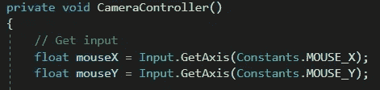
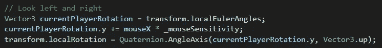
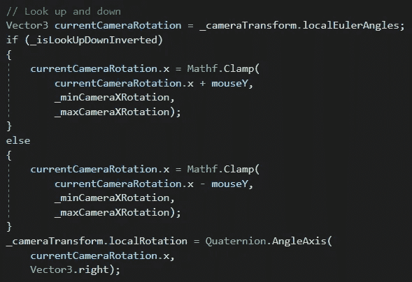

# 创建外观相机系统

> 原文：<https://medium.com/nerd-for-tech/creating-a-look-camera-system-e4faeef39c09?source=collection_archive---------15----------------------->

**目的:**允许玩家操纵跟随摄像机。

我们首先将相机设置为玩家对象的子对象，然后设置所需的相机角度。

在我们的玩家脚本中，我们需要一些变量。 *_min/_maxCameraXRotation* 变量将限制玩家可以移动多低或多高的垂直摄像机角度。我们将使用 *_isLookUpDownInverted* 来允许玩家自定义相机对鼠标上下移动的反应，而 *_mouseSensitivity* 则是鼠标对移动的反应有多敏感。我们应该努力想办法让我们的玩家定制他们的体验！

当游戏开始时，我们将光标“锁定”在屏幕中央，这也将导致光标消失。

不过，让玩家控制他们自己的系统是一个很好的做法，所以我们会让他们在任何时候按下 *Escape* 键来恢复他们的光标。

我们的 *CameraController* 方法将在每一帧被调用。首先，我们将获得玩家的鼠标输入。

然后我们将处理他们的水平鼠标输入。他们的输入将乘以 *_mouseSensitivity* 设置，并应用于玩家对象的 *localRotation* 。这具有在游戏世界中转动玩家的效果，允许他们在向前行走的同时转动。

最后，我们将处理玩家的垂直鼠标输入。我们会得到摄像机当前的旋转角度。然后我们将鼠标移动应用到旋转的 *x* 参数，但是我们将使用 *Mathf。夹住*以确保玩家不能向下看得太低(这样他们就不会射到自己)或向上看得太高。我们将使用 *_isLookUpDownInverted* 来决定我们是否应该根据玩家的偏好增加或减少输入。最后，我们将应用新的旋转回到相机。

