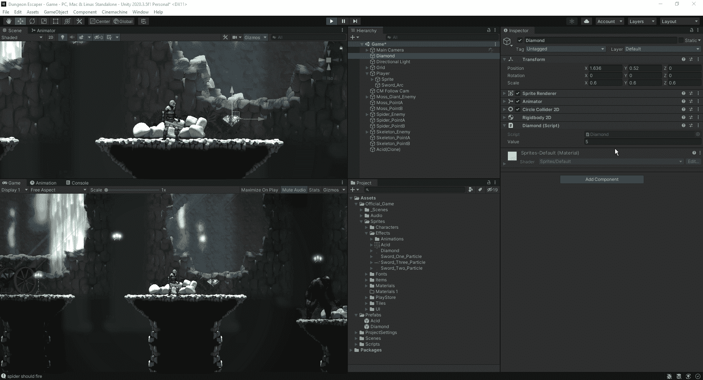
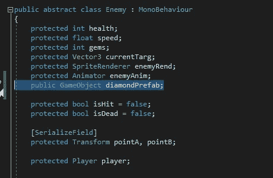
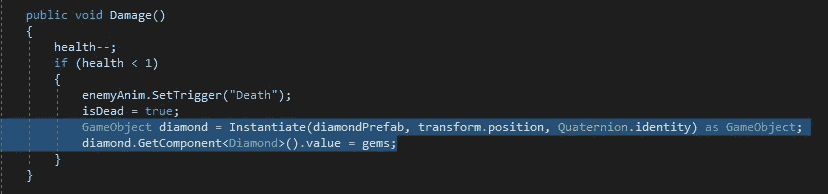
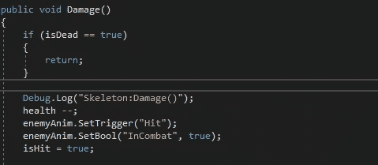
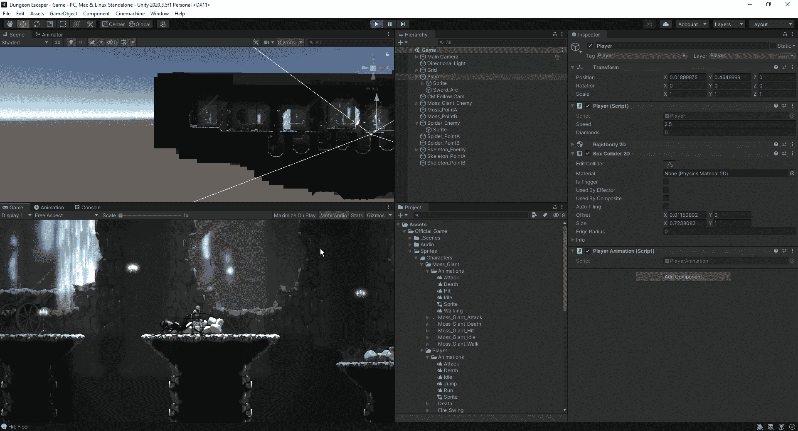

# 在 Unity 中创建一个战利品系统

> 原文：<https://medium.com/nerd-for-tech/creating-a-loot-system-in-unity-2ebd75e5c81c?source=collection_archive---------9----------------------->

现在我们的敌人都设置好了，让我们看看如何创建一个战利品系统，让我们的敌人在死亡时掉落一定数量的钻石。
首先，我们要为钻石创建逻辑，以便它能与玩家互动并增加钻石总数:

我们所做的是一个简单的钻石价值数额，将增加到玩家手头的钻石总数。从这里，我们可以看到它是否适当地增加了玩家总数:

现在我们已经把它加到了我们的玩家总数中，让我们来看看如何得到它，这样我们的敌人就会在死亡时掉落一定价值的宝石。首先，我们想要创建一个游戏对象，我们可以将预设附加到它上面。由于我们将在所有敌人类型中使用它，我们将把它作为公共变量添加到敌人脚本中:

从这里开始，我们将进入所有敌人的脚本，并添加逻辑，使其在死亡时掉落宝石，以及我们分配给特定敌人类型的值:

从这里，我们可以在我们的游戏中测试它:

正如我们所看到的，钻石确实从我们的敌人身上掉了下来，但有一个小问题是，我们可以通过反复杀死敌人来从敌人身上收获无限的钻石。为了解决这个问题，我们将在损坏作废的开头插入一个快速退货声明，以防止这种情况发生:

现在我们可以在游戏中测试它，看看不同的敌人会给我们不同的宝石值:

既然我们的敌人为我们丢下了那些珍贵的钻石，我们需要实现一个让我们花钱的系统。在下一篇文章中，我们将探索如何为玩家创建一个购物系统。