# 创造一个战利品系统|团结

> 原文：<https://medium.com/nerd-for-tech/creating-a-loot-system-unity-27476f9948be?source=collection_archive---------2----------------------->

## 统一指南

## 如何在 Unity 中创建一个简单的战利品系统的快速指南

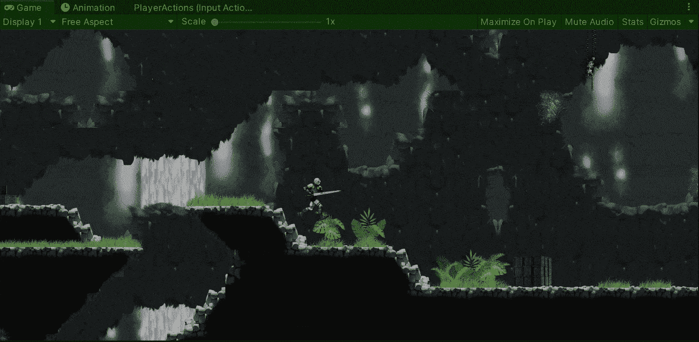

目标:在一个 2D 游戏中，为玩家创造一个收集钻石的战利品系统。

在上一篇文章中，我介绍了[如何用 Unity](/nerd-for-tech/implementing-hitbox-detection-for-melee-combat-unity-bc1912178e63) 实现一个 hitbox 检测系统。现在，是时候创建一个战利品系统来让我们的玩家在 2D 游戏中收集钻石了。

## 初速电流状态

首先，让我们看看 2D 游戏的现状。目前，我们可以攻击和接受敌人的攻击:

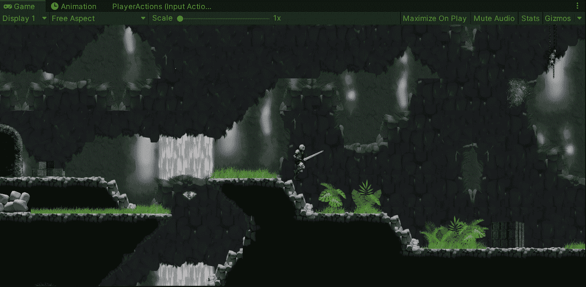

此外，我们已经有了几颗钻石，可以通过战利品系统收集:

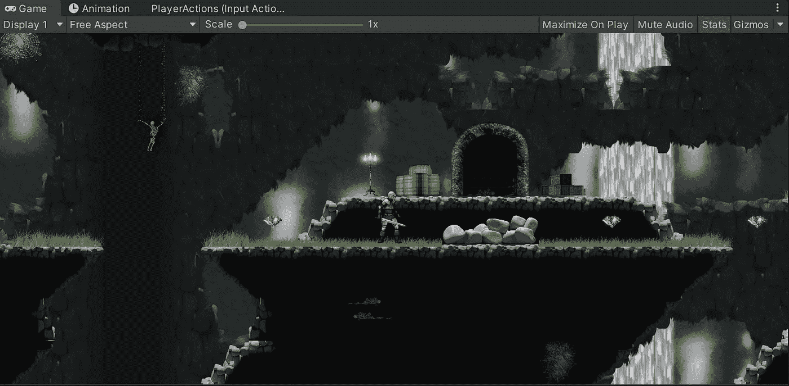

# 打造钻石

为了介绍各自的钻石，我们使用 2D 精灵编辑器对包含钻石精灵的精灵表进行了切片，并制作了动画:

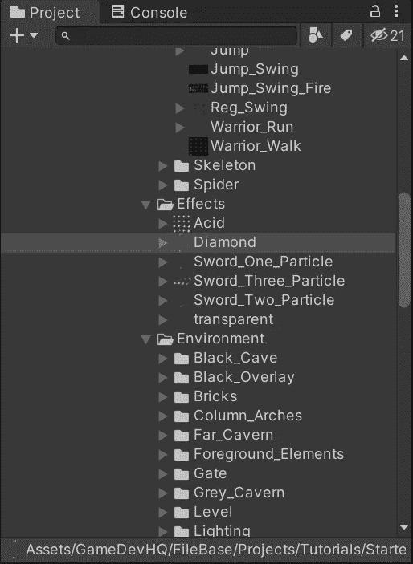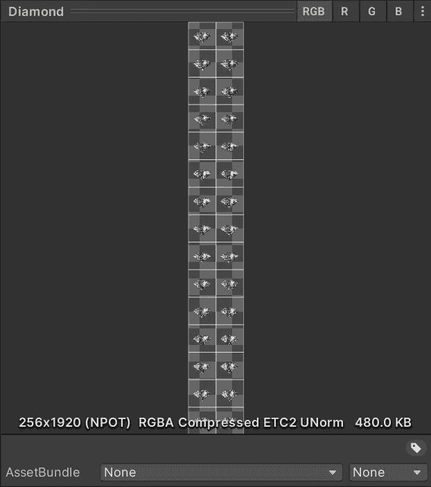

然后，我们用下面的组件创建了一个新的游戏对象:

*   精灵渲染器
*   鼓舞者
*   刚体 2D

重力刻度设置为 0，这样钻石就不会掉下来并保持在它的位置上。

*   2D 环形对撞机

启用 ***是触发器*** 属性，以检查玩家何时与钻石发生碰撞，并处理代码中发生的情况。

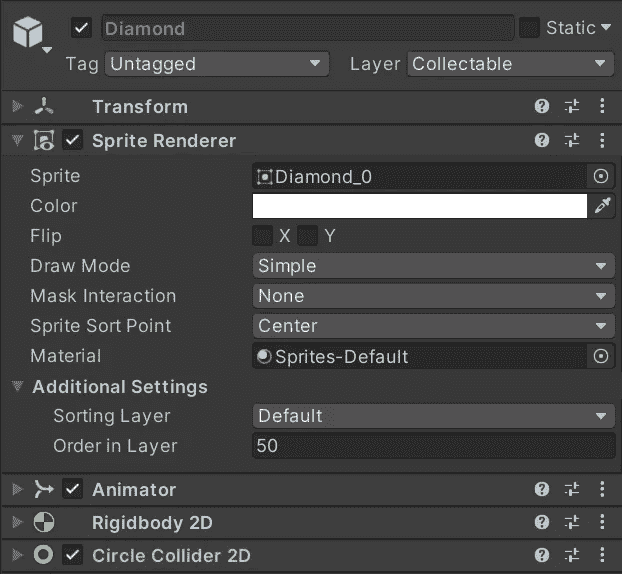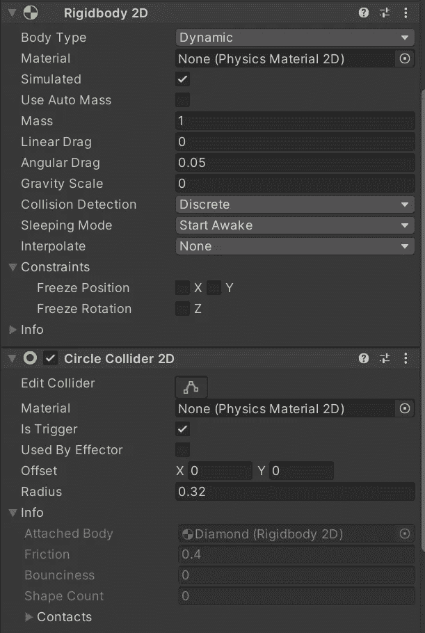

一旦我们有了这些组件，我们就可以把游戏对象变成一个预置，并按照我们的意愿把它们放在 2D 的环境中:

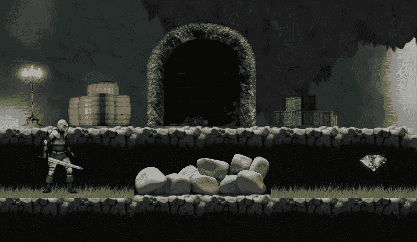

# 创建战利品系统

现在，为了创建我们的战利品系统，让我们开始创建一个新的 C#脚本，我们将附加到钻石预置:

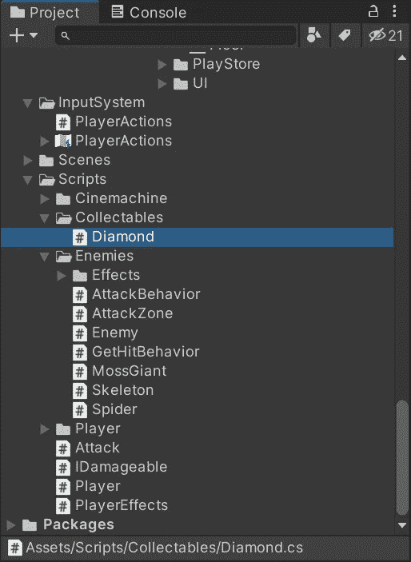

创建完成后，让我们打开脚本:

*   在顶部包含**系统**名称空间。
*   告诉脚本需要一个刚体 2D 和一个碰撞器 2D，以避免检查这些组件是否包含在游戏对象中。

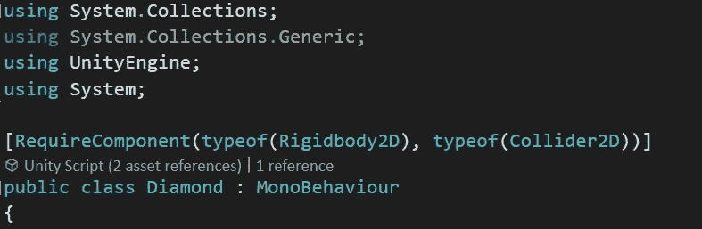

然后，让我们创建一个新的公共静态动作委托，作为每次收集钻石时的通知方式:

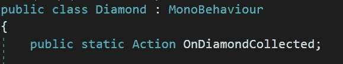

如果您想了解有关动作代表的更多信息，可以访问 Microsoft 文档:

 [## 动作委托(系统)

### 封装没有参数且不返回值的方法。公共委托 void Action()；公共…

docs.microsoft.com](https://docs.microsoft.com/en-us/dotnet/api/system.action?view=net-5.0) 

然后，让我们使用 OnTriggerEnter2D 方法来检查另一个碰撞器何时与菱形碰撞。一旦发生这种情况，让我们:

*   检查来自另一个碰撞器的标签是否属于玩家(因为我们希望玩家收集钻石)。
*   检查操作委托是否有人订阅了事件来执行它。
*   摧毁钻石游戏对象。

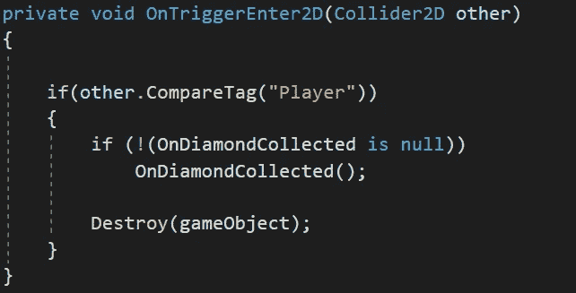

## 玩家脚本

一旦我们将钻石脚本附加到预设，让我们打开玩家脚本并创建一个新的变量来保存收集到的钻石的数量:

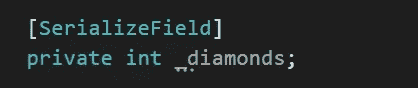

使用**【serialize field】**或**公共**变量来查看钻石何时通过检查员被收集。

最后，让我们使用 **Start** 或 **Awake** 方法为玩家订阅来自钻石脚本的动作委托。这样，我们可以使用一个匿名方法，将单个菱形添加到我们创建的变量中:

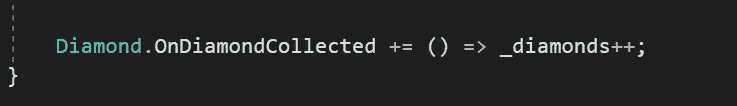

有关匿名方法的更多参考，您可以访问 Microsoft 文档:

 [## Lambda 表达式- C#参考

### 使用 lambda 表达式创建匿名函数。使用 lambda 声明运算符= >来分隔…

docs.microsoft.com](https://docs.microsoft.com/en-us/dotnet/csharp/language-reference/operators/lambda-expressions) 

现在，如果我们在 Unity 编辑器中运行游戏，我们会看到当玩家与钻石碰撞时，钻石会被收集起来:

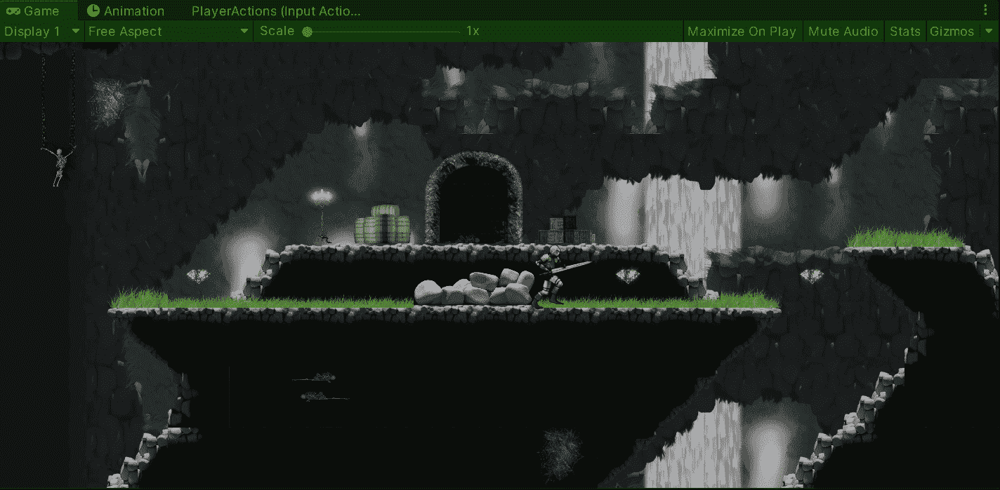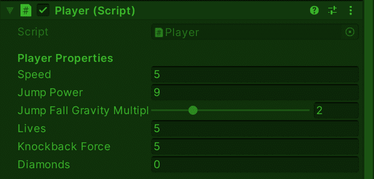

每次收集钻石时，diamonds 变量的值都会改变。

就这样，我们创造了一个战利品系统，允许玩家在我们的 2D 游戏中用 Unity 收集钻石！:d .我会在下一篇文章中看到你，在那里我会展示一个关于 Unity 中 UI 事件的教程。

> *如果你想了解我更多，欢迎登陆*[***LinkedIn***](https://www.linkedin.com/in/fas444/)**或访问我的* [***网站***](http://fernandoalcasan.com/) *:D**