# 创建模块化加电系统

> 原文：<https://medium.com/nerd-for-tech/creating-a-modular-power-up-system-e34a2414c50?source=collection_archive---------13----------------------->

## 统一指南

## 关于如何在 Unity 中为你的游戏创建一个模块化电源系统的快速指南

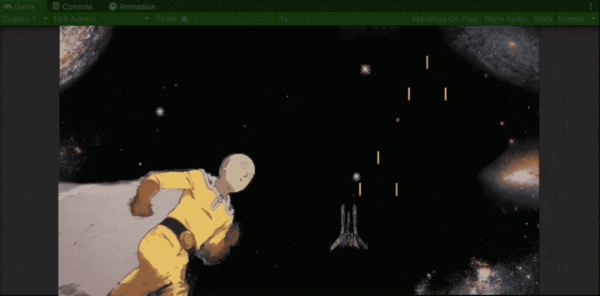

**目标**:用 Unity 打造一款太空射击游戏的模块化加电系统。

现在我们知道了[如何在 Unity 中为你的游戏创建一个加电系统](/nerd-for-tech/creating-a-power-up-for-your-game-in-unity-6810d73376a1)，是时候创建一个模块化的加电系统来避免每次加电都产生一个变量或函数。为此，我将在太空射击游戏中实现 3 个初始启动项目:

*   三次启动
*   加速加电
*   屏蔽上电

让我们从在游戏中添加速度提升加电项目开始，该项目具有处理收集方法所需的属性:

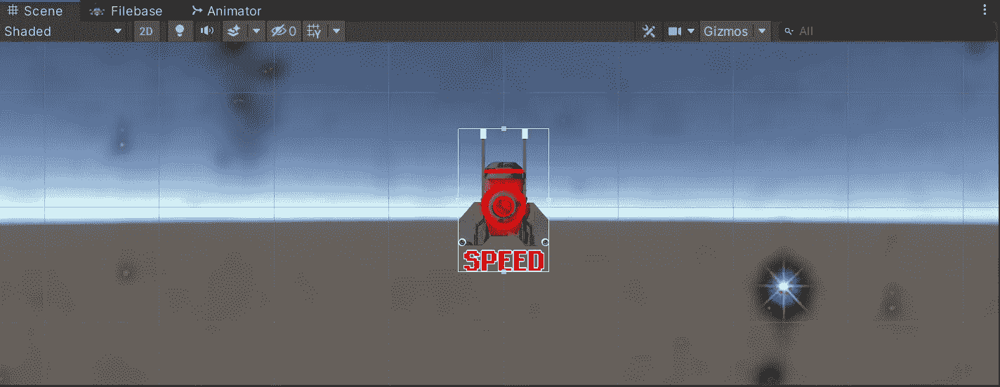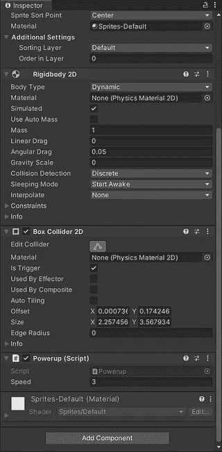

记住，为了被收集，物品应该包含一个**碰撞器**和一个**刚体**。

# 制造模块化系统

然后，让我们打开加电脚本并添加一个新的 int 变量，该变量将存储每个加电项目各自的 ID。一旦变量被序列化，选择各自的加电预置，并修改你希望识别它们的 ID:

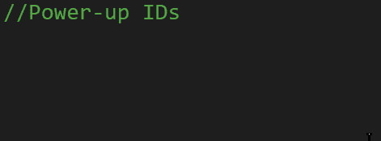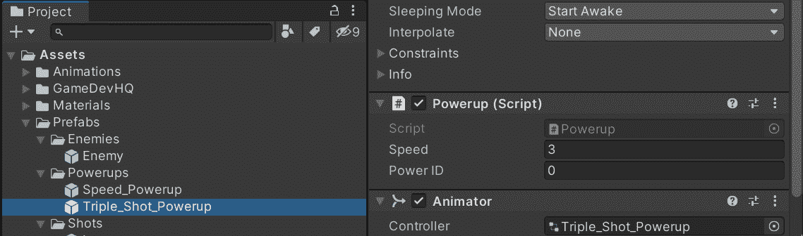

在这种情况下，我将使用 0 作为三倍拍摄加电的 ID，1 作为速度提升加电的 ID。

现在，在 **OnTriggerEnter2D** 函数中，我们可以用一个 switch 语句来改变我们处理与播放器冲突的方式，该语句将把加电的 ID 作为比较的参数:

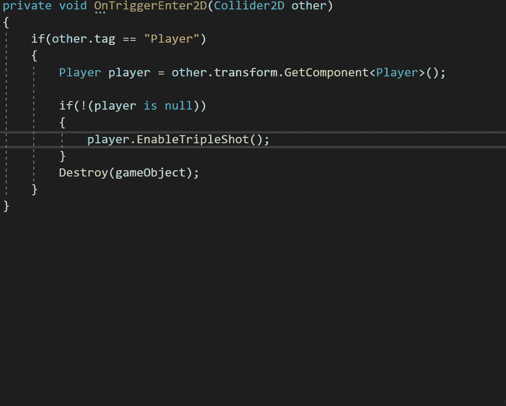

然后，让我们打开播放器脚本来创建一个新的 bools 数组，它将决定播放器中不同的电源是启用还是禁用。

> *注意:我将使用一个数组用于临时加电，另一个数组用于需要保持到其他事情发生(如护盾)的加电。*

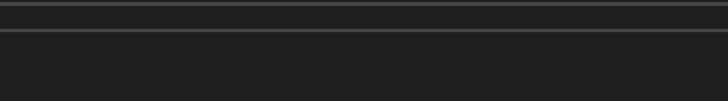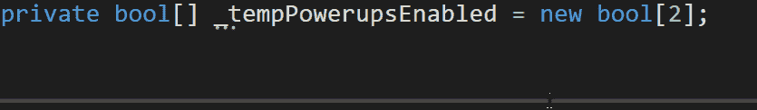

为**添加注释，以确定阵列中 2 个电源的索引**。

这是三次触发上电的当前协程实现:

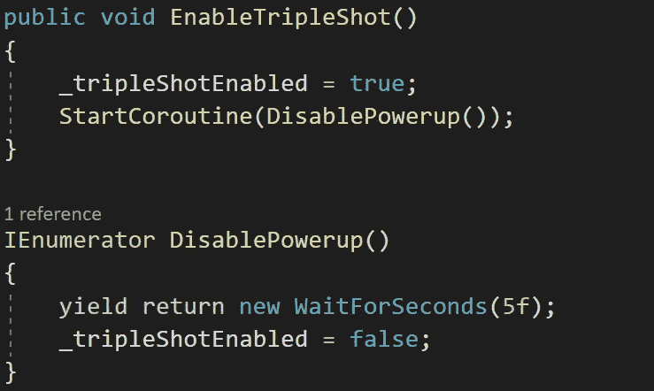

使用此协程，三重触发被启用，然后在 5 秒后被禁用。

让我们创建一个模块化的公共函数，通过 ID 和在协程中禁用它们之前等待的时间来处理临时加电激活:

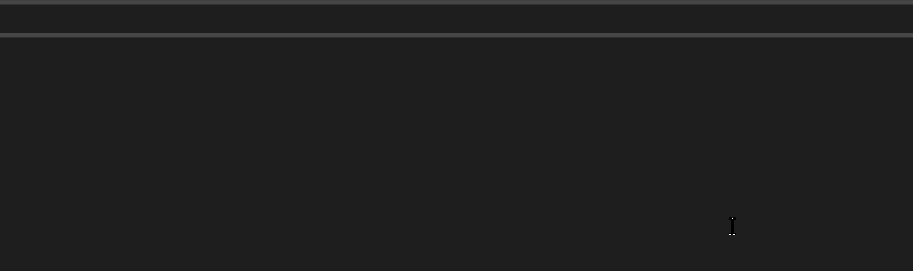

该函数将接收加电 ID 和禁用前的等待时间作为参数。

然后，在禁用三次上电的协程中，让我们更改名称并添加电源 ID 参数和禁用上电前的等待时间。此外，让我们添加时间变量，并将禁用三重触发的行更改为禁用相应数组中按索引上电的行:

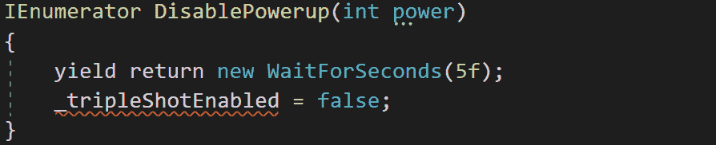

一旦时间参数结束，临时加电将被禁用。

然后，在公共函数中，让我们启用数组中相应的索引加电，并启动协程，在第二个参数发送的时间过去后禁用它:

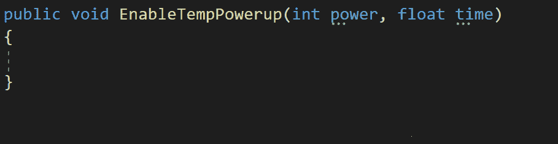

关于最佳实践，让我们添加一个条件来检查在函数中接收的 ID 是否在临时加电的阵列的索引界限之间:

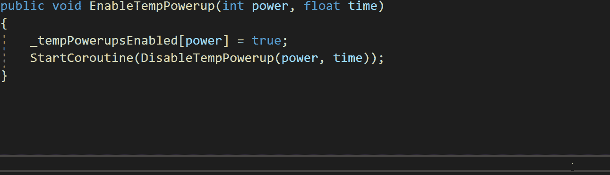

另外，如果 ID 不在现有的索引中，让我们在控制台中打印相应的错误:

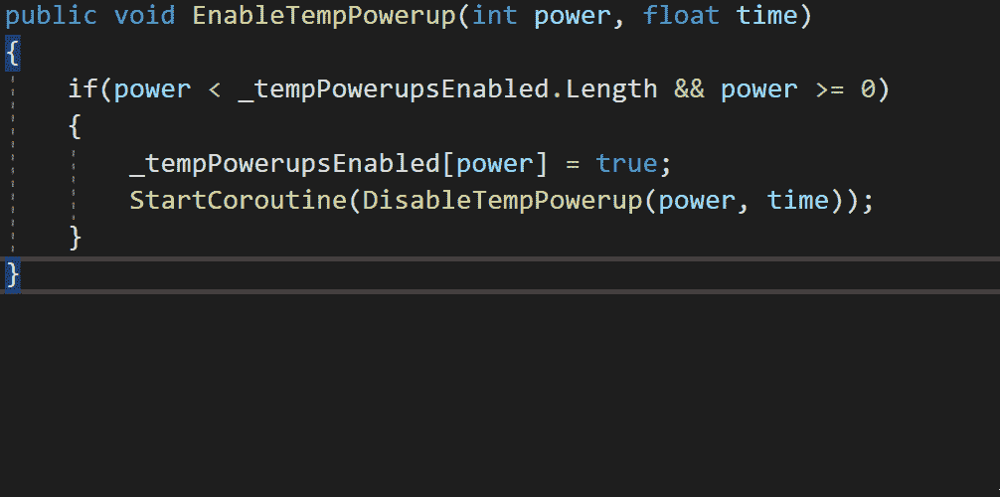

既然该函数是模块化的，我可以删除用于启用三倍拍摄上电的函数:

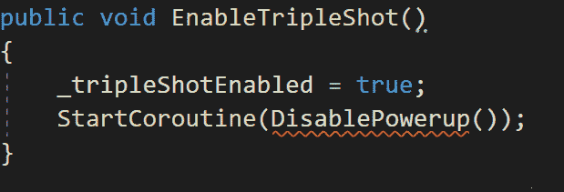

此外，在处理拍摄的函数中，我需要用新的数组和相应的索引来更改表示三次拍摄激活的条件:

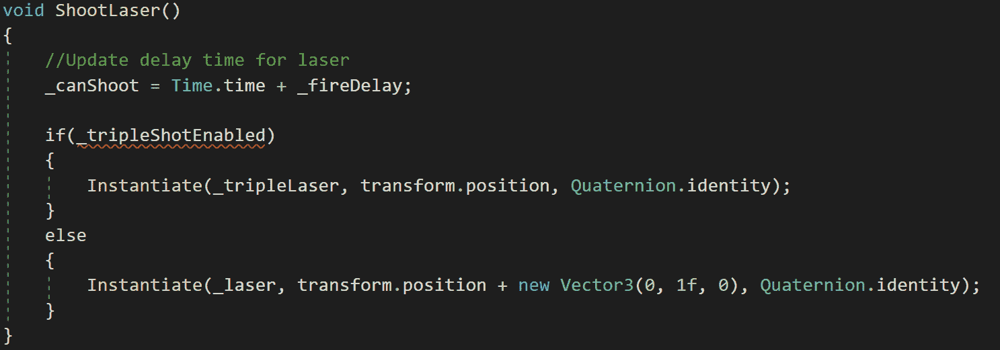

然后，让我们回到加电脚本，在这里我需要更改调用的函数来启用三重拍摄，并添加相应的加电 ID 和禁用时间作为参数:

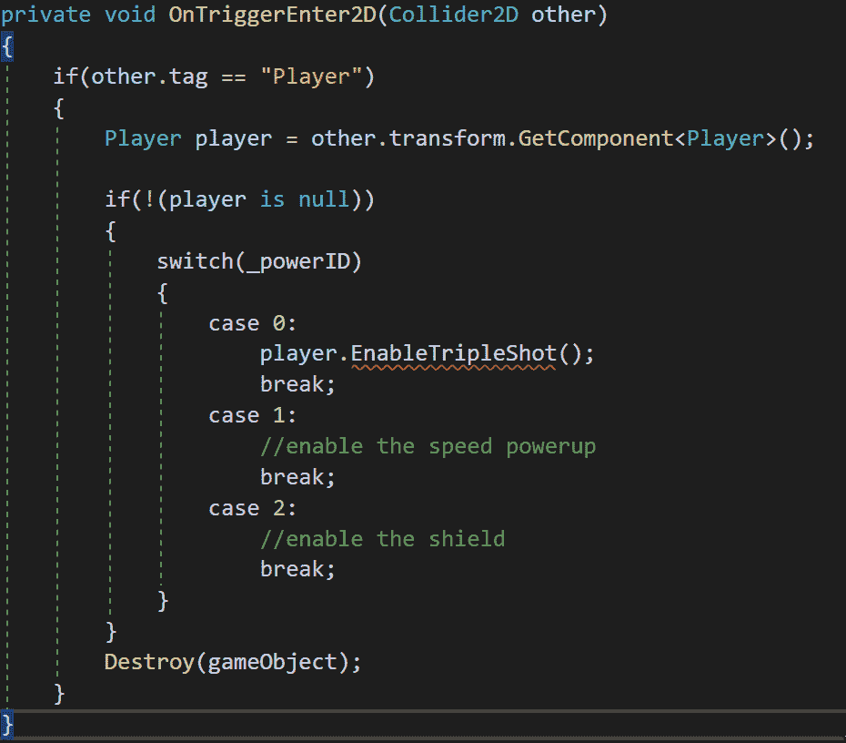

然后，让我们对速度提升加电进行同样的操作:

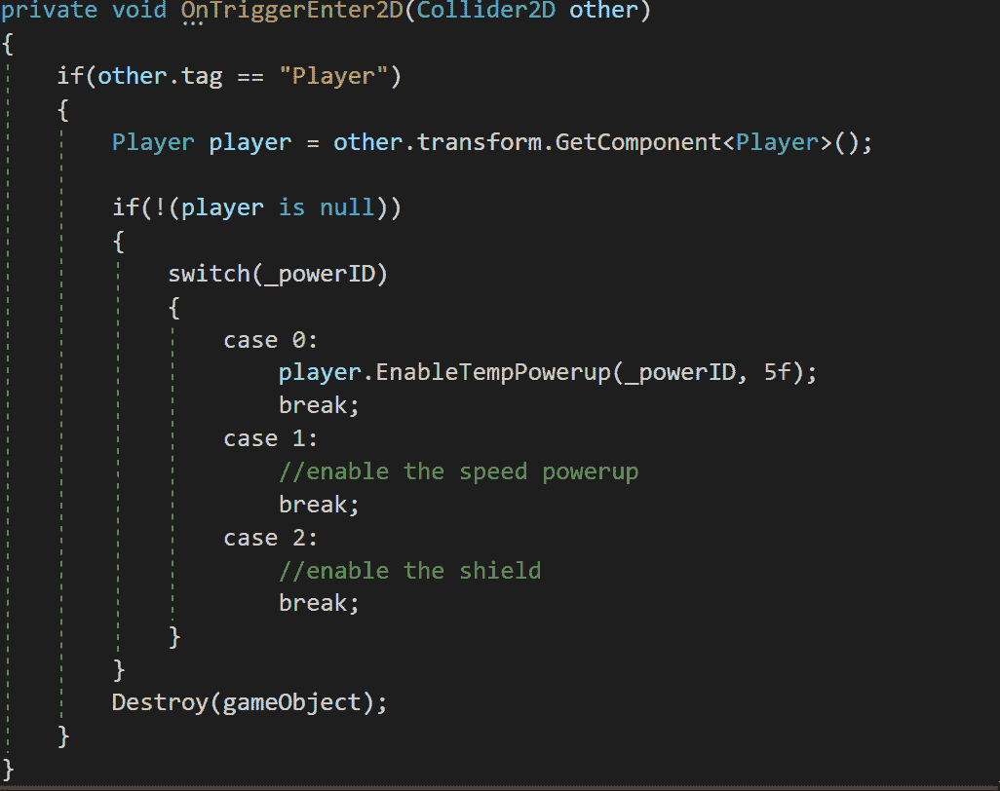

屏蔽不会是暂时的，所以我们必须调用一个不同的函数。

# 使速度启动工作

现在，为了使速度提升起作用，让我们再次打开播放器脚本，并添加一个新变量来存储速度的提升乘数:

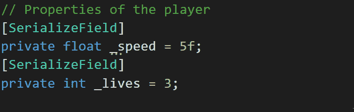

然后，我们可以通过使用**用它来乘以运动函数中的速度变量。**操作符检查数组中的速度提升指数是否为真，但即使这样做有效，它也会假设每帧都检查这个条件(因为运动函数在更新函数内):

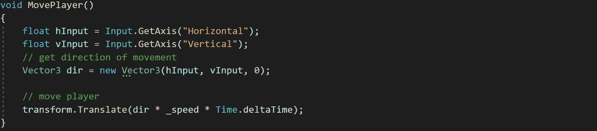

因此，为了使用更少的资源，我们可以在模块化函数中添加一个 switch 语句来处理临时加电，而不需要像三倍镜头那样每帧检查一次:

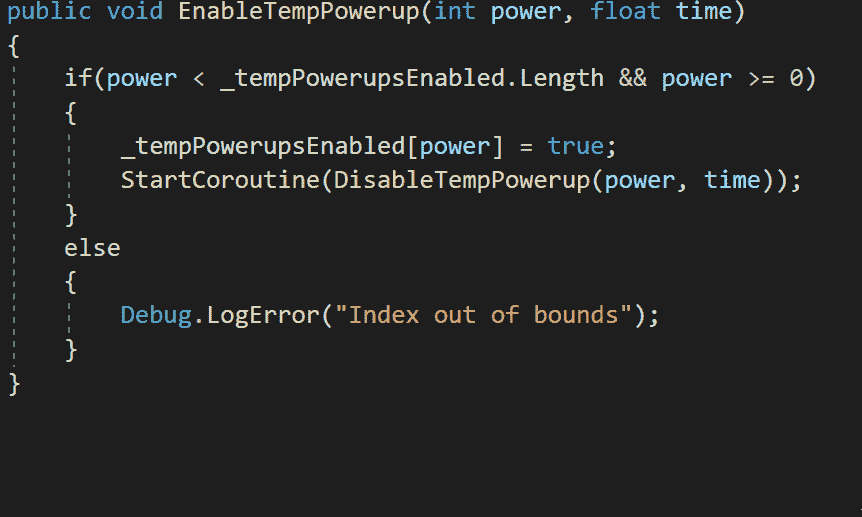

我决定对单次加电使用 switch 语句，因为我可能会在游戏中有 3 次以上的临时加电，不需要每一帧都检查。

然后，让我们在协程中添加另一个 switch 语句，它将处理临时加电，而不需要像三倍镜头那样每帧检查一次:

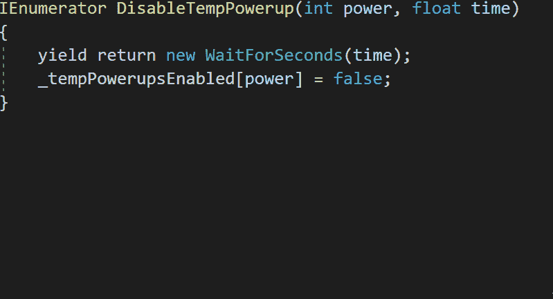

这样，速度提升将使播放器的速度倍增，然后在我们作为参数从启动脚本发送的 5 秒钟后除以它。

# 产生随机加电

此外，现在我们有一个以上的权力，让我们打开产卵管理器脚本和随机项目产卵。首先，将单个预置变量更改为一个新数组，以保存所有加电的预置:

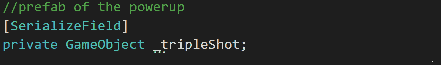

然后，在检查器的 spawn manager 脚本组件中拖动启动项目的预设:

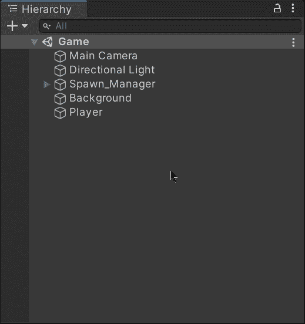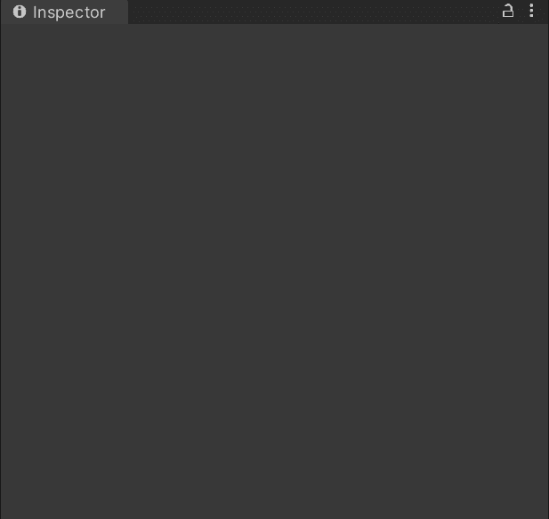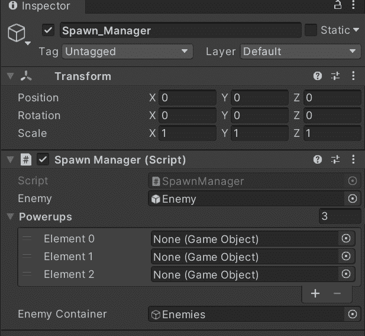

因为我只添加了速度提升物品，所以我暂时留下了一个空的预制空间。

现在，使用一个随机索引，用预置的数组改变三镜头预置实例化:

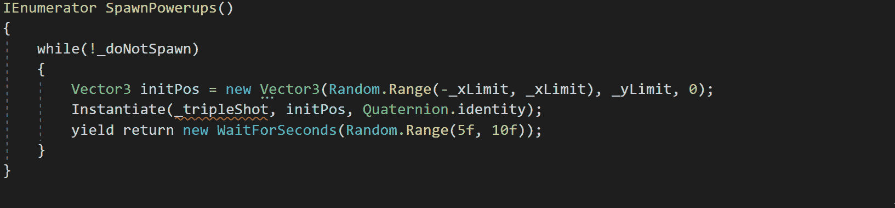

这样，游戏中每 5 到 10 秒就会出现一个新的随机加电实例。

最后，正如我们在[上一篇](/nerd-for-tech/animating-sprites-in-unity-9d02762bde96)中所做的，让我们用各自的精灵来制作速度提升的动画:

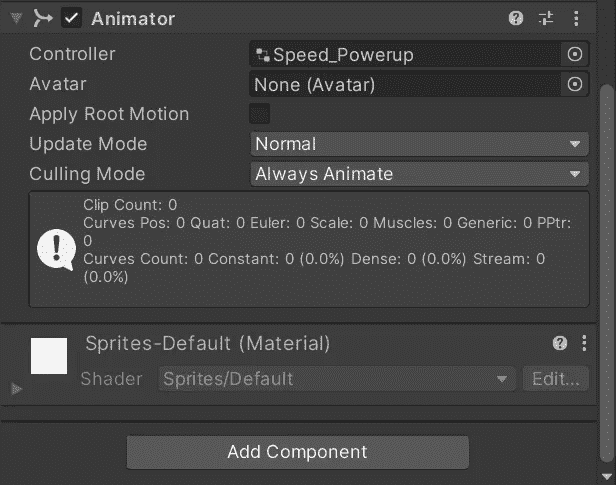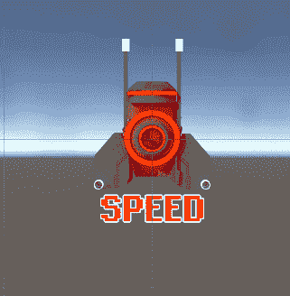

现在，当我们在 Unity 中运行游戏时，我们将会看到速度提升和三倍拍摄功能如预期一样工作:

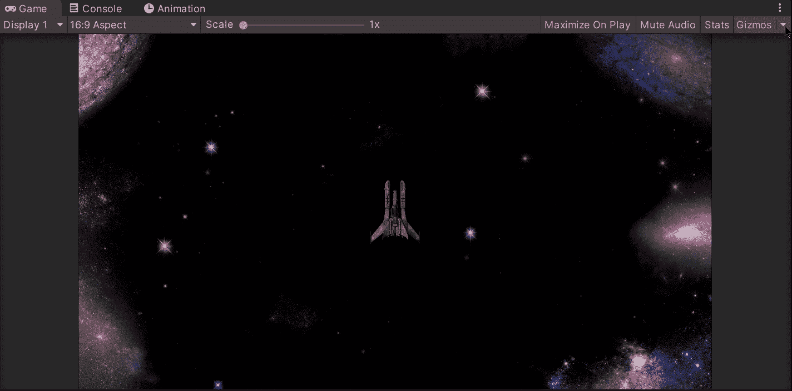

就是这样，你可以在 Unity 中为你的游戏创建一个模块化的加电系统！:d .下一篇文章再见，我将展示如何在 shield 加电实现中使用 switch 语句。

> *如果你想更多地了解我，欢迎登陆*[***LinkedIn***](https://www.linkedin.com/in/fas444/)**或访问我的* [***网站***](http://fernandoalcasan.com/) *:D**