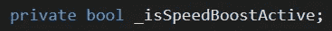
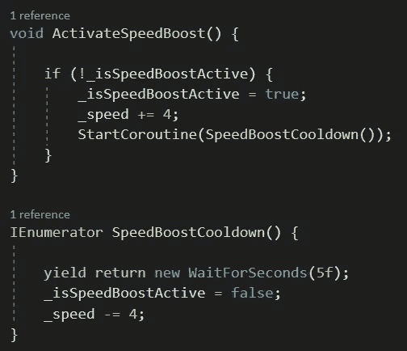
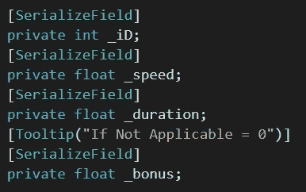
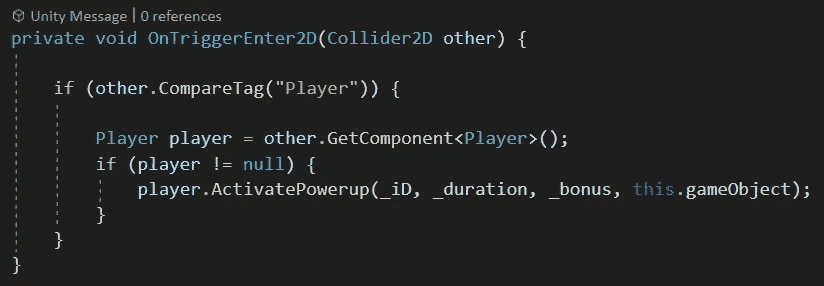
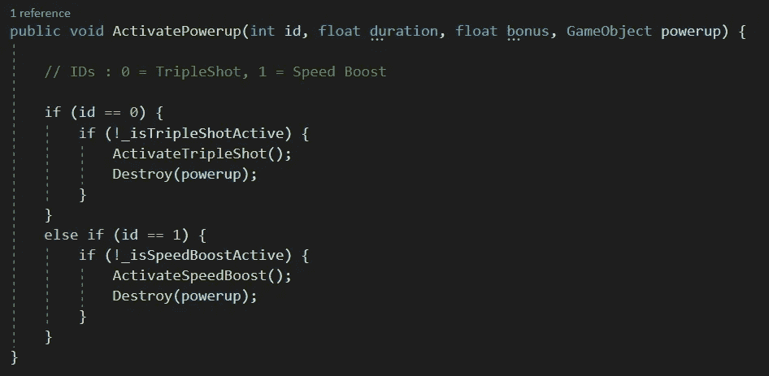
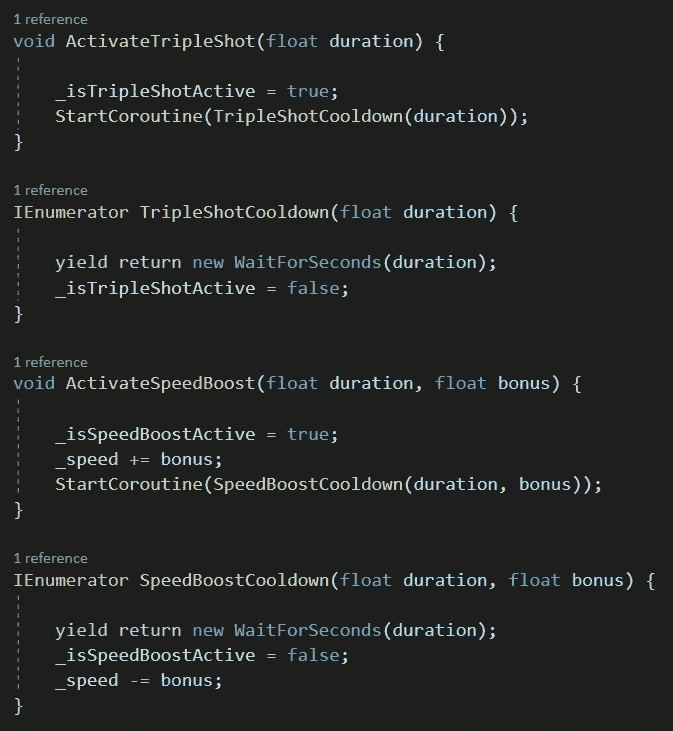
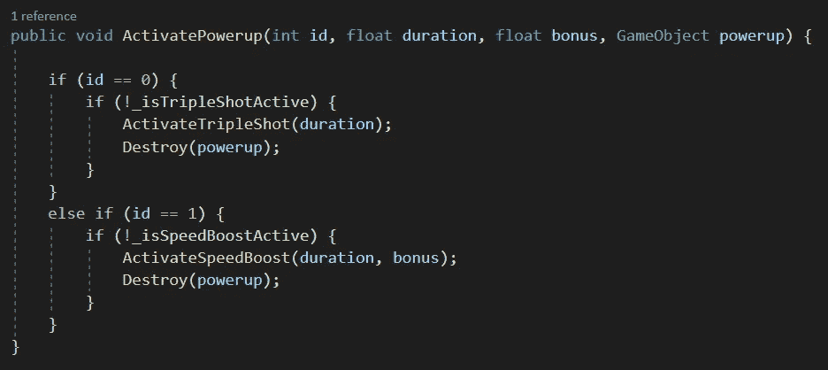

# 在 Unity 和 C#中创建模块化加电系统

> 原文：<https://medium.com/nerd-for-tech/creating-a-modular-powerup-system-in-unity-and-c-1c0c9d1538e3?source=collection_archive---------6----------------------->

在[之前的一篇文章](https://thestreetdev.medium.com/creating-a-powerup-ecfd88a1fbc5)中，我讲述了为玩家的武器系统创建能量的步骤。然而，这是一个非常低效的方法，因为它不是非常灵活或适应性强。我的意思是，我们需要为我们创建的每个新的启动创建一个新的脚本。

在这篇文章中，我将着眼于修改我们现有的脚本，使我们能够为球员创造新的动力，而不需要任何新的脚本。这将需要考虑你可以在你的游戏中增加什么样的能量，以及对我们的代码结构进行一些改变来实现这种灵活性。

*注意:正如编码中的所有事情一样，有许多方法可以得到想要的结果。本文演示了一种实现这一点的方法，即通过播放器脚本管理一切，并使加电脚本非常简单。*

让我们来看看如何提高速度

首先，让我们给我们的玩家脚本增加一个速度提升的功能

我们新电源的开关

新的激活/停用方法

有了这几行代码，我们的玩家已经准备好使用加速启动了，但是还有更多的事情要做(见我的[上一篇文章](https://thestreetdev.medium.com/animating-sprites-in-unity-8221ac4f127)为启动设置动画视觉效果)。

为了让相同的加电脚本用于所有的加电，我们需要修改激活不同加电的方式。

为了能够区分使用相同脚本的不同加电，我们需要添加一个可识别的参考(一个 ID)，每个加电也可以有不同的持续时间，并且每个加电可以添加一个设置的奖励效果。在这种徒劳的情况下，我们需要在我们的加电脚本中添加一些变量(我们已经有了控制加电在屏幕上下降速度的速度变量)

附加加电变量

将“这个”启动的信息传递给我们的玩家

回到播放器脚本，我们需要添加一些代码来过滤并找出哪个 powerup 刚刚被收集，而不是从 powerup 脚本中调用特定的 powerup 方法—

确保正确启动的新方法

在这里，在检查加电是否已经激活之后，破坏加电意味着我们只有在能够激活它的情况下才‘拾取’加电。

由于我们已经传递了收集到的所有通电相关信息，让我们通过调整通电激活方法来利用这些信息——

使用来自加电传递的变量的信息

最后一个变化是确保变量被传递到上面的方法中

确保我们传递与调用的激活方法相关的信息

以这种方式激活加电允许我们只需要向播放器添加功能，而不需要为每个新的加电添加新的脚本。即插即用电源，如果你愿意…

*注意:给出信息并不意味着必须使用它，也就是说，奖金变量不用于三连拍加电，因为它只打开/关闭*