# 创建模块化航路点系统| Unity

> 原文：<https://medium.com/nerd-for-tech/creating-a-modular-waypoint-system-unity-49cf6dc6e430?source=collection_archive---------3----------------------->

## 统一指南

## 关于如何在 Unity 中创建模块化航路点系统的快速指南

目标:创建一个模块化的路点系统来统一移动 NPC。

在上一篇文章中，我介绍了[如何在 Unity 中使用动画系统来制作玩家](/nerd-for-tech/using-the-animation-system-unity-d80c8be71f87)的动画。现在，是时候创建一个模块化的路点系统，让 NPC(不可玩的角色)跟随一条统一的路径。

# NPC

在当前场景中，我们有一些 NPC，如果他们看到它，他们会识别玩家。这些 NPC 是 3 个守卫，周围有一些陈列柜:

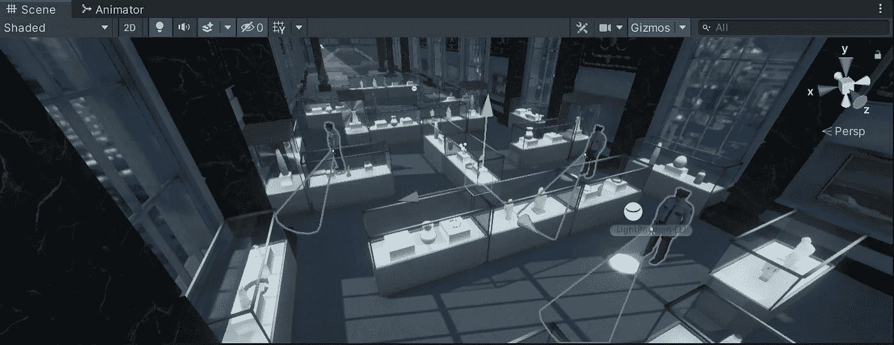

如果你关注了我的上一篇帖子，你会记得我们已经使用了一个 ***导航网*** ***代理*** 来移动玩家。这是我们已经在场景中烘焙过的 **NavMesh** :

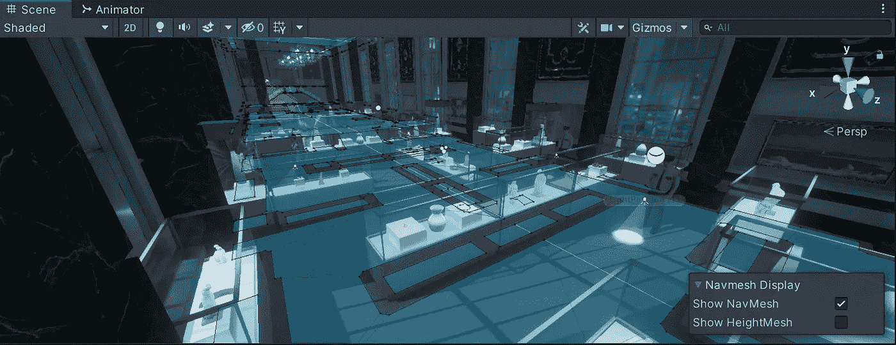

因此，为了通过地板路径移动 NPC，让我们为它们添加一个 ***导航网格代理*** 组件:

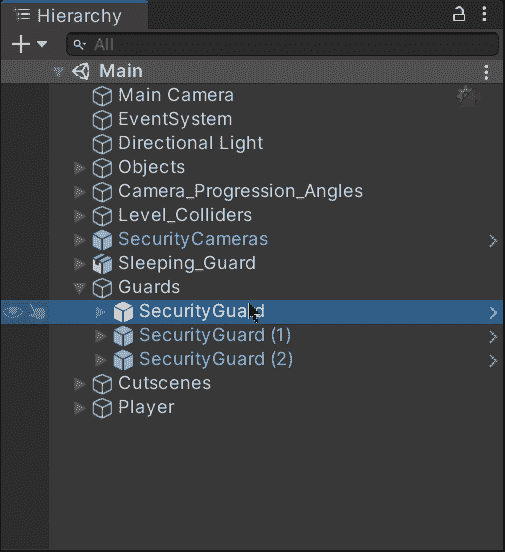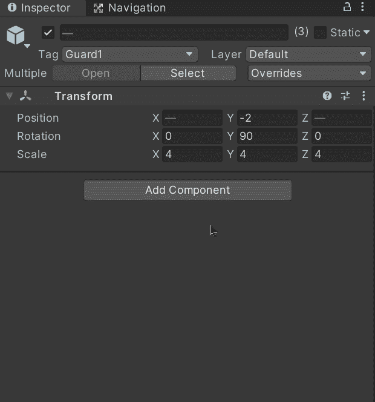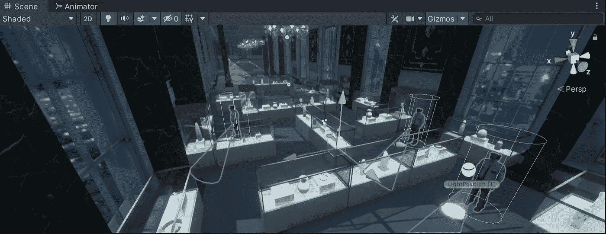

然后，让我们给它们添加下一个组件:

*   新脚本

使用模块化系统处理航路点的移动。

*   碰撞机

为了触发碰撞，我们需要检测路径点。别忘了启用 ***是触发*** 属性。

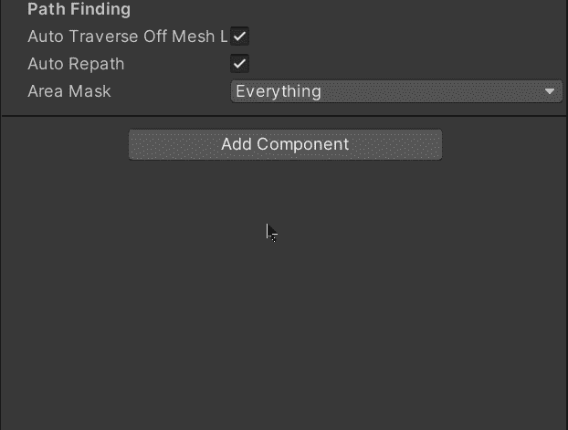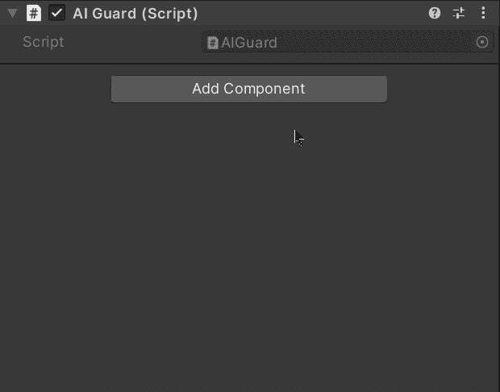

# 路标

现在，为了避免在创建将定义路径的路点时出现混乱，让我们创建一个新的空游戏对象来存储它们:

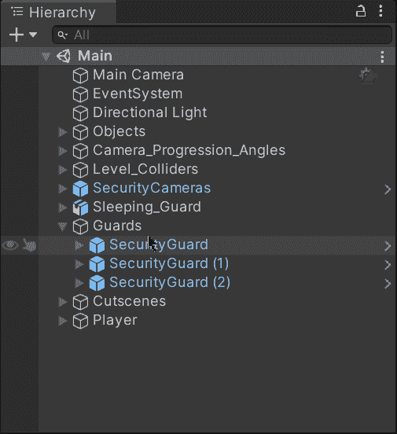

然后，让我们创建一个新的空对象来代表我们的第一个航点。创建完成后，让我们将游戏对象移动到各自守卫将要移动到的第一个位置:

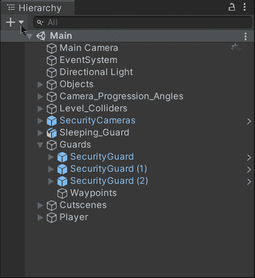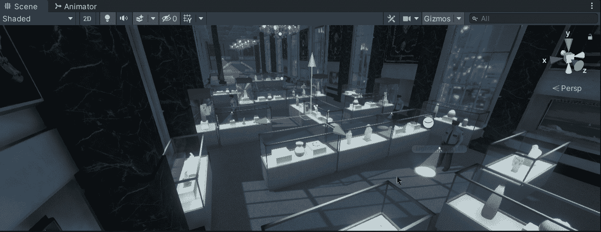

现在，让我们将各自的组件添加到航路点:

*   碰撞机

该组件将允许在与 NPC 的碰撞中检测到航路点。不要忘记启用 ***是触发*** 属性。

*   刚体

这个组件将允许检测与其他有碰撞器的游戏对象(如 NPC)的碰撞。不要忘记禁用 ***使用重力*** 属性，以免重力影响航路点。

> 注意:我们也可以把刚体放在 NPC 中来检测碰撞，而不是把它添加到航路点中。

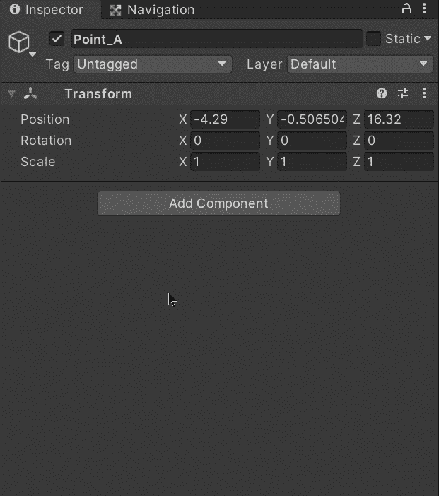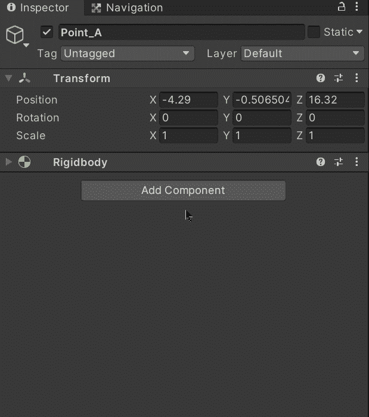

然后，让我们在场景中添加更多的路点来定义 NPC 应该遵循的路径:

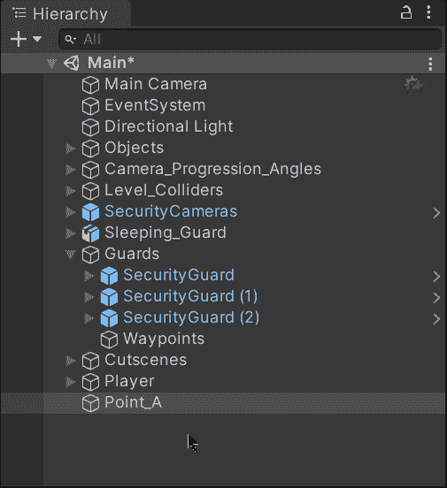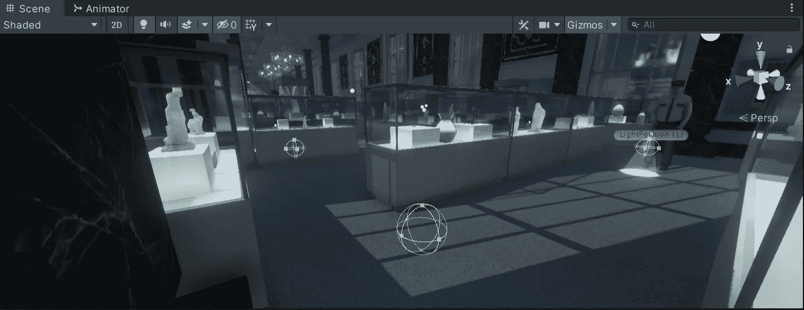

最后，让我们为航路点游戏对象创建并选择一个新标签:

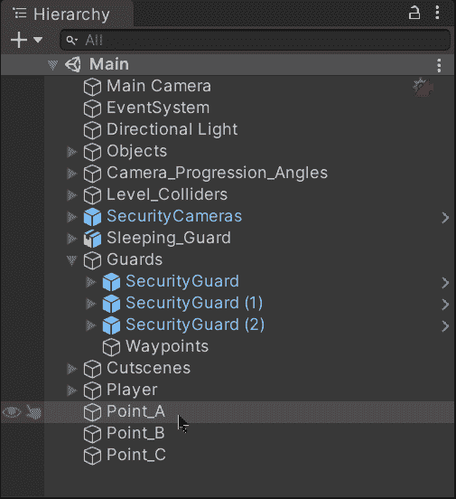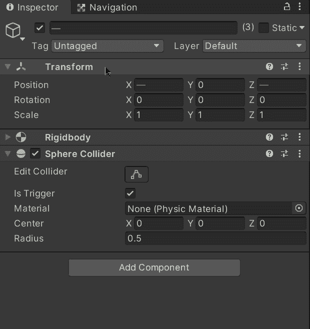

# 模块化系统

现在，为了创建模块化的航点系统，让我们打开之前附加到 NPC 上的新 **AIGuard** 脚本。当我们使用 ***导航网格代理*** 来移动 NPC 时，我们需要将 AI 名称空间添加到我们的脚本中:

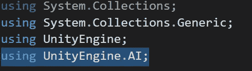

然后，让我们创建:

*   导航代理

此变量将存储对附加到 NPC 的 ***导航网格代理*** 组件的引用。

*   航点

该列表将存储定义 NPC 将遵循的路径的路点的不同变换组件。转换组件应该从路径的第一个到最后一个路点排序。不要忘记使用**【串行字段】**来通过检查器定义路径点。

*   目标

该整数变量将存储 ***导航网格代理*** 要到达的当前目标(在航路点列表内)的索引。

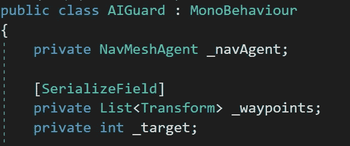

现在，让我们将各自的路点按顺序拖到第一个 NPC:

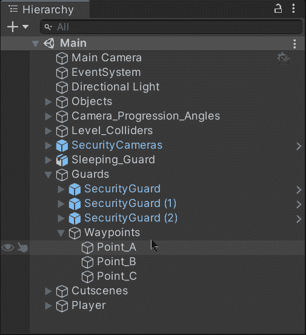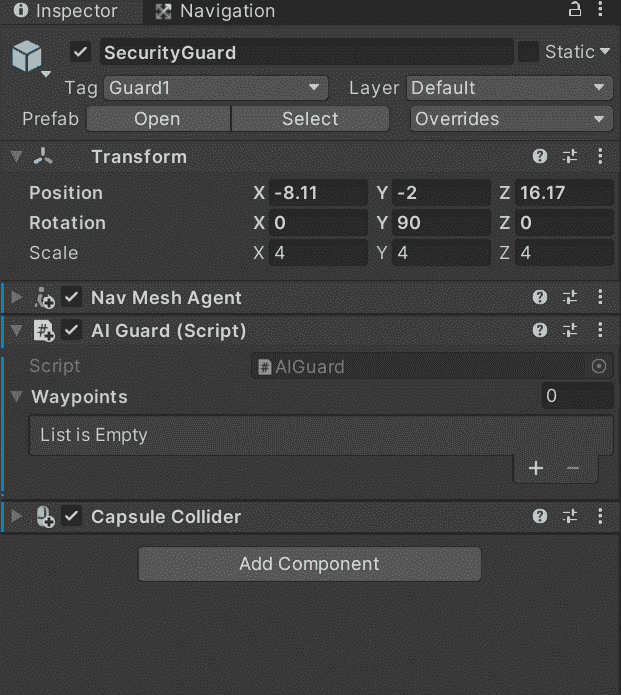

接下来，在 **Start** 方法中，让我们通过使用 **GetComponent** 方法用 ***Nav Mesh Agent*** 初始化变量。然后，让我们验证航路点列表是否包含至少两个元素，并且第一个元素不为空。如果是这样的话，让我们将 ***导航网格代理*** 的目的地设置为第一个变换位置:

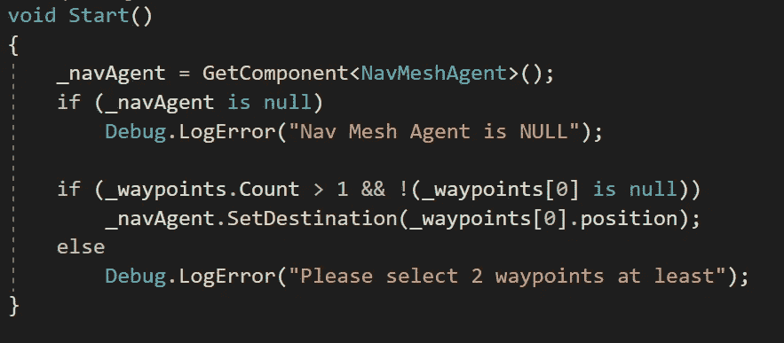

这样，NPC 将前往第一个航路点。

现在，为了检测与航路点的触发碰撞，让我们使用 **OnTriggerEnter** 方法，并使用各自的标签检查另一个碰撞器是否属于某个航路点:

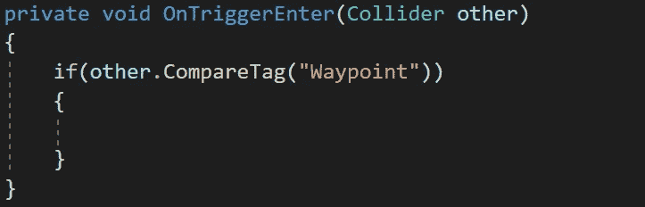

如果检测到一个航路点，让我们给目标变量添加一个单位，指向列表中的下一个航路点。

然后，让我们检查目标是否指向列表中不存在的航路点，如果是，让我们使用**反转**方法来反转列表中航路点的顺序，并定义新目标(倒数第二个航路点)。

这样，NPC 将从最后一个航路点到第一个航路点(并向后)一遍又一遍地遵循相同的路径:

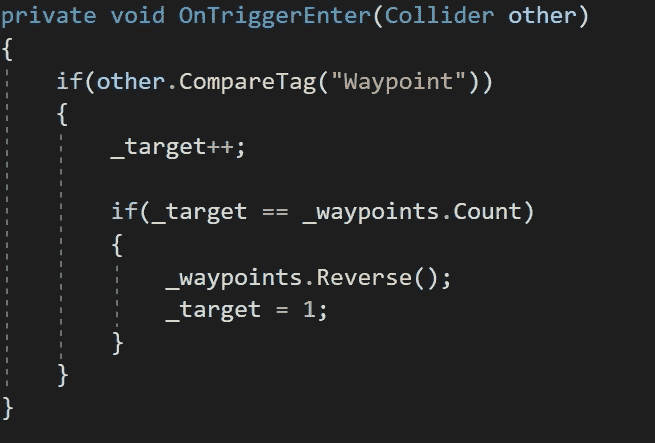

最后，让我们检查用目标变量定义的航路点在列表中是否不为空，并将其设置为 ***导航网格代理*** 的新目的地:

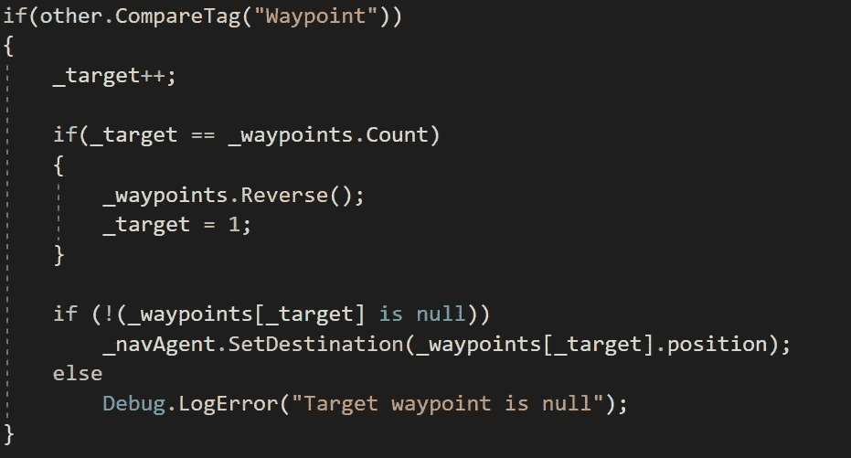

现在，如果我们在 Unity 中运行游戏，我们会看到 NPC 一遍又一遍地沿着由路点定义的路径前进:

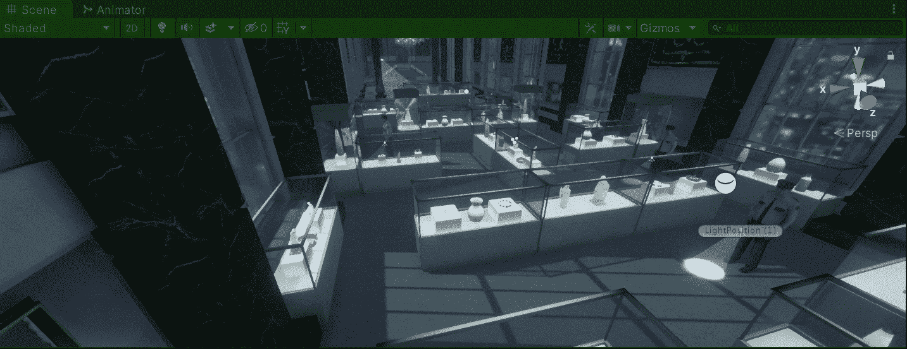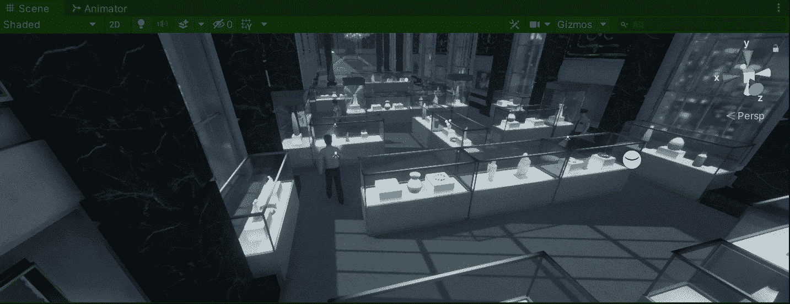

这样，我们就可以在游戏中与其他 NPC 使用相同的脚本和更多的路点。

就这样，我们在 Unity 中创建了一个模块化的航点系统！:d .我会在下一个帖子中看到你，在那里我会展示如何让 NPC 看到玩家的团结。

> *如果你想更多地了解我，欢迎登陆*[***LinkedIn***](https://www.linkedin.com/in/fas444/)**或访问我的* [***网站***](http://fernandoalcasan.com/) *:D**