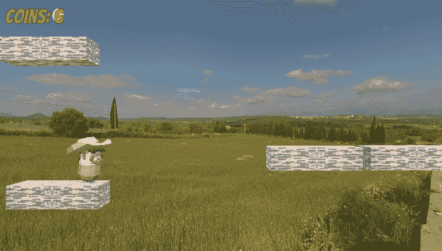
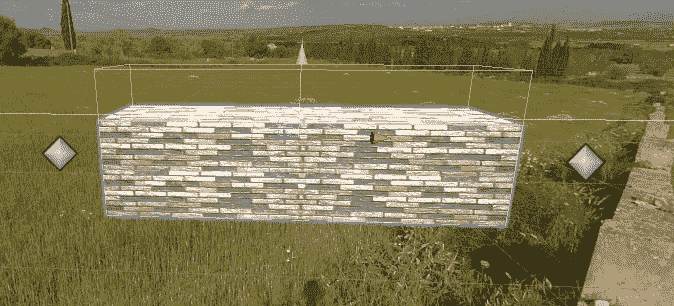
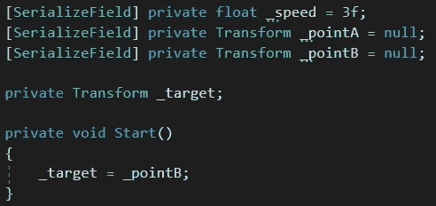
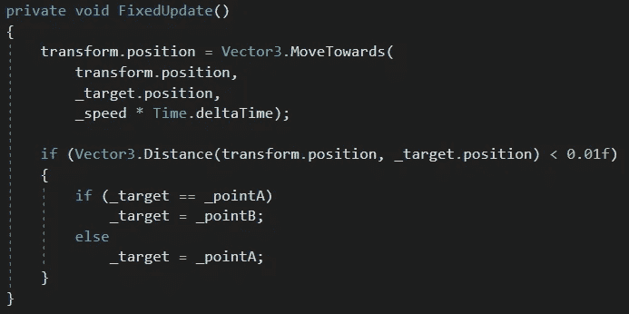

# 创造一个移动平台

> 原文：<https://medium.com/nerd-for-tech/creating-a-moving-platform-ac53487f9498?source=collection_archive---------22----------------------->

**目标:**打造一个在两点之间移动的平台。

我们将首先给我们的平台增加一个*对撞机*。这个仅用于检测玩家何时站在平台上，并检查其*是否触发*属性。它会垂直偏移一点。

我们还将创建两个空的*游戏对象*，它们只有*转换*组件。这些将是平台将在其间移动的点。他们在游戏中是不可见的，但是我们会给他们灰色的图标，这样我们就可以在场景视图中看到他们。

现在我们将创建脚本。我们将把我们的空游戏对象分配给 *_pointA* 和 *_pointB* 。在 *Start* 方法中，我们将把 *_pointB* 指定为我们的第一个目标。(因为我们将让平台从与 *_pointA* 相同的位置开始， *B* 比尔是我们的第一个目标。)

接下来，我们将使用*固定更新*方法。这种方法可以用于物理学，防止事情变得“神经过敏”首先，平台将从其当前位置向目标位置移动。接下来，它将检查从其当前位置到目标位置的距离是否小于一个非常小的数字。如果是的话，我们已经到达了我们的目标。如果目标是点 A，新的目标将是点 B，反之亦然。

现在我们将寻找我们的球员。如果玩家触摸触发碰撞器，玩家将成为我们平台的*子*，随其移动。玩家一离开(退出)碰撞器，玩家的父代就被设置为 *null* ，使其免于被平台移动。

注意，虽然在这个例子中我们让平台水平移动，但是这些点可以放置在任何地方，并且平台将在它们之间沿直线移动。