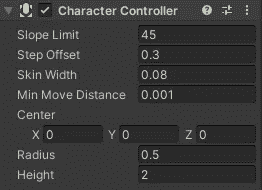
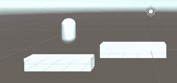
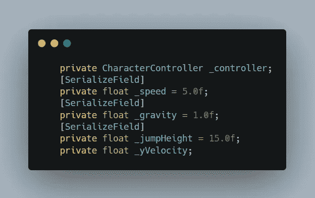
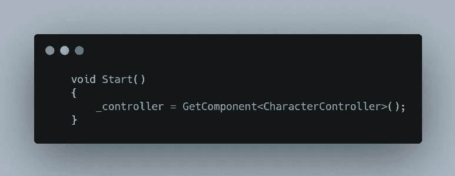
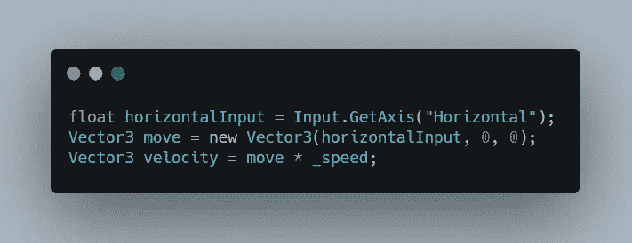
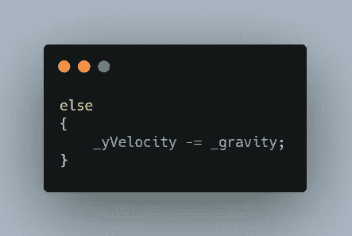
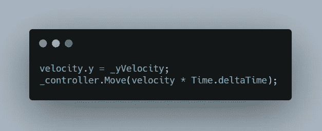
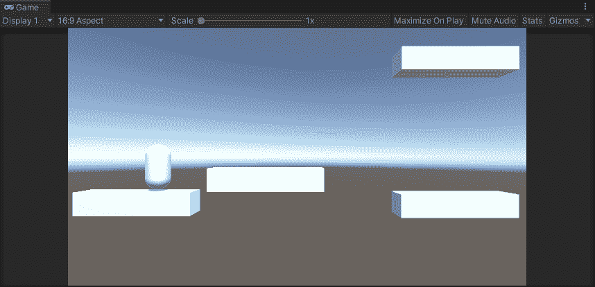

# 在 Unity 中创建基于物理的角色控制器

> 原文：<https://medium.com/nerd-for-tech/creating-a-physics-based-character-controller-in-unity-f1e3b025eb42?source=collection_archive---------4----------------------->

2.5D 游戏开发

有很多方法可以控制你的角色，但是总有一个共同点，那就是刚体，碰撞器等等。但是，当团结给了我们一个笔直前进的平台时，为什么还要走长路呢？

我们可以在我们的角色中添加角色控制器组件，它将处理我们角色的所有碰撞。它为我们提供了各种属性，如斜率限制、步长偏移、半径、高度等，可用于进一步配置我们的控制器，以满足我们的需求。

我们添加了一个角色控制器，但是如何移动它呢？

让我们首先创建一个平台，让我们的玩家可以移动和跳跃。

在你的场景中添加一个胶囊游戏对象，它现在就是你的玩家了。为玩家增加移动和跳跃的平台。现在要配置播放器，从播放器中移除胶囊碰撞器组件，并在它的位置添加角色控制器组件。

现在你的玩家已经在你的场景视图中设置好了，让我们写一些代码来让玩家移动。创建一个玩家脚本，让我们开始吧。

现在让我们在脚本中定义一些变量。首先定义一个角色控制器变量来访问 player 中角色控制器组件的属性。然后定义玩家移动的速度变量和让玩家在空中下落的重力变量。最后，添加一个变量来存储 player 的跳转值，并添加另一个浮点变量来存储 y 速度，我们将在后面讨论。

现在，在 start 方法中获取对播放器中角色控制器的引用。

现在存储一个输入浮动，检测' A '，' D '或'左箭头键'，'右箭头键'按下，并创建一个新的向量移动，使球员可以在那个方向移动。

然后定义速度，简单的说就是以一定的速度向一定的方向运动。

现在使用角色控制器的 isGrounded 特性检查玩家是否与地面碰撞。如果玩家在地面上，如果玩家点击空格键，然后定义 y 速度脚本的跳跃高度。

如果玩家在空中，那么定义重力，重力会把玩家拉向地面。

现在，将 y 轴上的速度设置为 _yVelocity 变量，该变量应用了跳跃和重力值。

然后使用相对于时间有速度的移动方法移动你的玩家。

这是它在游戏视图中的样子。