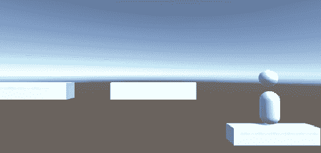
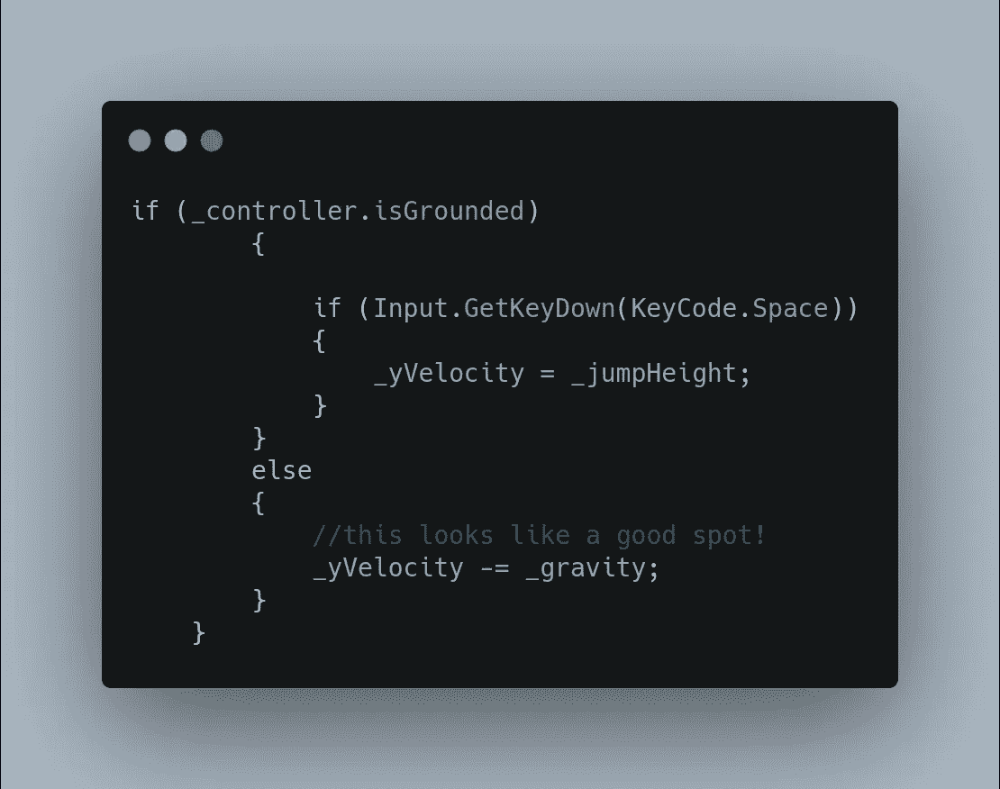
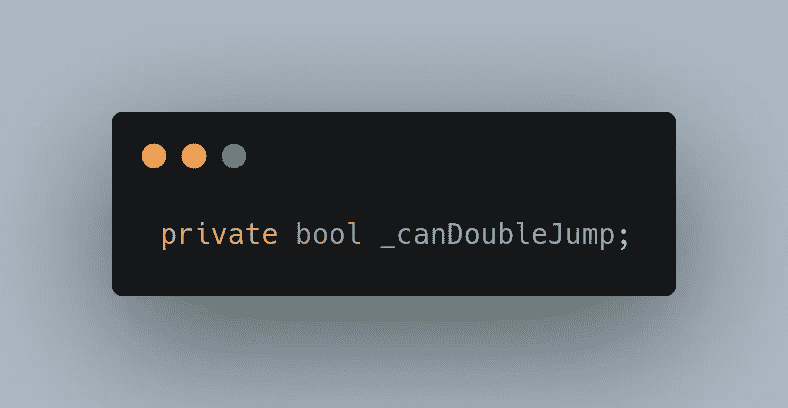
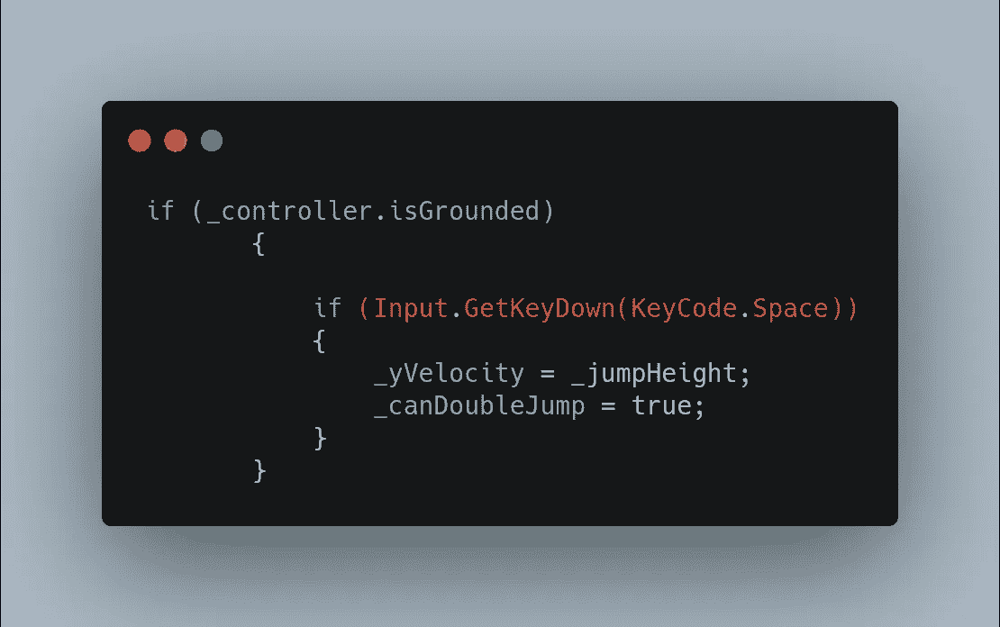
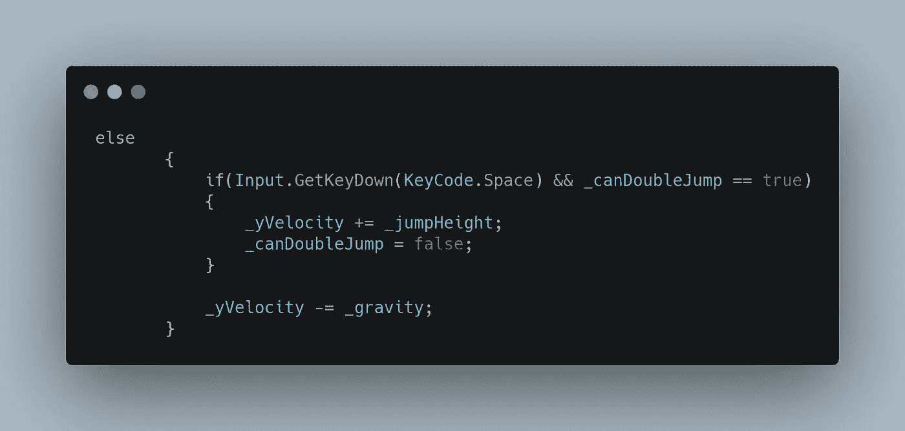

# 创建一个基于物理的角色控制器——第 4 部分——双跳！

> 原文：<https://medium.com/nerd-for-tech/creating-a-physics-based-character-controller-part-4-double-jump-f1adf0ecc054?source=collection_archive---------19----------------------->

所以昨天我们学会了如何跳跃，现在我们将力量加倍！

所以首先我们需要弄清楚我们可以在哪里进行第二次跳跃尝试:

因为我们检查了第一个 if 语句，所以一旦我们通过了那部分代码，在 else 语句中再检查一次是有意义的。我们需要一个新的变量 _canJump 来确保我们只允许玩家跳一次。

接下来，在我们最初的跳转代码中，我们将 _canDoubleJump 设置为 true，从而为双跳转优点提供了可能性！

所以在你跳完之后，它会自动默认为 else，在这里你会再次检查，所以如果你按了空格键并且 _canDoubleJump 为真，那么把 jumpHeight 加到当前的 jumpHeight，就这样。将 _canDoubleJump 设置为 false，这样你只能跳一次，当你再次跳跃时，它将变为 true，但这只发生在你落地时，所以一切都解决了！

下一次，我们将谈论收藏品！