# 创建基于物理的角色控制器| Unity

> 原文：<https://medium.com/nerd-for-tech/creating-a-physics-based-character-controller-unity-6c9f44473526?source=collection_archive---------3----------------------->

## 统一指南

## 关于如何使用 Unity 创建基于物理的角色控制器的快速指南

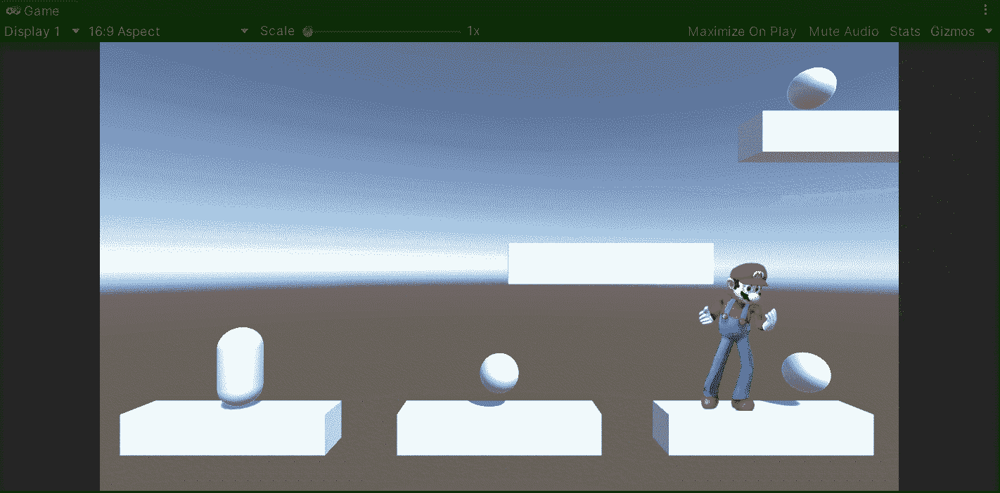

目标:创建一个基于物理的角色控制器，而不必在 Unity 中使用刚体。

在上一篇文章中，我谈到了[我和 Unity](/nerd-for-tech/time-for-a-new-project-unity-e6bbd9611224) 正在着手的新的 2.5D 项目。现在，是时候用 Unity 为我的新游戏创建一个基于物理的角色控制器了。

# 当前场景

首先，让我们看一下当前的场景。我们有下一个原始资产:

*   代表玩家的胶囊。
*   5 个修改过的立方体代表要跳跃的平台。
*   3 个球体代表玩家可收集的物品。

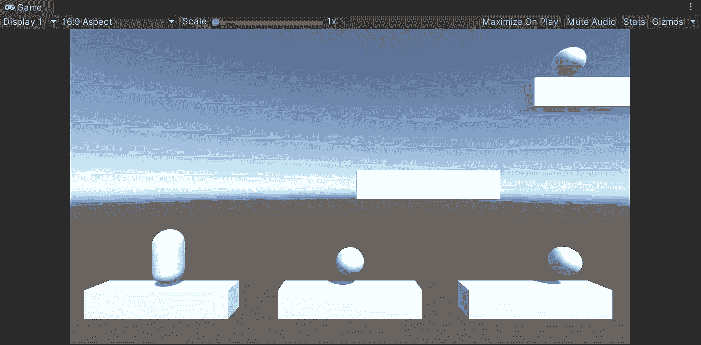

# 创建角色控制器

因此，为了开始开发游戏机制，让我们创建基于物理的角色控制器来控制玩家的动作。为此，让我们从胶囊中去掉胶囊碰撞器(因为我们不需要它)并通过检查器附加一个新的**角色控制器**组件:

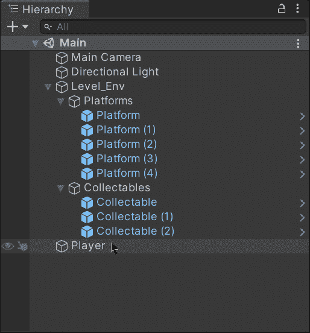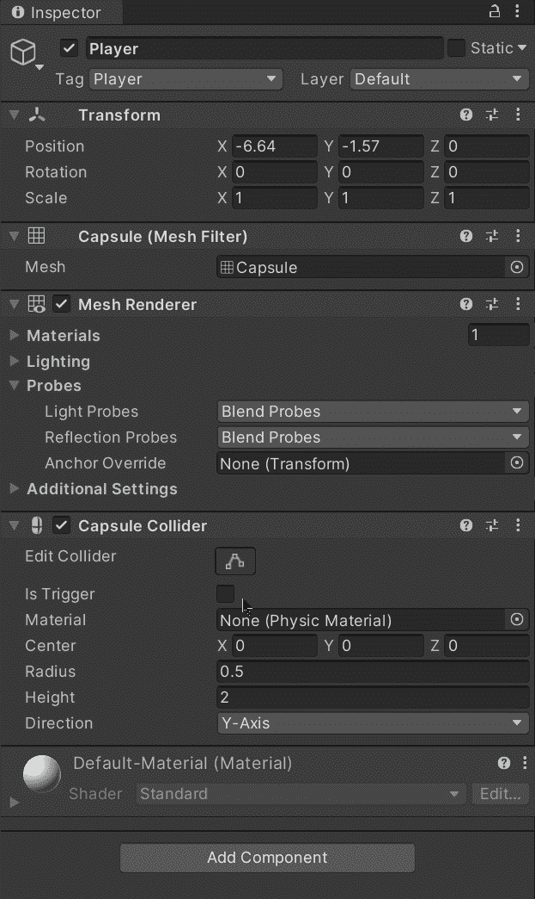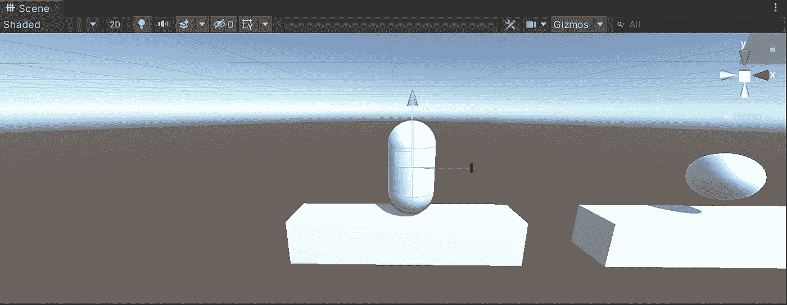

正如你所看到的，角色控制器包含了自己的碰撞器。

# 处理物理问题

现在，为了处理我们自己的物理系统，让我们创建一个新的脚本并附加到播放器上:

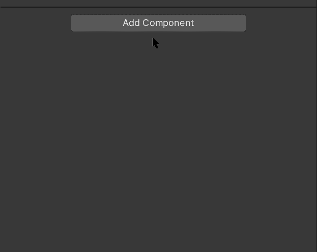

附加后，让我们打开脚本并创建下一个私有变量:

*   速度

这个变量将存储玩家的速度值。

*   重力

该变量将存储重力效果的值，以修改(在每一帧上)玩家的重力脉冲。

*   跳跃高度

这个变量将存储玩家每次跳跃的力量值。

*   重力脉冲

这个变量将存储每一帧中施加在玩家身上的重力脉冲。

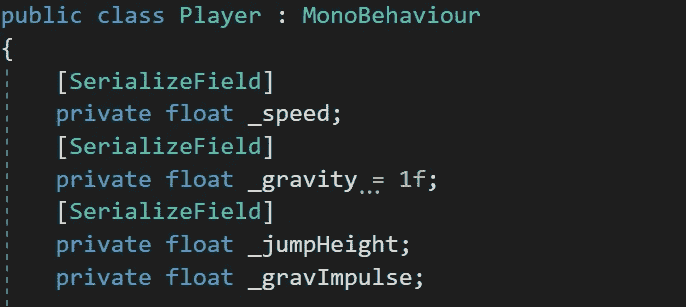

通过使用**【serialize field】**，我们能够通过检查器修改私有值。

此外，创建一个变量来存储对播放器的**角色控制器**组件的引用:

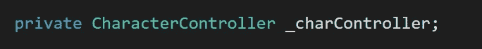

然后，在 **Start** 方法中，让我们使用 **GetComponent** 方法初始化变量，然后检查它是否为空:

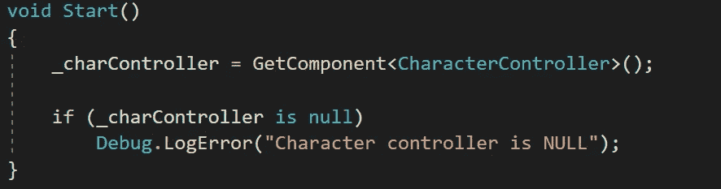

现在，为了处理玩家的移动，让我们在**更新**方法中这样做:

*   使用 **GetAxis** 方法获取水平输入值。
*   将水平输入转换为矢量 3，以表示应用的方向。
*   将速度变量乘以应用的方向，获得矢量 3 值中的速度。

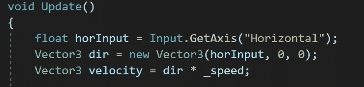

然后，为了处理物理问题，让我们通过使用播放器中的**角色控制器**组件的 ***isGrounded*** 属性来检查播放器是否接触地面:

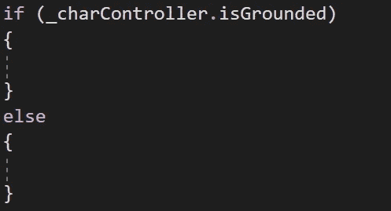

如果玩家接触到地面，让我们检查一下空格键是否被按下。如果是这种情况，让我们将跳跃高度功率值指定给重力脉冲变量:

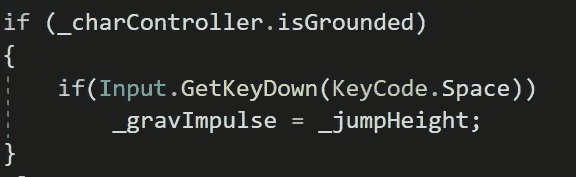

否则，如果玩家没有接触地面，让我们从重力脉冲变量中减去重力值:

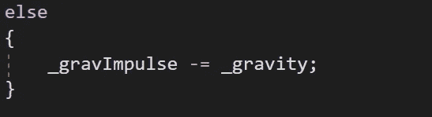

现在，为了应用各自的重力脉冲，让我们将速度的 *y* 值(其中是矢量 3)设置为重力脉冲:

最后，让我们通过将速度乘以**时间.增量时间**值并使用来自播放器的**角色控制器**组件的**移动**方法来平滑地应用速度:

如果您想了解更多关于**角色控制器**组件的信息，您可以查看 Unity 文档:

 [## 字符控制器

### Unity engine/Inherits from:Collider/建议更改感谢您帮助我们提高 Unity 的质量…

docs.unity3d.com](https://docs.unity3d.com/ScriptReference/CharacterController.html) 

# 测试物理

现在，为了测试应用于我们播放器的物理特性，我们可以通过检查器修改各自的变量值:

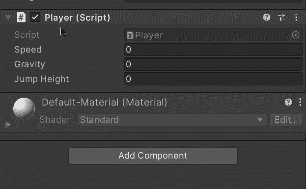

如果我们用 Unity 运行游戏，我们会看到物理被应用到我们的玩家的角色控制器，以在场景中移动:

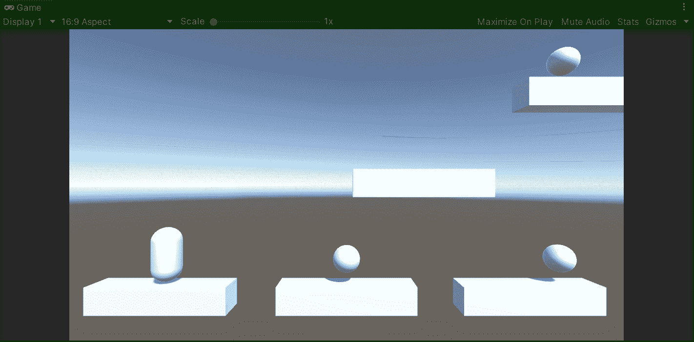

就这样，我们用 Unity 创建了一个基于物理的角色控制器！:d .我会在下一篇帖子中看到你，在那里我将展示如何用 Unity 实现对玩家的双跳。

> *如果你想了解我更多，欢迎登陆*[***LinkedIn***](https://www.linkedin.com/in/fas444/)**或访问我的* [***网站***](http://fernandoalcasan.com/) *:D**