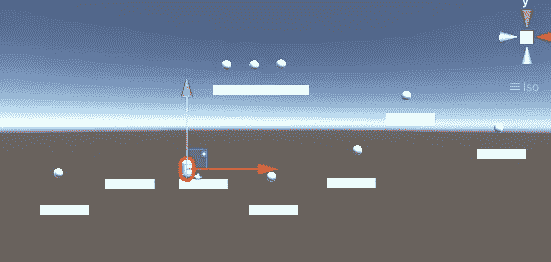
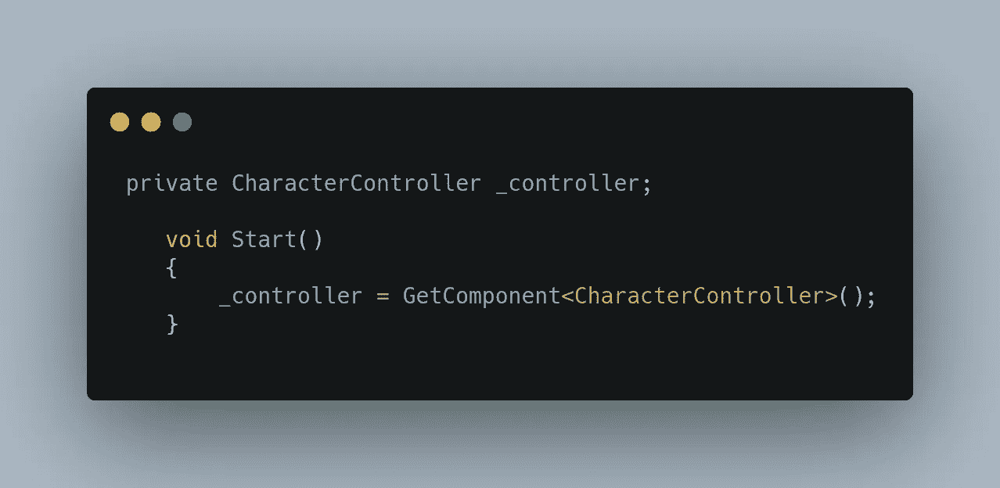
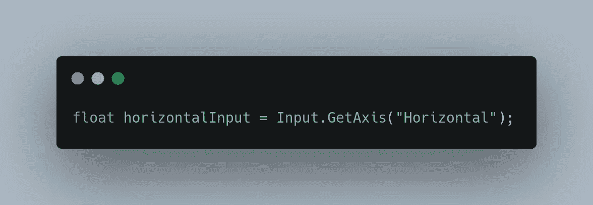
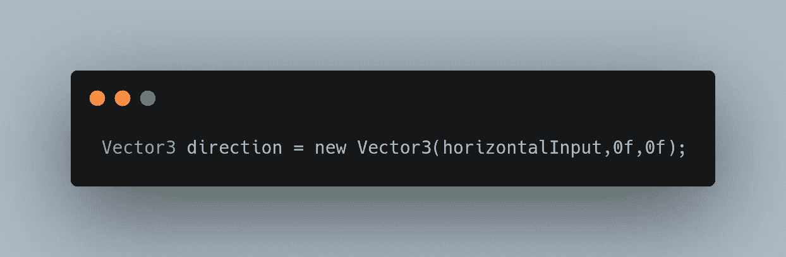
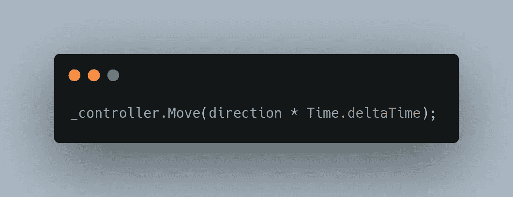
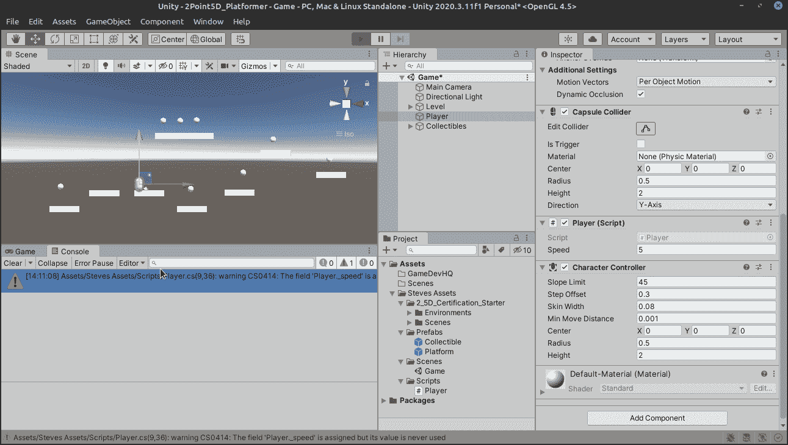
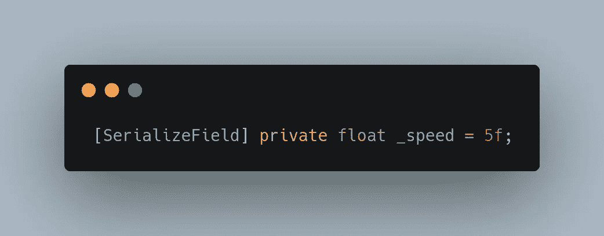
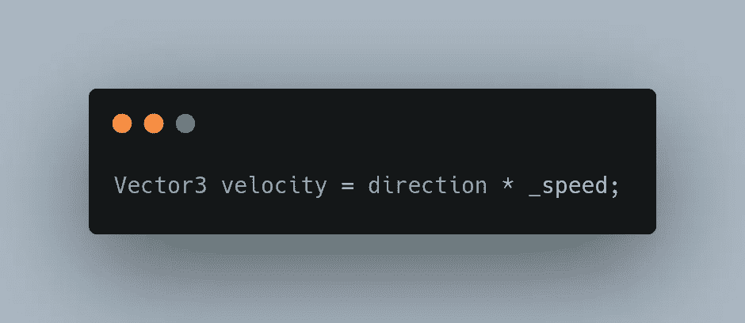
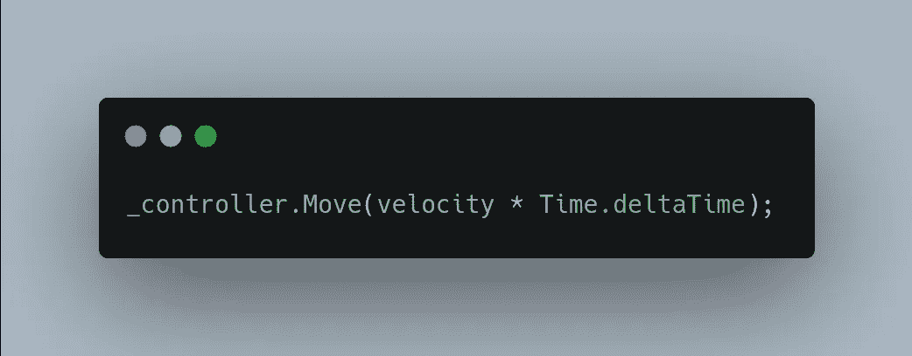

# 在 Unity 中创建基于物理的控制器，第 1 部分

> 原文：<https://medium.com/nerd-for-tech/creating-a-physics-based-controller-in-unity-part-1-6b905279f233?source=collection_archive---------15----------------------->

我们现在有一个简单的球员在一个基本的平台环境中，我们准备让他移动，让我们这样做。创建一个名为“播放器”的脚本，并将其附加到播放器胶囊。

我们需要一种方法来访问我们的角色控制器，所以让我们创建一个容器。

我们准备好摇滚了！我们面临的挑战是获得水平输入，基于该输入定义方向，然后从中制定移动方法。

## 获取水平输入

输入。GetAxis 使用的是 Unitys 内置的控制器，所以我们读取的要么是箭头键，要么是字母 A 和 d。无论如何，这是 Unitys 的经典控制器方法，它将为我们提供需要输入角色控制器移动方法的数据。

接下来，我们把水平输入放入一个方向，或者一个向量 3，你会记得是(x，y，z)轴。所以不管我们的水平输入是什么，方向现在保持在 x 轴上，这恰好是水平的。

最后，我们将方向变量通过它的 holder 变量 _controller 放入角色控制器！只是为了不让我们的速度快得离谱，我们会把它乘以时间。

所以让我们来看看！

真的很慢！我们需要加快速度！

速度的定义是速度*方向，所以用这个定义，我们来做一个新的变量，叫做 _speed。

虽然我们以后可以改变它，让我们设置我们的初始速度为 5 个单位。记住[SerializeField]将使这个变量在 Unity 的检查器中可用，如果你想改变它。

接下来，我们添加一个可变速度，这是我们的速度公式。之后，我们将把它插入我们的运动代码:

太好了！所以让我们来看看区别吧！

好多了！或者更糟，如果你在做海龟模拟器 2k。但我们没有，所以这太棒了！

明天我们将增加一些像重力和跳跃的东西！