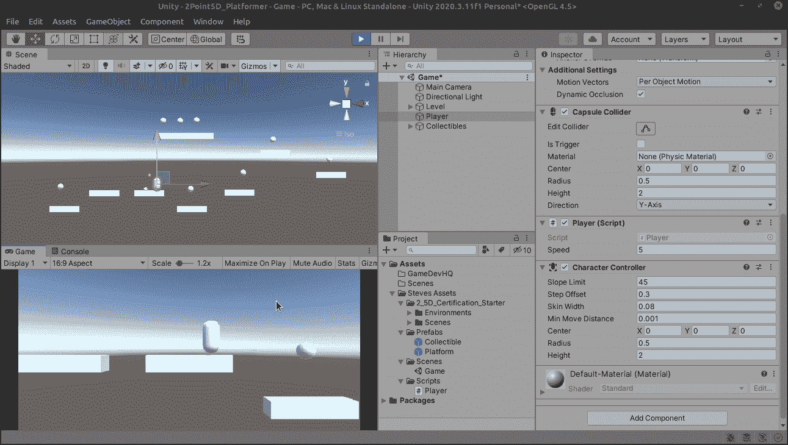
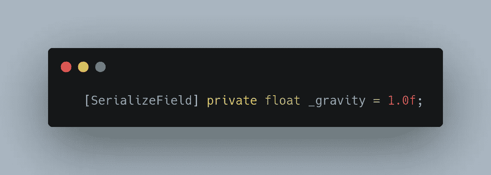
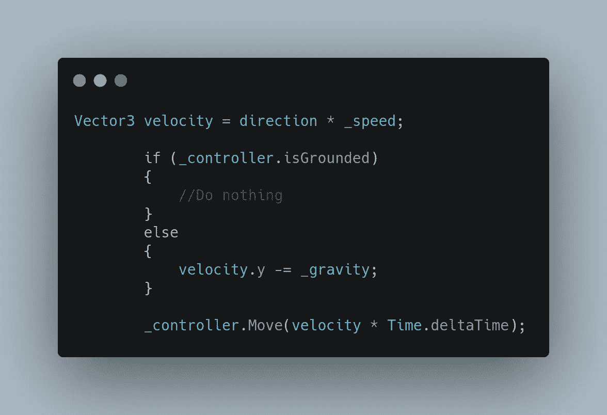
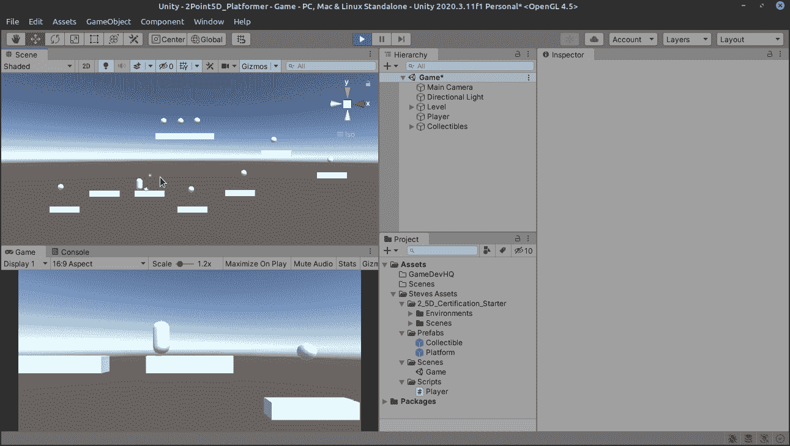

# 在 Unity 中创建基于物理的控制器——第 2 部分，重力

> 原文：<https://medium.com/nerd-for-tech/creating-a-physics-based-controller-in-unity-part-2-gravity-6823aeee59a6?source=collection_archive---------22----------------------->

因此，我们目前有我们的球员移动，这很好，但你会注意到没有重力！让我们加些力把我们的玩家推到其他平台上:

首先，让我们为重力做一个变量。我们现在把它定为 1 个单位，但我感觉我们以后会改变它。

所以在速度被定义为方向和速度之后，在更新方法中，我们将使用内置的 CharacterControllers 进行检查。isGrounded 函数。如果它在地面上，我们什么都不做，但如果它不在，我们从速度的 y 轴上减去重力。

嗯，它的工作，它有点慢，但不要担心。当我们进入跳跃时，事情会变得平稳，我们将在明天讨论！