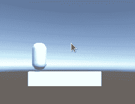
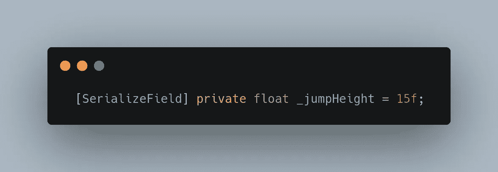
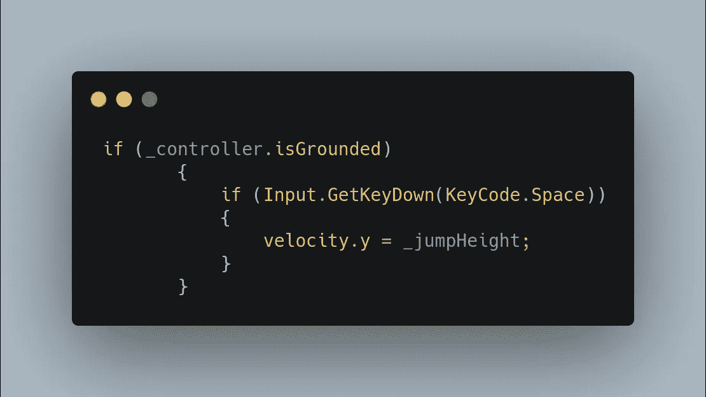
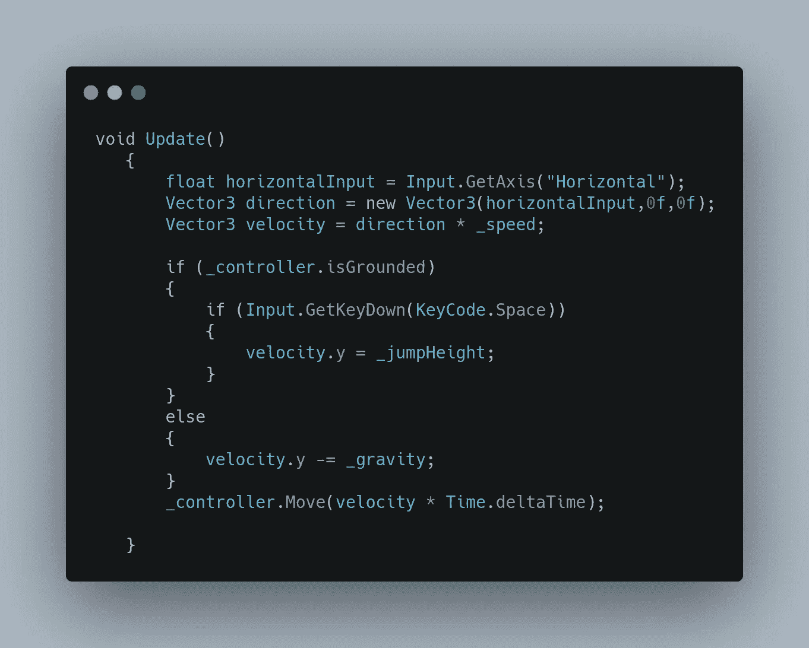
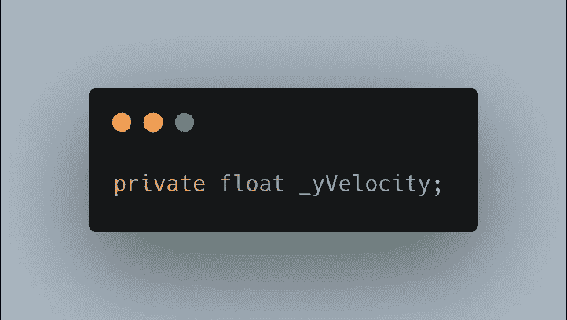
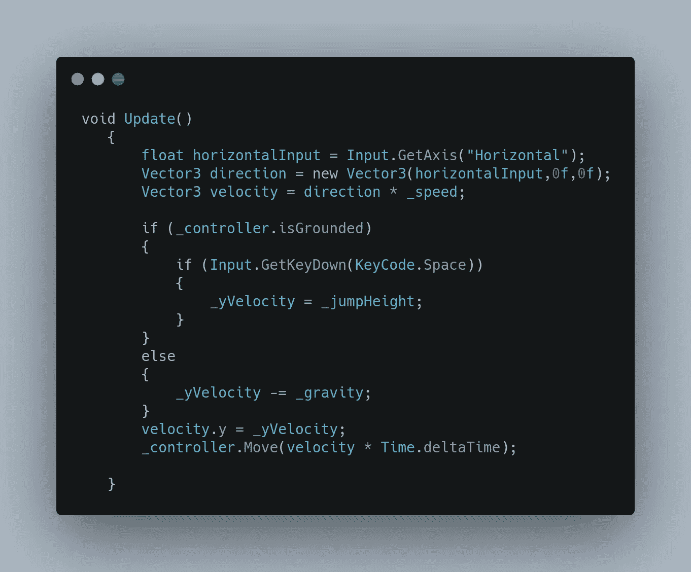

# 创建基于物理的控制器—第 3 部分:跳跃

> 原文：<https://medium.com/nerd-for-tech/creating-a-physics-based-controller-part-3-jumping-7f123cd140d?source=collection_archive---------21----------------------->

你想想，跳不过是往另一个方向掉。至少在团结方面。好的，也许不完全是，但是为了跳跃，我们将在速度 y 轴上加一个正的力。

我们将从创建一个名为 _jumpHeight 的变量开始，我们将用一个任意的数字作为种子。

那我们就去。是从昨天开始的一次全面检查，将 our _jumpHeight 添加到当前速度中。

好的，应该可以了。我们去看看吧！

等一下。这是不对的。为什么它不跳了？

好了，让我们一行一行地检查我们的代码，看看我们是否能发现发生了什么。

*float horizontalInput =输入。GetAxis("水平")；*

好了，这只是得到我们的水平输入。这里什么都没有。

*vector 3 direction = new vector 3(horizontal input，0f，0f)；*

这里，我们定义我们的方向为水平输入，0 表示 y 和 z 轴…啊哈！我们找到罪犯了！我们的 y 在每一帧都是 0。我们可以这样做:

我们将为 y 速度创建一个缓冲区。

然后我们用 _yVelocity 缓冲区替换 velocity 的所有实例，然后将 velocity.y(你已经知道它被清零了)赋给 _yVelocity，我们将有一个有效的跳转！

酷！！！明天我们将把这个推进双跳！到时候见！