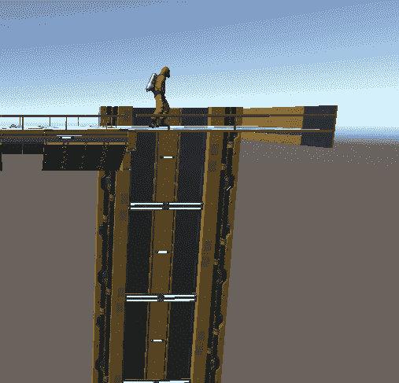
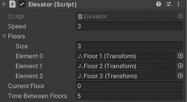
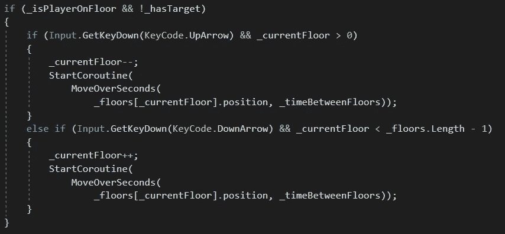
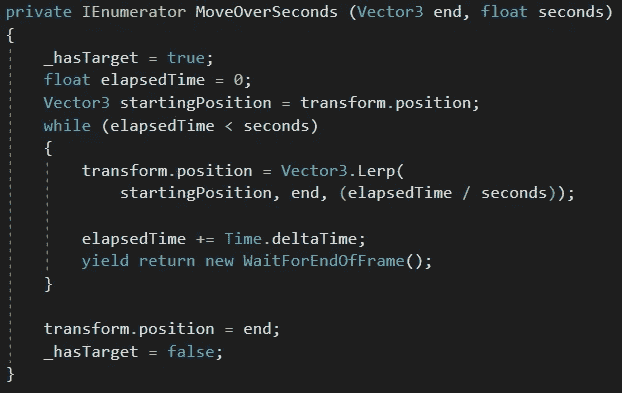
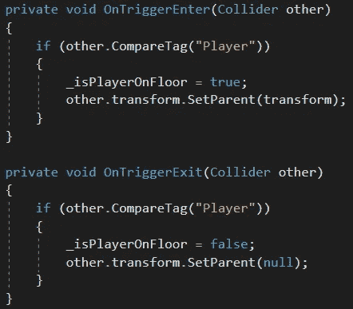

# 创造一个玩家控制的电梯

> 原文：<https://medium.com/nerd-for-tech/creating-a-player-controlled-elevator-9e51631f77d6?source=collection_archive---------21----------------------->

**目标:**创建一个玩家可以用上下箭头控制的电梯系统。

向下…然后向上。

很像我们的移动平台([https://medium . com/nerd-for-tech/creating-a-moving-platform-AC 53487 f 9498](/nerd-for-tech/creating-a-moving-platform-ac53487f9498))，我们希望电梯停靠的楼层将是空的*游戏对象*，只有一个*转换*组件。然而，与只有两个点的移动平台不同，我们将楼层存储在一个*数组*中，所以我们可以想要多少就有多少。

在我们电梯的*更新*功能中，如果玩家在电梯的楼层并且电梯没有当前目标，电梯将检查玩家的输入。

在我们继续之前，我应该提到在下面的设置中，最高的楼层是*元素 0* ，并且下面的每一层*的*增加*1。如果这个系统更适合你自己的想法，你当然可以改变它。玩家将看不到这些——箭头将简单地*工作*。*

如果玩家按了向上箭头，而电梯不在最高楼层，我们将*减少*当前楼层数并启动 *MoveOverSeconds* 协程。

如果玩家按下向下箭头，而电梯不在最低层，我们将*增加*当前楼层数并启动 *MoveOverSeconds* 协程。

*MoveOverSeconds* 协程需要知道我们的 *end* 位置(新的当前楼层的位置)以及电梯换层所需的时间。

当协程启动时，它将 *_hasTarget* 标记为 *true* ，以阻止玩家在电梯移动时向其发出新命令。然后，它启动一个计时器，并记录开始位置(当前位置)。

*当**经过的时间*小于电梯完成移动所需的时间时，它将使用线性插值( *Lerp* )来计算每一帧应该移动的距离。然后，它将更新计时器，并等待当前帧结束。

一旦时间结束，升降机确定它准确地处于其结束位置，并将 *_hasTarget* 设置为 *false* 。现在玩家可以选择一个新的楼层。

最后一点:就像移动平台一样，我们需要让玩家对象在乘坐电梯时成为电梯的*子对象*。

