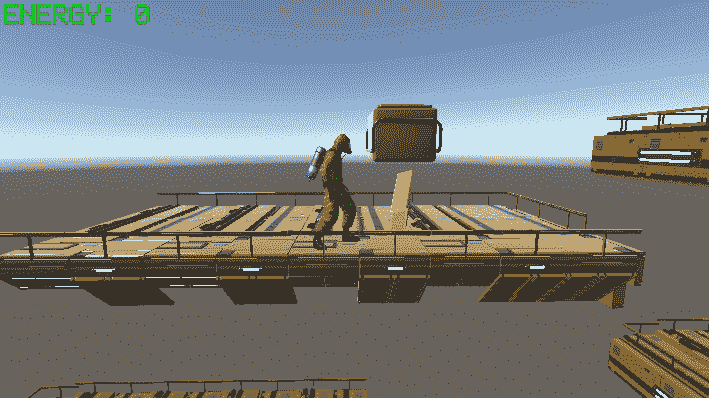
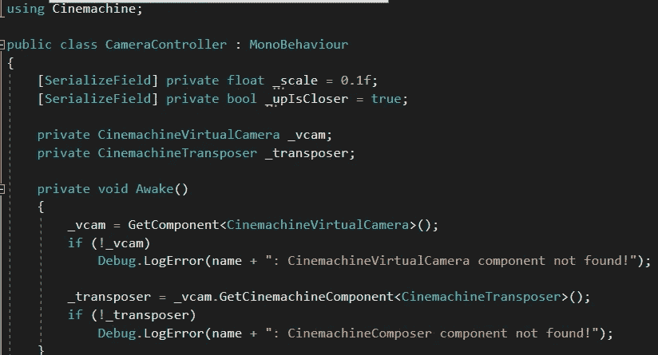
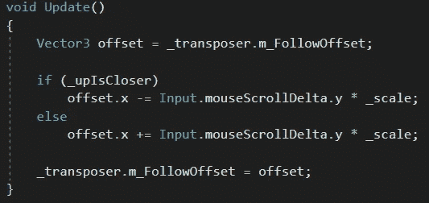

# 创建玩家控制的变焦相机

> 原文：<https://medium.com/nerd-for-tech/creating-a-player-controlled-zoom-camera-8868ac347824?source=collection_archive---------10----------------------->

**目的:**允许玩家用鼠标滚轮控制相机的放大和缩小。

我们首先将一个名为 *CameraController* 的新脚本附加到虚拟摄像机上。我们需要*使用 Cinemachine* 才能访问 Cinemachine 图书馆。然后我们将找到虚拟摄像机组件并缓存虚拟摄像机的 *CinemachineTransposer* 。

在 *Update* 方法中，我们将在 *offset* 中存储置换器的 *m_FollowOffset* 属性的当前值。然后我们将得到鼠标滚轮的*δy*值乘以 or *_scale* (以调整灵敏度)，并将该值放入*偏移*的 *x* 值中。最后，我们将用新的*偏移量*值替换置换器的 *m_FollowOffset* 属性。

如果 *_upIsCloser* 标志为*真*，向上移动滚轮会将摄像机向玩家拉近。将其设置为*假*则相反。我们可以创建一个选项屏幕，玩家可以选择他们喜欢的方式。用户体验非常重要，我们应该给我们的玩家尽可能多的选择！作为一个游戏玩家，我真的很感激我可以自定义我的控制方案！