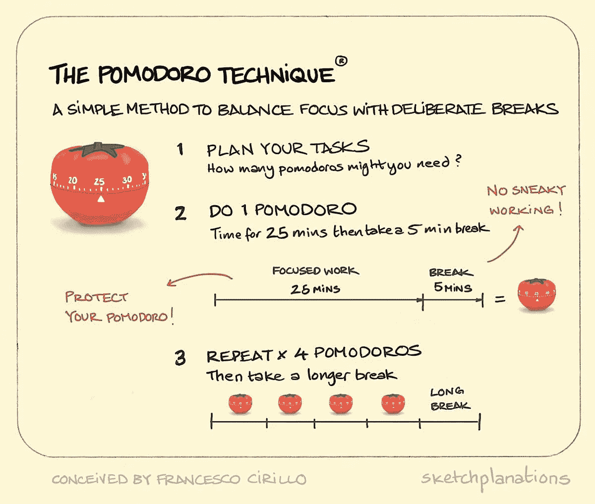

# 使用 Python 中的 Tkinter 创建番茄 GUI 应用程序

> 原文：<https://medium.com/nerd-for-tech/creating-a-pomodoro-gui-app-using-tkinter-in-python-d179e67e0ae0?source=collection_archive---------1----------------------->

番茄工作法是一种有效的时间管理系统。一个人在给定的时刻专注于特定的任务，而不是一心多用。



# **图形用户界面的目标**

我们连续 25 分钟专注于这项任务，然后休息 5 分钟。30 分钟的冲刺时间被称为一个番茄工作法。在 4 个这样的番茄之后，使用者需要休息 20 分钟。

# 构建 GUI 的步骤

1.  导入 tkinter 和数学库
2.  定义全局常数
3.  设置用户界面
4.  构建倒计时机制
5.  构建计时器机制
6.  设置定时器复位逻辑

## 步骤 1:导入 tkinter 和数学库

```
from tkinter import *
import math
```

**第二步:定义全局常量**

```
PINK = "#e2979c"
RED = "#e7305b"
GREEN = "#9bdeac"
YELLOW = "#f7f5dd"
FONT_NAME = "Courier"
WORK_MIN = 25
SHORT_BREAK_MIN = 5
LONG_BREAK_MIN = 20
reps = 0
timer = None
```

这里我们硬编码了颜色的十六进制值，以便以后在将它们应用到 GUI 时参考。

## **第三步:UI 设置**

```
window = Tk()
window.title("Pomodoro")
window.config(padx=100, pady=50, bg=YELLOW)
title_label = Label(text="Timer", fg=GREEN, bg=YELLOW, font=(FONT_NAME, 50))
title_label.grid(column=1, row=0)
# Need to check the background colour of the canvas as well
canvas = Canvas(width=200, height=224, bg=YELLOW, highlightthickness=0)
# highlightthicknes is used for making the highlight disappear
tomato_img = PhotoImage(file="tomato.png")
canvas.create_image(100, 112, image=tomato_img)
timer_text = canvas.create_text(100, 130, text="00:00", fill="white", font=(FONT_NAME, 35, "bold"))
canvas.grid(column=1, row=1)
# x and y values are half of the width and the height
start_button = Button(text="Start", highlightthickness=0, command=start_timer)
start_button.grid(column=0, row=2)
reset_button = Button(text="Reset", highlightthickness=0, command = reset_timer)
reset_button.grid(column=2, row=2)

check_marks = Label(text="✓", fg=GREEN, bg=YELLOW)
check_marks.grid(column=1, row=3)
```

我们将使用 Tk 类来定义窗口，并给它一个 100，50 像素的填充。

我们将使用网格布局来放置按钮和标签。

“highlightthickness”去掉了画布的边框轮廓。试着跳过它，你就会知道我在说什么。

fg =用于定义前景色，而 bg 用于定义背景色。

## 第四步:倒计时机制

```
 def count_down(count):
    count_min = math.floor(count / 60)
    count_sec = count % 60
    # Dynamic typing allows for changing the data type of a variable
    # Just by assigning it to a different kind of value
    if count_sec < 10:
        count_sec = f"0{count_sec}"
    canvas.itemconfig(timer_text, text=f"{count_min}:{count_sec}")
    if count > 0:
        global timer
        timer = window.after(1000, count_down, count - 1)
    else:
        start_timer()
        marks = ""
        work_sessions = math.floor(reps/2)
        for _ in range(work_sessions):
            marks += "✓"
        check_marks.config(text=marks)
```

逻辑就是以“00:00”格式输入分钟和秒钟。要做到这一点，我们可以简单地传递秒，通过除以 60 并使用 python 的 floor 方法将其四舍五入来计算分钟数。

这里可能发生的一个错误是，当秒数低于 10 秒时，GUI 会显示类似“0:8”的内容，假设当时是 8 秒。

为了避免这种情况，我们使用 if 条件，并使用动态类型的概念，即将“count_sec”的数据类型改为 string。

```
if count > 0:
        global timer
        timer = window.after(1000, count_down, count - 1)
    else:
        start_timer()
        marks = ""
        work_sessions = math.floor(reps/2)
        for _ in range(work_sessions):
            marks += "✓"
        check_marks.config(text=marks)
```

“after”方法用于添加一个延迟，在此之后特定的窗口会进行自我更新。每次重复番茄工作法后，我们还会添加一个对号。这在空字符串“marks”中传递。

## **第五步:构建计时器机制**

```
def start_timer():
    global reps
    reps += 1
    work_sec = WORK_MIN * 60
    short_break_sec = SHORT_BREAK_MIN * 60
    long_break_sec = LONG_BREAK_MIN * 60
    # If it's the 8th rep
    if reps % 8 == 0:
        count_down(long_break_sec)
        title_label.config(text="Break", fg=RED)
    # If it's the 2nd/4th/6th rep
    elif reps % 2 == 0:
        count_down(short_break_sec)
        title_label.config(text="Break", fg=PINK)
    # If it's the 1st/3rd/5th/7th rep
    else:
        count_down(work_sec)
        title_label.config(text="Work", fg=GREEN)
```

我们管理工作和休息的计时部分的方法是简单地给出一个计数器全局变量 reps。

对于每第 8 次迭代，我们要休息 20 分钟。

```
if reps % 8 == 0:
        count_down(long_break_sec)
        title_label.config(text="Break", fg=RED)
```

类似地，每第二/第四/第六次重复，我们会休息 5 分钟。

```
# If it's the 2nd/4th/6th rep
    elif reps % 2 == 0:
        count_down(short_break_sec)
        title_label.config(text="Break", fg=PINK)
```

否则我们工作！

```
else:
        count_down(work_sec)
        title_label.config(text="Work", fg=GREEN)
```

## 步骤 6:设置定时器复位逻辑

```
def reset_timer():
    window.after_cancel(timer)
    canvas.itemconfig(timer_text, text="00:00")
    title_label.config(text="Timer")
    check_marks.config(text="")
    global reps
    reps = 0
```

定时器重置逻辑很简单，当定时器按钮被点击时，GUI 会自动重置。为了在画布或 tomoto 上显示时间，我们使用“itemconfig”方法，而对于标签，我们使用“config”方法。

此外，不要忘记在代码末尾给出，以阻止画布消失。

mainloop()告诉 Python 运行 Tkinter 事件循环。该方法侦听事件，如按钮点击或按键，并阻止在它之后运行的任何代码，直到调用它的窗口关闭。继续并关闭您创建的窗口，您将看到 shell 中显示一个新的提示。：

```
window.mainloop()
```

你可以在这里找到完整的代码。

**总结**

我们使用 tkinter 库成功开发了 **Pomodoro GUI，在这个过程中，我们学习了 Tkinter 模块、方法，如 canvas、config 等，以及最重要的动态类型。**

我希望这是一个伟大的学习经验，任何人谁采取了阅读和实施它的痛苦:)。

你喜欢我的努力吗？如果是的话，请跟我来获取我的最新帖子和更新，或者更好的是，请我喝杯咖啡！☕

[](https://www.buymeacoffee.com/ayushdixit)[](https://www.buymeacoffee.com/ayushdixit) [## ayushdixit 正在编码、部署项目和写博客

### 嘿👋我刚刚在这里创建了一个页面。你现在可以给我买杯咖啡了！

www.buymeacoffee.com](https://www.buymeacoffee.com/ayushdixit)