# 在 Unity 中为你的游戏创造动力

> 原文：<https://medium.com/nerd-for-tech/creating-a-power-up-for-your-game-in-unity-6810d73376a1?source=collection_archive---------9----------------------->

## 统一指南

## 关于如何在你的 Unity 游戏中实现一个增强道具的快速指南

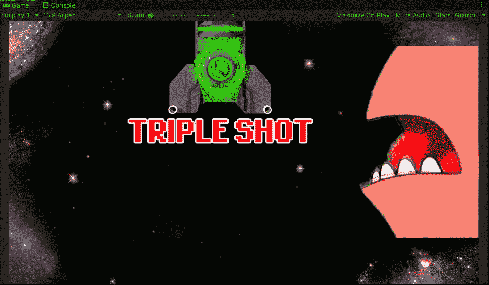

**目标**:在 Unity 中创建一个太空射击游戏的增强道具，让玩家发射 3 束激光，而不是 1 束，持续 5 秒。

又见面了！在我最近的一篇帖子中，我向[展示了如何在 Unity](https://fas444.medium.com/upgrading-from-a-prototype-to-a-work-of-art-in-unity-4f3c0435501d) 中将原型升级到下一个级别。在这篇文章中，我将展示如何为太空射击游戏创建一个加电物品，使它看起来更像一个真实的视频游戏。

# 创建启动预置

首先，我们需要为三次射击创建预设，所以我们只需要在启动时实例化一个包含 3 个激光器的游戏对象。因此，让我们将 3 个激光预设拖到场景中:

你会看到激光出现在预设的位置，所以我们需要将它们移动到我们想要的位置，这样当我实例化一个副本时它们就出现在那里:

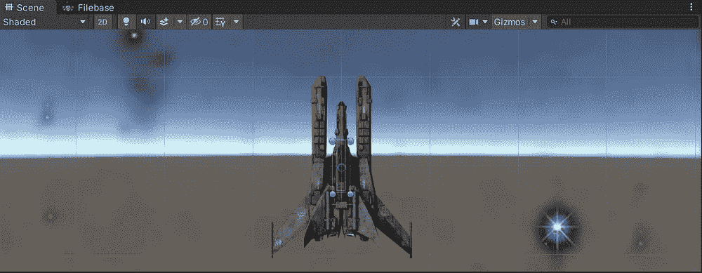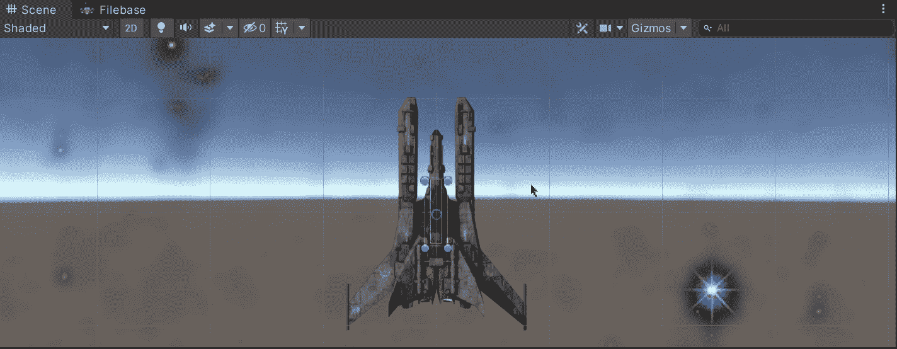

如你所愿移动激光预置。

一旦位置决定，创建一个空的游戏对象来存储 3 个激光器作为孩子，并使其成为一个预置:

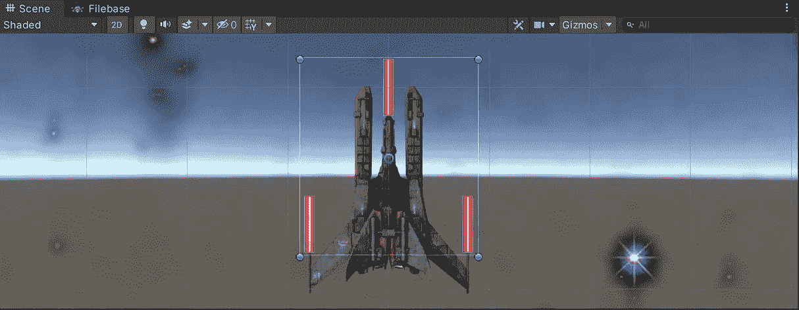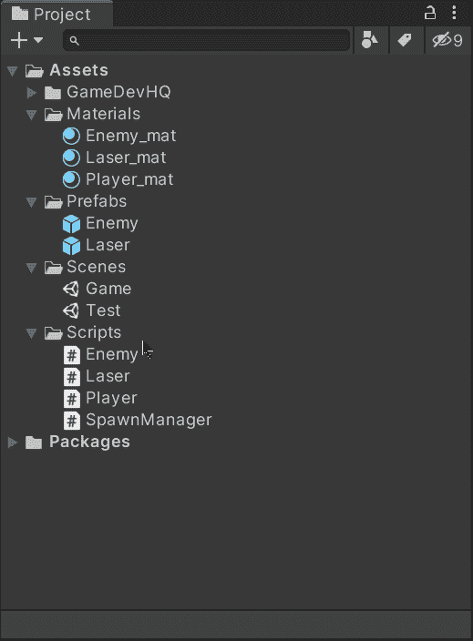

新的预置看起来像这样，玩家每次开机射击时都会创建一个副本:

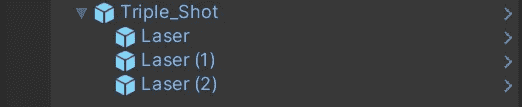

# 创造游戏机制

现在，为了在播放器中实现加电机制，我们需要打开附加的播放器脚本并创建两个新变量:

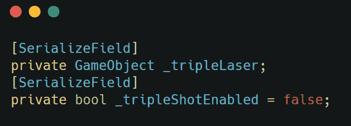

**_tripleLaser** 将存储三连拍预置， **_tripleShotEnabled** 将决定是否启用加电。

然后，在实例化一个简单激光镜头的函数中，我们需要处理 **_tripleShotEnabled** 条件来实例化相应的镜头预置:

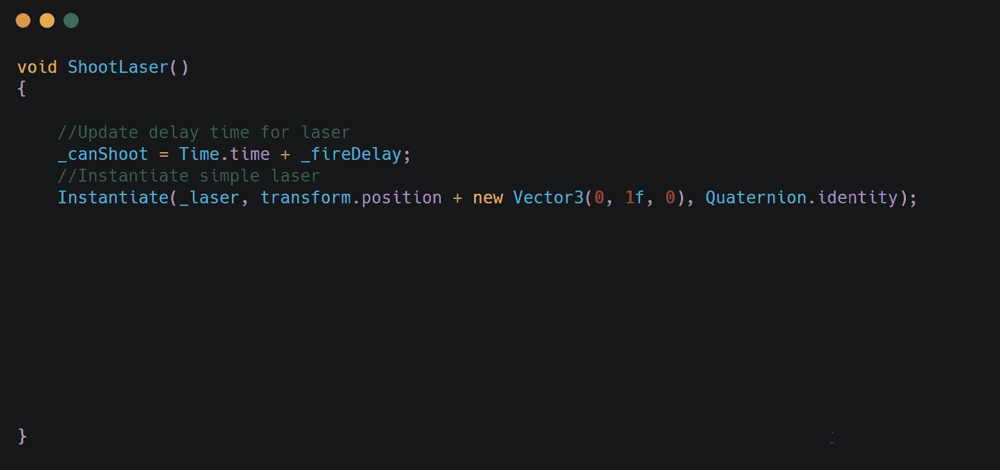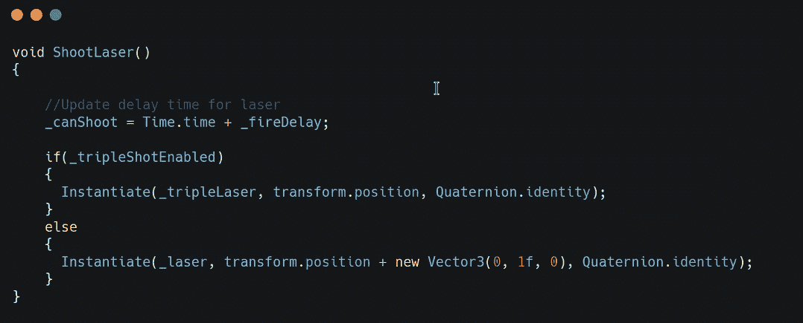

我们不需要添加一个新的向量到三连拍的初始位置，因为我们已经将预设保存到我们想要的位置。

不要忘记将三连拍预设拖到检查器中的玩家脚本中，否则当启动时什么都不会被实例化:

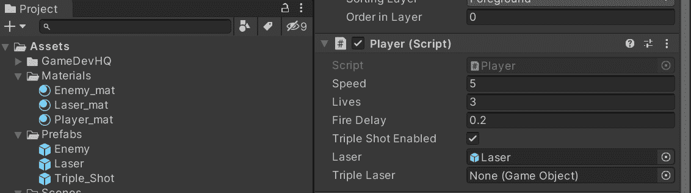

现在，为了验证这种机制，我们可以在运行游戏时启动电源:

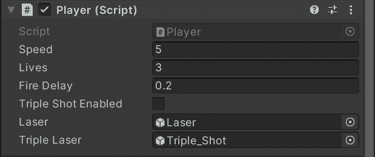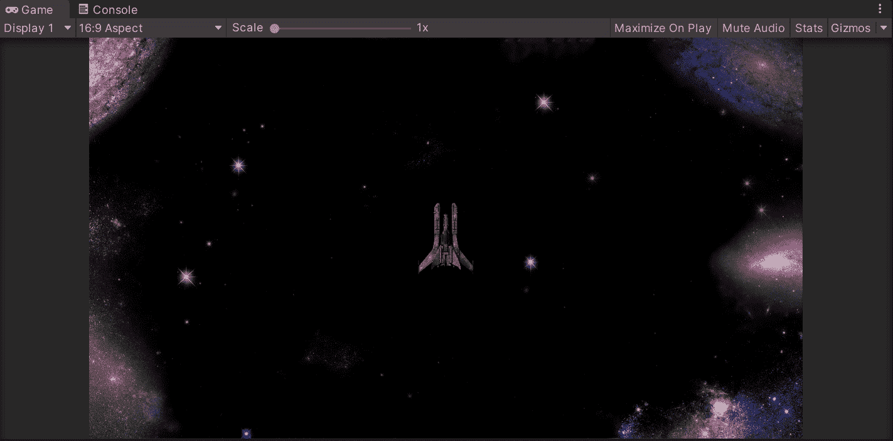

瞧啊。当启动时，玩家进行三连击。

# 创建可收集的加电预置

选择您希望作为激活能量的可收集物品的精灵，并将其拖动到场景中:

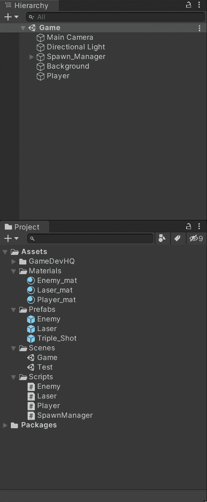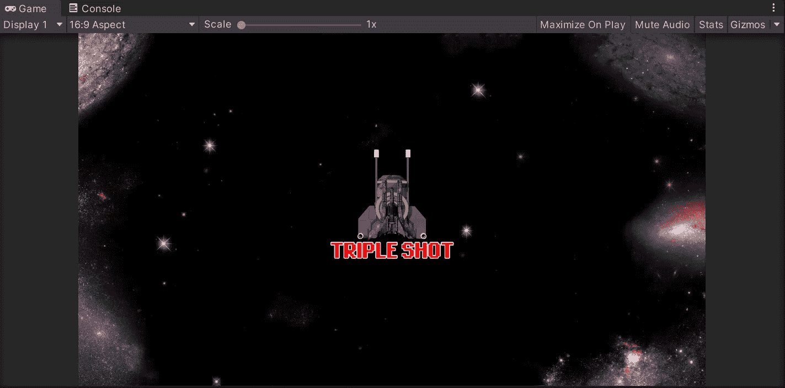

随意调整精灵的大小。

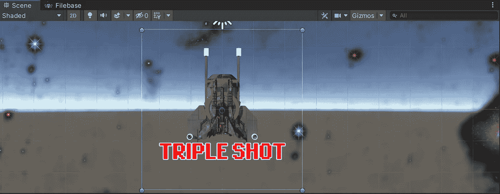

然后，就像我们在过去的帖子中处理与玩家的互动一样:

*   添加一个**碰撞器**组件并启用 **IsTrigger** 选项
*   添加一个**刚体**组件并将**重力比例设置为 0**
*   创建一个脚本来处理加电运动及其触发器

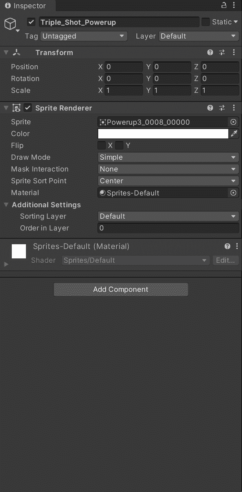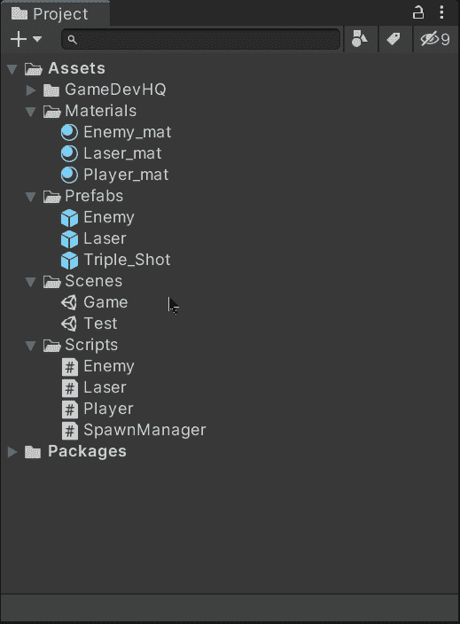

此外，修改碰撞器以适应启动精灵并避免从远处触发动作:

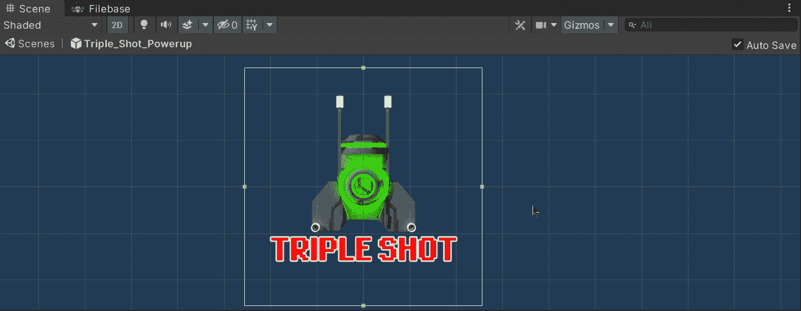

一旦你对你的启动对象感到满意，把它拖到预置文件夹中，让我们打开脚本来实现收集机制。

# 实现加电收集机制

一旦我们打开开机脚本，让我们创建 3 个变量来存储开机项目的速度和游戏可见空间的限制，以正确地实例化开机项目:

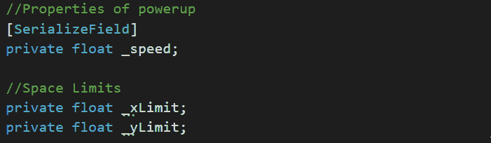

然后，在 Start 函数中，让我们指定上电项目的位置，以便它从那里下来:

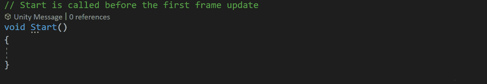

在两个极限之间选择一个随机的 X 位置，将会使玩家可以在物品掉落时收集物品。

现在，就像对敌人的行为一样，让我们创建一个函数，它可以使加电物品下降，但是让我们在它达到空间的极限后摧毁它。然后将其添加到 Update 函数中，以便在项目生成后对其进行处理:

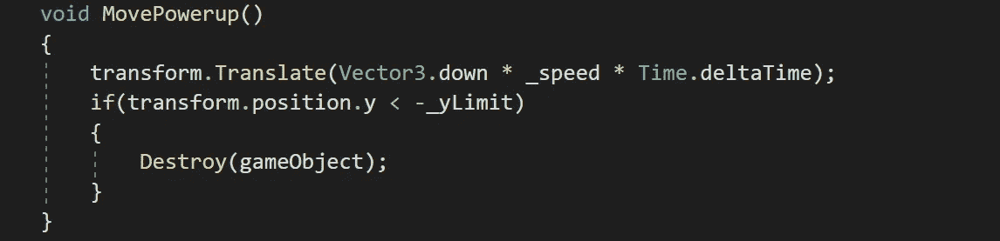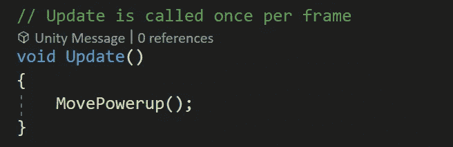

如果我们在 Unity 中运行游戏，物品将以我们选择的速度下降，然后从场景中被销毁:

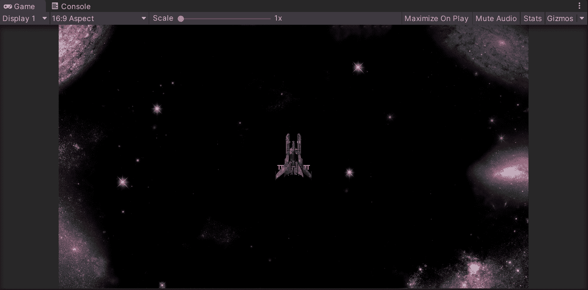

接下来，为了处理收集机制，我们需要打开播放器脚本，创建一个要调用的公共函数，并启用 triple shot:

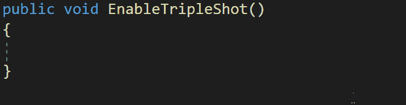

然后，为了给玩家有限的三次开机时间，我们可以创建一个协程，在 5 秒后禁用它:

使用 **StartCoroutine** 函数在上电启用后启动协程:

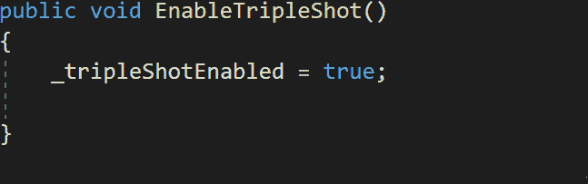

最后，打开开机脚本，使用 **OnTriggerEnter2D** (如果你的游戏是 2D)使用适当的标签处理与玩家的冲突。如果是这种情况，使用 **GetComponent** 函数与播放器脚本通信，并调用启用三倍镜头的函数:

一旦我们在 Unity 中运行游戏，我们将看到触发器工作并启动 5 秒钟:

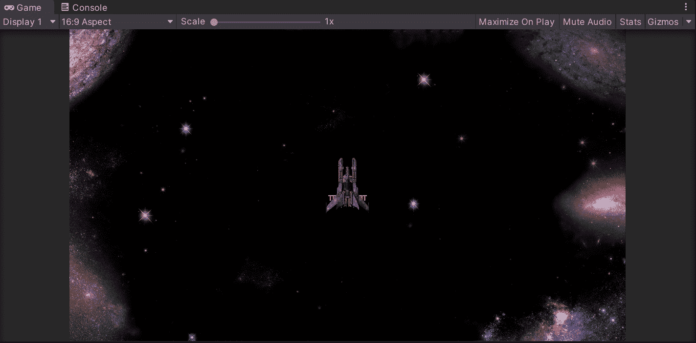

就是这样，你可以在 Unity 中为你的游戏创建一个电源！:d .我会在下一篇文章中看到你，在那里我将展示如何在 Unity 中为太空射击游戏制作精灵动画。

> *如果你想了解我更多，欢迎登陆*[***LinkedIn***](https://www.linkedin.com/in/fas444/)**或访问我的* [***网站***](http://fernandoalcasan.com/) *:D**