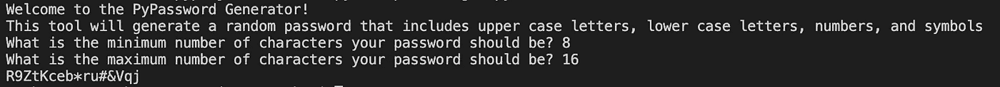

# 使用 Python 创建随机密码生成器

> 原文：<https://medium.com/nerd-for-tech/creating-a-random-password-generator-using-python-6e3a6480532c?source=collection_archive---------4----------------------->


我刚刚参加了 Angela Yu 博士的#100DaysOfCode python 课程 5 天。到目前为止，通过 Python 研究所的 PCEP (Python 入门级程序员)认证对我来说是一个很好的复习。Yu 博士的课程比我参加的 PCEP 预科课程更具实践性和实用性，我强烈推荐给任何想学习 Python 的人。

第五天的最后一个项目是一个密码生成器，允许练习导入模块、使用 for 循环、创建和编辑列表以及 Python 中的随机化。

在 Angela 的示例中，她根据以下字母、数字和符号列表创建了随机密码，并要求用户输入他们希望在密码中包含的每种类型的数量。然后，将每个字符类型的编号添加到一个新列表(password_list)中，并进行混洗:

```
letters = ['a', 'b', 'c', 'd', 'e', 'f', 'g', 'h', 'i', 'j', 'k', 'l', 'm', 'n', 'o', 'p', 'q', 'r', 's', 't', 'u', 'v', 'w', 'x', 'y', 'z', 'A', 'B', 'C', 'D', 'E', 'F', 'G', 'H', 'I', 'J', 'K', 'L', 'M', 'N', 'O', 'P', 'Q', 'R', 'S', 'T', 'U', 'V', 'W', 'X', 'Y', 'Z']
numbers = ['0', '1', '2', '3', '4', '5', '6', '7', '8', '9']
symbols = ['!', '#', '$', '%', '&', '(', ')', '*', '+']import randomprint("Welcome to the PyPassword Generator!")nr_letters = int(input("How many letters would you like in your password?\n"))
nr_symbols = int(input(f"How many symbols would you like?\n")) nr_numbers = int(input(f"How many numbers would you like?\n"))password_list = []for char in range(1, nr_letters + 1):
    password_list.append(random.choice(letters))for char in range(1, nr_symbols + 1):
    password_list += random.choice(symbols)for char in range(1, nr_numbers + 1):
    password_list += random.choice(numbers)print(password_list)
random.shuffle(password_list)
print(password_list)password = ""
for char in password_list:
    password += charprint(f"Your password is: {password}")
```

虽然这可以工作，但我认为这可能无法满足许多应用程序的所有最低密码要求。所以我决定编辑她的随机密码生成器，以更好地适应我发现的标准密码要求。

我通常看到的标准要求是:

1.  *至少一个大写字母*
2.  *至少一个小写字母*
3.  *至少一个符号*
4.  *至少一个数字*
5.  *密码长度要求因应用而异*

Angela 的密码生成器可能会在最终密码中省略一个大写或小写字母，这对于某些网站或应用程序来说不是有效的密码。它还要求用户确定他们希望在密码中包含多少种字符类型，以确保密码至少是所需的最小长度。我对如何改进密码生成器的一些想法如下:

我希望提示用户输入密码可以包含的最少和最多字符数，而不是要求用户输入他们希望密码包含的每种字符类型的数量。不同的网站/应用程序有不同的密码长度范围，所以我认为最好允许用户根据他们创建的网站/应用程序来提供密码。

我设置了代码，使 ***至少有一个*** 字符类型包含在最终密码中，以满足标准密码要求。在包括 4 种字符类型后，代码将用任意随机字符填充密码长度的剩余部分。我认为这将有助于进一步随机化密码。

现在让我们来看看代码。

首先，我将更新列表，使大写字母和小写字母在不同的列表中。

```
# List of the different character types for creating passwordsletters = ['a', 'b', 'c', 'd', 'e', 'f', 'g', 'h', 'i', 'j', 'k', 'l', 'm', 'n', 'o', 'p', 'q', 'r', 's', 't', 'u', 'v', 'w', 'x', 'y', 'z']capital_letters = ['A', 'B', 'C', 'D', 'E', 'F', 'G', 'H', 'I', 'J', 'K', 'L', 'M', 'N', 'O', 'P', 'Q', 'R', 'S', 'T', 'U', 'V', 'W', 'X', 'Y', 'Z']numbers = ['0', '1', '2', '3', '4', '5', '6', '7', '8', '9']symbols = ['!', '#', '$', '%', '&', '(', ')', '*', '+']
```

然后，我添加了一个新的列表，该列表组合了所有的字符类型，这样，在包含了每种字符类型中的一种之后，剩余的密码长度将随机填充任何字符类型。

```
all_keys = letters + capital_letters + numbers + symbols
```

然后提示用户输入密码长度。

```
min_input = int(input("What is the minimum number of characters your password should be? "))max_input = int(input("What is the maximum number of characters your password should be? "))
```

通过设置新变量，在最小和最大字符数之间随机选择密码长度。

```
password_length = (random.choice(range(min_input, max_input + 1)))
```

创建一个空白列表来生成密码。

```
password = []
```

现在我们已经创建了列表，让我们用密码字符填充列表。首先，我们将从每个字符类型中随机选择一个字符。

```
password.append(random.choice(letters))
password.append(random.choice(capital_letters))
password.append(random.choice(numbers))
password.append(random.choice(symbols))
```

然后，我们将添加每种类型的随机字符，使用 for 循环填充密码的剩余部分。代码将从 all_keys 列表中添加一个新的随机字符到密码列表中，直到密码列表长度等于随机密码长度变量。

```
for i in range(1, password_length — 3):
    if len(password) < password_length:
        password.append(random.choice(all_keys))
```

一旦 for 循环完成，打乱密码列表使其随机化。

```
random.shuffle(password)
```

使用 join 函数将密码列表中的单个字符连接成一个字符串。join 函数前的单引号是放置分隔符的地方，分隔符是用来分隔列表中的字段的字符。在这种情况下，我们不需要任何分隔符，因为我们希望我们的密码列表合并成一个单一的密码。在其他情况下，我们可以添加一个空格或一个逗号，如果我们希望我们的列表打印出来时，列表中的每一项之间有一个空格或字符。

```
final_random_password = ‘’.join(password)
```

最后，让我们打印密码。

```
print(f”Your password is: {final_random_password}”)
```

下面是一个运行中的密码生成器的例子。我们正在为其创建密码的站点的密码长度最短为 8 个字符，最长为 16 个字符。密码显示为 R9ZtKceb*ru#&Vqj，这似乎是一个非常强的密码！



感谢阅读我如何更新安吉拉于的随机密码生成器。如果你有任何改进的想法，请告诉我。

我的最终代码如下。

```
#Password Generator Projectimport random# List of the different character types for creating passwordsletters = ['a', 'b', 'c', 'd', 'e', 'f', 'g', 'h', 'i', 'j', 'k', 'l', 'm', 'n', 'o', 'p', 'q', 'r', 's', 't', 'u', 'v', 'w', 'x', 'y', 'z']
capital_letters = ['A', 'B', 'C', 'D', 'E', 'F', 'G', 'H', 'I', 'J', 'K', 'L', 'M', 'N', 'O', 'P', 'Q', 'R', 'S', 'T', 'U', 'V', 'W', 'X', 'Y', 'Z']
numbers = ['0', '1', '2', '3', '4', '5', '6', '7', '8', '9']
symbols = ['!', '#', '$', '%', '&', '(', ')', '*', '+']
all_keys = letters + capital_letters + numbers + symbolsprint("Welcome to the PyPassword Generator! \nThis tool will generate a random password that includes upper case letters, lower case letters, numbers, and symbols")# Different websites require different minimum character password length and might have different maximums. Prompt the user for this info.min_input = int(input("What is the minimum number of characters your password should be? "))
max_input = int(input("What is the maximum number of characters your password should be? ")) # Randomly select a password length between the min and max number of characters.password_length = (random.choice(range(min_input, max_input + 1)))# Create a blank list to generate the password into.password = []# Add one of each character type.
# Some applications require passwords to include at least one upper case letter, lower case letter, symbol and number.
# Adding one of each will meet the minimum requirements.password.append(random.choice(letters))
password.append(random.choice(capital_letters))
password.append(random.choice(numbers))
password.append(random.choice(symbols)) # Add in random characters from each type to populate the remainder of the password.for i in range(1, password_length - 3):
    if len(password) < password_length:
        password.append(random.choice(all_keys))# Shuffle the password list to randomize it.random.shuffle(password) # Concatenate the individual characters in the password list into a string with the join function.final_random_password = ''.join(password)print(f"Your password is: {final_random_password}")
```