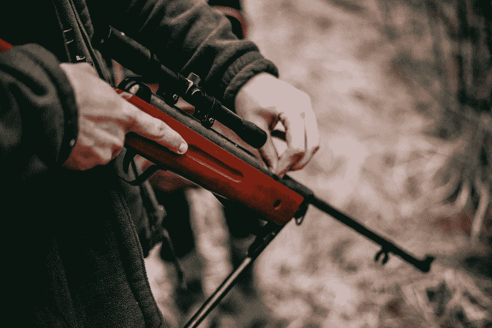
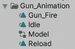
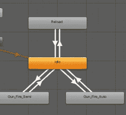
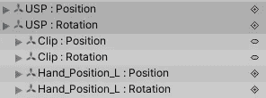
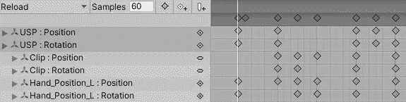
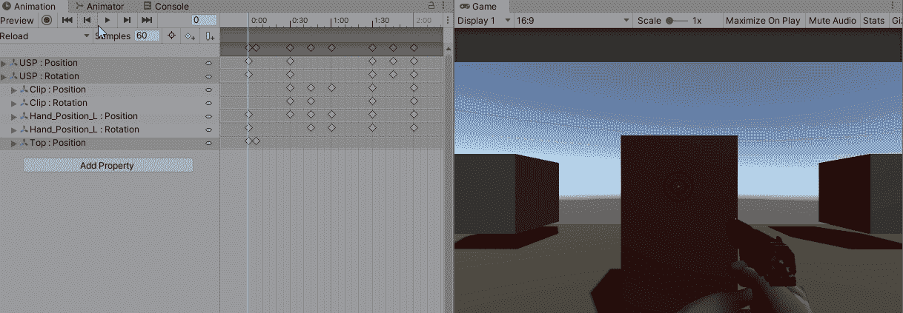

# 在 Unity 中创建重新加载动画

> 原文：<https://medium.com/nerd-for-tech/creating-a-reload-animation-in-unity-9819385cd34f?source=collection_archive---------3----------------------->

我为我的角色制作了一个第一人称射击动画。现在，我将创建重新加载。

为此，我将在枪动画文件夹中创建一个名为 reload 的新动画。

接下来，我将把这个动画添加到枪的动画窗口中。这个动画将使用触发器播放，所以我添加了那个参数。

在动画窗口中，我将打开重新加载动画，并开始设置枪的位置。我已经添加了枪、弹夹和左手的位置和旋转。

你需要移动不同的物体，让枪出现，取出夹子，放入一个新的夹子，然后重置枪的位置。这可以通过复制起始位置并使其成为最后一个位置，然后在这两个位置之间移动零件来实现。

这将为你的枪获得一个很好的重装动画。

