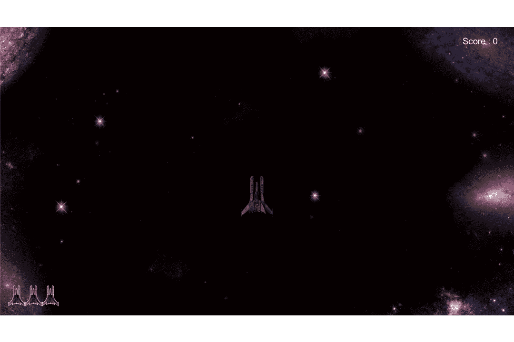
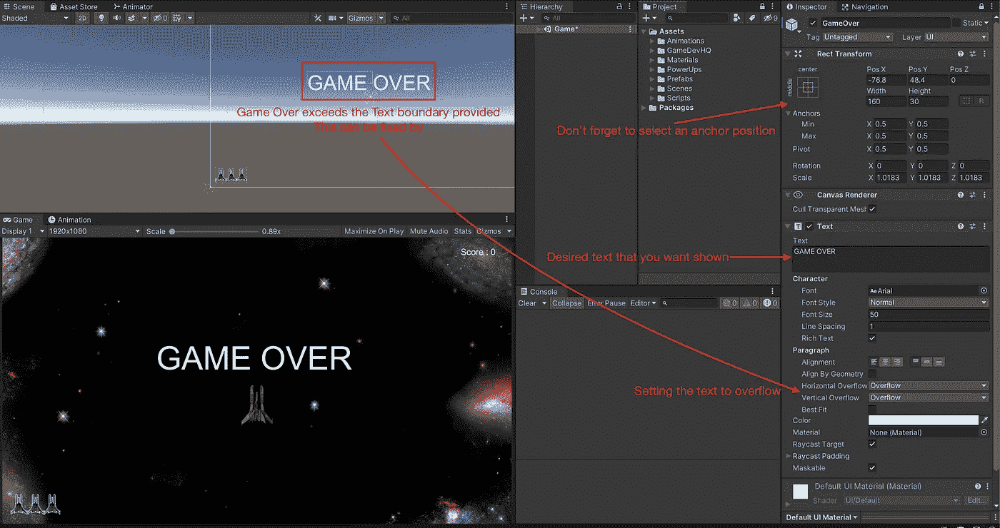
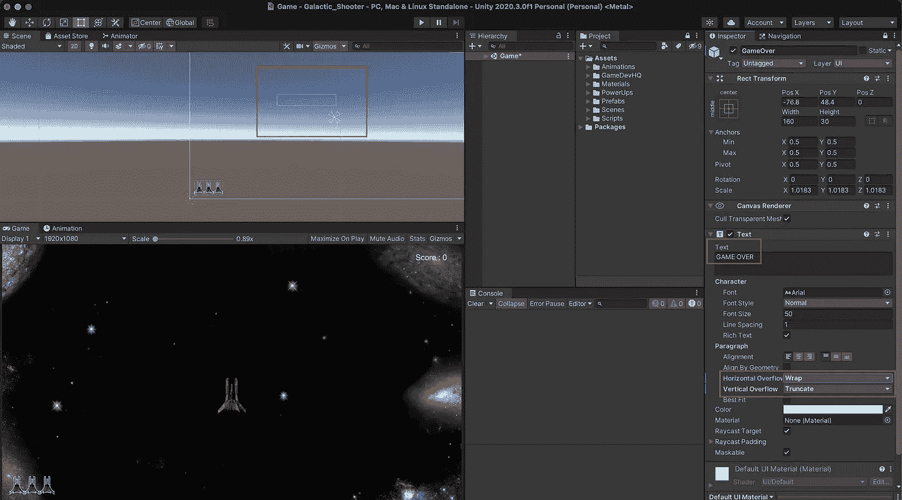
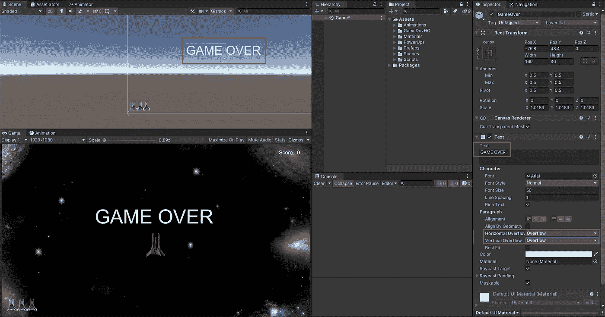
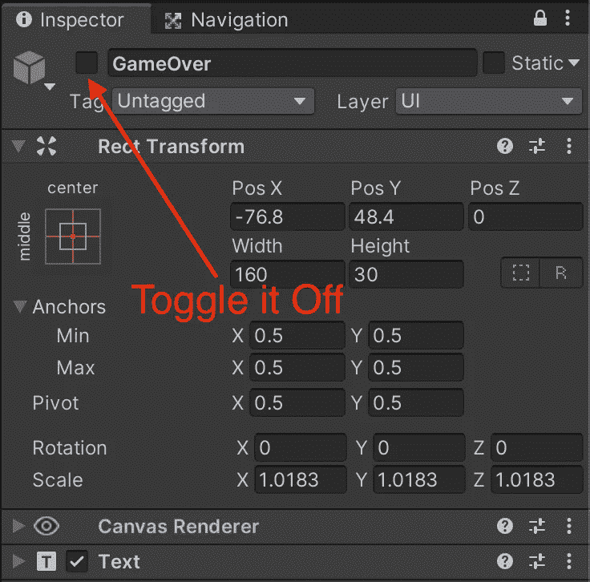
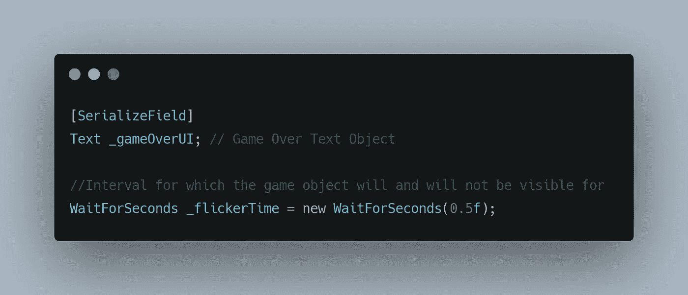
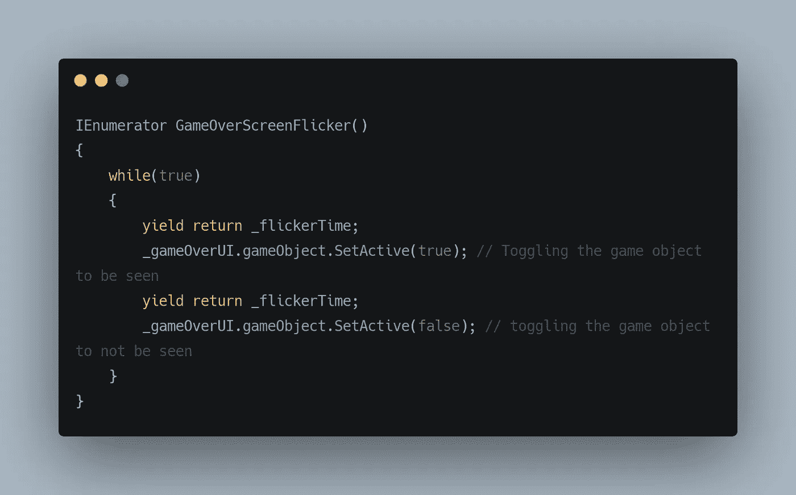
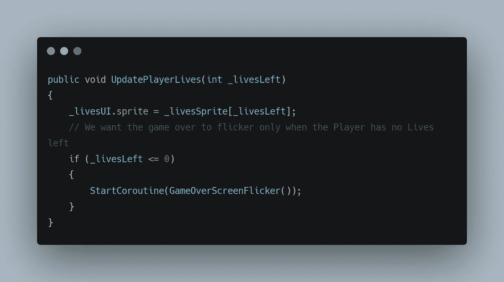
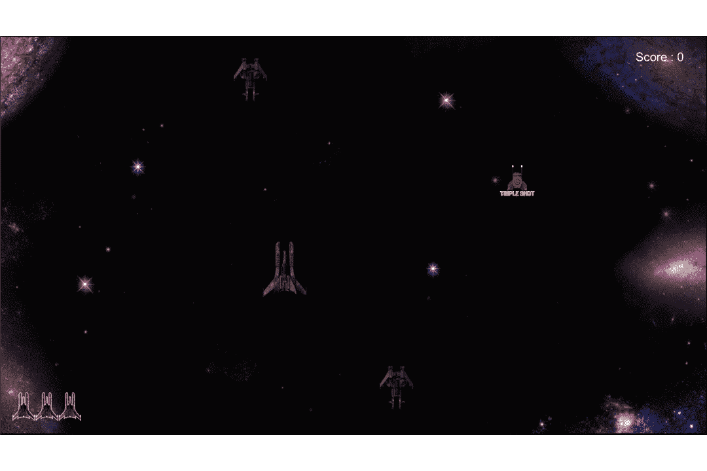

# 创造一个关于行为的复古游戏

> 原文：<https://medium.com/nerd-for-tech/creating-a-retro-game-over-behavior-9c59c7ce66?source=collection_archive---------32----------------------->

在之前的文章中，我们看到了在 unity 中构建 UI 是多么容易。让我们在此基础上进一步发展，一旦玩家没有生命了，就在屏幕上添加一个游戏。

首先，让我们创建一个游戏界面文本组件，当玩家没有剩余生命时，它将显示出来。

这将在我们的画布中创建一个文本对象。编辑它，放置它，并锚定到您想要的位置。

在这里，**文本**组件有一个有趣的字段叫做**水平/垂直溢出**，当你的文本超出定义的边界，使你的文本不可见时，这可能是有用的。

然后我们可以选择溢出选项，使文本忽略文本边界。

我们的文本用户界面已经准备好了，让它在默认情况下被禁用，只有在玩家**没有生命的时候才激活。**

完成后，让我们对游戏行为进行编码，我们希望游戏文本在固定的时间间隔内闪烁，给它一种复古的游戏氛围，因为我们正在处理一种例程/时间间隔类型的逻辑，我们可以使用协程(要了解协程[单击此处](/nerd-for-tech/coroutines-with-unity-fe650a4892f7))，

现在让我们定义闪烁行为，

当上述功能被执行时，游戏文本对象将每半秒切换一次。给我们一个闪烁的行为。

让我们在我们的 **UpdatePlayerLives()** 中调用这个函数，在这里我们记录**玩家**剩余的生命数(UpdatePlayerLives 在[上一篇文章](/codex/ease-of-building-ui-elements-in-unity-405f2d8bbff)中定义)。

这给了我们以下结果，

感谢您的阅读。更多即将推出！！！