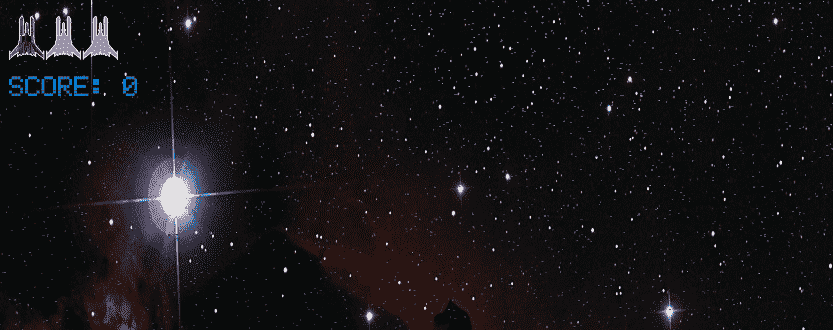
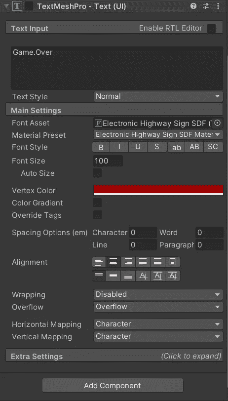
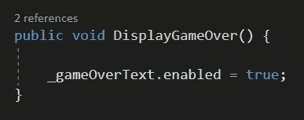
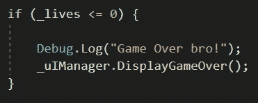
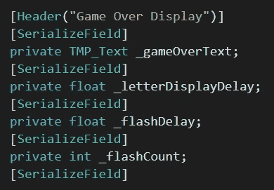
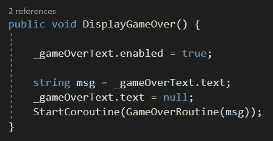
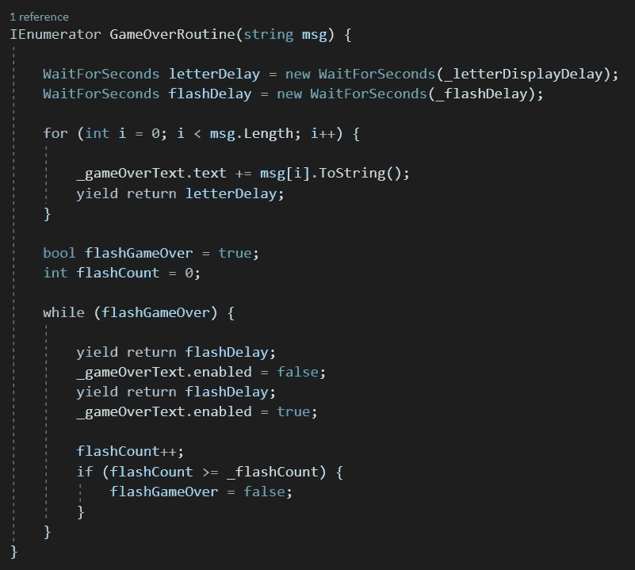
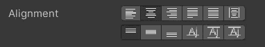

# 用 Unity 和 C#创建一个复古风格的游戏

> 原文：<https://medium.com/nerd-for-tech/creating-a-retro-style-game-over-screen-in-unity-and-c-7ab5069c413f?source=collection_archive---------8----------------------->

游戏结束了兄弟！

任何游戏的一个主要挑战是尽可能地进步——是什么让这成为一个挑战？当然是有机会*而不是*更进一步…

介绍一款游戏主打产品——屏幕游戏！继我上一篇关于 UI 构建的文章之后，我们需要能够在玩家失败并失去所有生命时通知他们。

和以前一样，我将为此使用 TextMeshPro 组件(虽然，使用正确的名称空间库，编码解决方案也可以和普通的文本组件一样工作)。

在游戏对象激活而 TMP 组件不激活的情况下，我们可以在对玩家隐藏游戏结束消息的情况下开始游戏。

这意味着，很明显，当玩家到达游戏极限时，我们需要激活这个消息——也就是说，已经没有生命了。

启用游戏结束消息

检查玩家脚本中的生命

非常简单，在我们的 UIManager 中，我们可以获取对文本组件上的游戏的引用，并使它能够在被调用时显示给玩家。

在检查我们的玩家是否还有生命后添加这个调用，将会在适当的时候显示游戏结束的消息。

不过，仅仅升级一个游戏似乎有点无聊，所以让我们把它修饰一下。

*注意:这个屏幕看起来怎么样完全取决于你自己的想象力和创造力。下面将演示用于创建本文顶部示例的方法。*

声明必需的变量

首先，我们的变量——当你试图让你的游戏达到期望的效果时，会有很多实验。在 inspector 中赋予变量可以让我们在微调效果的时候快速地重复效果，而不必回到我们的代码。

我们的 DisplayGameOver 方法中还添加了几行代码—

> `string msg = _gameOverText.text;`
> 
> `_gameOverText.text = null;`
> 
> `StartCoroutine(GameOverRoutine(msg));`

通过将我们的文本组件的值赋给一个变量`msg`，然后“清空”或清除它的内容，我们保留了一个对该值的引用——我们的游戏结束消息——它一开始就以空白消息的形式出现在玩家面前。

然后，就像你可能想要创建的许多定时效果一样，我们触发一个协同例程，同时将我们的`msg`字符串传递给它

效果协同例程

在这个协同程序中，效果被控制。

> `WaitForSeconds letterDelay = new WaitForSeconds(_letterDisplayDelay);`
> 
> `WaitForSeconds flashDelay = new WaitForSeconds(_flashDelay);`

使用这段代码，我们将变量`_letterDisplayDelay`和`_flashDelay`设置为我们将使用的产出延迟。

然后“for”循环遍历字符串变量的长度，每次在文本上增加一个字符。通过循环中的延迟，它给出了一次拼出我们的`msg`一个字符的效果。

文本组件的对齐设置决定了我们不断增长的消息的外观。当我将它设置为居中时，消息从文本组件的中间开始增长。

一旦我们的信息被拼写出来，我们的代码就进入一个‘while’循环，打开和关闭我们的文本组件，给它一个闪烁的效果，这一直持续到我们的`_flashCount`变量中指定的次数。

正如你所看到的，这是一个非常简单而有效的游戏补充。尝试使用文本组件设置和延迟计时器来实现您想要的游戏外观。