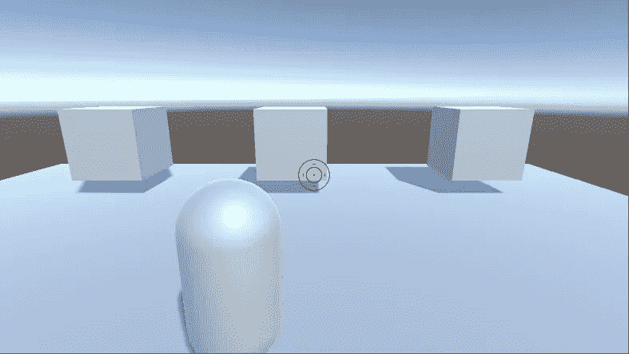
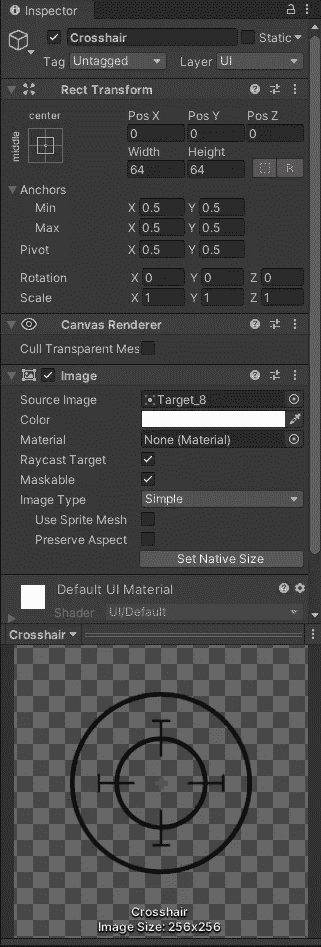
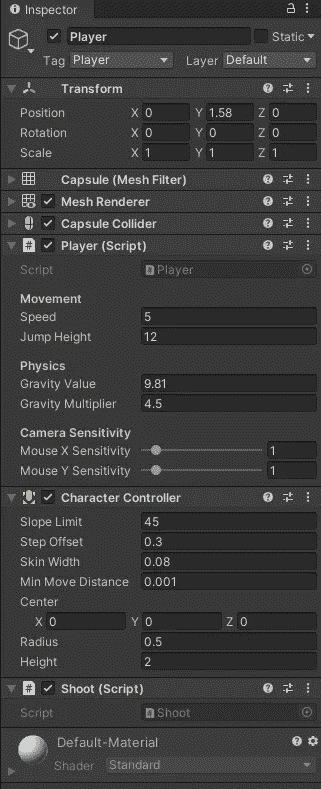
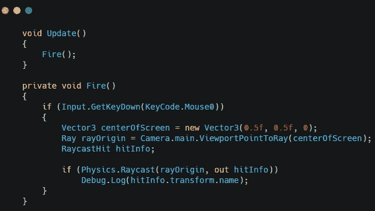
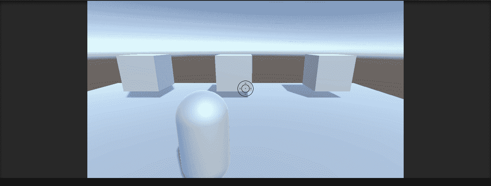

# 在 Unity 中使用光线投射创建一个拍摄机制

> 原文：<https://medium.com/nerd-for-tech/creating-a-shooting-mechanic-using-raycasting-in-unity-f2446c1ce916?source=collection_archive---------14----------------------->

随着玩家的移动和瞄准，是时候让他们开火了。

我做的第一件事是在屏幕中央添加一个标线。为此，我使用了由 **GameDevHQ** 创建的名为 **Filebase** 的定制资产。从 **Filebase** 下载了一个手提袋包，选择了自己喜欢的。然后，我创建了一个 UI 图像，并在其中添加了标线图像。

为了创建射击的功能，我创建了一个新的射击脚本，并将其附加到播放器上。

这方面的编码相当简单。如果玩家左击，你从原点发射一束光线。然后你收集关于你击中的物体的信息。现在，我将对象的名称打印到控制台。

这将允许玩家从屏幕中间射门。

