# 在 Unity 中创建天空盒

> 原文：<https://medium.com/nerd-for-tech/creating-a-skybox-in-unity-9399eff6a7b7?source=collection_archive---------6----------------------->

## 统一指南

## 关于如何在 Unity 中创建天空盒的快速指南

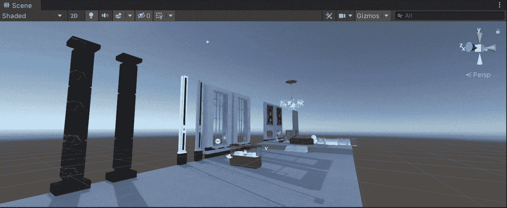

目标:使用 Unity 创建并实现一个 Skybox。

在上一篇文章中，我介绍了[如何创建一个透明窗口](/nerd-for-tech/creating-a-transparent-window-in-unity-b1379775165e)。现在，是时候创建和实现一个新的天空盒了，它会给 Unity 中的场景带来新的外观。

# 创建天空盒

我们有 Unity 中的下一个场景，其中一个默认的天空盒在场景中给出了这个外观:

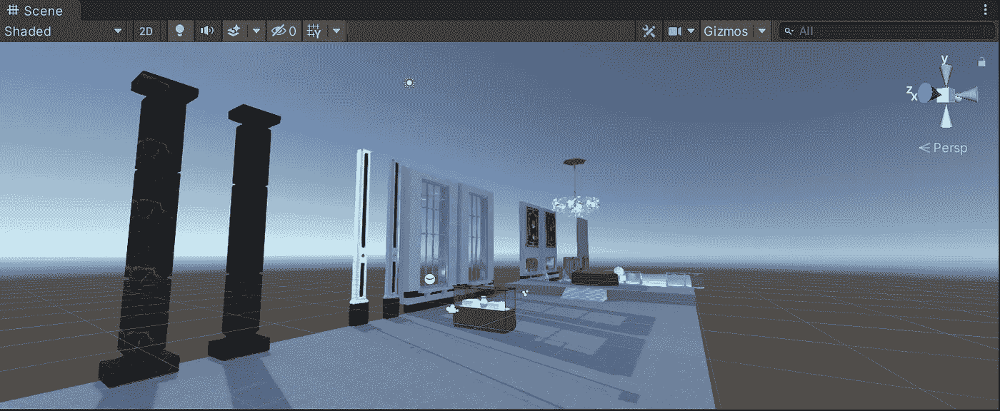

为了创建新的天空盒，我们将使用以下 6 种纹理:

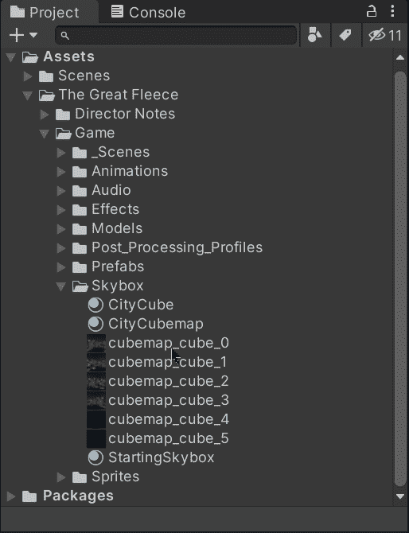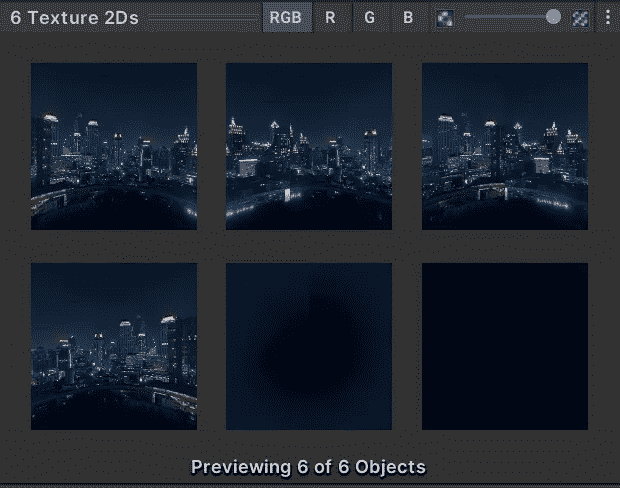

现在，让我们为天空盒创建一个新的材质。创建完成后，让我们将材质使用的着色器更改为*天空盒* > *6 面*:

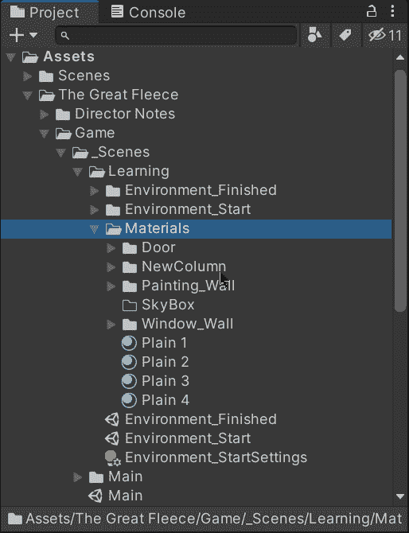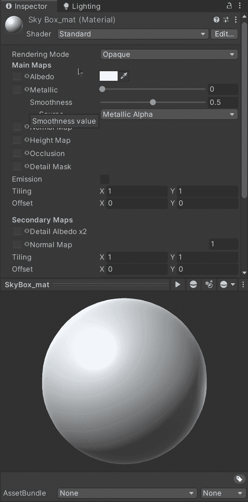

然后，让我们通过检查器将纹理拖到它们各自的槽中:

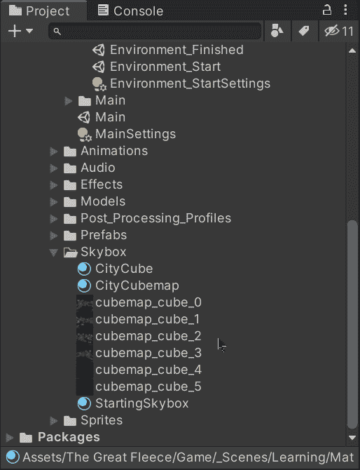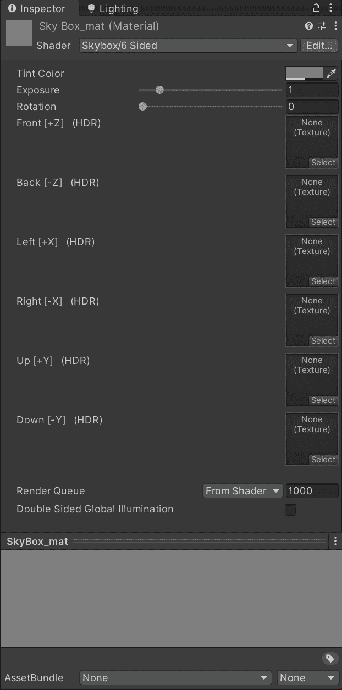

# 实现天空盒

现在，为了实现新的天空盒材质进入场景，让我们在*窗口* > *渲染* > *灯光*打开灯光选项卡:

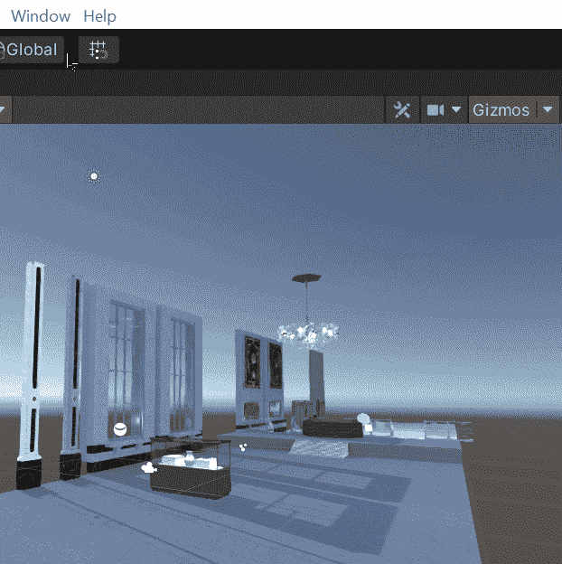

一旦打开，将带有天空盒的新素材拖动到存储天空盒素材的**环境**选项卡选项中:

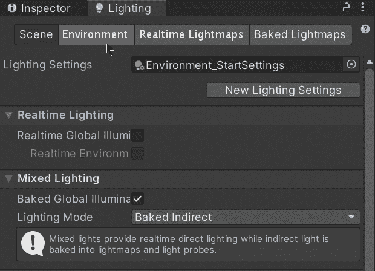

一旦新材质在各自的槽中，我们将能够看到在场景中实现的天空盒。默认情况下，该天空盒将提供光源:

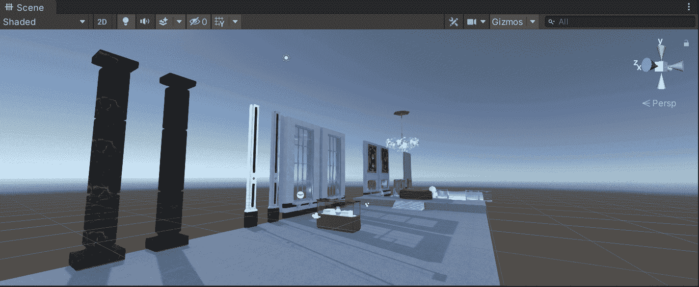

就这样，我们在 Unity 中为我们的场景实现了一个新的天空盒！:d .下一篇文章再见，我将展示 Unity 的 3D 环境的一些方面。

> *如果你想了解我更多，欢迎登陆*[***LinkedIn***](https://www.linkedin.com/in/fas444/)**或访问我的* [***网站***](http://fernandoalcasan.com/) *:D**